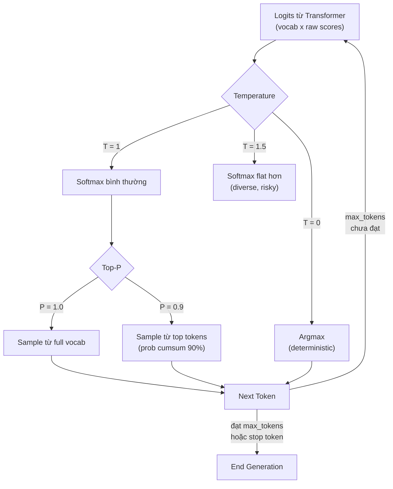

# Temperature, Top-P, Max Tokens ảnh hưởng Response như thế nào

## ⚡ Tóm tắt ngắn (30s)
* Ba tham số sampling cốt lõi điều khiển **cách model chọn token tiếp theo** từ phân phối xác suất:
  * **Temperature** (0.0–2.0): "độ sáng tạo". Càng thấp càng deterministic (chọn token xác suất cao); càng cao càng random/đa dạng. Default thường 1.0.
  * **Top-P (nucleus sampling)** (0.0–1.0): chỉ sample từ tập hợp token nhỏ nhất có tổng xác suất ≥ P. Default thường 1.0 (xét tất cả).
  * **Max Tokens**: giới hạn cứng số token output. Guard cost & latency.
* **Cách dùng đúng theo use case**:
  | Use case | Temperature | Top-P | Max Tokens |
  | :--- | :---: | :---: | :---: |
  | Classification / extraction / structured JSON | 0.0–0.2 | 1.0 | 200–500 |
  | RAG question answering | 0.0–0.3 | 1.0 | 500–1500 |
  | Code generation | 0.0–0.3 | 0.95 | 1000–3000 |
  | Marketing copy / brainstorming | 0.7–1.0 | 0.9 | 500–1500 |
  | Creative writing | 1.0–1.3 | 0.95 | 1500+ |
* **Thảm họa thực chiến**: Team để temperature mặc định 1.0 cho endpoint extract số điện thoại từ user message. ~5% case model "sáng tạo" thêm chữ số, hoặc đổi format. Downstream service gọi SMS API với số sai → user nhận OTP vào số người khác. Senior fix bằng `temperature=0.0` + JSON schema + retry với validation.

---

## 🔍 Chi tiết bản chất

### 1. Cách LLM sinh token (refresher)

Sau mỗi forward pass, model trả về **logits** — một vector size = vocab (200k token). Softmax biến logits thành xác suất (sum = 1). Sampler chọn 1 token từ phân phối này.

```
Logits → Softmax → Probability Distribution → Sampler → Next Token
                                                   ↑
                                    Temperature + Top-P điều khiển ở đây
```

### 2. Temperature — Hâm/nguội phân phối

Công thức: `softmax(logits / T)`. 

* `T → 0`: phân phối tập trung vào token có xác suất cao nhất → **gần argmax** → deterministic.
* `T = 1`: phân phối nguyên bản của model.
* `T → 2`: phân phối "flat" hơn → các token xác suất thấp cũng có cơ hội → output đa dạng hơn nhưng dễ "lạc đề".

**Quy tắc Senior**:
* Cần kết quả **đáng tin cậy, có thể test** → T = 0 (hoặc 0.1).
* Cần **đa dạng câu trả lời** cho cùng prompt (brainstorm, marketing) → T = 0.7–1.0.
* Hiếm khi đặt T > 1.2 trong production.

> Lưu ý: T = 0 KHÔNG đảm bảo deterministic 100%. Vẫn có thể có sai khác do floating-point + non-determinism trong batched inference. Nếu cần strict deterministic, dùng `seed` parameter (OpenAI/Anthropic đều hỗ trợ).

### 3. Top-P — Cắt đuôi xác suất thấp

Sau khi softmax, sắp xếp token theo xác suất giảm dần, cộng dồn đến khi đạt P → chỉ sample trong subset đó.

* `P = 1.0`: xét toàn bộ vocab.
* `P = 0.9`: chỉ xét các token chiếm 90% xác suất (thường ~10–50 token đầu) → cắt bỏ token "rác".
* `P = 0.5`: chỉ xét top tokens nhỏ → gần deterministic.

**Khác biệt với Temperature**: Top-P **giữ shape của phân phối** chỉ cắt đuôi; Temperature **biến dạng** phân phối. Combine cả 2 thường KHÔNG cần (chọn 1 trong 2). Default: chỉnh Temperature, để Top-P = 1.0.

### 4. Max Tokens — Guard cost & latency

* Là **số token output tối đa**. Khi đạt → model dừng (không cắt giữa câu một cách thông minh — chỉ cắt cứng).
* Guard **CỰC QUAN TRỌNG**:
  * Bảo vệ chống prompt injection "viết essay 10000 chữ" (DoS qua cost).
  * Bảo đảm latency tối đa predictable.
  * Tránh overflow context (output cũng tốn budget).

**Quy tắc**: luôn set max_tokens. Tính bằng "expected length × 1.5 safety". Ví dụ summary 1 đoạn ~100 token → max_tokens = 200.

---

## 🎨 Sơ đồ trực quan



---

## 💻 Code thực chiến: Cấu hình theo use case

### 1. Java/Spring AI — Extraction endpoint (cần deterministic)

```java
package com.example.ai.extract;

import org.springframework.ai.chat.client.ChatClient;
import org.springframework.ai.chat.prompt.ChatOptions;
import org.springframework.stereotype.Service;

@Service
public class PhoneNumberExtractor {
    private final ChatClient chatClient;

    public PhoneNumberExtractor(ChatClient.Builder b) {
        this.chatClient = b.build();
    }

    public String extract(String userText) {
        ChatOptions opts = ChatOptions.builder()
                .temperature(0.0)   // deterministic: cùng input phải ra cùng output
                .topP(1.0)          // không cần cắt vì T=0 đã đủ
                .maxTokens(50)      // số điện thoại tối đa ~20 ký tự = ~10 token
                .build();

        String result = chatClient.prompt()
                .system("Extract phone number. Reply ONLY with the digits. If none, reply 'NONE'.")
                .user(userText)
                .options(opts)
                .call()
                .content()
                .trim();

        // Validate trước khi trả về downstream
        if (!result.equals("NONE") && !result.matches("^[0-9+\\- ()]{8,15}$")) {
            throw new IllegalStateException("Model trả format lạ: " + result);
        }
        return result;
    }
}
```

### 2. Python/OpenAI — Creative copywriter (cần đa dạng)

```python
from openai import OpenAI
client = OpenAI()

def generate_marketing_variants(product_description: str, n: int = 5) -> list[str]:
    """
    Sinh 5 phương án copy marketing khác nhau cho cùng product.
    Cần variance cao → temperature cao.
    """
    variants = []
    for _ in range(n):
        resp = client.chat.completions.create(
            model="gpt-4o",
            messages=[
                {"role": "system", "content": "Bạn là copywriter marketing. Viết 1 dòng tiêu đề catchy."},
                {"role": "user", "content": product_description},
            ],
            temperature=0.9,   # creative
            top_p=0.95,        # cắt token rác
            max_tokens=80,     # 1 dòng đủ ngắn
        )
        variants.append(resp.choices[0].message.content.strip())
    return variants
```

### 3. Anthropic SDK — RAG QA (cần factual)

```python
import anthropic
client = anthropic.Anthropic()

def rag_answer(question: str, context_chunks: list[str]) -> str:
    context = "\n---\n".join(context_chunks)
    resp = client.messages.create(
        model="claude-sonnet-4-6",
        max_tokens=1500,
        temperature=0.1,   # gần deterministic để giảm hallucination
        # top_p mặc định 1.0
        system="Answer ONLY from the provided context. If not in context, say 'Không có thông tin'.",
        messages=[{"role": "user", "content": f"Context:\n{context}\n\nQ: {question}"}],
    )
    return resp.content[0].text
```

---

## 📊 Bảng so sánh tác động của từng tham số

| Tham số | Range | Tác động khi tăng | Default khuyên dùng |
| :--- | :---: | :--- | :---: |
| **Temperature** | 0.0–2.0 | Tăng diversity, giảm faithfulness | 0.0 (extraction) → 0.7 (chat) → 1.0 (creative) |
| **Top-P** | 0.0–1.0 | Mở rộng tập token được sample | 1.0 (không can thiệp), 0.9 nếu cần cắt rác |
| **Max Tokens** | 1–context_limit | Cho phép output dài hơn (tốn cost + latency) | Đặt theo expected output length × 1.5 |
| **Frequency Penalty** | -2.0–2.0 | Giảm lặp lại token đã xuất hiện | 0.0 (chỉ tăng 0.1–0.5 khi model lặp văn) |
| **Presence Penalty** | -2.0–2.0 | Khuyến khích nói chủ đề mới | 0.0 |
| **Stop Sequences** | list[string] | Dừng generation khi gặp pattern | Set khi muốn output có format cụ thể |

---

## ⚠️ Common Gotchas & Questions follow-up

### 1. Cạm bẫy: Đặt Temperature cao cho extraction/classification
* **Vấn đề**: Endpoint extract email từ user message để bypass tới SES. Để T=0.7 (default) → ~3% case model "format lại" email (thêm space, đổi chữ hoa). Downstream SES reject → user không nhận email reset password.
* **Giải pháp**: 
  1. T = 0 cho mọi task có "đáp án đúng" (extract, classify, structured output).
  2. Dùng JSON mode + JSON schema để ép format.
  3. Validate output cứng (regex) trước khi gửi downstream.

### 2. Cạm bẫy: Quên set Max Tokens → cost DoS
* **Vấn đề**: User prompt "viết tiểu thuyết 1000 trang". Không max_tokens → model chạy đến hết context limit (vài ngàn token output) = $X/request. Bot spam = $XXX/giờ.
* **Giải pháp**: Luôn set max_tokens. Quota per-user. Alert khi token output trung bình tăng đột biến.

### 3. Cạm bẫy: Cùng Temperature, khác Top-P → diversity giả
* **Vấn đề**: Team set T=1.5 nhưng vẫn thấy output thiếu sáng tạo. Lý do: provider có default Top-P khác nhau, hoặc đã apply min_p cutoff.
* **Giải pháp**: Hiểu cả pipeline sampling của provider mình dùng. Đọc doc kỹ. Test thực tế ở mức 5–10 sample/setting.

### 4. Câu hỏi đào sâu từ interviewer
* **Interviewer: "Cùng prompt, cùng T=0, vì sao đôi khi vẫn ra output khác nhau?"**
* **Trả lời Senior**:
  1. **Non-determinism trong batched inference**: provider batch nhiều request vào cùng forward pass; floating-point reduction order khác nhau → kết quả khác micro-level → cuối cùng chọn token khác.
  2. **Sparse Mixture-of-Experts** (GPT-4, Mixtral): routing đến expert khác nhau giữa các request giống hệt.
  3. **Tie-breaking**: 2 token có score xấp xỉ bằng nhau ở argmax → kết quả nhạy với noise.
  4. **Giải pháp**: 
     - OpenAI có `seed` parameter (best-effort, không 100% guarantee).
     - Đối với critical workflow cần stricter determinism: dùng self-host model + greedy decoding + fixed batch size.
     - Hoặc design system để **tolerant với variance** (validate output, retry, fallback).
