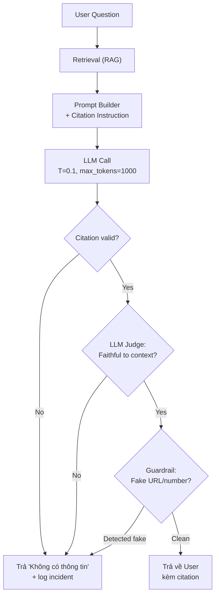

# Hallucination là gì? Có thể loại bỏ hoàn toàn không

## ⚡ Tóm tắt ngắn (30s)
* **Hallucination** là hiện tượng LLM **sinh ra thông tin sai lệch một cách tự tin** — không phải bug, mà là **hậu quả tất yếu của cách model hoạt động**: nó dự đoán token có xác suất cao về mặt ngôn ngữ, không phải fact-check. Model "thấy" pattern "Sách của tác giả X là..." trong training → tự tin generate tên sách, kể cả khi không tồn tại.
* **Phân loại 3 dạng hallucination chính**:
  1. **Factual hallucination**: Sai sự thật ("Albert Einstein sinh năm 1885" — sai 4 năm).
  2. **Faithfulness hallucination**: Mâu thuẫn với context được cung cấp (RAG đưa doc nói "doanh thu Q1 là 100 tỷ" nhưng model trả lời "200 tỷ").
  3. **Made-up entities**: Bịa tên người, API endpoint, function name, citation không tồn tại — đặc biệt phổ biến khi code-gen.
* **KHÔNG thể loại bỏ hoàn toàn** — đó là tính chất bẩm sinh của probabilistic model. Nhưng **giảm đáng kể** (từ ~20% xuống <2%) bằng kết hợp: RAG + temperature thấp + structured output + citation enforcement + LLM-as-judge + guardrail.
* **Thảm họa thực chiến**: Chatbot pháp lý dùng GPT-4 không có RAG, trả lời câu hỏi luật bằng cách bịa số điều luật + tên vụ án ("Theo điều 257 Bộ luật Dân sự 2015, vụ XYZ vs ABC..."). User là luật sư, đem ra tòa → bị tòa cảnh cáo vì citation fake. Senior fix: bắt buộc citation từ RAG, từ chối trả lời nếu không tìm thấy nguồn.

---

## 🔍 Chi tiết bản chất

### 1. Tại sao LLM hallucinate

LLM được train để **mô phỏng phân phối token có xác suất cao về ngôn ngữ**, không phải để nói sự thật. Khi không biết, model vẫn phải chọn 1 token tiếp theo → nó "đoán bừa" theo pattern đã thấy nhiều nhất trong training.

Ví dụ minh họa:
```
Prompt: "Theo nghiên cứu của Đại học Y, ___"
LLM: P("Harvard")=0.4, P("Stanford")=0.3, P("MIT")=0.2, ...
→ Bịa ra "Harvard" dù không có nghiên cứu nào như vậy
```

Model không có cờ "tôi không biết" bẩm sinh. Phải dạy nó qua RLHF / system prompt.

### 2. Các nguyên nhân chính

| Nguyên nhân | Ví dụ | Mức độ |
| :--- | :--- | :--- |
| **Knowledge cutoff** | Hỏi event sau training date → bịa | Phổ biến |
| **Long-tail facts** | Hỏi về thông tin hiếm trong training (tác giả ít người biết) | Phổ biến |
| **Confusion giữa entities** | "Người tên X làm CEO công ty Y" — model trộn thông tin nhiều người tên X | Phổ biến |
| **Conflicting training data** | Internet có nhiều phiên bản fact mâu thuẫn → model chọn theo prior | Trung bình |
| **Prompt induce** | Prompt giả định "Như chúng ta biết, X = Y" → model agree dù X ≠ Y | Phổ biến (RAG-injection) |
| **Reasoning chain quá dài** | Multi-step reasoning, sai 1 bước → kéo theo cả chain | Phổ biến |

### 3. Vì sao không thể loại bỏ hoàn toàn

* **Bản chất probabilistic**: Output là sample từ phân phối. Luôn có xác suất khác 0 cho token sai.
* **Training data cũng không hoàn hảo**: Web data có thông tin sai. Model học cả sai lẫn đúng.
* **Generalization vs memorization**: Model phải generalize để trả lời câu hỏi mới → trade-off với độ chính xác trên fact cụ thể.

Đây là vấn đề triết học/toán học, không phải engineering bug.

### 4. Chiến lược giảm hallucination (Defense-in-Depth)

```
[Tầng 1: Grounding]     RAG: ép model chỉ trả lời từ context được cung cấp
        │
[Tầng 2: Sampling]      Temperature thấp (0–0.3), top_p = 1
        │
[Tầng 3: Prompt]        "If unknown, say 'I don't know'" + few-shot từ chối
        │
[Tầng 4: Structured]    JSON schema với enum, structured output
        │
[Tầng 5: Citation]      Bắt buộc model gắn citation [doc_id] → validate ngược
        │
[Tầng 6: Verify]        LLM-as-judge với model khác (Haiku verify Sonnet)
        │
[Tầng 7: Guardrail]     Regex/NER detect các pattern bịa (URL fake, số fake)
        │
[Tầng 8: Human review]  High-risk output (legal, medical, payment) → human gate
```

---

## 🎨 Sơ đồ trực quan



---

## 💻 Code thực chiến: Anti-Hallucination Pipeline

### 1. Prompt template với "I don't know" + citation enforcement

```java
package com.example.ai.rag;

public class GroundedPromptBuilder {

    private static final String SYSTEM = """
            Bạn là trợ lý chỉ trả lời từ thông tin trong CONTEXT. Quy tắc tuyệt đối:
            1. NẾU thông tin không có trong CONTEXT, trả lời: "Tôi không tìm thấy thông tin trong tài liệu."
            2. KHÔNG ĐƯỢC suy diễn, KHÔNG ĐƯỢC dùng kiến thức bên ngoài.
            3. Mọi tuyên bố factual phải kèm citation dạng [doc_id:chunk_id].
            4. Output JSON: { "answer": "...", "citations": ["doc_1:c3", ...] }
            """;

    public String build(String question, List<RagChunk> chunks) {
        StringBuilder ctx = new StringBuilder();
        for (RagChunk c : chunks) {
            ctx.append("---\n[doc_id=").append(c.docId())
               .append(":chunk_id=").append(c.chunkId()).append("]\n")
               .append(c.text()).append("\n");
        }
        return SYSTEM + "\n\nCONTEXT:\n" + ctx + "\n\nQUESTION: " + question;
    }
}
```

### 2. Citation Validator — verify model không bịa nguồn

```java
package com.example.ai.guardrail;

import java.util.Set;
import java.util.regex.Pattern;

public class CitationValidator {
    private static final Pattern CITATION = Pattern.compile("\\[doc_(\\d+):c(\\d+)\\]");

    /**
     * Trả về true nếu mọi citation trong response thực sự tồn tại trong RAG context.
     * Chống model bịa "[doc_99:c1]" không có thực.
     */
    public boolean validate(String response, Set<String> validIds) {
        var m = CITATION.matcher(response);
        while (m.find()) {
            String id = "doc_" + m.group(1) + ":c" + m.group(2);
            if (!validIds.contains(id)) {
                return false; // Bịa nguồn → reject
            }
        }
        return true;
    }
}
```

### 3. LLM-as-Judge — model thứ 2 verify response

```python
import anthropic
judge = anthropic.Anthropic()

JUDGE_PROMPT = """Bạn là trọng tài. Kiểm tra ANSWER có CHỈ dùng thông tin từ CONTEXT không.
CONTEXT: {context}
ANSWER: {answer}

Trả JSON: {{"faithful": true/false, "violations": [...]}}.
Faithful = false nếu answer chứa bất kỳ tuyên bố factual không thuộc context.
"""

def judge_faithfulness(answer: str, context: str) -> bool:
    resp = judge.messages.create(
        model="claude-haiku-4-5",  # Dùng model rẻ làm judge
        max_tokens=300,
        temperature=0.0,
        messages=[{"role":"user","content": JUDGE_PROMPT.format(context=context, answer=answer)}]
    )
    import json
    result = json.loads(resp.content[0].text)
    return result["faithful"]
```

---

## 📊 Bảng so sánh các kỹ thuật giảm Hallucination

| Kỹ thuật | Hiệu quả | Cost overhead | Khi nào dùng |
| :--- | :---: | :---: | :--- |
| **RAG** | Cao (giảm 60–80%) | Latency +200ms, cost x1.5 | Mọi knowledge-based QA |
| **Temperature = 0** | Trung bình (giảm ~10%) | Không | Mọi factual task |
| **Few-shot "I don't know" examples** | Trung bình | Token thêm | Khi model trả lời thay vì từ chối |
| **JSON schema / structured output** | Cao cho structured task | Không | Extraction, classification |
| **Citation enforcement** | Cao | Cost validate +10% | High-stakes (legal, medical) |
| **LLM-as-Judge** | Cao | +1 LLM call (rẻ nếu Haiku) | Critical workflows |
| **Self-consistency** (sample n, vote) | Trung bình | +n× cost | Multi-step reasoning |
| **Fine-tune trên dataset domain** | Cao | Train cost + ops | Domain-specific khi có data |

---

## ⚠️ Common Gotchas & Questions follow-up

### 1. Cạm bẫy: Tin rằng RAG = không hallucinate
* **Vấn đề**: Team triển khai RAG, tự tin "đã có grounding, hết hallucinate". Thực tế: nếu retrieval miss (không tìm thấy doc đúng), model vẫn cố trả lời bằng prior knowledge → vẫn bịa.
* **Giải pháp**: 
  1. Đo retrieval quality (recall@k, MRR).
  2. Prompt RẤT NGHIÊM: "If context insufficient, refuse".
  3. Set threshold: nếu similarity score < 0.5 → từ chối thay vì cố trả lời.

### 2. Cạm bẫy: Code generation bịa API/function
* **Vấn đề**: Model bịa method `list.removeIf(...).stream()` hoặc `Collectors.toUnmodifiableMap()` với signature sai. Code không compile.
* **Giải pháp**: 
  1. Bắt buộc compile / lint trong loop (LLM viết → compile → fix → retry).
  2. Cho model truy cập documentation thật qua tool use.
  3. Dùng model có training cutoff sau version library bạn dùng.

### 3. Cạm bẫy: Confidence score là dối trá
* **Vấn đề**: Một số dev viết prompt "Đưa ra confidence 0–100". Model luôn trả 95–99% — kể cả khi sai.
* **Giải pháp**: Confidence của LLM **không calibrated**. Dùng `logprobs` (OpenAI có) để lấy real probability của output token. Hoặc dùng self-consistency: sample n lần, đo variance.

### 4. Câu hỏi đào sâu từ interviewer
* **Interviewer: "Hệ thống RAG của bạn đôi khi vẫn trả lời sai. Tìm root cause thế nào?"**
* **Trả lời Senior**:
  1. **Phân tích triage**: trong các case sai, phần nào là retrieval miss, phần nào là model hallucinate trên context đúng?
     * Retrieval miss → cần chia: chunk size, embedding model, hybrid search, rerank.
     * Model hallucinate trên context → cần: stronger prompt, citation enforcement, LLM judge.
  2. **Eval pipeline thường xuyên**: golden dataset 100–500 Q&A pair → đo accuracy. Khi đẩy prompt mới → so sánh trước/sau.
  3. **Observability**: log full prompt + response + retrieved chunks. Khi user report sai, debug được ngay.
  4. **User feedback loop**: thumbs up/down on responses → input cho rerank training.
