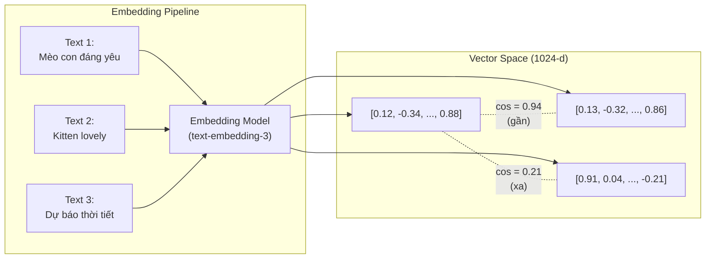

# Embedding là gì? Dùng để làm gì

## ⚡ Tóm tắt ngắn (30s)
* **Embedding** là **vector số (thường 384–3072 chiều)** đại diện cho **ngữ nghĩa** của một đoạn văn bản (hoặc hình ảnh, code, audio). Một embedding model được train để các văn bản có ý nghĩa gần nhau cho ra vector gần nhau trong không gian vector (cosine similarity cao).
* **Ví dụ trực quan**:
  * "Mèo con đáng yêu" → `[0.12, -0.34, ..., 0.88]` (1024-dim)
  * "Kitten lovely" → `[0.13, -0.32, ..., 0.86]` (gần với câu trên)
  * "Dự báo thời tiết mưa" → `[0.91, 0.04, ..., -0.21]` (xa)
* **Use case backend phổ biến**:
  1. **Semantic search**: Tìm document gần ngữ nghĩa với query (RAG core).
  2. **Recommendation**: Tìm sản phẩm tương tự dựa trên description.
  3. **Clustering / dedup**: Gom nhóm các đoạn văn gần nghĩa, phát hiện duplicate ticket / FAQ.
  4. **Anomaly detection**: Phát hiện log/text khác biệt so với pattern bình thường.
  5. **Classification**: K-NN trên embedding làm "zero-shot" classifier.
* **Thảm họa thực chiến**: Team đem cosine similarity của embedding làm "ngưỡng giống nhau" cứng (>0.85 = duplicate). Hai câu trái nghĩa ("Tôi yêu Java" vs "Tôi ghét Java") có similarity 0.92 vì cùng topic — pipeline dedup gộp nhầm 30% ticket vào một bug. Senior fix: dùng cross-encoder rerank thay vì cosine threshold cứng.

---

## 🔍 Chi tiết bản chất

### 1. Embedding model học gì

Embedding model (sentence-BERT, OpenAI text-embedding-3, Cohere embed, BAAI bge-m3, voyage-3) được train với mục tiêu **contrastive learning**:
* Cặp văn bản tương đồng → kéo vector gần nhau.
* Cặp văn bản khác nhau → đẩy vector xa nhau.

Sau khi train, embedding tạo ra một **không gian ngữ nghĩa** nơi:
* Cosine similarity (`cos(θ)` giữa 2 vector) đo độ tương đồng. Range [-1, 1], càng gần 1 càng giống.
* Khoảng cách Euclidean cũng có thể dùng nhưng cosine phổ biến hơn vì invariant với độ dài vector.

### 2. Tham số quan trọng

| Tham số | Ý nghĩa | Giá trị phổ biến |
| :--- | :--- | :--- |
| **Dimension** | Số chiều vector | 384 (bge-small), 1024 (bge-m3), 1536 (text-embedding-3-small), 3072 (text-embedding-3-large) |
| **Max input** | Số token tối đa per embedding | 512 (sentence-BERT) đến 8192 (text-embedding-3) |
| **Language coverage** | Đa ngôn ngữ hay chỉ English | bge-m3 multilingual; OpenAI multilingual; Cohere multilingual |
| **Output normalization** | Đã chuẩn hóa về norm = 1 chưa | text-embedding-3 normalized, Cohere có flag |
| **Cost** | $/1M token | $0.02–$0.13 |

### 3. Không gian vector – Tính chất hữu ích

Trong không gian embedding, **arithmetic gần đúng** xảy ra (giống word2vec):
```
v("vua") - v("đàn ông") + v("phụ nữ") ≈ v("nữ hoàng")
```

Điều này KHÔNG đúng tuyệt đối với mọi embedding model, nhưng đủ để:
* **Semantic search** tốt hơn keyword search rất nhiều.
* **Classification trên K-NN** đạt accuracy cao trên các task đơn giản.
* **Clustering** k-means hoạt động ổn trên cấp ngàn document.

### 4. Embedding model vs LLM — Khác nhau

| Khía cạnh | Embedding Model | LLM (Chat Model) |
| :--- | :--- | :--- |
| Output | Vector số (1024-3072 chiều) | Text |
| Goal | Encode ngữ nghĩa | Predict next token |
| Cost / 1M token | $0.02–0.13 | $0.15–$75 |
| Latency | 10–100ms | 300ms–10s |
| Khi dùng | Search, similarity, clustering | Generate, reason, conversation |

→ Senior backend hiểu **2 model khác nhau**, đừng nhầm.

---

## 🎨 Sơ đồ trực quan



---

## 💻 Code thực chiến

### 1. Sinh embedding với Spring AI

```java
package com.example.embedding;

import org.springframework.ai.embedding.EmbeddingModel;
import org.springframework.ai.embedding.EmbeddingResponse;
import org.springframework.stereotype.Service;
import java.util.List;

@Service
public class EmbeddingService {
    private final EmbeddingModel embeddingModel;

    public EmbeddingService(EmbeddingModel m) { this.embeddingModel = m; }

    /** Sinh embedding cho 1 đoạn text */
    public float[] embed(String text) {
        // Spring AI tự chọn provider theo config (OpenAI / Bedrock / Ollama)
        return embeddingModel.embed(text);
    }

    /** Batch embedding tiết kiệm round-trip. Quy tắc: batch 50–100 doc/request */
    public List<float[]> embedBatch(List<String> texts) {
        EmbeddingResponse resp = embeddingModel.call(
            new org.springframework.ai.embedding.EmbeddingRequest(texts, null)
        );
        return resp.getResults().stream()
                .map(r -> r.getOutput())
                .map(this::toFloatArray)
                .toList();
    }

    private float[] toFloatArray(List<Float> list) {
        float[] arr = new float[list.size()];
        for (int i = 0; i < list.size(); i++) arr[i] = list.get(i);
        return arr;
    }
}
```

### 2. Cosine similarity (tính tay, không cần lib)

```java
public class VectorMath {
    /** Cosine similarity, giả định vector chưa normalize */
    public static double cosine(float[] a, float[] b) {
        double dot = 0, na = 0, nb = 0;
        for (int i = 0; i < a.length; i++) {
            dot += a[i] * b[i];
            na  += a[i] * a[i];
            nb  += b[i] * b[i];
        }
        return dot / (Math.sqrt(na) * Math.sqrt(nb));
    }
}
```

### 3. Semantic search với pgvector (Postgres)

```sql
-- Schema
CREATE EXTENSION IF NOT EXISTS vector;
CREATE TABLE documents (
    id BIGSERIAL PRIMARY KEY,
    text TEXT NOT NULL,
    embedding vector(1024) NOT NULL,
    created_at TIMESTAMPTZ DEFAULT now()
);
-- HNSW index cho semantic search nhanh
CREATE INDEX documents_embedding_idx ON documents
    USING hnsw (embedding vector_cosine_ops);

-- Query: top-5 doc gần nghĩa với query embedding
SELECT id, text, 1 - (embedding <=> :query_embedding) AS similarity
FROM documents
ORDER BY embedding <=> :query_embedding   -- '<=>' là cosine distance
LIMIT 5;
```

```java
@Repository
public class DocumentRepository {
    private final NamedParameterJdbcTemplate jdbc;

    public List<Document> semanticSearch(float[] queryEmbedding, int topK) {
        String sql = """
            SELECT id, text, 1 - (embedding <=> :emb::vector) AS sim
            FROM documents
            ORDER BY embedding <=> :emb::vector
            LIMIT :topK
            """;
        return jdbc.query(sql,
            Map.of("emb", toPgvector(queryEmbedding), "topK", topK),
            (rs, rn) -> new Document(rs.getLong("id"), rs.getString("text"), rs.getDouble("sim"))
        );
    }

    private String toPgvector(float[] v) {
        StringBuilder sb = new StringBuilder("[");
        for (int i = 0; i < v.length; i++) {
            sb.append(v[i]);
            if (i < v.length - 1) sb.append(",");
        }
        return sb.append("]").toString();
    }
    record Document(long id, String text, double similarity) {}
}
```

---

## 📊 Bảng so sánh các Embedding Model phổ biến (2026)

| Model | Provider | Dim | Max Input | $/1M token | Best for |
| :--- | :--- | :---: | :---: | :---: | :--- |
| text-embedding-3-small | OpenAI | 1536 | 8192 | $0.02 | General, rẻ |
| text-embedding-3-large | OpenAI | 3072 | 8192 | $0.13 | Best English quality |
| voyage-3-large | Voyage | 1024 | 32k | $0.18 | Long context, top RAG |
| embed-multilingual-v3.0 | Cohere | 1024 | 512 | $0.10 | Multilingual |
| bge-m3 | BAAI (open) | 1024 | 8192 | self-host | Self-host, multilingual, free |
| amazon.titan-embed-text-v2 | Bedrock | 1024 | 8192 | $0.02 | AWS native |
| nomic-embed-text-v1.5 | Nomic (open) | 768 | 8192 | self-host | Lightweight on-prem |

---

## ⚠️ Common Gotchas & Questions follow-up

### 1. Cạm bẫy: Trộn embedding từ nhiều model
* **Vấn đề**: Team embed nửa data bằng text-embedding-ada-002 (1536-dim), nửa kia bằng text-embedding-3-large (3072-dim) → query không thể compare cross-model.
* **Giải pháp**: Mỗi vector DB collection chỉ dùng MỘT embedding model. Khi đổi model → re-embed toàn bộ data (downtime hoặc dual-write migration).

### 2. Cạm bẫy: Cosine cao = đồng nghĩa
* **Vấn đề**: "Tôi yêu Java" và "Tôi ghét Java" có cosine ~0.92 vì cùng topic Java + cấu trúc câu giống. Pipeline dedup gộp nhầm.
* **Giải pháp**: 
  1. Cosine **chỉ đo similarity ngữ nghĩa thô**, không đo "đồng ý/phản đối".
  2. Dùng **cross-encoder rerank** (Cohere rerank-3 hoặc BGE-reranker) cho top-K trước khi quyết định.
  3. Với task phân loại sentiment / stance, dùng LLM ngắn để gắn label, không dựa vào cosine.

### 3. Cạm bẫy: Không normalize, không asymmetric
* **Vấn đề**: Một số model có **asymmetric encoding** (encode query khác encode document). E.g. bge-m3 có prefix `"query: "` cho query và `"passage: "` cho doc. Quên prefix → recall giảm 10-20%.
* **Giải pháp**: Đọc model card kỹ. Áp dụng đúng convention. Test recall trước/sau khi áp prefix.

### 4. Câu hỏi đào sâu từ interviewer
* **Interviewer: "Bạn có 10 triệu document, cần embed và search nhanh. Thiết kế thế nào?"**
* **Trả lời Senior**:
  1. **Embedding offline + batch**: 
     - Producer đẩy doc vào Kafka.
     - Consumer batch 100 doc/request gửi cho embedding API (giảm cost + overhead).
     - Throttle theo provider rate limit (OpenAI ~1M token/min cho embedding).
  2. **Vector DB chọn theo scale**:
     - <1M vector: pgvector OK, đơn giản.
     - 1M–100M: Qdrant / Weaviate / Pinecone, có HNSW + filter native.
     - >100M: Milvus với sharding, hoặc managed Pinecone.
  3. **Index strategy**: HNSW (nhanh nhưng tốn RAM) hoặc IVF (rẻ RAM, hơi chậm). Tune `efConstruction` / `efSearch`.
  4. **Hybrid search**: kết hợp BM25 + vector search → recall cao hơn cho query có từ khóa cụ thể.
  5. **Monitoring**: track p99 latency, recall@k trên golden set hàng ngày.
