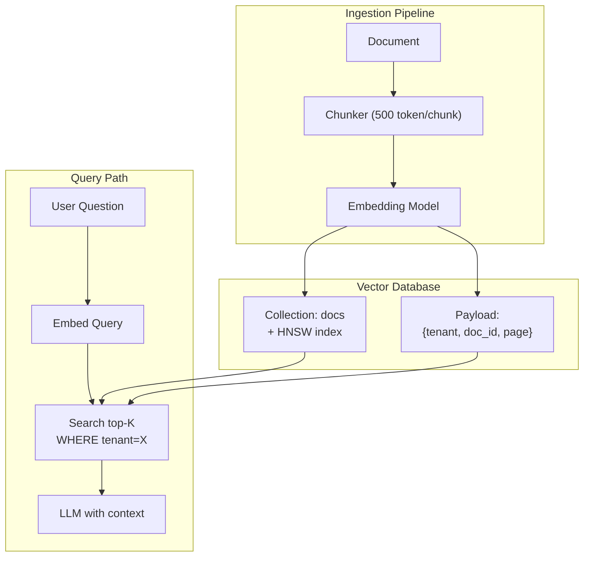

# Vector Database là gì

## ⚡ Tóm tắt ngắn (30s)
* **Vector database** là database chuyên dụng để lưu trữ và **tìm kiếm nhanh các vector gần nhất** (Approximate Nearest Neighbor — ANN search) trong không gian high-dimensional (768–3072 chiều). Truy vấn điển hình: "cho query vector Q, trả về top-K vector gần nhất theo cosine similarity / Euclidean distance".
* **Tại sao cần database riêng** thay vì lưu vào MySQL: chứa hàng triệu/tỷ vector × 1024 chiều = nhiều GB RAM. Brute-force search O(n) quá chậm. Cần **ANN index** (HNSW, IVF, ScaNN) để search trong O(log n) với accuracy ~95%.
* **Lựa chọn phổ biến (2026)**:
  | Scale | Lựa chọn | Lý do |
  | :--- | :--- | :--- |
  | <1M vectors | **pgvector** (Postgres extension) | Đơn giản, dùng SQL hiện tại, không thêm component |
  | 1M–100M | **Qdrant / Weaviate / Pinecone serverless** | HNSW + filter native, hosted |
  | >100M | **Milvus / Pinecone enterprise** | Distributed, GPU search, multi-tenancy |
  | Self-host enterprise | **Milvus / Weaviate** | Open-source, control hoàn toàn |
* **Thảm họa thực chiến**: Team chọn Elasticsearch (knn plugin) làm vector DB chính vì "đã có sẵn". 5M vector × 1024 chiều → Elasticsearch ngốn 80GB RAM, query p99 = 2s. Senior chuyển sang Qdrant cluster 3 node → RAM 15GB, p99 = 50ms, cost giảm 4x.

---

## 🔍 Chi tiết bản chất

### 1. Vấn đề mà vector DB giải quyết

Cho 10 triệu vector 1024-d, tìm top-5 gần nhất với query vector Q:
* **Brute-force**: compute cosine với từng vector → 10M phép tính → ~5–30 giây. Không scale.
* **ANN index**: pre-build index sao cho query chỉ phải so sánh ~1000–10000 vector "có khả năng gần Q" → ~5–50ms. Trade-off: 95–99% recall (không tuyệt đối chính xác, nhưng đủ tốt cho semantic search).

### 2. ANN Index — Các thuật toán chính

#### HNSW (Hierarchical Navigable Small World)
* Graph structure: mỗi vector là 1 node, có edge tới các neighbor gần.
* Search: đi từ entry point, "leo dốc" tới node gần Q nhất.
* Ưu: recall cao, query nhanh, hỗ trợ filter tốt.
* Nhược: build index chậm, tốn RAM (graph structure).
* Dùng bởi: pgvector, Qdrant, Weaviate, Pinecone.

#### IVF (Inverted File Index)
* Cluster vectors thành k partition (k-means). Khi query, chỉ search các partition gần Q.
* Ưu: ít RAM hơn HNSW.
* Nhược: recall thấp hơn nếu k nhỏ; cần tune `nprobe`.
* Dùng bởi: Faiss, Milvus.

#### Scalar / Product Quantization
* Nén vector từ float32 → int8 (4x giảm RAM) hoặc product quantize.
* Trade off recall xíu để giảm RAM/cost.
* Thường combine với HNSW/IVF.

### 3. Tính năng phải có của Vector DB sản phẩm hóa

| Tính năng | Mô tả | Vì sao cần |
| :--- | :--- | :--- |
| **Metadata filter** | WHERE tenant_id = X AND created_at > Y | Multi-tenant, permission, date range |
| **Hybrid search** | Kết hợp BM25 (keyword) + vector | Recall cao hơn cho query có từ khóa specific |
| **Upsert** | Update vector theo ID | Document update workflow |
| **Bulk insert** | Insert hàng triệu vector hiệu quả | Ingestion pipeline |
| **Snapshot / backup** | Save & restore | Disaster recovery |
| **Multi-tenancy** | Isolation logic / physical | SaaS |
| **Versioning** | Track schema version | Migrate embedding model |
| **Sharding / replication** | Scale ngang | Hàng tỷ vector |

### 4. Mô hình dữ liệu

```
Collection (= table)
  ├─ ID (string/uuid)
  ├─ Vector (float[]: 1024d)
  ├─ Payload / Metadata (JSON: { tenant_id, doc_id, chunk_id, page, ...})
```

Query: `cho vector Q + filter {tenant_id = "X"}, trả top-K`.

---

## 🎨 Sơ đồ trực quan



---

## 💻 Code thực chiến

### 1. pgvector — Setup + index (Postgres)

```sql
-- Bật extension (Postgres 15+ recommended)
CREATE EXTENSION IF NOT EXISTS vector;

-- Schema cho RAG chunks
CREATE TABLE rag_chunks (
    id BIGSERIAL PRIMARY KEY,
    tenant_id UUID NOT NULL,
    doc_id    UUID NOT NULL,
    chunk_idx INT  NOT NULL,
    text      TEXT NOT NULL,
    embedding vector(1024) NOT NULL,
    created_at TIMESTAMPTZ DEFAULT now()
);

-- HNSW cho cosine distance
CREATE INDEX rag_chunks_embedding_hnsw
ON rag_chunks
USING hnsw (embedding vector_cosine_ops)
WITH (m = 16, ef_construction = 64);  -- M = 16 connection/node, ef = chất lượng build

-- BTREE cho filter metadata
CREATE INDEX rag_chunks_tenant_idx ON rag_chunks (tenant_id);
```

### 2. Java client — Multi-tenant semantic search trên pgvector

```java
package com.example.vector;

import org.springframework.jdbc.core.namedparam.NamedParameterJdbcTemplate;
import org.springframework.stereotype.Repository;

import java.util.*;

@Repository
public class RagChunkRepository {

    private final NamedParameterJdbcTemplate jdbc;

    public RagChunkRepository(NamedParameterJdbcTemplate j) { this.jdbc = j; }

    public List<Hit> search(UUID tenantId, float[] qEmbedding, int topK) {
        // ef_search ảnh hưởng recall/latency tradeoff — set trong session
        jdbc.getJdbcTemplate().execute("SET hnsw.ef_search = 100");

        String sql = """
            SELECT id, doc_id, chunk_idx, text,
                   1 - (embedding <=> CAST(:q AS vector)) AS similarity
              FROM rag_chunks
             WHERE tenant_id = :tenantId
             ORDER BY embedding <=> CAST(:q AS vector)
             LIMIT :topK
        """;

        Map<String, Object> params = Map.of(
            "tenantId", tenantId,
            "q", toPgvector(qEmbedding),
            "topK", topK
        );

        return jdbc.query(sql, params, (rs, n) -> new Hit(
            rs.getLong("id"),
            UUID.fromString(rs.getString("doc_id")),
            rs.getInt("chunk_idx"),
            rs.getString("text"),
            rs.getDouble("similarity")
        ));
    }

    private static String toPgvector(float[] v) {
        StringBuilder sb = new StringBuilder("[");
        for (int i = 0; i < v.length; i++) {
            sb.append(v[i]);
            if (i < v.length - 1) sb.append(",");
        }
        return sb.append("]").toString();
    }

    public record Hit(long id, UUID docId, int chunkIdx, String text, double similarity) {}
}
```

### 3. Qdrant — Java client cho scale cao

```java
package com.example.vector;

import io.qdrant.client.QdrantClient;
import io.qdrant.client.QdrantGrpcClient;
import io.qdrant.client.grpc.Points;
import io.qdrant.client.grpc.Points.SearchPoints;

public class QdrantSearchService {
    private final QdrantClient client = new QdrantClient(
        QdrantGrpcClient.newBuilder("qdrant.internal", 6334, false).build()
    );

    public List<Points.ScoredPoint> search(String collection, float[] q, String tenantId, int topK) throws Exception {
        var filter = Points.Filter.newBuilder()
            .addMust(Points.Condition.newBuilder()
                .setField(Points.FieldCondition.newBuilder()
                    .setKey("tenant_id")
                    .setMatch(Points.Match.newBuilder().setKeyword(tenantId).build())
                    .build())
                .build())
            .build();

        SearchPoints req = SearchPoints.newBuilder()
            .setCollectionName(collection)
            .addAllVector(toFloatList(q))
            .setLimit(topK)
            .setFilter(filter)
            .setWithPayload(Points.WithPayloadSelector.newBuilder().setEnable(true).build())
            .build();

        return client.searchAsync(req).get();
    }

    private static java.util.List<Float> toFloatList(float[] arr) {
        java.util.List<Float> out = new java.util.ArrayList<>(arr.length);
        for (float v : arr) out.add(v);
        return out;
    }
}
```

---

## 📊 Bảng so sánh Vector DB phổ biến (2026)

| DB | Type | HNSW | Filter | Scale | Self-host | Note |
| :--- | :--- | :---: | :---: | :--- | :---: | :--- |
| **pgvector** | Postgres ext | ✓ | SQL native | <10M optimal | ✓ | Đơn giản, ACID, dùng SQL |
| **Pinecone** | Managed | ✓ | ✓ | 100M+ | ✗ | Hosted only, easy ops |
| **Weaviate** | Vector DB | ✓ | ✓ + GraphQL | 100M+ | ✓ | Hybrid search native |
| **Qdrant** | Vector DB | ✓ | ✓ + payload | 100M+ | ✓ | Performance tốt, Rust-based |
| **Milvus** | Distributed | ✓ + IVF | ✓ | 1B+ | ✓ | Phức tạp, dùng cho mega scale |
| **Chroma** | Embedded | ✓ | ✓ | <1M | ✓ | Dev/prototype, không prod |
| **OpenSearch / ES (kNN)** | Search engine | ✓ | ✓ | 10M+ | ✓ | Reuse nếu đã có ES; nhưng tốn RAM |
| **Vespa** | Search engine | ✓ | ✓ | 1B+ | ✓ | Yahoo-grade, learning curve cao |

---

## ⚠️ Common Gotchas & Questions follow-up

### 1. Cạm bẫy: Chọn vector DB không có filter tốt
* **Vấn đề**: Multi-tenant app dùng vector DB không có metadata filter mạnh → phải post-filter sau khi search → mất nhiều top-K hợp lệ (vì các kết quả khớp tenant nằm xa hơn top-K). Recall giảm.
* **Giải pháp**: Test trước khi chọn. Qdrant/Weaviate/pgvector có pre-filter (filter TRONG khi traverse HNSW graph) → recall cao hơn post-filter.

### 2. Cạm bẫy: Quên rebuild index khi đổi embedding model
* **Vấn đề**: Đổi text-embedding-ada-002 (1536d) sang text-embedding-3-large (3072d) nhưng schema cũ vẫn 1536d. Hoặc dim giống nhưng distribution khác → recall sụt mạnh.
* **Giải pháp**: 
  1. Re-embed toàn bộ data với model mới.
  2. Dual-write trong giai đoạn migrate, A/B test, sau đó cutover.
  3. Versioned collection: `rag_chunks_v2` thay vì update in-place.

### 3. Cạm bẫy: Index HNSW quá khắt khe → build lâu
* **Vấn đề**: Set `m = 64, ef_construction = 512` → quality cao nhưng build 10M vector mất 5 giờ. Sau đó update 1 record cũng chậm.
* **Giải pháp**: Default `m = 16, ef_construction = 64` là điểm cân bằng tốt. Tune theo benchmark cụ thể, không copy paste config từ Stack Overflow.

### 4. Câu hỏi đào sâu từ interviewer
* **Interviewer: "Khi nào bạn KHÔNG dùng vector DB?"**
* **Trả lời Senior**:
  1. **Dataset nhỏ <10k vector**: brute-force trong RAM (numpy.dot) đủ nhanh, không cần infrastructure thêm.
  2. **Query mostly exact-match keyword**: BM25/Elasticsearch tốt hơn semantic search.
  3. **Latency cực thấp <10ms**: vector search có overhead, không phù hợp inline trong critical path nhanh; cache kết quả semantic nếu cần.
  4. **High write throughput >10k/s**: vector index expensive để rebuild; cân nhắc batch + reindex offline thay vì real-time.
  5. **Compliance không cho lưu embedding**: một số quy định coi embedding như "derived PII"; nếu không clear → tránh.
