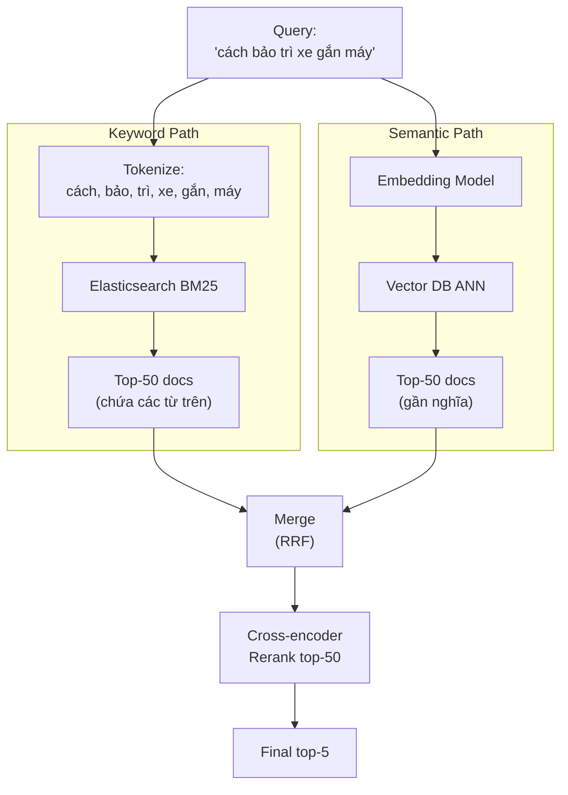

# Semantic Search khác Keyword Search thế nào

## ⚡ Tóm tắt ngắn (30s)
* **Keyword search** (BM25, TF-IDF, Elasticsearch default) tìm document chứa **chính xác các từ trong query**. Strong khi user biết từ khóa cụ thể; weak khi câu hỏi diễn đạt khác từ trong doc ("xe hai bánh chạy bằng pin" ≠ "scooter điện" theo BM25).
* **Semantic search** dùng **embedding** để tìm document gần ngữ nghĩa với query, không cần trùng từ. Hiểu được synonym ("automobile" ≈ "car"), paraphrase ("how to bake bread" ≈ "bread recipe"), cross-lingual ("xe đạp" ≈ "bicycle").
* **Sự thật Senior phải biết**: Trong production RAG, **không bao giờ chỉ dùng 1 trong 2**. Best practice là **Hybrid Search** = combine cả 2 + rerank. BM25 cứu cho exact-match (mã sản phẩm, code identifier, tên người), semantic cứu cho paraphrase.
* **Thảm họa thực chiến**: Team RAG cho FAQ e-commerce, chỉ dùng semantic search. User search "SKU ABC-12345" → semantic không hit doc có chứa SKU vì embedding model tokenize sai mã số. User search "mã giảm giá" → trả về đủ thứ document marketing. Senior fix bằng hybrid (BM25 + semantic, rerank Cohere) → recall@5 tăng từ 62% lên 89%.

---

## 🔍 Chi tiết bản chất

### 1. Keyword Search (Lexical)

**Algorithm**: BM25 (Best Match 25) là chuẩn vàng. Cải tiến của TF-IDF:
* TF (Term Frequency): từ xuất hiện nhiều → relevance cao.
* IDF (Inverse Document Frequency): từ hiếm → relevance cao hơn từ phổ thông.
* Document length normalization: doc dài không bị unfair advantage.

**Ưu**:
* Exact match — quan trọng cho mã, ID, tên riêng.
* Explainable — dễ debug vì sao doc match.
* Cực rẻ và nhanh (Elasticsearch inverted index).
* Không cần GPU / embedding API.

**Nhược**:
* **Vocabulary mismatch**: query "car" không match doc chứa "automobile".
* Không hiểu synonym, paraphrase, intent.
* Không cross-lingual (query EN không match doc VN).

### 2. Semantic Search (Vector)

**Algorithm**: Embed query và doc → cosine similarity → ANN search trong vector DB (Pinecone, pgvector, Qdrant).

**Ưu**:
* Hiểu **ngữ nghĩa**: synonym, paraphrase.
* Cross-lingual nếu dùng multilingual embedding (bge-m3, OpenAI).
* Hoạt động tốt với query dài, mơ hồ.

**Nhược**:
* **Miss exact-match**: query "v1.2.3" không pinpoint được version cụ thể.
* **False positives**: hai câu cùng topic nhưng trái nghĩa có thể có cosine cao ("Java tốt" vs "Java tệ").
* Đòi hỏi embedding pipeline + vector DB → ops phức tạp hơn.
* Cost embedding + storage.

### 3. Hybrid Search — Best of both

Công thức kết hợp đơn giản (RRF — Reciprocal Rank Fusion):
```
hybrid_score(doc) = α / (k + rank_bm25)  +  (1-α) / (k + rank_semantic)
```
Với `α = 0.5, k = 60`. Hoặc dùng score normalization rồi weighted sum.

Quy trình hybrid điển hình:
1. BM25 search → top-50 candidates.
2. Semantic search → top-50 candidates.
3. Merge + RRF → top-20.
4. **Rerank** bằng cross-encoder (Cohere rerank-3, BGE-reranker) → top-5.
5. Đưa top-5 vào LLM.

### 4. Khi nào dùng từng loại

| Use case | Keyword | Semantic | Hybrid |
| :--- | :---: | :---: | :---: |
| Tìm SKU / code identifier | ✓✓✓ | ✗ | ✓✓ |
| FAQ chatbot | ✓ | ✓✓ | ✓✓✓ |
| Tìm văn bản pháp lý | ✓✓ | ✓✓ | ✓✓✓ |
| Code search (Github) | ✓✓ | ✓✓ | ✓✓✓ |
| Cross-lingual support | ✗ | ✓✓✓ | ✓✓ |
| Câu hỏi dài, mơ hồ | ✗ | ✓✓✓ | ✓✓✓ |
| Realtime / cost-sensitive | ✓✓✓ | ✓ | ✗ |

---

## 🎨 Sơ đồ trực quan



---

## 💻 Code thực chiến: Hybrid Search

### 1. BM25 với Elasticsearch + Vector với pgvector → Hybrid trong app

```java
package com.example.search.hybrid;

import org.springframework.stereotype.Service;
import java.util.*;
import java.util.stream.Collectors;

@Service
public class HybridSearchService {

    private final ElasticBm25Service bm25;
    private final PgVectorService vector;
    private final EmbeddingService embedding;
    private final CohereRerankService reranker;

    public HybridSearchService(ElasticBm25Service b, PgVectorService v, EmbeddingService e, CohereRerankService r) {
        this.bm25 = b; this.vector = v; this.embedding = e; this.reranker = r;
    }

    public List<DocHit> hybridSearch(String query, UUID tenantId, int topK) {
        // 1. BM25 top-50
        List<DocHit> bm25Hits = bm25.search(query, tenantId, 50);

        // 2. Semantic top-50
        float[] qEmbed = embedding.embed(query);
        List<DocHit> semanticHits = vector.search(qEmbed, tenantId, 50);

        // 3. RRF merge
        Map<String, Double> rrf = new HashMap<>();
        addRRF(rrf, bm25Hits, 60);
        addRRF(rrf, semanticHits, 60);

        // 4. Lấy top-50 sau khi merge
        List<String> mergedTop50 = rrf.entrySet().stream()
                .sorted(Map.Entry.<String, Double>comparingByValue().reversed())
                .limit(50)
                .map(Map.Entry::getKey)
                .toList();

        // 5. Rerank top-50 với cross-encoder, lấy top-K
        List<DocHit> candidates = loadDocsByIds(mergedTop50);
        return reranker.rerank(query, candidates, topK);
    }

    private void addRRF(Map<String, Double> map, List<DocHit> hits, int k) {
        for (int i = 0; i < hits.size(); i++) {
            String id = hits.get(i).docId();
            double weight = 1.0 / (k + i + 1);  // RRF formula
            map.merge(id, weight, Double::sum);
        }
    }

    private List<DocHit> loadDocsByIds(List<String> ids) { return List.of(); /* impl */ }

    public record DocHit(String docId, String text, double score) {}
}
```

### 2. pgvector native hybrid (Postgres 16+ với tsvector + vector)

```sql
-- Thêm tsvector cho BM25-like search
ALTER TABLE rag_chunks ADD COLUMN tsv tsvector
    GENERATED ALWAYS AS (to_tsvector('vietnamese', text)) STORED;
CREATE INDEX rag_chunks_tsv_idx ON rag_chunks USING GIN(tsv);

-- Query hybrid: kết hợp ts_rank và cosine
WITH bm25 AS (
    SELECT id, ts_rank(tsv, plainto_tsquery('vietnamese', :query)) AS rank
    FROM rag_chunks
    WHERE tenant_id = :tenant_id AND tsv @@ plainto_tsquery('vietnamese', :query)
    ORDER BY rank DESC LIMIT 50
),
semantic AS (
    SELECT id, 1 - (embedding <=> CAST(:qemb AS vector)) AS sim
    FROM rag_chunks
    WHERE tenant_id = :tenant_id
    ORDER BY embedding <=> CAST(:qemb AS vector) LIMIT 50
)
SELECT rc.id, rc.text,
       0.5 * COALESCE(bm25.rank, 0) + 0.5 * COALESCE(semantic.sim, 0) AS hybrid_score
FROM rag_chunks rc
LEFT JOIN bm25 ON rc.id = bm25.id
LEFT JOIN semantic ON rc.id = semantic.id
WHERE bm25.id IS NOT NULL OR semantic.id IS NOT NULL
ORDER BY hybrid_score DESC LIMIT 10;
```

---

## 📊 Bảng so sánh chi tiết

| Tiêu chí | Keyword (BM25) | Semantic (Vector) | Hybrid + Rerank |
| :--- | :--- | :--- | :--- |
| **Exact match (SKU, code)** | Xuất sắc | Yếu | Xuất sắc |
| **Synonym / paraphrase** | Yếu | Xuất sắc | Xuất sắc |
| **Cross-lingual** | Không | Có (multilingual model) | Có |
| **Recall trên FAQ test** | 60–70% | 70–85% | **88–95%** |
| **Latency** | 5–20ms | 30–100ms | 200–500ms |
| **Cost** | Rẻ | Trung bình | Cao (rerank API) |
| **Explainability** | Cao (highlight match) | Thấp | Trung bình |
| **Ops complexity** | Thấp (ES có sẵn) | Trung bình | Cao (3 component) |

---

## ⚠️ Common Gotchas & Questions follow-up

### 1. Cạm bẫy: Chỉ semantic, bỏ keyword
* **Vấn đề**: Bug tracker tích hợp RAG, user search "JIRA-1234" → semantic không pin-point được vì model không học pattern này. Trả về 5 ticket ngẫu nhiên có chữ "JIRA".
* **Giải pháp**: Hybrid bắt buộc. Hoặc dùng query rewrite: detect pattern alphanumeric → ưu tiên BM25.

### 2. Cạm bẫy: Quên stem / lemmatize tiếng Việt
* **Vấn đề**: BM25 query "chạy bộ" không match doc "chạy bộ buổi sáng" nếu analyzer không xử lý đúng. Tiếng Việt khó stem hơn tiếng Anh.
* **Giải pháp**: 
  1. Elasticsearch dùng analyzer Việt: `vi_analyzer` (Vincaa) hoặc plug-in coccoc-tokenizer.
  2. Hoặc bypass stem hoàn toàn, để semantic cover.

### 3. Cạm bẫy: Trọng số α cứng
* **Vấn đề**: Set α = 0.5 cho mọi query. Nhưng có loại query semantic ưu thế (câu hỏi tự nhiên), loại keyword ưu thế (mã SKU).
* **Giải pháp**: Query classifier phía trước → set α dynamic. Hoặc tune α offline trên golden set.

### 4. Câu hỏi đào sâu từ interviewer
* **Interviewer: "Khi nào reranker đem lại ROI cao nhất?"**
* **Trả lời Senior**:
  1. **Khi top-K BM25/Vector noisy**: BM25 trả 50 doc có chứa từ khóa nhưng nội dung không liên quan → rerank lọc rất hiệu quả.
  2. **Khi query là câu hỏi dài, ngữ cảnh phức tạp**: cross-encoder hiểu interaction query-doc tốt hơn bi-encoder embedding.
  3. **Bài toán cost-sensitive nhưng accuracy critical**: rerank ~50ms thêm có thể đáng giá nếu giảm hallucination 30%.
  4. **Tradeoff**: rerank thêm latency 100–500ms và cost. Với high QPS app, cân nhắc cache rerank result theo `hash(query + docId)`.
