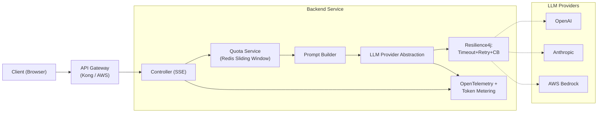

# Thiết kế Backend Service gọi LLM API

## ⚡ Tóm tắt ngắn (30s)
* **Backend gọi LLM** KHÔNG phải là "wrap 1 SDK call trong REST controller". Senior thiết kế nó như **một dòng dữ liệu critical** với 6 thành phần bắt buộc:
  1. **API Key vault** (Secrets Manager / Vault), không hardcode, rotation.
  2. **Provider abstraction** (interface để swap OpenAI/Anthropic/Bedrock).
  3. **Timeout + retry + circuit breaker** (Resilience4j) — LLM dễ timeout, dễ rate-limit 429.
  4. **Rate limit + quota per user** (Redis) — chống cost runaway.
  5. **Streaming SSE** cho UX tốt; cancel khi client disconnect để cứu cost.
  6. **Observability**: distributed tracing (OpenTelemetry), token/cost metric, response logging (redact PII).
* **Thảm họa thực chiến**: Team viết controller `@PostMapping` gọi `openaiClient.chat()` trực tiếp, 30s timeout, không retry, không streaming, không rate-limit. Trong 1 ngày: (1) LLM provider 429 → 80% request fail user-side, (2) Một user kẹt loop spam → $2k tiền oan, (3) Nginx timeout 60s → kill connection nhưng provider vẫn chạy → vẫn bị tính tiền. Senior refactor: WebClient async + Resilience4j retry + Redis quota + SSE streaming + cancel → uptime 99.9%.

---

## 🔍 Chi tiết kiến trúc service

### 1. Components chính (layered)

```
┌─────────────────────────────────────────────────┐
│ REST Controller (SSE stream / sync)             │
├─────────────────────────────────────────────────┤
│ Quota Service (Redis sliding window)            │
├─────────────────────────────────────────────────┤
│ Prompt Builder (versioned, cache-friendly)      │
├─────────────────────────────────────────────────┤
│ LLM Provider Abstraction                        │
│   ┌─────────┐ ┌──────────┐ ┌────────┐           │
│   │ OpenAI  │ │Anthropic │ │Bedrock │           │
│   └─────────┘ └──────────┘ └────────┘           │
├─────────────────────────────────────────────────┤
│ Resilience: Timeout + Retry + Circuit Breaker   │
├─────────────────────────────────────────────────┤
│ Observability: OpenTelemetry, Token Metering    │
└─────────────────────────────────────────────────┘
```

### 2. Quy trình xử lý request

1. **Auth + quota check** (Redis): từ chối sớm nếu vượt limit.
2. **Validate input**: max length, content type. Sanitize prompt injection markers.
3. **Build prompt**: system + few-shot + RAG context + user message.
4. **Estimate cost**: token count + price → reject nếu vượt $budget.
5. **Call LLM** qua abstraction với timeout cứng + retry idempotent + circuit breaker.
6. **Stream response** (SSE) về client. Cancel chain nếu client disconnect.
7. **Log**: redacted prompt + response + token usage + provider + latency.
8. **Emit metrics**: tokens_in, tokens_out, cost_usd, latency, error.

### 3. Resilience pattern

| Pattern | Mục đích | Cấu hình điển hình |
| :--- | :--- | :--- |
| **Timeout** | Tránh thread hang khi LLM stuck | connect=5s, read=60s (sync), 180s (streaming) |
| **Retry** | Recover transient 5xx / 429 | maxAttempts=2, backoff=exponential(1s, 4s, 16s) |
| **Circuit Breaker** | Stop hammer provider khi nó down | open khi error >50% trong 30s, half-open sau 60s |
| **Bulkhead** | Isolate LLM call khỏi web thread pool | semaphore 100 concurrent |
| **Rate limit** | Tránh bị provider 429 | Redis token bucket: 500 req/min |

### 4. Async vs Sync

* **Sync (RestTemplate)**: chiếm thread suốt thời gian LLM chạy (5–30s) → block 100 thread = sập server.
* **Async (WebClient/Reactor)**: free thread khi đang chờ I/O → 10x throughput trên cùng cluster.
* **Streaming SSE**: bắt buộc cho UX chat. Server-Sent Events đơn giản hơn WebSocket.

→ Senior chọn **WebClient + Reactor** ngay từ đầu.

---

## 🎨 Sơ đồ kiến trúc



---

## 💻 Code thực chiến: Spring Boot + WebClient + Resilience4j + SSE

### 1. Provider abstraction interface

```java
package com.example.ai.provider;

import reactor.core.publisher.Flux;
import reactor.core.publisher.Mono;

public interface LlmProvider {
    /** Sync call: trả về full response một lần */
    Mono<LlmResponse> chat(LlmRequest req);

    /** Streaming: token-by-token */
    Flux<String> stream(LlmRequest req);

    String providerName();
}

public record LlmRequest(
    String model, String systemPrompt, String userPrompt,
    Double temperature, Integer maxTokens
) {}

public record LlmResponse(
    String text, int inputTokens, int outputTokens, String provider
) {}
```

### 2. OpenAI implementation với WebClient + Resilience4j

```java
package com.example.ai.provider;

import io.github.resilience4j.circuitbreaker.annotation.CircuitBreaker;
import io.github.resilience4j.retry.annotation.Retry;
import io.github.resilience4j.timelimiter.annotation.TimeLimiter;
import org.springframework.beans.factory.annotation.Value;
import org.springframework.http.MediaType;
import org.springframework.http.codec.ServerSentEvent;
import org.springframework.stereotype.Component;
import org.springframework.web.reactive.function.client.WebClient;
import reactor.core.publisher.Flux;
import reactor.core.publisher.Mono;
import java.time.Duration;

@Component
public class OpenAiProvider implements LlmProvider {

    private final WebClient webClient;

    public OpenAiProvider(@Value("${openai.api-key}") String apiKey) {
        this.webClient = WebClient.builder()
            .baseUrl("https://api.openai.com/v1")
            .defaultHeader("Authorization", "Bearer " + apiKey)
            .defaultHeader("Content-Type", "application/json")
            .build();
    }

    @Override
    @TimeLimiter(name = "openai")        // 60s timeout
    @Retry(name = "openai")              // Retry 2x exponential
    @CircuitBreaker(name = "openai", fallbackMethod = "fallback")
    public Mono<LlmResponse> chat(LlmRequest req) {
        return webClient.post()
            .uri("/chat/completions")
            .bodyValue(toOpenAiPayload(req))
            .retrieve()
            .bodyToMono(OpenAiResponse.class)
            .map(r -> new LlmResponse(
                r.choices().get(0).message().content(),
                r.usage().prompt_tokens(),
                r.usage().completion_tokens(),
                "openai"
            ))
            .timeout(Duration.ofSeconds(60));
    }

    @Override
    public Flux<String> stream(LlmRequest req) {
        var payload = toOpenAiPayload(req);
        payload.put("stream", true);

        return webClient.post()
            .uri("/chat/completions")
            .bodyValue(payload)
            .accept(MediaType.TEXT_EVENT_STREAM)
            .retrieve()
            .bodyToFlux(ServerSentEvent.class)
            .takeWhile(e -> !"[DONE]".equals(e.data()))
            .map(e -> parseDelta(e.data()))
            .doOnCancel(() -> log.info("Client cancelled → stop streaming"));
    }

    public Mono<LlmResponse> fallback(LlmRequest req, Throwable t) {
        // Circuit open → trả về graceful error
        return Mono.error(new LlmUnavailableException("OpenAI hiện không khả dụng", t));
    }

    private Map<String,Object> toOpenAiPayload(LlmRequest req) { /* build JSON */ return Map.of(); }
    private String parseDelta(String json) { /* parse choices[0].delta.content */ return ""; }
    @Override public String providerName() { return "openai"; }
    private static final org.slf4j.Logger log = org.slf4j.LoggerFactory.getLogger(OpenAiProvider.class);
}
```

### 3. Controller với SSE + quota

```java
package com.example.ai.controller;

import org.springframework.http.MediaType;
import org.springframework.web.bind.annotation.*;
import reactor.core.publisher.Flux;
import reactor.core.publisher.Mono;

@RestController
@RequestMapping("/api/ai")
public class ChatController {

    private final LlmProvider llm;
    private final QuotaService quota;
    private final PromptBuilder promptBuilder;
    private final TokenMeterService meter;

    public ChatController(LlmProvider l, QuotaService q, PromptBuilder p, TokenMeterService m) {
        this.llm = l; this.quota = q; this.promptBuilder = p; this.meter = m;
    }

    @PostMapping(value = "/chat", produces = MediaType.TEXT_EVENT_STREAM_VALUE)
    public Flux<String> chat(@RequestBody ChatReq body, @RequestHeader("X-User-Id") String userId) {
        // Quota check (Redis sliding window)
        return quota.checkAndConsume(userId, body.estimatedTokens())
            .flatMapMany(allowed -> {
                if (!allowed) return Flux.error(new QuotaExceededException("Rate limit"));
                LlmRequest req = promptBuilder.build(body, userId);
                return llm.stream(req)
                    .doOnComplete(() -> meter.record(userId, req))
                    .onErrorResume(this::handleError);
            });
    }

    private Flux<String> handleError(Throwable t) {
        log.error("chat error", t);
        return Flux.just("data: {\"error\":\"" + t.getMessage() + "\"}\n\n");
    }

    record ChatReq(String message, Integer estimatedTokens) {}
    private static final org.slf4j.Logger log = org.slf4j.LoggerFactory.getLogger(ChatController.class);
}
```

### 4. application.yml — Resilience4j config

```yaml
resilience4j:
  timelimiter:
    instances:
      openai:
        timeout-duration: 60s
        cancel-running-future: true
  retry:
    instances:
      openai:
        max-attempts: 3
        wait-duration: 1s
        exponential-backoff-multiplier: 2
        retry-exceptions:
          - java.io.IOException
          - org.springframework.web.reactive.function.client.WebClientResponseException$ServiceUnavailable
          - org.springframework.web.reactive.function.client.WebClientResponseException$TooManyRequests
  circuitbreaker:
    instances:
      openai:
        sliding-window-size: 100
        failure-rate-threshold: 50
        wait-duration-in-open-state: 60s
        permitted-number-of-calls-in-half-open-state: 10
```

---

## 📊 Bảng quyết định kỹ thuật

| Decision | Lựa chọn Senior | Lý do |
| :--- | :--- | :--- |
| HTTP client | WebClient (reactive) | LLM call dài, thread blocking → throughput thấp |
| Streaming | SSE | Đơn giản hơn WebSocket, hỗ trợ HTTP/2 |
| Retry strategy | Exponential backoff, 2–3 attempts | 429/5xx thường resolve sau backoff |
| Timeout | 60–180s read | LLM có thể chậm; quá ngắn → false negative |
| Circuit breaker | Có (Resilience4j) | Tránh hammer provider khi down |
| Provider abstraction | Interface + Strategy | Đổi provider không động controller |
| Cancel propagation | doOnCancel → cancel upstream | Tiết kiệm token khi user disconnect |
| Observability | OpenTelemetry + custom span | Trace cross-service + cost |

---

## ⚠️ Common Gotchas & Questions follow-up

### 1. Cạm bẫy: Không cancel khi client disconnect
* **Vấn đề**: User reload page → frontend đóng SSE. Server vẫn tiếp tục đọc stream từ provider → tốn token vô ích.
* **Giải pháp**: WebClient Flux có `doOnCancel` propagate; OpenAI/Anthropic SDK hỗ trợ cancel. Bắt buộc test scenario này.

### 2. Cạm bẫy: Retry non-idempotent operation
* **Vấn đề**: Auto-retry trên `POST /chat` mà không có dedup key → mỗi retry tốn token mới + user nhận response trùng.
* **Giải pháp**: 
  1. Retry CHỈ trên transient error (429, 5xx, network).
  2. Idempotency key (UUID per request) để provider dedup.
  3. Không retry trên 4xx khác (400, 401, 403).

### 3. Cạm bẫy: Thread pool đói
* **Vấn đề**: Sync call với Tomcat default 200 thread; 250 user gửi chat → queue → timeout 500/502.
* **Giải pháp**: WebFlux reactive; bulkhead Resilience4j giới hạn concurrent LLM call (e.g. 50) thay vì để vô hạn.

### 4. Câu hỏi đào sâu từ interviewer
* **Interviewer: "Khi LLM provider trả 429, bạn xử lý thế nào?"**
* **Trả lời Senior**:
  1. **Header Retry-After**: nếu provider gửi Retry-After, dùng giá trị đó. Nếu không → exponential backoff với jitter.
  2. **Lift to circuit**: nếu 429 vượt threshold → circuit open, không thử trong 60s.
  3. **Spillover sang provider khác**: nếu có multi-provider abstraction, route sang Anthropic khi OpenAI 429.
  4. **Pre-emptive throttle**: Redis token bucket ở backend nắm rate-limit thực tế của plan → throttle CLIENT trước khi reach provider, tránh waste budget retry.
  5. **Alert + cap**: nếu 429 kéo dài (provider giảm rate plan của bạn) → page on-call, tăng plan.
