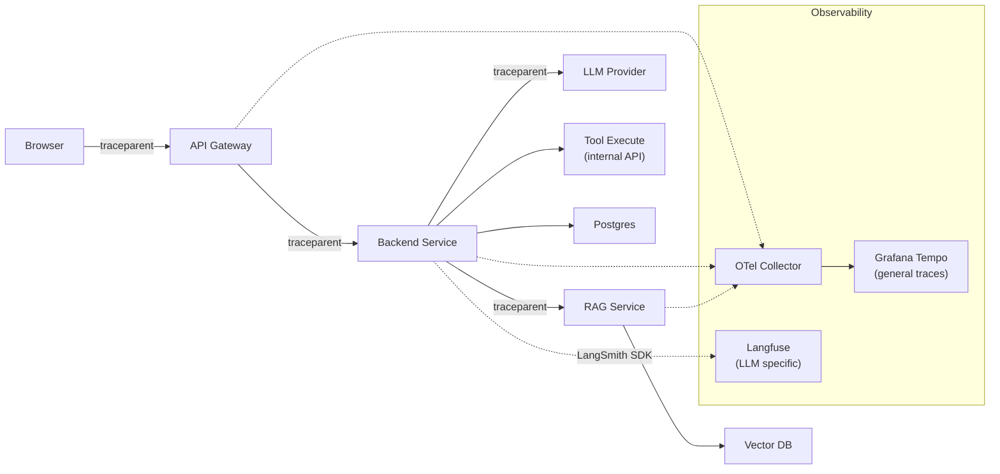

# Trace một Request đi qua API Gateway → Backend → LLM Provider

## ⚡ Tóm tắt ngắn (30s)
* **Distributed tracing** cho AI request: theo dõi 1 request xuyên qua mọi service (gateway → backend → LLM provider → tool calling → DB), gắn timing + metadata vào từng span.
* **Stack chuẩn 2026**:
  * **OpenTelemetry SDK** (Java/Python) để emit span.
  * **Collector** (OTel Collector) chuyển spans tới backend.
  * **Backend trace**: Datadog APM / Jaeger / Grafana Tempo / Honeycomb / LangSmith / Langfuse.
  * **AI-specific**: LangSmith / Langfuse / Helicone trace LLM-specific metadata (tokens, model, prompt hash, cost).
* **Spans cần emit cho mỗi LLM request**:
  1. `http.gateway` — request enter system.
  2. `auth.jwt-verify`.
  3. `quota.check`.
  4. `rag.search` — vector DB query.
  5. `prompt.build`.
  6. `llm.call` (span chính, với attribute `gen_ai.system=openai`, `gen_ai.model=gpt-4o`, `gen_ai.input_tokens`, `gen_ai.output_tokens`).
  7. `tool.execute` cho mỗi tool call.
  8. `audit.log`.
* **Thảm họa thực chiến**: User báo "AI lag 30s". Không có tracing → 4 giờ root cause analysis. Spam check log mỗi service. Cuối cùng tìm ra là RAG vector DB chậm 25s do index bị fragment. Sau khi setup OTel: 5 phút sau alert → dashboard chỉ thẳng vector DB span p99 spike.

---

## 🔍 Chi tiết kiến trúc tracing

### 1. Trace propagation chuẩn W3C

Mỗi HTTP request mang headers:
* `traceparent: 00-{trace_id}-{span_id}-{flags}` — W3C Trace Context.
* `tracestate: vendor=...` — vendor metadata.

Service nhận → extract → create child span → propagate sang downstream.

### 2. Span hierarchy cho 1 AI request

```
[ROOT SPAN] http.server (gateway)                          200ms
  ├─ auth.jwt-verify                                       5ms
  ├─ quota.check                                           3ms
  │
  └─ http.server (backend)                                 195ms
       │
       ├─ rag.search                                       50ms
       │    ├─ embedding.create                            20ms
       │    └─ vector_db.query                             28ms
       │
       ├─ prompt.build                                     2ms
       │
       ├─ llm.call (gen_ai.system=openai)                  140ms
       │    ├─ gen_ai.input_tokens=2500
       │    ├─ gen_ai.output_tokens=300
       │    ├─ gen_ai.cost_usd=0.018
       │    └─ http.client (OpenAI POST)                   135ms
       │
       └─ audit.log                                        2ms
```

### 3. AI-specific attributes (OTel GenAI semconv)

OpenTelemetry có draft **GenAI semantic conventions**:
* `gen_ai.system`: "openai" / "anthropic" / "bedrock"
* `gen_ai.model`: "gpt-4o" / "claude-sonnet-4-6"
* `gen_ai.operation.name`: "chat" / "completion" / "embedding"
* `gen_ai.input_tokens`, `gen_ai.output_tokens`
* `gen_ai.temperature`, `gen_ai.max_tokens`
* `gen_ai.finish_reason`: "stop" / "length" / "tool_calls"

→ Dashboard có thể filter/aggregate theo model, system, hỗ trợ cost per service.

### 4. Specialized AI observability tools

| Tool | Focus | Khác biệt |
| :--- | :--- | :--- |
| **LangSmith** | LLM trace + eval | Tích hợp LangChain native, có A/B test |
| **Langfuse** | Open-source LLM observability | Self-host, generation tracking |
| **Helicone** | Proxy + cost dashboard | Drop-in OpenAI proxy |
| **Datadog APM + LLM Obs** | General + LLM | Tích hợp APM hiện tại |
| **Honeycomb** | High-cardinality general | Mạnh ở debug exception |

→ Senior thường combo: OTel cho infrastructure-level + LangSmith/Langfuse cho LLM-level.

---

## 🎨 Sơ đồ kiến trúc



---

## 💻 Code thực chiến

### 1. Spring Boot + OpenTelemetry auto-instrumentation

```xml
<!-- pom.xml -->
<dependency>
    <groupId>io.opentelemetry.instrumentation</groupId>
    <artifactId>opentelemetry-spring-boot-starter</artifactId>
    <version>2.10.0</version>
</dependency>
```

```yaml
# application.yml
otel:
  service:
    name: ai-chat-backend
  exporter:
    otlp:
      endpoint: http://otel-collector:4317
  instrumentation:
    spring-web-mvc:
      enabled: true
    spring-webflux:
      enabled: true
    spring-jdbc:
      enabled: true
```

### 2. Custom spans cho LLM call

```java
package com.example.ai.observability;

import io.opentelemetry.api.OpenTelemetry;
import io.opentelemetry.api.trace.Span;
import io.opentelemetry.api.trace.SpanKind;
import io.opentelemetry.api.trace.Tracer;
import io.opentelemetry.context.Scope;
import org.springframework.stereotype.Service;

@Service
public class TracedLlmService {

    private final Tracer tracer;
    private final LlmClient llmClient;

    public TracedLlmService(OpenTelemetry otel, LlmClient l) {
        this.tracer = otel.getTracer("com.example.ai.llm");
        this.llmClient = l;
    }

    public LlmResponse chat(LlmRequest req) {
        // Tạo span theo OTel GenAI semantic convention
        Span span = tracer.spanBuilder("chat " + req.model())
            .setSpanKind(SpanKind.CLIENT)
            .setAttribute("gen_ai.system", req.provider())
            .setAttribute("gen_ai.model", req.model())
            .setAttribute("gen_ai.operation.name", "chat")
            .setAttribute("gen_ai.temperature", req.temperature())
            .setAttribute("gen_ai.max_tokens", req.maxTokens())
            .startSpan();

        try (Scope scope = span.makeCurrent()) {
            long start = System.nanoTime();
            LlmResponse resp = llmClient.call(req);
            long durationMs = (System.nanoTime() - start) / 1_000_000;

            // Đính kèm output attributes
            span.setAttribute("gen_ai.input_tokens", resp.inputTokens());
            span.setAttribute("gen_ai.output_tokens", resp.outputTokens());
            span.setAttribute("gen_ai.cost_usd", resp.costUsd());
            span.setAttribute("gen_ai.finish_reason", resp.finishReason());
            span.setAttribute("gen_ai.latency_ms", durationMs);

            return resp;
        } catch (Exception e) {
            span.recordException(e);
            span.setStatus(io.opentelemetry.api.trace.StatusCode.ERROR, e.getMessage());
            throw e;
        } finally {
            span.end();
        }
    }
}
```

### 3. LangSmith / Langfuse — LLM-specific tracking

```java
package com.example.ai.observability;

import com.langfuse.client.LangfuseClient;
import com.langfuse.client.model.Generation;
import org.springframework.stereotype.Service;

@Service
public class LangfuseTracker {
    private final LangfuseClient client = LangfuseClient.builder()
        .secretKey(System.getenv("LANGFUSE_SECRET"))
        .publicKey(System.getenv("LANGFUSE_PUBLIC"))
        .build();

    public void trackGeneration(LlmRequest req, LlmResponse resp, String traceId) {
        client.generation(Generation.builder()
            .traceId(traceId)        // Link với OTel trace_id
            .name(req.purpose())
            .model(req.model())
            .input(req.prompt())     // Will be redacted server-side if sensitive
            .output(resp.text())
            .promptTokens(resp.inputTokens())
            .completionTokens(resp.outputTokens())
            .startTime(resp.startTime())
            .endTime(resp.endTime())
            .metadata(Map.of(
                "provider", req.provider(),
                "temperature", req.temperature(),
                "user_id_hash", hashUserId(req.userId())
            ))
            .build());
    }

    private String hashUserId(String userId) { /* SHA-256 */ return ""; }
}
```

### 4. Python — OpenTelemetry + OpenAI

```python
from opentelemetry import trace
from opentelemetry.sdk.trace import TracerProvider
from opentelemetry.sdk.trace.export import BatchSpanProcessor
from opentelemetry.exporter.otlp.proto.grpc.trace_exporter import OTLPSpanExporter
from openai import OpenAI

trace.set_tracer_provider(TracerProvider())
trace.get_tracer_provider().add_span_processor(
    BatchSpanProcessor(OTLPSpanExporter(endpoint="otel-collector:4317"))
)
tracer = trace.get_tracer("ai-service")
client = OpenAI()

def chat(messages: list[dict], model: str = "gpt-4o-mini"):
    with tracer.start_as_current_span(f"chat {model}", kind=trace.SpanKind.CLIENT) as span:
        span.set_attribute("gen_ai.system", "openai")
        span.set_attribute("gen_ai.model", model)
        span.set_attribute("gen_ai.operation.name", "chat")
        
        resp = client.chat.completions.create(model=model, messages=messages, max_tokens=500)
        
        span.set_attribute("gen_ai.input_tokens", resp.usage.prompt_tokens)
        span.set_attribute("gen_ai.output_tokens", resp.usage.completion_tokens)
        span.set_attribute("gen_ai.finish_reason", resp.choices[0].finish_reason)
        return resp.choices[0].message.content
```

---

## 📊 Bảng so sánh tracing tools

| Tool | Khả năng | Cost | Khi dùng |
| :--- | :--- | :--- | :--- |
| Jaeger | OSS, general tracing | Self-host | Internal, không cần long retention |
| Grafana Tempo | OSS, integrate Grafana | Self-host | Đã có Grafana stack |
| Datadog APM | Hosted, có LLM Obs | $$$ | Enterprise, đã trả Datadog |
| Honeycomb | Hosted, high cardinality | $$ | Debug exception phức tạp |
| LangSmith | LLM-native | $$ | LangChain app, LLM eval |
| Langfuse | OSS LLM observability | Self-host hoặc cloud | LLM-specific, prefer OSS |
| Helicone | Drop-in OpenAI proxy | $ | Quick start cost dashboard |

---

## ⚠️ Common Gotchas & Questions follow-up

### 1. Cạm bẫy: Tracing bị mất khi qua reactive boundary
* **Vấn đề**: Spring WebFlux dùng Reactor; trace context phải propagate qua `Context` của Reactor. Default OTel có thể miss.
* **Giải pháp**: 
  1. OTel auto-instrumentation Spring Boot 3 + Reactor đã support tốt.
  2. Manual: `Mono.deferContextual` + `Context.put(TraceContext)` cho custom propagation.

### 2. Cạm bẫy: Span quá nhiều → cost backend cao
* **Vấn đề**: Mỗi function tạo span → 1 request có 50 spans. Datadog APM/Honeycomb tính theo span → bill cao.
* **Giải pháp**: 
  1. Sampling: head-based 10% + tail-based 100% cho error/slow.
  2. Span chỉ ở critical boundary: HTTP, DB, LLM, external API. Internal helper không cần.

### 3. Cạm bẫy: PII trong span attribute
* **Vấn đề**: `span.setAttribute("user_email", req.email())` → email lưu trong trace backend → ai access trace = thấy email.
* **Giải pháp**: Hash hoặc bỏ. `user_id_hash` thay `user_email`. Document attribute schema.

### 4. Cạm bẫy: Trace ID không match log
* **Vấn đề**: Trace trong Datadog, log trong CloudWatch → debug khó vì không cross-reference.
* **Giải pháp**: 
  1. Inject `trace_id`, `span_id` vào MDC → mọi log line có trace_id.
  2. Log JSON với `trace_id` field; tool log support click → jump tới trace.

### 5. Câu hỏi đào sâu từ interviewer
* **Interviewer: "Một AI request slow 30s. Bạn dùng trace thế nào để diagnose?"**
* **Trả lời Senior**:
  1. **Tìm trace của request đó**: 
     - User báo có timestamp / request_id → tìm trong Datadog/Tempo.
     - Hoặc lọc theo `gen_ai.latency_ms > 10000`.
  2. **Đọc waterfall trace**: thấy span nào span đỏ/dài nhất.
     - RAG span dài → vector DB chậm, kiểm tra index.
     - LLM span dài → provider lag, kiểm tra Retry-After / status page.
     - Prompt build dài → templating + RAG context xử lý chậm.
  3. **Đối chiếu với log**: trace_id → cross-reference log để xem warning/error.
  4. **Aggregate**: chạy query "p99 latency của span X trong 1 giờ trước". Nếu chỉ 1 request slow → isolated. Nếu nhiều → regression mới.
  5. **Tham khảo LangSmith**: prompt + response của exact request đó để xem có gì lạ.
  6. **Action**: nếu RAG → optimize vector DB. Nếu LLM → fallback model. Nếu cụm latency tăng → rollback recent deploy.
