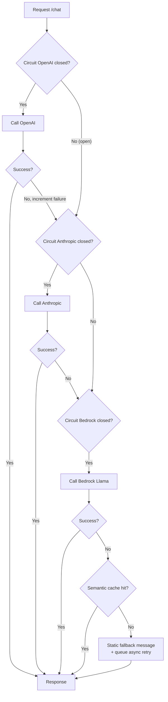

# Nếu LLM Provider Down, Hệ thống Fallback thế nào

## ⚡ Tóm tắt ngắn (30s)
* **Sự thật**: LLM provider DOWN là chuyện **bình thường, không phải ngoại lệ**. OpenAI/Anthropic/Bedrock đều có outage hàng tháng (đọc statuspage.openai.com lịch sử). Production app cần fallback strategy được **test định kỳ**, không phải document chết.
* **5 chiến lược fallback theo độ phức tạp**:
  1. **Graceful degradation**: trả error message thân thiện + retry-after, KHÔNG hiển thị stack trace.
  2. **Cached response**: nếu prompt giống request gần đây → trả cached.
  3. **Static fallback**: với task định hình (intent classification, FAQ), có template trả lời mặc định.
  4. **Multi-provider failover**: Anthropic ← → OpenAI ← → Bedrock Llama. Quality khác nhưng tốt hơn 503.
  5. **Queue & retry async**: nếu non-urgent (email draft, summary background), queue + retry sau.
* **Quan trọng**: Circuit Breaker chặn cascade. Khi provider A error rate >50% → stop hit nó trong 60s, dồn sang B.
* **Thảm họa thực chiến**: OpenAI down 90 phút ngày 4/6/2024. Team chỉ wrap retry 3 lần → request hang 30s × 3 lần = 90s timeout → user thấy lỗi 100%. Khi đó user reload x10 → load của ALB tăng 10x → ALB cũng overload, làm hư các endpoint khác (non-AI). Senior fix: circuit breaker + fallback sang Bedrock Llama → uptime perceived 99.9% trong outage.

---

## 🔍 Chi tiết chiến lược fallback

### 1. Defense layers — Top-down

```
┌─────────────────────────────────────────────────┐
│ Layer 1: Graceful Error Message                 │
│   - 503 + retry-after, "Hệ thống đang bận"      │
│   - Không lộ tech detail                        │
├─────────────────────────────────────────────────┤
│ Layer 2: Cache Hit                              │
│   - Redis cache hash(prompt) → cached response │
│   - TTL tùy task                                │
├─────────────────────────────────────────────────┤
│ Layer 3: Static Fallback                        │
│   - Intent: default category                    │
│   - FAQ: "Tôi không tìm thấy, vui lòng liên hệ"│
├─────────────────────────────────────────────────┤
│ Layer 4: Secondary Provider                     │
│   - OpenAI fail → Anthropic / Bedrock           │
│   - Quality khác → flag "fallback mode"         │
├─────────────────────────────────────────────────┤
│ Layer 5: Async Queue                            │
│   - Non-realtime task → Kafka + retry           │
│   - Tell user "sẽ xử lý sau, thông báo qua mail"│
└─────────────────────────────────────────────────┘
```

### 2. Multi-provider abstraction

Code path:
```
LlmService.chat(req)
  ├─ Try primary (OpenAI gpt-4o) [circuit closed]
  │    ├─ Success → return
  │    └─ Fail (error rate > threshold) → circuit OPEN
  ├─ Fallback to secondary (Anthropic claude-sonnet) [circuit closed]
  │    ├─ Success → return + log "fallback used"
  │    └─ Fail → circuit OPEN
  └─ Fallback to tertiary (Bedrock llama-3-70b self-managed) [always available]
       ├─ Success → return + log
       └─ Fail → return static error
```

Khó khăn:
* **Quality khác**: cùng prompt, gpt-4o vs claude-sonnet ra response khác. UX có thể vỡ nếu prompt template optimize cho 1 model cụ thể.
* **Cost khác**: Anthropic Sonnet 4.6 = $3 input vs gpt-4o = $2.5 input. Switch tỷ lệ → tracking cost.
* **API contract khác**: tool calling format, structured output format khác → cần adapter.

### 3. Cache strategy fallback

* **Semantic cache**: embedding của query + Redis. Nếu cosine > 0.95 với cached → reuse.
* **Exact prompt hash**: SHA256(prompt) → key. TTL 1 giờ–1 ngày tùy.
* **Đặc thù**: chỉ cache khi temperature=0 (deterministic) và không có user-specific context.

### 4. Static fallback patterns

| Task | Fallback |
| :--- | :--- |
| Intent classification | Default to "other" + flag for human review |
| FAQ chatbot | "Không tìm thấy thông tin, click [contact us]" |
| Summarization | Lấy 2 câu đầu của doc làm summary tạm |
| Embedding search | Fallback BM25 keyword search |
| Code completion | Disable feature, hint user |

### 5. Test fallback định kỳ (Chaos Engineering)

* **Game day**: 1 lần/quý, intentionally block traffic tới provider A → quan sát fallback work.
* **Synthetic monitoring**: 1 request/phút giả lập "provider down" → verify path.
* **Canary fallback**: 1% traffic luôn dùng fallback path → keep warm.

---

## 🎨 Sơ đồ trực quan



---

## 💻 Code thực chiến

### 1. Multi-provider failover

```java
package com.example.ai.fallback;

import io.github.resilience4j.circuitbreaker.annotation.CircuitBreaker;
import org.springframework.stereotype.Service;
import reactor.core.publisher.Mono;

@Service
public class FailoverLlmService {

    private final OpenAiProvider primary;
    private final AnthropicProvider secondary;
    private final BedrockProvider tertiary;
    private final SemanticCache cache;

    public FailoverLlmService(OpenAiProvider p, AnthropicProvider s,
                              BedrockProvider t, SemanticCache c) {
        this.primary = p; this.secondary = s; this.tertiary = t; this.cache = c;
    }

    @CircuitBreaker(name = "primary", fallbackMethod = "trySecondary")
    public Mono<LlmResponse> chat(LlmRequest req) {
        return primary.chat(req)
            .doOnSuccess(r -> meter.increment("llm.primary.success"));
    }

    public Mono<LlmResponse> trySecondary(LlmRequest req, Throwable t) {
        log.warn("Primary failed → secondary", t);
        return circuitSecondary(req)
            .onErrorResume(e -> tryTertiary(req, e));
    }

    @CircuitBreaker(name = "secondary", fallbackMethod = "tryTertiary")
    private Mono<LlmResponse> circuitSecondary(LlmRequest req) {
        // Có thể cần adjust prompt vì Anthropic xử lý khác OpenAI
        LlmRequest adjusted = adjustForAnthropic(req);
        return secondary.chat(adjusted)
            .doOnSuccess(r -> meter.increment("llm.secondary.success"));
    }

    public Mono<LlmResponse> tryTertiary(LlmRequest req, Throwable t) {
        log.warn("Secondary failed → tertiary", t);
        return tertiary.chat(req)
            .onErrorResume(e -> tryCacheOrStatic(req, e));
    }

    private Mono<LlmResponse> tryCacheOrStatic(LlmRequest req, Throwable t) {
        return cache.semanticLookup(req.prompt())
            .switchIfEmpty(Mono.just(staticFallback(req)))
            .doOnNext(r -> meter.increment("llm.fallback.used"));
    }

    private LlmResponse staticFallback(LlmRequest req) {
        return new LlmResponse(
            "Hệ thống AI tạm thời gián đoạn. Bạn vui lòng thử lại sau vài phút.",
            0, 0, "fallback-static");
    }

    private LlmRequest adjustForAnthropic(LlmRequest req) {
        // E.g. OpenAI format → Anthropic format conversion
        return req;
    }

    private static final org.slf4j.Logger log = org.slf4j.LoggerFactory.getLogger(FailoverLlmService.class);
}
```

### 2. Resilience4j config

```yaml
resilience4j:
  circuitbreaker:
    instances:
      primary:
        sliding-window-size: 50
        failure-rate-threshold: 50
        wait-duration-in-open-state: 60s
        slow-call-duration-threshold: 30s
        slow-call-rate-threshold: 50
      secondary:
        sliding-window-size: 50
        failure-rate-threshold: 50
        wait-duration-in-open-state: 60s
```

### 3. Semantic cache với Redis + pgvector

```java
package com.example.ai.cache;

import org.springframework.stereotype.Service;
import reactor.core.publisher.Mono;
import java.time.Duration;

@Service
public class SemanticCache {

    private final EmbeddingService embedding;
    private final PgVectorRepo repo;
    private final ReactiveRedisOperations<String, String> redis;

    public Mono<LlmResponse> semanticLookup(String prompt) {
        return Mono.fromCallable(() -> embedding.embed(prompt))
            .flatMap(emb -> repo.findSimilar(emb, 0.95, 1))
            .switchIfEmpty(Mono.empty())
            .flatMap(hit -> redis.opsForValue().get("cached:" + hit.id())
                .map(json -> deserialize(json)));
    }

    public Mono<Void> store(String prompt, LlmResponse resp) {
        return Mono.fromCallable(() -> embedding.embed(prompt))
            .flatMap(emb -> {
                String id = UUID.randomUUID().toString();
                return repo.insert(id, emb, prompt)
                    .then(redis.opsForValue().set("cached:" + id, serialize(resp), Duration.ofHours(24)));
            }).then();
    }

    private String serialize(LlmResponse r) { return ""; }
    private LlmResponse deserialize(String json) { return null; }
}
```

### 4. Status page monitoring webhook

```java
package com.example.ai.monitoring;

import org.springframework.web.bind.annotation.*;

@RestController
@RequestMapping("/internal/monitoring")
public class StatusPageWebhook {

    /** Receive webhook từ statuspage.openai.com (set up trên dashboard provider) */
    @PostMapping("/openai-status")
    public void onOpenAiIncident(@RequestBody StatusPageEvent event) {
        if ("operational".equals(event.componentStatus())) {
            // Provider recovered → manually close circuit
            circuitBreakerRegistry.circuitBreaker("primary").transitionToClosedState();
            log.info("OpenAI recovered → circuit closed");
        } else if ("major_outage".equals(event.componentStatus())) {
            // Proactively open circuit → save 60s of error before circuit auto-opens
            circuitBreakerRegistry.circuitBreaker("primary").transitionToOpenState();
            log.warn("OpenAI major outage detected → circuit forced open");
        }
    }
}
```

---

## 📊 Bảng so sánh fallback strategies

| Strategy | Quality | Latency | Cost | Setup | Khi dùng |
| :--- | :--- | :--- | :--- | :--- | :--- |
| Static error | 0 | 0ms | $0 | 1 line | Always có |
| Cached response | Cao | <50ms | $0 | Vài giờ | Repeated query |
| Static template | Trung bình | 0ms | $0 | Vài giờ | Task định hình |
| Secondary provider | Tốt (~80% quality) | +300ms | Tương đương | 2 tuần | Production critical |
| Tertiary self-host | Đủ dùng | +500ms | Cao (GPU) | 1 tháng | Multi-9 SLA |
| Async queue | Tốt khi recover | Minutes | Same | 1 tuần | Non-urgent task |

---

## ⚠️ Common Gotchas & Questions follow-up

### 1. Cạm bẫy: Không test fallback path
* **Vấn đề**: Code có failover nhưng chưa bao giờ trigger thực tế. Khi outage xảy ra → fallback code bug → cũng fail.
* **Giải pháp**: 
  1. Chaos engineering: monthly game day intentionally block provider.
  2. Synthetic test 1 req/phút qua fallback path → keep code path warm.

### 2. Cạm bẫy: Quality fallback quá thấp
* **Vấn đề**: Fallback sang model nhỏ → user nhận response chất lượng thấp mà không biết → mất trust.
* **Giải pháp**: 
  1. UI hiển thị "Đang chạy ở chế độ dự phòng".
  2. Lưu request, async retry với primary khi recover → gửi update cho user.

### 3. Cạm bẫy: Cascade overload
* **Vấn đề**: Primary down → 100% traffic → secondary. Secondary không có capacity → cũng down.
* **Giải pháp**: 
  1. Pre-allocate capacity ở secondary (warm spare).
  2. Throttle fallback path: chỉ 50% traffic qua fallback, 50% trả error.
  3. Notify user chậm hơn.

### 4. Cạm bẫy: Quên reset circuit khi recover
* **Vấn đề**: Provider recover sau 1 giờ. Circuit đã open quá lâu, half-open thử nhưng failure cũ trong window vẫn count → reopen.
* **Giải pháp**: Webhook từ statuspage → force close circuit khi confirmed recover.

### 5. Câu hỏi đào sâu từ interviewer
* **Interviewer: "Provider chính down 2 giờ. Bạn có nên switch toàn bộ sang secondary không?"**
* **Trả lời Senior**:
  1. **Đánh giá blast radius**: 
     - Có bao nhiêu request/giờ?
     - Secondary có capacity không (rate limit)?
     - Quality gap có chấp nhận được không?
  2. **Gradual cutover**: 10% → 30% → 50% → 100% theo monitoring.
  3. **Cost spike**: secondary có thể đắt hơn (e.g. Opus vs gpt-4o-mini). Quote daily budget.
  4. **User comm**: status banner "AI có thể chậm hơn bình thường".
  5. **Recover plan**: provider chính lên lại → drain traffic ngược dần, monitor quality drift.
  6. **Postmortem**: phân tích outage để cải tiến: cần thêm provider thứ 3? Tăng cache TTL? Pre-warm self-host?
