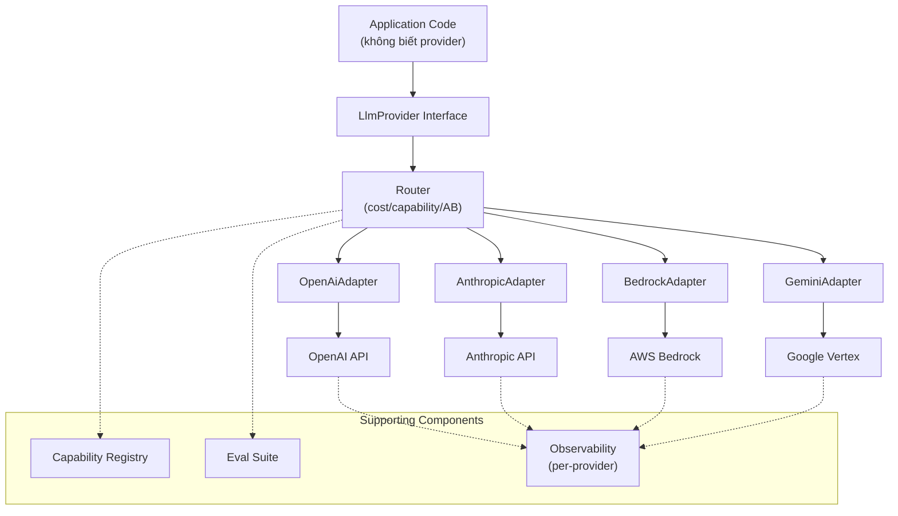

# Support nhiều Model / Provider cùng lúc

## ⚡ Tóm tắt ngắn (30s)
* **Vì sao**: 
  1. **Failover** (nếu 1 provider down).
  2. **Cost optimization** (route task đơn giản sang model rẻ).
  3. **Quality** (model A giỏi reasoning, model B giỏi long context, model C tiếng Việt tốt hơn).
  4. **Compliance** (regional model cho regulated data).
  5. **Bargaining** (đa nhà cung cấp → đàm phán giá tốt).
* **Kiến trúc Senior**:
  1. **Abstraction layer** (interface `LlmProvider`) — code app không biết đang dùng provider nào.
  2. **Adapter pattern** — chuyển đổi format request/response giữa các provider (OpenAI vs Anthropic vs Bedrock có schema khác).
  3. **Router** — chọn provider theo task type, user tier, cost budget, latency requirement.
  4. **Capability registry** — biết model nào support tool calling, JSON mode, vision, streaming.
  5. **Eval suite** — so sánh quality cross-provider trên golden set định kỳ.
* **Thảm họa thực chiến**: Team lock-in OpenAI. Khi OpenAI tăng giá 30% → không thoát được vì prompt template optimize riêng + tool calling format hard-code. Senior refactor abstraction layer → 2 tuần migrate được sang Anthropic, tiết kiệm $4k/tháng.

---

## 🔍 Chi tiết kiến trúc multi-provider

### 1. Provider abstraction interface

```java
public interface LlmProvider {
    Mono<LlmResponse> chat(LlmRequest req);
    Flux<String> stream(LlmRequest req);
    
    String providerName();
    Set<String> supportedModels();
    Set<Capability> capabilities();  // TOOL_CALLING, JSON_MODE, VISION, STREAMING
    Pricing pricing(String model);
}
```

Mỗi provider implement: OpenAiProvider, AnthropicProvider, BedrockProvider, GeminiProvider, ...

### 2. Adapter for format conversion

Request format khác nhau:

| Format | OpenAI | Anthropic | Bedrock |
| :--- | :--- | :--- | :--- |
| System prompt | `messages[0].role=system` | top-level `system` param | format theo model |
| Tool definition | `tools: [{type:"function",function:{...}}]` | `tools: [{name,description,input_schema}]` | per-model |
| Tool result | `role:"tool", tool_call_id` | `role:"user", content:[{type:"tool_result",tool_use_id}]` | per-model |
| JSON mode | `response_format:{type:"json_schema",...}` | tool use with schema | tool use |

→ Adapter chuyển từ internal canonical format sang provider format.

### 3. Router strategies

```java
public interface LlmRouter {
    LlmProvider select(LlmRequest req, RoutingContext ctx);
}
```

**Strategies**:
* **Static config**: routing.simple→gpt-4o-mini, routing.reasoning→claude-opus-4-7.
* **Cost-based**: budget < $0.01 → cheap model.
* **Capability-based**: cần vision → only models with VISION.
* **Quality-tier**: free user → cheap; pro user → expensive model.
* **A/B test**: 10% traffic Claude, 90% GPT-4o → compare quality.

### 4. Capability registry

```java
public enum Capability {
    CHAT, STREAMING, TOOL_CALLING, JSON_MODE,
    VISION, AUDIO_INPUT, STRUCTURED_OUTPUT,
    CACHING, BATCH, LONG_CONTEXT_200K, LONG_CONTEXT_1M
}

public record ModelSpec(
    String provider,
    String modelId,
    Set<Capability> capabilities,
    int contextWindow,
    double inputUsdPer1m,
    double outputUsdPer1m
) {}
```

Registry biết: "Cần JSON mode + tool calling + long context → gpt-4o, claude-sonnet-4-6, gemini-2".

### 5. Eval suite cross-provider

```
Golden set 100 Q&A pair → chạy hàng tuần qua mọi model active
→ Score: accuracy, latency p50/p99, cost, hallucination rate
→ Dashboard giúp quyết định routing
```

---

## 🎨 Sơ đồ kiến trúc



---

## 💻 Code thực chiến

### 1. Canonical request/response (internal format)

```java
package com.example.ai.canonical;

import java.util.List;
import java.util.Map;

public record LlmRequest(
    String purpose,            // "chat", "summarize", "extract"
    List<Message> messages,    // canonical message list
    Double temperature,
    Integer maxTokens,
    List<ToolDefinition> tools,
    Map<String, Object> responseSchema,  // for JSON mode
    Set<Capability> requiredCapabilities,
    String userId
) {}

public record Message(Role role, String content, List<ToolCall> toolCalls) {
    public enum Role { SYSTEM, USER, ASSISTANT, TOOL }
}

public record ToolDefinition(String name, String description, Map<String,Object> inputSchema) {}
public record ToolCall(String id, String name, Map<String,Object> args) {}

public record LlmResponse(
    String text,
    List<ToolCall> toolCalls,
    int inputTokens,
    int outputTokens,
    double costUsd,
    String provider,
    String model,
    String finishReason
) {}
```

### 2. Provider adapter (OpenAI)

```java
package com.example.ai.adapter;

import com.example.ai.canonical.*;
import org.springframework.stereotype.Component;
import org.springframework.web.reactive.function.client.WebClient;
import reactor.core.publisher.Mono;
import java.util.*;

@Component
public class OpenAiAdapter implements LlmProvider {

    private final WebClient client;
    private static final Map<String,Pricing> PRICING = Map.of(
        "gpt-4o", new Pricing(2.5, 10.0),
        "gpt-4o-mini", new Pricing(0.15, 0.60)
    );

    public OpenAiAdapter(WebClient w) { this.client = w; }

    @Override
    public Mono<LlmResponse> chat(LlmRequest req) {
        Map<String,Object> payload = toOpenAiFormat(req);
        return client.post()
            .uri("/chat/completions")
            .bodyValue(payload)
            .retrieve()
            .bodyToMono(Map.class)
            .map(resp -> fromOpenAiResponse(req.purpose(), resp));
    }

    private Map<String,Object> toOpenAiFormat(LlmRequest req) {
        List<Map<String,Object>> messages = req.messages().stream()
            .map(m -> Map.<String,Object>of(
                "role", m.role().name().toLowerCase(),
                "content", m.content()
            )).toList();

        Map<String,Object> payload = new HashMap<>();
        payload.put("model", req.model() != null ? req.model() : "gpt-4o-mini");
        payload.put("messages", messages);
        payload.put("temperature", req.temperature());
        payload.put("max_tokens", req.maxTokens());

        if (req.tools() != null && !req.tools().isEmpty()) {
            payload.put("tools", req.tools().stream().map(t -> Map.of(
                "type", "function",
                "function", Map.of(
                    "name", t.name(),
                    "description", t.description(),
                    "parameters", t.inputSchema())
            )).toList());
        }
        return payload;
    }

    private LlmResponse fromOpenAiResponse(String purpose, Map<String,Object> resp) {
        // Parse choices[0].message.content, usage, ...
        return null; // implement
    }

    @Override public String providerName() { return "openai"; }
    @Override public Set<String> supportedModels() {
        return Set.of("gpt-4o", "gpt-4o-mini", "o1-preview");
    }
    @Override public Set<Capability> capabilities() {
        return Set.of(Capability.CHAT, Capability.STREAMING,
                      Capability.TOOL_CALLING, Capability.JSON_MODE);
    }
    @Override public Pricing pricing(String model) { return PRICING.get(model); }
}
```

### 3. Smart router

```java
package com.example.ai.router;

import com.example.ai.canonical.*;
import org.springframework.stereotype.Service;
import java.util.*;

@Service
public class CapabilityCostRouter implements LlmRouter {

    private final List<LlmProvider> providers;
    private final Map<String, String> staticRoutes;  // purpose → provider

    public CapabilityCostRouter(List<LlmProvider> p, Map<String,String> staticRoutes) {
        this.providers = p;
        this.staticRoutes = staticRoutes;
    }

    @Override
    public LlmProvider select(LlmRequest req, RoutingContext ctx) {
        // 1. Static route by purpose nếu có
        String staticTarget = staticRoutes.get(req.purpose());
        if (staticTarget != null) {
            return providers.stream()
                .filter(p -> p.providerName().equals(staticTarget))
                .findFirst().orElseThrow();
        }

        // 2. Filter by required capabilities
        List<LlmProvider> candidates = providers.stream()
            .filter(p -> p.capabilities().containsAll(req.requiredCapabilities()))
            .toList();

        // 3. Pick cheapest that meets quality bar
        if ("free".equals(ctx.userTier())) {
            return candidates.stream()
                .min(Comparator.comparingDouble(p ->
                    p.pricing(p.supportedModels().iterator().next()).inputUsd()))
                .orElseThrow();
        }

        // 4. Default: balanced quality/cost (gpt-4o-mini class)
        return candidates.get(0);
    }
}
```

### 4. Spring AI multi-provider config

```java
@Configuration
public class LlmConfig {
    @Bean OpenAiProvider openAi(@Value("${openai.api-key}") String key) {
        return new OpenAiProvider(key);
    }
    @Bean AnthropicProvider anthropic(@Value("${anthropic.api-key}") String key) {
        return new AnthropicProvider(key);
    }
    @Bean BedrockProvider bedrock(BedrockRuntimeClient c) {
        return new BedrockProvider(c);
    }

    @Bean LlmRouter router(List<LlmProvider> providers) {
        Map<String,String> staticRoutes = Map.of(
            "summarize", "openai",            // gpt-4o-mini rẻ
            "code-review", "anthropic",        // Sonnet 4.6 mạnh code
            "long-context-analysis", "anthropic", // Claude 200k
            "compliance-data", "bedrock"       // Regional
        );
        return new CapabilityCostRouter(providers, staticRoutes);
    }
}
```

---

## 📊 Bảng so sánh providers (May 2026)

| Provider | Models flagship | Tool calling | JSON mode | Long context | Strength |
| :--- | :--- | :---: | :---: | :---: | :--- |
| OpenAI | gpt-4o, gpt-4o-mini, o1 | ✓ | ✓ native | 128k | Function calling format chuẩn, eco |
| Anthropic | Opus 4.7, Sonnet 4.6, Haiku 4.5 | ✓ | tool use | 200k–1M | Reasoning, prompt caching native |
| Google Vertex | Gemini 2.x | ✓ | ✓ | 1M–2M | Long context, multimodal |
| AWS Bedrock | Anthropic + Llama + Mistral + Titan | partial | per-model | per-model | Compliance, VPC native |
| Together / Fireworks | OSS hosted | partial | tool use | per-model | Cost rẻ open-weights |
| Azure OpenAI | gpt-4o + custom deployment | ✓ | ✓ | 128k | Enterprise compliance |

---

## ⚠️ Common Gotchas & Questions follow-up

### 1. Cạm bẫy: Adapter quên một capability
* **Vấn đề**: Adapter Anthropic forward `tools` nhưng quên handle `tool_use` response back → loop tool calling break.
* **Giải pháp**: Adapter test coverage cao. Một test suite chung chạy cùng prompt qua mọi provider → verify behavior equivalent.

### 2. Cạm bẫy: Quality drift không monitor
* **Vấn đề**: Route 50% traffic sang Anthropic, không monitor → 3 tháng sau phát hiện Anthropic kém hơn 20% accuracy cho task A.
* **Giải pháp**: Eval suite trên golden set theo schedule (daily/weekly), so sánh cross-provider. Auto alert nếu provider X regress.

### 3. Cạm bẫy: Lock-in prompt template
* **Vấn đề**: Prompt optimize riêng cho gpt-4o (special tokens, format). Switch sang Claude → quality giảm vì prompt không phù hợp.
* **Giải pháp**: 
  1. Prompt per provider trong git, link với adapter.
  2. Test prompt cross-provider, document quality.
  3. Tránh provider-specific feature trừ khi cần thiết.

### 4. Câu hỏi đào sâu từ interviewer
* **Interviewer: "User tier khác nhau, route khác nhau sao cho không degrade free user quá mạnh?"**
* **Trả lời Senior**:
  1. **Free user**: route sang model rẻ (gpt-4o-mini, Haiku-4.5). Quality vẫn ổn cho task đơn giản (chat, summarize ngắn).
  2. **Pro user**: route sang flagship (gpt-4o, Sonnet 4.6). Cao hơn cost nhưng justify được.
  3. **Task complexity classifier**: simple task (sentiment, intent) qua model rẻ kể cả cho Pro; complex (reasoning, long context) qua model lớn.
  4. **Burst capacity**: nếu cost dồn về model lớn quá → tự động downgrade một phần traffic sang model rẻ để protect budget.
  5. **Transparency**: Pro user thấy chỉ báo model đang dùng; có thể chọn force premium model.
  6. **Eval**: chạy A/B golden test định kỳ; nếu task X làm cho free user → measure quality, đảm bảo không sụt quá threshold.
