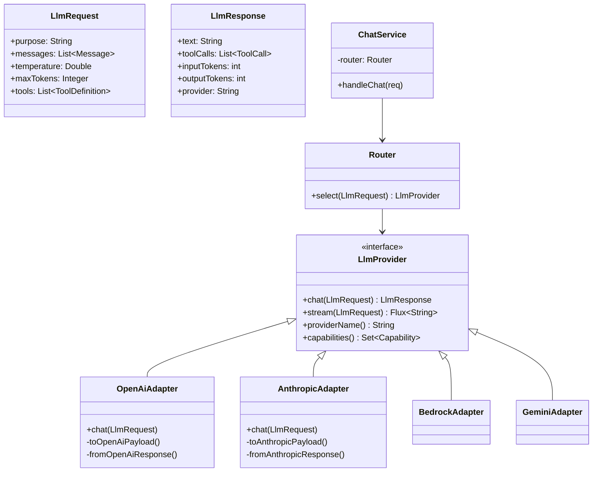

# Thiết kế Abstraction Layer để Đổi Model dễ hơn

## ⚡ Tóm tắt ngắn (30s)
* **Abstraction layer cho LLM** = pattern Strategy + Adapter + Factory để app code KHÔNG biết đang dùng OpenAI/Anthropic/Bedrock. Đổi provider chỉ là đổi config, không động code business.
* **5 thành phần cốt lõi**:
  1. **Canonical Model**: chuẩn hóa request/response (Message, Role, ToolCall, Usage) độc lập với provider.
  2. **Provider Interface**: `LlmProvider.chat(LlmRequest) → LlmResponse`.
  3. **Adapter implementations**: chuyển canonical ↔ format provider riêng (Open AI vs Anthropic schema khác hoàn toàn).
  4. **Configuration**: chọn provider qua property/feature flag, không hard-code.
  5. **Testing harness**: contract test chung chạy trên mọi adapter → đảm bảo behavior equivalent.
* **Quan trọng**: tránh "leaky abstraction" — đừng expose object của provider SDK ở interface. Một khi `OpenAiChatRequest` xuất hiện ở service layer → lock-in.
* **Thảm họa thực chiến**: Team viết service `OpenAiService` xuyên suốt 30 file. Khi cần migrate sang Anthropic → 2 tuần refactor + 200 PR. Senior fix: tạo interface `ChatProvider`, di chuyển dần code qua interface; sau đó migrate provider chỉ tốn 1 ngày.

---

## 🔍 Chi tiết design pattern

### 1. Layered architecture

```
┌─────────────────────────────────────────────────┐
│ Business Service Layer                          │
│   - Chat controller, RAG service, agent loop    │
│   - Chỉ biết: LlmProvider interface             │
├─────────────────────────────────────────────────┤
│ Abstraction Layer                               │
│   - LlmProvider interface                       │
│   - Canonical types (LlmRequest, LlmResponse)   │
│   - Router (pick provider)                      │
├─────────────────────────────────────────────────┤
│ Adapter Layer                                   │
│   - OpenAiAdapter, AnthropicAdapter, ...        │
│   - Convert canonical ↔ provider format         │
├─────────────────────────────────────────────────┤
│ Provider SDK Layer                              │
│   - openai-java, anthropic-sdk, aws-bedrock     │
└─────────────────────────────────────────────────┘
```

### 2. Anti-pattern (leaky abstraction)

```java
// ❌ Anti-pattern: SDK type rò rỉ
public class ChatService {
    OpenAiResponse handle(OpenAiRequest req) { ... }
}
```

Mọi service phụ thuộc OpenAI SDK → lock-in.

### 3. Pattern đúng — Canonical types

```java
// ✅ Service chỉ biết canonical type
public class ChatService {
    private final LlmProvider llm;  // interface
    public LlmResponse handle(LlmRequest req) {
        return llm.chat(req);  // không quan tâm OpenAI hay Anthropic
    }
}
```

### 4. Format conversion edge cases

Khó nhất khi migrate là handle các edge cases:

| Feature | OpenAI | Anthropic | Conversion |
| :--- | :--- | :--- | :--- |
| System prompt | message role="system" | top-level `system` param | rearrange |
| Tool definition | `function.parameters` | `input_schema` | rename + same JSON Schema |
| Tool call response | role="tool", tool_call_id | role="user", content[type=tool_result, tool_use_id] | restructure |
| Stop sequence | `stop: ["..."]` | `stop_sequences: [...]` | rename |
| JSON mode | response_format=json_schema | tool use với schema | wrap as tool |
| Streaming format | choices[].delta.content | content_block_delta.delta.text | parse different SSE |

Adapter implementation 30-50% code = handle các diff này.

### 5. Configuration-driven provider selection

```yaml
ai:
  routing:
    default: anthropic-sonnet-4-6
    rules:
      - purpose: summarize
        provider: openai-gpt-4o-mini
      - purpose: code-review
        provider: anthropic-opus-4-7
      - purpose: extract-pii
        provider: bedrock-llama-3-70b  # compliance
```

Đổi routing không cần deploy code.

---

## 🎨 Sơ đồ design



---

## 💻 Code thực chiến

### 1. Canonical types

```java
package com.example.ai.canonical;

import java.util.List;
import java.util.Map;

public record LlmRequest(
    String purpose,                          // "chat", "summarize"...
    String preferredModel,                   // optional, override
    List<Message> messages,
    Double temperature,
    Integer maxTokens,
    List<ToolDefinition> tools,
    Map<String, Object> responseSchema,
    String userId
) {}

public record Message(Role role, String content) {
    public enum Role { SYSTEM, USER, ASSISTANT, TOOL }
}

public record ToolDefinition(String name, String description, Map<String,Object> inputSchema) {}
public record ToolCall(String id, String name, Map<String,Object> args) {}

public record LlmResponse(
    String text,
    List<ToolCall> toolCalls,
    int inputTokens,
    int outputTokens,
    double costUsd,
    String provider,
    String model,
    String finishReason
) {}

public enum Capability {
    CHAT, STREAMING, TOOL_CALLING, JSON_MODE,
    VISION, LONG_CONTEXT_200K, PROMPT_CACHING
}

public record Pricing(double inputUsdPer1m, double outputUsdPer1m) {}
```

### 2. Provider interface

```java
package com.example.ai.provider;

import com.example.ai.canonical.*;
import reactor.core.publisher.Flux;
import reactor.core.publisher.Mono;
import java.util.Set;

public interface LlmProvider {
    Mono<LlmResponse> chat(LlmRequest req);
    Flux<String> stream(LlmRequest req);

    String providerName();
    Set<String> supportedModels();
    Set<Capability> capabilities();
    Pricing pricing(String model);
    
    /** Validate request hợp với provider trước khi gọi */
    default void validate(LlmRequest req) {
        if (req.tools() != null && !capabilities().contains(Capability.TOOL_CALLING)) {
            throw new IllegalArgumentException(providerName() + " không support tool calling");
        }
    }
}
```

### 3. Adapter (OpenAI) — Tập trung conversion

```java
package com.example.ai.adapter;

import com.example.ai.canonical.*;
import com.example.ai.provider.LlmProvider;
import org.springframework.stereotype.Component;
import org.springframework.web.reactive.function.client.WebClient;
import reactor.core.publisher.Flux;
import reactor.core.publisher.Mono;
import java.util.*;

@Component
public class OpenAiAdapter implements LlmProvider {

    private final WebClient client;

    public OpenAiAdapter(WebClient.Builder b, AiCredentials creds) {
        this.client = b.baseUrl("https://api.openai.com/v1")
            .defaultHeader("Authorization", "Bearer " + creds.openaiKey())
            .build();
    }

    @Override
    public Mono<LlmResponse> chat(LlmRequest req) {
        validate(req);
        Map<String,Object> payload = canonicalToOpenAi(req);

        return client.post()
            .uri("/chat/completions")
            .bodyValue(payload)
            .retrieve()
            .bodyToMono(Map.class)
            .map(resp -> openAiToCanonical(req, resp));
    }

    @Override
    public Flux<String> stream(LlmRequest req) {
        Map<String,Object> payload = canonicalToOpenAi(req);
        payload.put("stream", true);
        return client.post()
            .uri("/chat/completions")
            .bodyValue(payload)
            .retrieve()
            .bodyToFlux(String.class)
            .takeUntil("[DONE]"::equals)
            .map(this::extractDeltaContent);
    }

    private Map<String,Object> canonicalToOpenAi(LlmRequest req) {
        Map<String,Object> payload = new LinkedHashMap<>();
        payload.put("model", req.preferredModel() != null ? req.preferredModel() : "gpt-4o-mini");
        payload.put("messages", req.messages().stream().map(m -> Map.of(
            "role", m.role().name().toLowerCase(),
            "content", m.content()
        )).toList());
        if (req.temperature() != null) payload.put("temperature", req.temperature());
        if (req.maxTokens() != null) payload.put("max_tokens", req.maxTokens());
        if (req.tools() != null && !req.tools().isEmpty()) {
            payload.put("tools", req.tools().stream().map(t -> Map.of(
                "type", "function",
                "function", Map.of(
                    "name", t.name(),
                    "description", t.description(),
                    "parameters", t.inputSchema()
                )
            )).toList());
        }
        return payload;
    }

    @SuppressWarnings("unchecked")
    private LlmResponse openAiToCanonical(LlmRequest req, Map<String,Object> resp) {
        var choices = (List<Map<String,Object>>) resp.get("choices");
        var choice0 = choices.get(0);
        var msg = (Map<String,Object>) choice0.get("message");
        var usage = (Map<String,Object>) resp.get("usage");

        return new LlmResponse(
            (String) msg.get("content"),
            extractToolCalls(msg),
            (int)(Integer) usage.get("prompt_tokens"),
            (int)(Integer) usage.get("completion_tokens"),
            computeCost(req, usage),
            "openai",
            (String) resp.get("model"),
            (String) choice0.get("finish_reason")
        );
    }

    private List<ToolCall> extractToolCalls(Map<String,Object> msg) { return List.of(); }
    private double computeCost(LlmRequest req, Map<String,Object> usage) { return 0.0; }
    private String extractDeltaContent(String sseLine) { return ""; }

    @Override public String providerName() { return "openai"; }
    @Override public Set<String> supportedModels() {
        return Set.of("gpt-4o", "gpt-4o-mini", "o1");
    }
    @Override public Set<Capability> capabilities() {
        return Set.of(Capability.CHAT, Capability.STREAMING,
                      Capability.TOOL_CALLING, Capability.JSON_MODE);
    }
    @Override public Pricing pricing(String model) {
        return Map.of(
            "gpt-4o", new Pricing(2.5, 10.0),
            "gpt-4o-mini", new Pricing(0.15, 0.60)
        ).get(model);
    }
}
```

### 4. Contract test — Đảm bảo behavior equivalent

```java
package com.example.ai;

import com.example.ai.canonical.*;
import com.example.ai.provider.LlmProvider;
import org.junit.jupiter.api.*;
import org.junit.jupiter.params.ParameterizedTest;
import org.junit.jupiter.params.provider.ArgumentsSource;
import java.util.List;

class ProviderContractTest {

    @ParameterizedTest
    @ArgumentsSource(AllProvidersProvider.class)
    void simpleChat_shouldReturnNonEmptyText(LlmProvider provider) {
        LlmRequest req = new LlmRequest("test", null,
            List.of(new Message(Message.Role.USER, "Say 'hello'")),
            0.0, 10, null, null, "test-user");

        LlmResponse resp = provider.chat(req).block();

        Assertions.assertNotNull(resp);
        Assertions.assertTrue(resp.text().toLowerCase().contains("hello"));
        Assertions.assertTrue(resp.inputTokens() > 0);
        Assertions.assertEquals(provider.providerName(), resp.provider());
    }

    @ParameterizedTest
    @ArgumentsSource(AllProvidersWithToolingProvider.class)
    void toolCalling_shouldInvokeTool(LlmProvider provider) {
        // ... test tool calling tương đương giữa providers
    }
}
```

---

## 📊 Bảng so sánh design choices

| Choice | Pros | Cons | Khuyến nghị |
| :--- | :--- | :--- | :--- |
| Một interface unified | Đơn giản, dễ swap | Phải maintain canonical | ✓ Default |
| Provider-specific interface mỗi loại | Tận dụng feature riêng | Lock-in code | ✗ |
| Spring AI ChatModel | Built-in abstraction | Có thể giới hạn feature mới | ✓ Cho startup |
| LangChain4j | Java-native LangChain | Heavy weight | Cho agent app phức tạp |
| Direct SDK | Đơn giản nhất | Lock-in nặng | ✗ |

---

## ⚠️ Common Gotchas & Questions follow-up

### 1. Cạm bẫy: Provider-specific feature
* **Vấn đề**: OpenAI có "JSON mode native", Anthropic không có. Code dùng JSON mode → đổi sang Anthropic fail.
* **Giải pháp**: Abstraction expose `Capability` set; service check `provider.capabilities().contains(JSON_MODE)` trước khi dùng. Nếu không có → fallback strategy (Anthropic dùng tool use to enforce schema).

### 2. Cạm bẫy: Streaming format khác nhau
* **Vấn đề**: OpenAI SSE format `data: {"choices":[{"delta":{...}}]}` vs Anthropic `event: content_block_delta data: {...}`. Code parse riêng OpenAI → switch sang Anthropic break.
* **Giải pháp**: Adapter normalize stream về `Flux<String>` (mỗi emit là 1 chunk text).

### 3. Cạm bẫy: Quên handle async non-text events
* **Vấn đề**: Anthropic streaming có events `message_start`, `content_block_start`, `content_block_delta`, `content_block_stop`, `message_delta`, `message_stop`. Adapter chỉ parse `content_block_delta` → miss `usage` info trong `message_delta`.
* **Giải pháp**: Adapter consume mọi event type; expose pertinent ones (text + usage) tới canonical.

### 4. Câu hỏi đào sâu từ interviewer
* **Interviewer: "Bạn quyết định build custom abstraction hay dùng Spring AI / LangChain4j?"**
* **Trả lời Senior**:
  1. **Spring AI**: tốt cho 80% case. Đã abstract chat, embedding, vector store, tool calling, structured output. Pros: maintained, tích hợp Spring Boot. Cons: provider mới có thể chậm support, đôi khi không expose feature mới.
  2. **LangChain4j**: tốt cho agent / chain phức tạp. Pros: API copy LangChain Python. Cons: nhiều opinion, learning curve.
  3. **Custom**: chỉ build khi:
     - Cần feature provider-specific Spring AI chưa support.
     - Team có capacity maintain.
     - Workflow đặc thù.
  4. **Quyết định Senior**: bắt đầu Spring AI; nếu hit giới hạn → wrap thêm thin layer trên Spring AI (vẫn tái sử dụng adapter của họ). Tránh build từ đầu.
