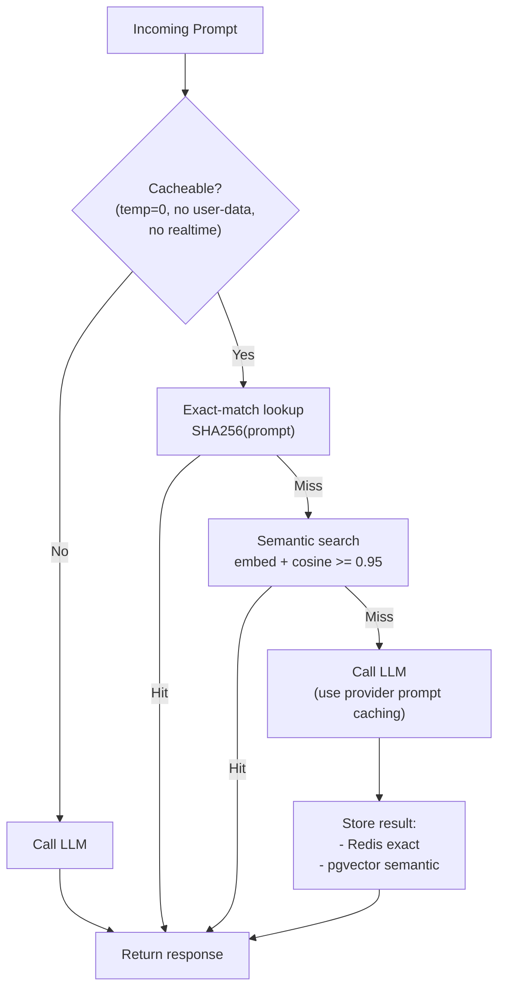

# Cache kết quả từ LLM — Khi nào nên và Không nên Cache

## ⚡ Tóm tắt ngắn (30s)
* **Cache LLM response** = tận dụng tính fact: cùng (prompt + system + temperature=0) thường → cùng output. Tiết kiệm cost 30-90% cho repeated query, giảm latency từ 2s xuống 30ms.
* **3 cấp cache**:
  1. **Exact match**: SHA256(prompt+system+params) → response. Hit rate ~5-15% production.
  2. **Semantic cache**: embedding của prompt + cosine similarity > threshold → cached response của câu hỏi tương đương. Hit rate 30-50%.
  3. **Prompt caching** (provider-side): OpenAI/Anthropic cache system prompt prefix. Không phải cache response → cache compute cho prefill, giảm cost input token 50-90%.
* **KHÔNG cache khi**:
  1. Personalized output (chứa user_id, account info).
  2. Temperature > 0 (random sampling → user mong khác nhau).
  3. Realtime data (giá cả, lịch, status đơn hàng).
  4. Compliance (cache có thể vi phạm right-to-be-forgotten).
  5. Tool use response (kết quả phụ thuộc tool result tươi).
* **Thảm họa thực chiến**: Team cache toàn bộ output của RAG chatbot không filter user_id. User A hỏi "show me my balance" → cached. User B hỏi tương tự → trả balance của user A. Data breach. Senior fix: cache key bao gồm user_id + ACL filter, semantic cache chỉ cho non-personal query.

---

## 🔍 Chi tiết các loại cache

### 1. Exact match cache

```
key = SHA256(system_prompt + user_prompt + model + temperature + max_tokens)
value = { response_text, tokens_in, tokens_out, generated_at }
TTL = 1 giờ - 7 ngày tùy task
```

Pros:
* Đơn giản, fast lookup (Redis O(1)).
* Không false-positive (cùng key = cùng output).

Cons:
* Hit rate thấp: prompt thay đổi 1 ký tự → miss.
* Không help với paraphrase ("doanh thu Q1" vs "Q1 revenue").

### 2. Semantic cache

```
1. Embed prompt → vector
2. Search vector DB: nearest neighbor có cosine > 0.95?
3. Yes → trả response của nearest neighbor
4. No → call LLM → embed prompt + store
```

Pros:
* Hit rate cao 30-50%.
* Hiểu paraphrase, multilingual.

Cons:
* Risk false-positive: 2 câu cosine cao nhưng yêu cầu khác nhau (e.g. "show user 1 balance" vs "show user 2 balance").
* Embedding cost overhead.
* Cần threshold tune cẩn thận.

### 3. Provider prompt caching

OpenAI / Anthropic hỗ trợ cache **prefix của prompt** (system + few-shot + RAG context cố định). Khi request sau cùng prefix → provider skip prefill cho prefix → cost giảm 90%, latency giảm 50%.

```python
# Anthropic prompt caching
response = client.messages.create(
    model="claude-sonnet-4-6",
    system=[
        {"type": "text", "text": "Bạn là trợ lý...", "cache_control": {"type": "ephemeral"}},
        {"type": "text", "text": "<5k token few-shot examples>", "cache_control": {"type": "ephemeral"}}
    ],
    messages=[{"role": "user", "content": user_question}],  # phần này không cache
)
```

→ Senior thiết kế prompt với prefix CỐ ĐỊNH ở đầu, dynamic content ở cuối → maximize cache hit.

### 4. Khi nào không cache

| Scenario | Lý do không cache |
| :--- | :--- |
| Cá nhân hóa | Response phụ thuộc user → khác nhau giữa users |
| `temperature > 0` | User mong response đa dạng, cache đè lên |
| Realtime data | Giá CK, exchange rate, đơn hàng status |
| Compliance (GDPR delete) | User xóa data → cache vẫn giữ → vi phạm |
| Tool use chain | Tool result tươi mỗi lần |
| A/B test prompt mới | Cache đè lên kết quả mới |

### 5. Cache invalidation

* **TTL**: hết hạn auto. 1 giờ–7 ngày phổ biến.
* **Manual invalidate**: khi RAG source update → publish event → invalidate cache cho prompt liên quan.
* **Versioned cache key**: include `prompt_version` trong key → push prompt mới → cache cũ skip naturally.

---

## 🎨 Sơ đồ trực quan



---

## 💻 Code thực chiến

### 1. Exact-match cache (Spring Boot + Redis)

```java
package com.example.ai.cache;

import com.example.ai.canonical.LlmRequest;
import com.example.ai.canonical.LlmResponse;
import com.fasterxml.jackson.databind.ObjectMapper;
import org.springframework.data.redis.core.ReactiveStringRedisTemplate;
import org.springframework.stereotype.Service;
import reactor.core.publisher.Mono;
import java.security.MessageDigest;
import java.time.Duration;
import java.util.HexFormat;

@Service
public class ExactMatchCache {

    private final ReactiveStringRedisTemplate redis;
    private final ObjectMapper mapper = new ObjectMapper();
    private static final Duration TTL = Duration.ofHours(24);

    public ExactMatchCache(ReactiveStringRedisTemplate r) { this.redis = r; }

    public Mono<LlmResponse> get(LlmRequest req) {
        if (!isCacheable(req)) return Mono.empty();

        String key = "llm:cache:" + computeKey(req);
        return redis.opsForValue().get(key)
            .map(json -> deserialize(json))
            .doOnNext(r -> meter.increment("llm.cache.hit"));
    }

    public Mono<Void> set(LlmRequest req, LlmResponse resp) {
        if (!isCacheable(req)) return Mono.empty();
        String key = "llm:cache:" + computeKey(req);
        return redis.opsForValue().set(key, serialize(resp), TTL).then();
    }

    private boolean isCacheable(LlmRequest req) {
        return req.temperature() != null && req.temperature() == 0.0
            && req.userId() == null  // không phải personalized
            && (req.tools() == null || req.tools().isEmpty())  // không tool use
            && !req.purpose().startsWith("realtime");
    }

    private String computeKey(LlmRequest req) {
        try {
            String canonical = req.preferredModel() + "|"
                + req.messages().toString() + "|"
                + req.temperature() + "|" + req.maxTokens();
            byte[] hash = MessageDigest.getInstance("SHA-256")
                .digest(canonical.getBytes());
            return HexFormat.of().formatHex(hash);
        } catch (Exception e) { throw new RuntimeException(e); }
    }

    private String serialize(LlmResponse r) {
        try { return mapper.writeValueAsString(r); }
        catch (Exception e) { throw new RuntimeException(e); }
    }
    private LlmResponse deserialize(String json) {
        try { return mapper.readValue(json, LlmResponse.class); }
        catch (Exception e) { throw new RuntimeException(e); }
    }
}
```

### 2. Semantic cache với pgvector

```java
package com.example.ai.cache;

import com.example.ai.canonical.LlmRequest;
import com.example.ai.canonical.LlmResponse;
import org.springframework.jdbc.core.namedparam.NamedParameterJdbcTemplate;
import org.springframework.stereotype.Service;
import java.util.*;

@Service
public class SemanticCache {

    private final EmbeddingService embedding;
    private final NamedParameterJdbcTemplate jdbc;
    private static final double SIMILARITY_THRESHOLD = 0.95;

    /**
     * Sql schema:
     * CREATE TABLE llm_semantic_cache (
     *   id BIGSERIAL PRIMARY KEY,
     *   prompt_text TEXT,
     *   prompt_embedding vector(1536),
     *   response_text TEXT,
     *   created_at TIMESTAMP,
     *   tenant_id UUID
     * );
     * CREATE INDEX ... USING hnsw (prompt_embedding vector_cosine_ops);
     */

    public Optional<LlmResponse> lookup(LlmRequest req) {
        if (!isCacheable(req)) return Optional.empty();

        String prompt = req.messages().get(req.messages().size()-1).content();
        float[] emb = embedding.embed(prompt);

        String sql = """
            SELECT response_text,
                   1 - (prompt_embedding <=> CAST(:emb AS vector)) AS similarity
              FROM llm_semantic_cache
             WHERE tenant_id = :tenant
               AND (1 - (prompt_embedding <=> CAST(:emb AS vector))) >= :threshold
             ORDER BY prompt_embedding <=> CAST(:emb AS vector)
             LIMIT 1
            """;

        return jdbc.query(sql, Map.of(
            "emb", toPgvector(emb),
            "tenant", req.userId(),  // multi-tenant aware
            "threshold", SIMILARITY_THRESHOLD
        ), (rs, n) -> deserializeResponse(rs.getString("response_text")))
        .stream().findFirst();
    }

    public void store(LlmRequest req, LlmResponse resp) {
        if (!isCacheable(req)) return;
        String prompt = req.messages().get(req.messages().size()-1).content();
        float[] emb = embedding.embed(prompt);
        jdbc.update("""
            INSERT INTO llm_semantic_cache (prompt_text, prompt_embedding, response_text, tenant_id)
            VALUES (:p, CAST(:emb AS vector), :r, :t)
            """, Map.of(
                "p", prompt, "emb", toPgvector(emb),
                "r", serializeResponse(resp), "t", req.userId()
            ));
    }

    private boolean isCacheable(LlmRequest req) {
        return req.temperature() != null && req.temperature() == 0.0;
    }

    private String toPgvector(float[] v) { /* ... */ return ""; }
    private String serializeResponse(LlmResponse r) { return ""; }
    private LlmResponse deserializeResponse(String s) { return null; }
}
```

### 3. Anthropic prompt caching usage

```python
import anthropic
client = anthropic.Anthropic()

# System prompt + few-shot CỐ ĐỊNH (cache 5 phút)
SYSTEM_BLOCK = [
    {"type": "text", "text": "Bạn là trợ lý ABC Bank...", "cache_control": {"type": "ephemeral"}},
    # 5000 token few-shot examples
    {"type": "text", "text": "Ví dụ:\n1. ...\n2. ...", "cache_control": {"type": "ephemeral"}}
]

def chat(user_msg: str) -> str:
    resp = client.messages.create(
        model="claude-sonnet-4-6",
        max_tokens=1024,
        system=SYSTEM_BLOCK,
        messages=[{"role": "user", "content": user_msg}],
    )
    # resp.usage.cache_read_input_tokens vs cache_creation_input_tokens
    # Cache hit: input cost giảm 90%
    return resp.content[0].text
```

### 4. Cache layering: combine exact + semantic + provider

```java
@Service
public class LayeredCache {
    private final ExactMatchCache exact;
    private final SemanticCache semantic;
    private final LlmProvider provider;  // provider tự cache prefix

    public Mono<LlmResponse> chat(LlmRequest req) {
        return exact.get(req)
            .switchIfEmpty(Mono.justOrEmpty(semantic.lookup(req)))
            .switchIfEmpty(provider.chat(req)  // provider's prompt caching kicks in
                .doOnSuccess(resp -> {
                    exact.set(req, resp).subscribe();
                    semantic.store(req, resp);
                }));
    }
}
```

---

## 📊 Bảng so sánh

| Loại cache | Hit rate | Latency hit | Risk false-positive | Khi dùng |
| :--- | :---: | :---: | :--- | :--- |
| Exact match (Redis) | 5-15% | <10ms | None | Default |
| Semantic (vector DB) | 30-50% | 30-100ms | Có nếu threshold thấp | Q&A, FAQ |
| Provider prompt caching | N/A (cost only) | -50% | None | Long stable prefix |
| User-scoped exact | 5-15% per user | <10ms | None | Personalized chat |
| Time-windowed cache | Variable | <10ms | Stale data | Daily reports |

---

## ⚠️ Common Gotchas & Questions follow-up

### 1. Cạm bẫy: Cache personal data cross-user
* **Vấn đề**: User A hỏi "tổng đơn hàng của tôi" → cache theo prompt text → user B hỏi câu giống → trả response của A → data leakage.
* **Giải pháp**: Cache key BẮT BUỘC include `user_id` cho mọi personalized query. Best: phân loại upfront — personal vs general → cache khác store.

### 2. Cạm bẫy: Semantic threshold quá thấp
* **Vấn đề**: Threshold = 0.85 → "Order 123 status" và "Order 124 status" cosine ~0.92 → trả nhầm.
* **Giải pháp**: 
  1. Threshold cao (≥ 0.95) cho personalized.
  2. Detect entities (order_id) trong prompt → không semantic match nếu entities khác.
  3. Test với golden set cross-pair.

### 3. Cạm bẫy: Cache stale RAG context
* **Vấn đề**: Doc nguồn update nhưng cache vẫn trả response cũ.
* **Giải pháp**: 
  1. Include `rag_index_version` trong cache key.
  2. Publish event khi doc update → invalidate cache liên quan.
  3. TTL ngắn cho RAG-based response (1 giờ).

### 4. Cạm bẫy: Bỏ qua prompt caching cho prefix dài
* **Vấn đề**: 80% cost của request đến từ system prompt 3000 token. Mỗi request tốn full input cost.
* **Giải pháp**: 
  1. Anthropic / OpenAI prompt caching: đặt prefix cố định ở đầu với `cache_control`.
  2. Sau request đầu, hit cache → input cost giảm 90%.

### 5. Câu hỏi đào sâu từ interviewer
* **Interviewer: "Cache rất tốt cho cost. Làm sao bạn biết khi nào nên invalidate?"**
* **Trả lời Senior**:
  1. **TTL based**: tối thiểu acceptable staleness.
  2. **Event-driven**: 
     - Source data thay đổi (RAG doc update) → publish event → invalidate keys với tag liên quan.
     - Prompt template version bump → invalidate hết cache cũ.
     - User update profile → invalidate cache user-scoped.
  3. **Versioned key**: include `{prompt_v}:{rag_v}:{user_v}:{actual_key}` → version bump = natural cache miss.
  4. **Soft invalidation**: thay vì delete, mark stale → còn dùng được cho fallback khi LLM down.
  5. **Monitor freshness**: dashboard "cache age distribution" → spot anomaly nếu key cũ lâu mà chưa được refresh.
  6. **Cost vs freshness tradeoff**: thường acceptable 5-15 phút staleness cho QA chatbot, không acceptable cho realtime data.
