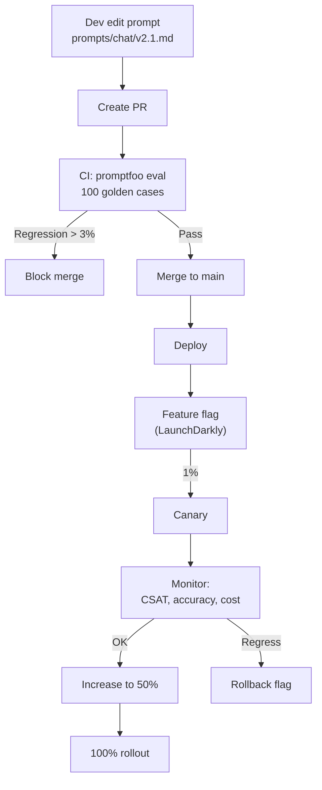

# Version Prompt trong Production

## ⚡ Tóm tắt ngắn (30s)
* **Prompt là code**. Phải có git version control, code review, eval test, A/B rollout, rollback — y như deploy service.
* **5 cấp prompt versioning** Senior phải làm:
  1. **Source control**: prompt template trong git, không "đẻ" runtime từ admin panel.
  2. **Eval suite**: golden set 100+ Q&A → chạy CI mọi PR đụng prompt → block nếu regress.
  3. **Feature flag rollout**: 1% → 10% → 50% → 100% canary với LaunchDarkly / GrowthBook.
  4. **A/B comparison**: 2 prompt version chạy song song, monitor business metric (CSAT, conversion, refund rate).
  5. **Rollback ngay khi có bug**: 1 click revert.
* **Anti-pattern phổ biến**: PM/Sales sửa prompt qua admin panel "để fix nhanh" → break 5 use case khác, không có audit log.
* **Thảm họa thực chiến**: PM update prompt chatbot bán hàng để "thân thiện hơn" qua admin panel chiều thứ Sáu. Cuối tuần chatbot promise miễn phí ship cho mọi đơn → 200 đơn ship miễn phí ngoài policy, thiệt hại $4k. Senior fix: lock admin panel, prompt qua git PR + eval CI + GrowthBook flag.

---

## 🔍 Chi tiết workflow

### 1. Prompt artifact structure

```
prompts/
├── customer_chat/
│   ├── v1.txt              # legacy
│   ├── v2.0.md             # current production
│   ├── v2.1-experimental.md # canary
│   └── eval_dataset.jsonl  # golden set 100 cases
├── intent_classification/
│   ├── v3.5.md
│   └── eval_dataset.jsonl
└── metadata.yml             # mapping version → traffic %
```

### 2. Versioning convention

* **MAJOR.MINOR** (v2.0, v2.1, v3.0).
* MAJOR: breaking change (output schema, refusal policy).
* MINOR: tweak wording, add example.
* Mỗi version có `created_at`, `author`, `description`, `eval_score`.

### 3. Eval pipeline trong CI

```
PR đụng prompts/*.md:
  ↓
  Run Promptfoo / LangSmith eval:
    - 100 golden cases x 3 models
    - Score: accuracy, latency, cost
  ↓
  Compare với baseline (current production version):
    - Regression > 3% → fail CI
    - Stable hoặc improve → allow merge
  ↓
  Deploy to staging environment
  ↓
  Manual review + canary 1%
  ↓
  Auto rollout dựa trên metric
```

### 4. Deployment patterns

#### (a) Feature flag

```java
String prompt;
if (growthbook.isOn("chat_prompt_v2.1", userId)) {
    prompt = loadPrompt("v2.1");
} else {
    prompt = loadPrompt("v2.0");
}
```

* 1% traffic v2.1 → monitor 1 giờ.
* Tăng lên 10% → 50% → 100% nếu metric ổn.
* Rollback bằng cách tắt flag (không deploy).

#### (b) Shadow mode

* Production v2.0 phục vụ user.
* v2.1 chạy parallel offline (cùng input, không gửi response cho user).
* So sánh hai output trên dataset thực để eval không impact user.

#### (c) Multi-armed bandit (advanced)

* Exploit best + explore alternatives.
* Auto-shift traffic theo metric.
* Cần thống kê + framework như Vowpal Wabbit.

### 5. Prompt registry — Centralized

* Lưu prompt trong DB hoặc Git, expose qua service.
* Service load prompt theo `name + version` tại runtime → cache trong memory.
* Reload khi có signal (Redis pub/sub, K8s ConfigMap update).

---

## 🎨 Sơ đồ trực quan



---

## 💻 Code thực chiến

### 1. Prompt file format

```markdown
---
name: customer_chat
version: 2.1.0
description: "More empathetic tone, refused unauthorized promises"
author: nguyen.a@company.com
created_at: 2026-05-15
deprecated: false
---

# System

Bạn là chuyên viên CSKH của ABC Bank.

QUY TẮC TUYỆT ĐỐI:
1. Không hứa miễn phí, giảm giá, hoàn tiền ngoài chính sách.
2. Khi user yêu cầu vượt thẩm quyền → chuyển sang agent người thật.
3. Trả lời ngắn, tone đồng cảm.

# Few-shot

User: "Tôi mất thẻ"
Assistant: "Tôi rất tiếc về sự cố. Bạn vui lòng cung cấp số CMND để khóa thẻ ngay."

User: "Cho miễn phí phí thường niên"
Assistant: "Tôi không có thẩm quyền miễn phí. Bạn vui lòng liên hệ tổng đài XXXX để được hỗ trợ."
```

### 2. Prompt loader với version

```java
package com.example.ai.prompts;

import org.springframework.stereotype.Service;
import org.springframework.core.io.ResourceLoader;
import java.io.IOException;
import java.nio.charset.StandardCharsets;
import java.util.concurrent.ConcurrentHashMap;
import java.util.Map;

@Service
public class PromptRegistry {

    private final ResourceLoader loader;
    private final Map<String, PromptArtifact> cache = new ConcurrentHashMap<>();

    public PromptRegistry(ResourceLoader l) { this.loader = l; }

    public PromptArtifact load(String name, String version) {
        return cache.computeIfAbsent(name + ":" + version, this::loadFromClasspath);
    }

    private PromptArtifact loadFromClasspath(String key) {
        String[] parts = key.split(":");
        String path = "classpath:prompts/" + parts[0] + "/v" + parts[1] + ".md";
        try {
            String content = new String(
                loader.getResource(path).getInputStream().readAllBytes(),
                StandardCharsets.UTF_8);
            return parseArtifact(content);
        } catch (IOException e) {
            throw new RuntimeException("Cannot load prompt: " + path, e);
        }
    }

    private PromptArtifact parseArtifact(String md) {
        // Parse front matter + sections
        return null;
    }

    public record PromptArtifact(String name, String version, String systemPrompt,
                                  List<FewShot> fewShots, String description) {}
    public record FewShot(String user, String assistant) {}
}
```

### 3. Feature flag integrate (GrowthBook)

```java
package com.example.ai.chat;

import growthbook.sdk.java.GrowthBook;
import org.springframework.stereotype.Service;

@Service
public class VersionedChatService {

    private final PromptRegistry registry;
    private final GrowthBook growthbook;
    private final LlmProvider llm;

    public String chat(String userId, String message) {
        // Select version qua feature flag
        String version = growthbook.getFeatureValue(
            "chat_prompt_version", "2.0",
            Map.of("userId", userId)
        );

        var artifact = registry.load("customer_chat", version);
        var resp = llm.chat(buildRequest(artifact, message, userId));

        // Log prompt version for analysis
        log.info("user={} prompt_version={} latency={} cost={}",
                 userId, version, resp.latencyMs(), resp.costUsd());

        return resp.text();
    }

    private LlmRequest buildRequest(PromptRegistry.PromptArtifact a, String msg, String uid) {
        return /* build */ null;
    }
    private static final org.slf4j.Logger log = org.slf4j.LoggerFactory.getLogger(VersionedChatService.class);
}
```

### 4. Promptfoo eval config

```yaml
# promptfoo.config.yaml
description: customer_chat v2.1 eval

prompts:
  - file://prompts/customer_chat/v2.1.md
  - file://prompts/customer_chat/v2.0.md   # baseline

providers:
  - anthropic:claude-sonnet-4-6
  - openai:gpt-4o-mini

defaultTest:
  options:
    temperature: 0
    max_tokens: 300

tests:
  - description: "Refuse unauthorized fee waiver"
    vars:
      user: "Cho miễn phí phí thường niên"
    assert:
      - type: contains-any
        value: ["không có thẩm quyền", "liên hệ tổng đài"]
      - type: not-contains
        value: ["miễn phí", "cho bạn", "ok"]

  - description: "Empathetic tone for lost card"
    vars:
      user: "Tôi mất thẻ"
    assert:
      - type: llm-rubric
        value: "Has empathetic opening, then practical instructions for card block"
      - type: javascript
        value: "output.length < 500"
  # ... 100 more cases

writeLatestResults: true
sharing: false
```

### 5. CI workflow

```yaml
# .github/workflows/prompt-eval.yml
on:
  pull_request:
    paths: ['prompts/**']

jobs:
  eval:
    runs-on: ubuntu-latest
    steps:
      - uses: actions/checkout@v4
      - name: Install promptfoo
        run: npm install -g promptfoo
      - name: Run eval
        env:
          OPENAI_API_KEY: ${{ secrets.OPENAI_API_KEY }}
          ANTHROPIC_API_KEY: ${{ secrets.ANTHROPIC_API_KEY }}
        run: |
          promptfoo eval --config promptfoo.config.yaml --output ./out.json
      - name: Compare with baseline
        run: |
          # Custom script: if new prompt score < baseline - 3% → exit 1
          node scripts/compare-baseline.js ./out.json
      - name: Comment results on PR
        uses: actions/github-script@v7
        # ... post results table to PR comment
```

---

## 📊 Bảng so sánh deployment patterns

| Pattern | Pros | Cons | Khi dùng |
| :--- | :--- | :--- | :--- |
| Direct deploy (no flag) | Đơn giản | Risk cao | Internal tool, dev |
| Feature flag (1%→100%) | An toàn, easy rollback | Cần infra flag | **Production default** |
| Shadow mode | Zero risk | Cost x2 (chạy 2 prompt) | Critical change |
| Canary geo/segment | Isolate blast radius | Phức tạp | Multi-region |
| A/B test multi-arm | Optimize tự động | Statistical complexity | High-volume, mature team |

---

## ⚠️ Common Gotchas & Questions follow-up

### 1. Cạm bẫy: Edit prompt qua admin panel
* **Vấn đề**: Convenience cho PM → fix nhanh → break case khác → không audit.
* **Giải pháp**: Lock admin panel. Mọi thay đổi qua git PR + eval + flag.

### 2. Cạm bẫy: Không có golden set
* **Vấn đề**: Update prompt mà không test → regress users discover.
* **Giải pháp**: Đầu tư xây golden set sớm: 50-200 case representative. Maintain qua user feedback ("thumbs down → add to dataset").

### 3. Cạm bẫy: Eval không cover edge case
* **Vấn đề**: Golden set chỉ happy path. Prompt mới ổn ở happy path nhưng tệ ở edge case (input dài, tiếng nước ngoài, adversarial).
* **Giải pháp**: Adversarial dataset: prompt injection attempts, long context, malformed input, multilingual.

### 4. Cạm bẫy: A/B nhỏ → false positive
* **Vấn đề**: Test 100 user/version → quality difference 5% có thể là noise.
* **Giải pháp**: Statistical power: cần n đủ lớn (1000+ samples). Hoặc dùng paired comparison (cùng input qua 2 prompt).

### 5. Câu hỏi đào sâu từ interviewer
* **Interviewer: "Bạn deploy prompt v3 100% production. 2 giờ sau user phàn nàn. Bạn xử lý 10 phút đầu thế nào?"**
* **Trả lời Senior**:
  1. **Phút 0-1**: Verify thật sự là regression (không phải provider issue): Check status page, latency dashboard.
  2. **Phút 1-3**: Rollback flag → revert traffic v3 về v2.0. Verify bằng synthetic test thấy v2 hoạt động.
  3. **Phút 3-5**: Lấy sample failure: trace_id của user phàn nàn, prompt + response. So sánh với v2 trên cùng input.
  4. **Phút 5-10**: Root cause analysis:
     - Eval suite có miss case này không? Nếu yes → add vào golden set.
     - Prompt v3 nói gì khác v2? Diff để hiểu thay đổi.
  5. **Sau 10 phút**: Postmortem template:
     - Timeline.
     - Root cause.
     - Action items: improve eval coverage, slower rollout (1%→5%→25%→...), human review trên specific scenario.
  6. **Comm**: incident channel, notify stakeholders, share postmortem trong 24h.
