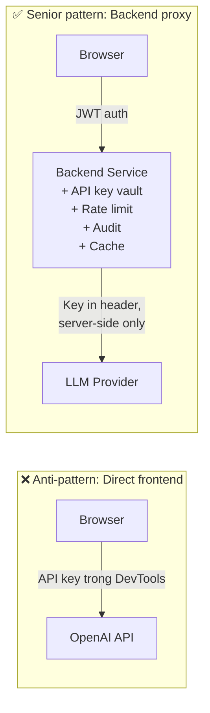

# Nên gọi LLM trực tiếp từ Frontend hay qua Backend

## ⚡ Tóm tắt ngắn (30s)
* **Trả lời ngắn**: **Luôn luôn qua Backend** với production app. Gọi trực tiếp từ frontend chỉ chấp nhận trong: (a) personal hobby project, (b) hackathon demo, (c) end-user mang API key của họ (e.g. Bring Your Own Key SaaS).
* **5 lý do bắt buộc qua Backend**:
  1. **Bảo vệ API key**: key trong frontend = lộ trong DevTools → ai cũng dùng được → cháy hóa đơn.
  2. **Rate limit & quota**: backend control được, frontend không.
  3. **Audit, observability, content moderation**: log + trace + safety guardrail tập trung.
  4. **Prompt control**: system prompt + RAG context không bị attacker thấy/sửa.
  5. **Cost optimization**: cache + dedup + routing model — chỉ làm được ở backend.
* **Thảm họa thực chiến**: Startup deploy "AI summarizer" với fetch trực tiếp `https://api.openai.com` từ React. Sau 12h, một developer crawl frontend, extract API key từ minified JS, dùng để spam → hóa đơn OpenAI tăng từ $50/ngày lên $4200/ngày trong 36 giờ. Cứu được nhờ OpenAI tự alert "anomaly detected". Senior fix: revoke key cũ, build backend proxy.

---

## 🔍 Chi tiết bản chất

### 1. Vấn đề khi gọi LLM trực tiếp từ frontend

#### (a) API key lộ
Bất kỳ key nào trong frontend bundle (kể cả "ẩn" trong env var của Next.js) đều có thể extract bằng DevTools / curl. `NEXT_PUBLIC_*` hay `VITE_*` đều bundle vào client.

```javascript
// ❌ ANTI-PATTERN: key này attacker thấy trong Network tab
fetch("https://api.openai.com/v1/chat/completions", {
  headers: { "Authorization": "Bearer sk-proj-..." }
});
```

#### (b) Không có quota / rate limit thật
Frontend rate limit là **client-side** → attacker bypass dễ. Họ chỉ cần dùng curl trực tiếp với key đã extract.

#### (c) Không log, không trace
Mỗi request đi thẳng provider → backend không thấy → không có observability, không debug được incident.

#### (d) System prompt lộ
Nếu frontend build full prompt → attacker đọc trong code → biết secret instructions, có thể design jailbreak.

#### (e) Không cache / dedup
Cùng câu hỏi từ 10 user → 10 LLM call. Backend có thể cache theo hash(prompt).

### 2. Kiến trúc đúng: Backend Proxy Pattern

```
[Browser]  →  [BFF / API Gateway]  →  [Backend Service]  →  [LLM Provider]
   ↑                                        ↑
   │ JWT auth                               │ - API key (vault)
   │ User-friendly URL                      │ - Rate limit (Redis)
   │ Không thấy API key                     │ - Prompt template
                                            │ - RAG retrieval
                                            │ - Caching
                                            │ - Logging + tracing
                                            │ - Content moderation
                                            │ - Cost metering
```

Backend đóng vai trò **proxy thông minh**, không chỉ relay.

### 3. Trường hợp đặc biệt: BYOK (Bring Your Own Key) SaaS

Một số SaaS cho user nhập **API key riêng của họ** (e.g. Cursor IDE, LobeChat). Lúc đó key ở client OK vì:
* Key thuộc về user → user chịu trách nhiệm cost.
* Vẫn nên thông qua backend nếu cần thêm logic (RAG, prompt templates).
* Lưu key bằng **localStorage chỉ ở user's browser**, không gửi qua backend trừ khi cần.

Đây là exception, không phải rule.

### 4. Kiến trúc lai: Streaming qua Backend

Vấn đề: backend proxy có thể làm chậm streaming? KHÔNG nếu dùng SSE pass-through:
* Frontend → Backend SSE.
* Backend → Provider SSE stream.
* Backend forward chunk-by-chunk → frontend chỉ thấy thêm ~10-50ms overhead.

---

## 🎨 Sơ đồ trực quan



---

## 💻 Code thực chiến

### 1. ❌ Sai: Direct frontend (Next.js)

```javascript
// pages/api/chat.js — đừng làm vầy
'use client';

export async function POST(req) {
  const body = await req.json();
  const resp = await fetch("https://api.openai.com/v1/chat/completions", {
    method: "POST",
    headers: {
      "Content-Type": "application/json",
      // ❌ Key lộ ra nếu file này render client-side
      "Authorization": `Bearer ${process.env.NEXT_PUBLIC_OPENAI_KEY}`
    },
    body: JSON.stringify(body),
  });
  return resp;
}
```

### 2. ✅ Đúng: Backend proxy với Spring Boot

**Server-side** (`/api/ai/chat`):
```java
package com.example.ai.api;

import org.springframework.beans.factory.annotation.Value;
import org.springframework.http.MediaType;
import org.springframework.security.access.prepost.PreAuthorize;
import org.springframework.web.bind.annotation.*;
import reactor.core.publisher.Flux;

@RestController
@RequestMapping("/api/ai")
public class ChatProxyController {

    private final LlmService llmService;
    private final QuotaService quota;
    private final ContentModerator moderator;

    public ChatProxyController(LlmService s, QuotaService q, ContentModerator m) {
        this.llmService = s; this.quota = q; this.moderator = m;
    }

    @PostMapping(value = "/chat", produces = MediaType.TEXT_EVENT_STREAM_VALUE)
    @PreAuthorize("hasRole('USER')")
    public Flux<String> chat(@AuthenticationPrincipal Jwt jwt,
                              @RequestBody ChatRequest body) {
        String userId = jwt.getClaim("sub");

        // 1. Quota
        if (!quota.allow(userId)) {
            return Flux.error(new QuotaExceededException("Vượt quota ngày"));
        }
        // 2. Content moderation input
        moderator.check(body.message());
        // 3. Gọi LLM qua service (API key chỉ server-side biết)
        return llmService.streamChat(body.message(), userId)
            .doOnNext(chunk -> moderator.checkOutgoing(chunk));
    }

    record ChatRequest(String message) {}
}
```

**Client-side** (React):
```javascript
async function streamChat(message) {
  const resp = await fetch("/api/ai/chat", {
    method: "POST",
    headers: {
      "Content-Type": "application/json",
      "Authorization": `Bearer ${getJwt()}`  // JWT user, không phải API key OpenAI
    },
    body: JSON.stringify({ message }),
  });
  
  // Đọc SSE stream
  const reader = resp.body.getReader();
  const decoder = new TextDecoder();
  while (true) {
    const { done, value } = await reader.read();
    if (done) break;
    const chunk = decoder.decode(value);
    appendToChat(chunk);
  }
}
```

### 3. Edge case: BYOK với key ở client (chỉ khi thực sự cần)

```javascript
// User-provided key — lưu CHỈ localStorage, KHÔNG gửi qua backend
async function chatWithUserKey(message) {
  const userKey = localStorage.getItem("openai_user_key");
  if (!userKey) return promptUserForKey();

  const resp = await fetch("https://api.openai.com/v1/chat/completions", {
    headers: {
      "Authorization": `Bearer ${userKey}`,  // Key của user, không phải app
      "Content-Type": "application/json"
    },
    body: JSON.stringify({ model: "gpt-4o-mini", messages: [{role:"user",content:message}] })
  });
  return resp.json();
}
```

---

## 📊 Bảng so sánh

| Khía cạnh | Frontend trực tiếp | Backend proxy |
| :--- | :--- | :--- |
| API key bảo vệ | ❌ Lộ trong bundle | ✓ Server-side vault |
| Rate limit thật | ❌ Bypass dễ | ✓ Redis sliding window |
| Audit log | ❌ Không có | ✓ Full request/response |
| RAG / context | ❌ Logic ở client | ✓ Backend control |
| Caching | ❌ Khó share | ✓ Redis cross-user |
| Content moderation | ❌ Client có thể bypass | ✓ Bắt buộc |
| Cost control | ❌ Không có | ✓ Quota + alert |
| Latency overhead | 0ms | ~20-50ms (gateway+backend) |
| Setup time | Phút | Vài giờ |
| Khi nào | Hobby, BYOK SaaS | 99% production |

---

## ⚠️ Common Gotchas & Questions follow-up

### 1. Cạm bẫy: NEXT_PUBLIC_API_KEY
* **Vấn đề**: Dev thấy `NEXT_PUBLIC_*` → "ẩn được trong env var". Thực ra Next.js bundle vào client. Lộ y như viết hardcode.
* **Giải pháp**: Key chỉ ở `process.env.OPENAI_API_KEY` (không có prefix `NEXT_PUBLIC_`). Truy cập trong API route server-side.

### 2. Cạm bẫy: Proxy KHÔNG có auth
* **Vấn đề**: Backend proxy mở public `/api/chat` không yêu cầu JWT → attacker spam free. Vẫn cháy hóa đơn.
* **Giải pháp**: JWT bắt buộc. Anonymous user nếu có → captcha + low quota.

### 3. Cạm bẫy: Frontend gửi system prompt
* **Vấn đề**: Để dễ "config flexible", frontend gửi `{system: "...", user: "..."}`. Attacker đổi system prompt → bypass guardrail.
* **Giải pháp**: System prompt chỉ ở backend. Frontend chỉ gửi user message (+ feature flag nếu cần).

### 4. Câu hỏi đào sâu từ interviewer
* **Interviewer: "Trong app SaaS BYOK của bạn, làm sao bảo đảm user A không thấy key user B?"**
* **Trả lời Senior**:
  1. **Key chỉ ở localStorage trình duyệt user A**, server không lưu plaintext.
  2. Nếu cần server-side feature (cron, batch): user upload key 1 lần → server encrypt at rest với KMS, decrypt CHỈ khi cần invoke LLM cho task của họ.
  3. **Per-user encryption key** (DEK encrypted by KMS): isolate blast radius. User B compromised không lộ key user A.
  4. **Tenant isolation**: row-level security trong DB; mọi query phải filter `tenant_id`. Test penetration với 2 account.
  5. **Audit log**: mọi operation đọc key được log; alert nếu có pattern bất thường (1 admin query nhiều key liên tiếp).
  6. **Compliance**: key được mã hóa AES-256 in rest; transit qua TLS 1.3; deletion request → key wipe trong 30 ngày.
