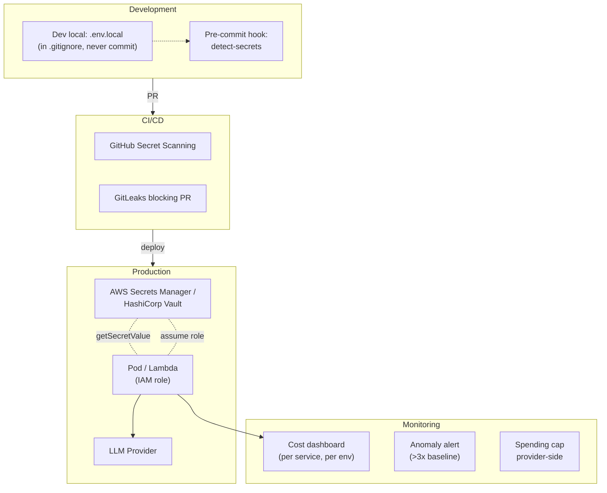

# Quản lý API Key của LLM Provider

## ⚡ Tóm tắt ngắn (30s)
* **API key** = bí mật cấp tài chính: rò rỉ = cháy hóa đơn ngay lập tức. Trên dark web, key OpenAI/Anthropic active được rao bán $50–500/key. Bot scan GitHub liên tục.
* **5 nguyên tắc Senior**:
  1. **Không bao giờ hardcode** (code, env file commit, Docker image, frontend bundle).
  2. **Vault tập trung**: AWS Secrets Manager / HashiCorp Vault / Azure Key Vault. Inject vào pod qua IAM role / Workload Identity, KHÔNG qua env var plain.
  3. **Rotation định kỳ**: 90 ngày max. Có thể dùng dual-key window để zero-downtime.
  4. **Least privilege**: 1 key / 1 service / 1 môi trường. Production key tách hoàn toàn dev/staging.
  5. **Monitoring & cap**: alert anomaly (>3× baseline), hard spending cap ở provider dashboard.
* **Thảm họa thực chiến**: Junior commit `.env` chứa key OpenAI vào public GitHub. Trong vòng 8 phút (đo bằng git log → first abuse), bot đã scrape + abuse. Hóa đơn từ $200/tháng vọt lên $18000 trong 2 ngày. OpenAI refund được 70% sau khi chứng minh là leak. Senior fix: GitHub secret scanning + git pre-commit hook + rotate toàn bộ key + setup Vault.

---

## 🔍 Chi tiết bản chất

### 1. Các pattern lưu trữ key

#### Anti-patterns (KHÔNG bao giờ làm)
* Hardcode trong source code.
* Commit `.env` vào git (kể cả private repo).
* Bundle vào frontend.
* Plain text trong Docker image / Helm chart values.
* Slack/email cho team.
* Wiki / Confluence.

#### Senior patterns

**(a) Cloud Secrets Manager + IAM Role (recommended)**
```
[EC2/EKS/Lambda]
  ↓ assume IAM role (no key needed)
[AWS Secrets Manager]
  ↓ getSecretValue("prod/openai")
[Application reads in memory at startup]
```

App KHÔNG có key in env. App có IAM role → role có quyền `secretsmanager:GetSecretValue` cho ARN cụ thể.

**(b) HashiCorp Vault (multi-cloud / on-prem)**
* Vault tổ chức theo namespace + policy.
* App auth qua Kubernetes Service Account hoặc AppRole.
* Có dynamic secret + lease + rotation tự động.

**(c) Kubernetes Sealed Secrets / External Secrets Operator**
* Encrypt secret offline, commit encrypted version vào Git.
* Operator decrypt khi deploy.

### 2. Rotation strategy

**Manual rotation (90 ngày)**:
1. Tạo key mới ở provider.
2. Update Secrets Manager với 2 phiên bản (key_a, key_b).
3. App preload cả 2; primary = key_a; fallback = key_b nếu key_a fail auth.
4. Sau 24h tự tin → revoke key cũ ở provider.

**Tự động (HashiCorp Vault Dynamic Secrets)**: Vault tự tạo key, lease 7 ngày, app refresh tự động. Provider hỗ trợ Vault plugin.

### 3. Spending cap & monitoring

* **Provider-side cap**: OpenAI / Anthropic có Hard limit ($X/tháng). Set cap < expected × 1.5.
* **Backend-side metering**: Redis counter token used per day. Alert khi đạt 80% baseline.
* **Anomaly detection**: nếu p99 token/request hoặc total cost/hour tăng 3× → page on-call.
* **Per-key spending**: tách key theo service → biết service nào cháy.

### 4. Defense-in-depth checklist

```
[Code] → pre-commit hook detect secret patterns
[Repo] → GitHub secret scanning, GitLeaks CI
[Build] → không build secret vào image (multi-stage)
[Runtime] → IAM/Vault inject memory; KHÔNG env var plaintext
[Network] → egress only to provider domains; deny others
[Monitor] → cost alert, anomaly detect
[Response] → playbook revoke + rotate trong 15 phút
```

---

## 🎨 Sơ đồ trực quan



---

## 💻 Code thực chiến

### 1. Spring Boot + AWS Secrets Manager

```java
package com.example.ai.config;

import org.springframework.cloud.aws.secretsmanager.AwsSecretsManagerPropertySource;
import org.springframework.context.annotation.Bean;
import org.springframework.context.annotation.Configuration;
import software.amazon.awssdk.services.secretsmanager.SecretsManagerClient;
import software.amazon.awssdk.services.secretsmanager.model.GetSecretValueRequest;

@Configuration
public class SecretsConfig {

    @Bean
    public LlmCredentials llmCredentials(SecretsManagerClient client) {
        // Secret JSON: {"openai_key":"sk-...","anthropic_key":"sk-ant-...","openai_key_backup":"sk-..."}
        String secretId = System.getenv("LLM_SECRET_ID");  // e.g. "prod/llm-keys"

        var response = client.getSecretValue(
            GetSecretValueRequest.builder().secretId(secretId).build()
        );
        return LlmCredentials.fromJson(response.secretString());
    }

    public record LlmCredentials(String openaiKey, String anthropicKey, String openaiKeyBackup) {
        public static LlmCredentials fromJson(String json) {
            // parse via Jackson; in production cache + refresh
            return /* parsed */ null;
        }
    }
}
```

### 2. application.yml — Spring Cloud AWS

```yaml
spring:
  cloud:
    aws:
      region:
        static: ap-southeast-1
      secretsmanager:
        # Secret ID inject từ env var/Helm value
        # Pod assume IAM role, không cần access key
        name: ${LLM_SECRET_ID:prod/llm-keys}
```

### 3. Dual-key zero-downtime rotation

```java
package com.example.ai.provider;

import org.springframework.stereotype.Component;
import reactor.core.publisher.Mono;
import org.springframework.web.reactive.function.client.WebClient;

@Component
public class RotationAwareOpenAiClient {

    private volatile String primaryKey;
    private volatile String fallbackKey;
    private final WebClient webClient = WebClient.create("https://api.openai.com/v1");

    public RotationAwareOpenAiClient(LlmCredentials creds) {
        this.primaryKey = creds.openaiKey();
        this.fallbackKey = creds.openaiKeyBackup();
    }

    public Mono<String> chat(Object payload) {
        return callWith(payload, primaryKey)
            .onErrorResume(WebClientResponseException.Unauthorized.class,
                e -> {
                    // 401 → primary key revoked; thử backup
                    log.warn("Primary key 401, fallback to backup");
                    return callWith(payload, fallbackKey);
                });
    }

    private Mono<String> callWith(Object payload, String key) {
        return webClient.post()
            .uri("/chat/completions")
            .header("Authorization", "Bearer " + key)
            .bodyValue(payload)
            .retrieve()
            .bodyToMono(String.class);
    }

    // Polled bởi @Scheduled task khi Secrets Manager refresh
    public void rotateKeys(String newPrimary, String newFallback) {
        this.fallbackKey = this.primaryKey;   // primary cũ thành backup
        this.primaryKey = newPrimary;
        log.info("Keys rotated");
    }

    private static final org.slf4j.Logger log = org.slf4j.LoggerFactory.getLogger(RotationAwareOpenAiClient.class);
}
```

### 4. Pre-commit hook (.git/hooks/pre-commit hoặc gitleaks)

```yaml
# .gitleaks.toml — block commit chứa secret pattern
[[rules]]
id = "openai-key"
description = "OpenAI API Key"
regex = '''sk-[A-Za-z0-9]{32,}'''

[[rules]]
id = "anthropic-key"
description = "Anthropic API Key"
regex = '''sk-ant-[A-Za-z0-9_\-]{80,}'''
```

```bash
# CI step
gitleaks detect --source . --no-banner --redact || exit 1
```

---

## 📊 Bảng so sánh giải pháp

| Solution | Cost | Setup | Rotation | Multi-env | Khi dùng |
| :--- | :--- | :--- | :---: | :---: | :--- |
| Env var trong systemd | $0 | 5 phút | Manual | Manual | Hobby/small |
| Docker secret | $0 | 30 phút | Manual | OK | Single-host |
| AWS Secrets Manager | $0.40/secret/tháng | 1 giờ | Manual + lambda auto | ✓ | AWS native |
| HashiCorp Vault | $0–$$$ | 1 ngày | Tự động (dynamic) | ✓ | Multi-cloud / on-prem |
| Kubernetes Sealed Secrets | $0 | 1 giờ | Manual | ✓ | K8s native, GitOps |
| Azure Key Vault | $0.03/10k op | 1 giờ | Manual + auto | ✓ | Azure native |
| GCP Secret Manager | $0.06/secret/tháng | 1 giờ | Manual | ✓ | GCP native |

---

## ⚠️ Common Gotchas & Questions follow-up

### 1. Cạm bẫy: Commit `.env.example` chứa key thật
* **Vấn đề**: Dev rename `.env` thành `.env.example` để "team biết format", quên xóa key. Vẫn leak.
* **Giải pháp**: `.env.example` chỉ chứa key dummy (`OPENAI_KEY=sk-xxxx`). GitLeaks regex blocking.

### 2. Cạm bẫy: Log key vào stdout
* **Vấn đề**: Debug log `log.info("Calling with key=" + apiKey)` → key vào Datadog/CloudWatch → indexed bởi tool monitoring → ai có quyền search log = thấy key.
* **Giải pháp**: 
  1. Logger filter: redact pattern `sk-[A-Za-z0-9]+` thành `sk-***REDACTED***`.
  2. Code review hook detect log statement có biến chứa "key", "secret", "token".

### 3. Cạm bẫy: Single key cho mọi service
* **Vấn đề**: 1 key dùng cho 10 microservice. Key bị compromise → revoke ảnh hưởng cả 10 service.
* **Giải pháp**: 
  1. Mỗi microservice 1 key riêng.
  2. Provider có "project" / "organization" có thể tạo nhiều API key cùng quota → tận dụng.
  3. Có thể cap per-key ở provider để limit blast radius.

### 4. Cạm bẫy: Quên revoke khi nhân viên nghỉ
* **Vấn đề**: Dev có quyền tạo personal API key → tạo cho dev local. Nghỉ việc, key vẫn active → có thể dùng tiếp.
* **Giải pháp**: 
  1. Không cho personal API key. Mọi key thuộc service account.
  2. Offboarding checklist: revoke mọi access trong 1 giờ.
  3. Quarterly audit: list active key + last used → revoke dead key.

### 5. Câu hỏi đào sâu từ interviewer
* **Interviewer: "Bạn vừa phát hiện key leaked trên GitHub. Bạn xử lý 30 phút đầu thế nào?"**
* **Trả lời Senior**:
  1. **Phút 0-2**: Revoke key ngay ở provider dashboard. Quan trọng nhất, làm trước khi điều tra.
  2. **Phút 2-5**: Tạo key mới + cập nhật Secrets Manager + restart service nếu cần (hoặc trigger refresh).
  3. **Phút 5-10**: Verify service hoạt động bình thường với key mới.
  4. **Phút 10-15**: Investigate scope: 
     - Commit lúc nào → từ đó đến giờ có abuse không?
     - Check billing dashboard → spike?
     - Filter network log: outbound traffic tới provider domain.
  5. **Phút 15-30**: 
     - Contact provider abuse: cung cấp evidence, request refund khoản abuse.
     - Force-push remove key khỏi git history (`git filter-branch` / `BFG`); biết là không hoàn toàn xóa được khỏi GitHub cache.
     - Postmortem: vì sao slip qua gitleaks, fix pre-commit + CI.
     - Comm internal: report incident, train team.
  6. **Sau 24h**: Implement guardrail mới (vault, scanning), rotation cho mọi key, audit log enable.
