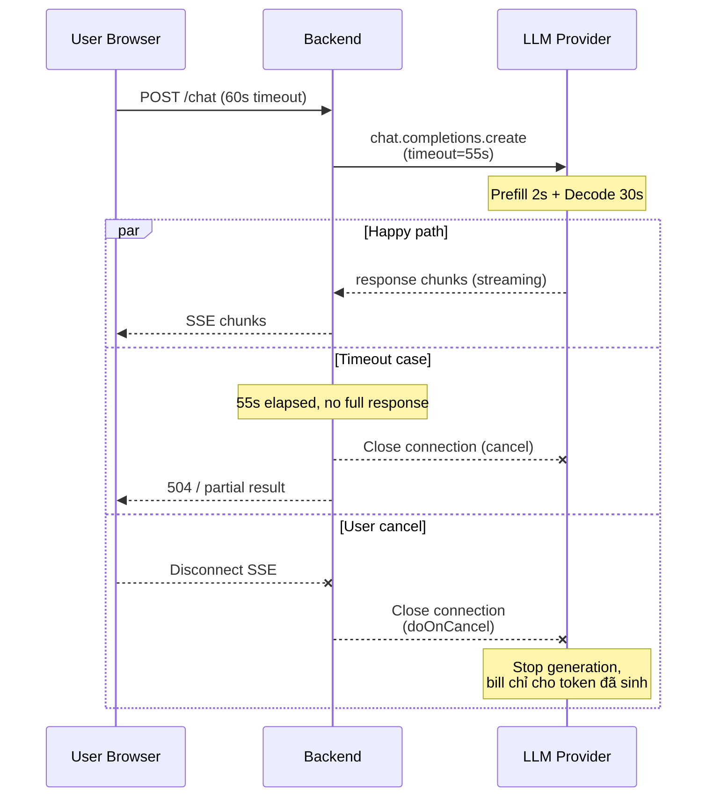

# Timeout khi gọi LLM nên đặt như thế nào

## ⚡ Tóm tắt ngắn (30s)
* LLM call có **đặc tính latency rất khác** HTTP truyền thống: p50 = 1–3s, p99 có thể 30–120s tùy model + output dài. Đặt timeout theo "habit" 5s như API thường → 30% request fail false-negative. Đặt 300s → thread hang, không bao giờ recover.
* **Quy tắc Senior 3 tầng timeout**:
  1. **Connect timeout**: 3–5s. Provider không reachable → fail nhanh.
  2. **Read timeout** (sync call): 60–120s tùy max_tokens. Công thức gần đúng: `max_tokens × 100ms + buffer 20s`.
  3. **Total request timeout** (cho streaming): 180–300s. Streaming dài nhưng có chunk → từng chunk timeout 30s là OK.
* **Quan trọng nhất**: cancel propagation. Khi timeout → CANCEL request sang provider (gửi DELETE / close socket) để KHÔNG bị tính tiền cho phần đã sinh.
* **Thảm họa thực chiến**: Team set timeout = 5s (theo habit REST API). Endpoint `/chat` p99 = 8s vì RAG context dài + Sonnet thinking. 40% request bị timeout, retry → tốn cost x2, user thấy "Lỗi mạng" liên tục. Senior fix: read timeout 90s + streaming SSE để user thấy response từng phần → uptime perceived 99.5%.

---

## 🔍 Chi tiết bản chất

### 1. Vì sao LLM call lâu

* **Prefill phase**: encode toàn bộ input tokens. Tỷ lệ với input length. Với 8k token input → 1-2s.
* **Decode phase**: sinh từng output token, 30-100ms/token. 500 token output → 15-50s.
* **Provider queueing**: khi load cao, request có thể chờ trong queue → +5-30s.
* **Network**: 200ms round-trip overhead per direction.

→ Tổng p50 ~2s, p99 có thể 60s là **bình thường**, không phải bug.

### 2. Phân loại timeout

| Loại | Định nghĩa | Khuyến nghị |
| :--- | :--- | :--- |
| **Connect timeout** | Time để mở TCP/TLS connection | 3-5s |
| **Read timeout (HTTP request)** | Time chờ response complete | 60-120s sync, 180-300s streaming |
| **Stream chunk timeout** | Time max không có chunk mới đến | 30s (provider "đang nghĩ") |
| **End-to-end client timeout** | Tổng time client chờ | Server timeout + buffer 10s |
| **Cancel propagation timeout** | Time cleanup khi cancel | 5s |

### 3. Công thức tính timeout

```
read_timeout = max_tokens × estimated_ms_per_token + safety_buffer

Ví dụ:
- max_tokens = 500
- Sonnet 4.6 ~50ms/token → 500 × 50 = 25000ms = 25s
- Buffer cho prefill + network: +30s
- Total: 55s → set 60s là đủ
```

Nếu max_tokens = 4000:
* Decode time: 4000 × 50 = 200s
* +Buffer: 230s
* → Set **240s read timeout** cho sync call này, hoặc dùng streaming.

### 4. Khi nào dùng streaming thay vì sync

* Output > 500 token: streaming bắt buộc cho UX.
* Output dài + sync = user thấy "loading 30 giây" → bỏ.
* Streaming cho phép TTFT thấp (200ms-2s), giảm perceived latency.

### 5. Cancel propagation

```
[User cancel / timeout]
   ↓
[Client gửi tín hiệu cancel]
   ↓
[Backend nhận → cancel Flux/Future]
   ↓
[HTTP client (WebClient) đóng connection sang provider]
   ↓
[Provider phát hiện connection closed → stop generating]
   ↓
[Tiền chỉ tính cho phần đã sinh, không tính cho output bị cut]
```

Bỏ qua bước cancel propagation → vẫn bị tính tiền dù user đã bỏ.

---

## 🎨 Sơ đồ trực quan



---

## 💻 Code thực chiến

### 1. Spring WebClient với timeout 3 tầng

```java
package com.example.ai.client;

import io.netty.channel.ChannelOption;
import io.netty.handler.timeout.ReadTimeoutHandler;
import org.springframework.beans.factory.annotation.Value;
import org.springframework.http.client.reactive.ReactorClientHttpConnector;
import org.springframework.stereotype.Component;
import org.springframework.web.reactive.function.client.WebClient;
import reactor.core.publisher.Mono;
import reactor.netty.http.client.HttpClient;
import java.time.Duration;
import java.util.concurrent.TimeUnit;

@Component
public class TimeoutAwareLlmClient {

    private final WebClient client;

    public TimeoutAwareLlmClient(@Value("${openai.api-key}") String apiKey) {
        HttpClient httpClient = HttpClient.create()
            // Connect timeout — TCP/TLS handshake
            .option(ChannelOption.CONNECT_TIMEOUT_MILLIS, 5000)
            // Idle timeout cho stream chunks
            .responseTimeout(Duration.ofSeconds(120))
            .doOnConnected(conn ->
                conn.addHandlerLast(new ReadTimeoutHandler(120, TimeUnit.SECONDS))
            );

        this.client = WebClient.builder()
            .baseUrl("https://api.openai.com/v1")
            .clientConnector(new ReactorClientHttpConnector(httpClient))
            .defaultHeader("Authorization", "Bearer " + apiKey)
            .build();
    }

    /** Sync call với calculated timeout dựa trên max_tokens */
    public Mono<String> chat(int maxTokens, Object payload) {
        long timeoutMs = computeTimeout(maxTokens);

        return client.post()
            .uri("/chat/completions")
            .bodyValue(payload)
            .retrieve()
            .bodyToMono(String.class)
            .timeout(Duration.ofMillis(timeoutMs))   // Reactor timeout
            .doOnCancel(() -> log.info("Request cancelled — provider sẽ stop generation"));
    }

    /** Công thức: max_tokens × 100ms + buffer 20s */
    private long computeTimeout(int maxTokens) {
        return maxTokens * 100L + 20_000L;
    }

    private static final org.slf4j.Logger log = org.slf4j.LoggerFactory.getLogger(TimeoutAwareLlmClient.class);
}
```

### 2. OpenAI SDK Python — Per-request timeout

```python
from openai import OpenAI
import openai

# Default timeout cho client = 10 phút (quá lâu)
client = OpenAI(timeout=120.0)  # 120s mặc định

def chat_with_timeout(messages, max_tokens=500):
    # Tính timeout theo max_tokens
    timeout = min(max_tokens * 0.1 + 20, 180)  # cap 180s
    
    try:
        resp = client.chat.completions.create(
            model="gpt-4o-mini",
            messages=messages,
            max_tokens=max_tokens,
            timeout=timeout,  # Per-request override
        )
        return resp.choices[0].message.content
    except openai.APITimeoutError:
        # Đã hết timeout — request đã được cancel
        raise RuntimeError(f"LLM timeout sau {timeout}s")
```

### 3. Streaming với chunk-level timeout

```java
package com.example.ai.stream;

import org.springframework.stereotype.Service;
import org.springframework.web.reactive.function.client.WebClient;
import reactor.core.publisher.Flux;
import java.time.Duration;

@Service
public class StreamingLlmService {

    private final WebClient client;

    public StreamingLlmService(WebClient c) { this.client = c; }

    public Flux<String> stream(Object payload) {
        return client.post()
            .uri("/chat/completions")
            .bodyValue(payload)
            .retrieve()
            .bodyToFlux(String.class)
            // Chunk-level timeout: nếu 30s không có chunk mới → coi như provider hang
            .timeout(Duration.ofSeconds(30))
            // Total timeout: 5 phút cho cả stream
            .take(Duration.ofMinutes(5))
            .doOnCancel(() -> log.info("Client cancelled stream"))
            .doOnError(java.util.concurrent.TimeoutException.class,
                       e -> log.warn("Stream chunk timeout 30s — provider có thể stuck"));
    }

    private static final org.slf4j.Logger log = org.slf4j.LoggerFactory.getLogger(StreamingLlmService.class);
}
```

---

## 📊 Bảng timeout khuyến nghị theo use case

| Use case | Max tokens | Connect | Read | Stream chunk | Total |
| :--- | :---: | :---: | :---: | :---: | :---: |
| Classification / extract | 100 | 3s | 15s | - | 18s |
| Short answer (FAQ) | 500 | 3s | 30s | - | 33s |
| RAG with citation | 1000 | 5s | 60s | 30s | 90s |
| Code generation | 2000 | 5s | 90s | 30s | 120s |
| Long summary | 4000 | 5s | 180s | 30s | 210s |
| Agentic multi-turn | 1000 × N | 5s | 60s/turn | 30s | 5 phút |
| Embedding (batch 100) | - | 3s | 30s | - | 33s |

---

## ⚠️ Common Gotchas & Questions follow-up

### 1. Cạm bẫy: Timeout < provider timeout
* **Vấn đề**: Đặt backend timeout = 30s, nhưng provider tự nó phải 60s mới trả response → backend cancel sớm → vẫn bị tính tiền + user thấy lỗi liên tục.
* **Giải pháp**: Đo p99 thực tế, set backend timeout = p99 × 1.2. Hoặc dùng streaming để TTFT thấp.

### 2. Cạm bẫy: Quên cancel propagation
* **Vấn đề**: Timeout client → trả 504. Nhưng provider không nhận tín hiệu cancel → vẫn generate full output → bill cost full.
* **Giải pháp**: 
  1. WebClient.doOnCancel hoặc Flux.doOnCancel → đóng connection upstream.
  2. OpenAI SDK: signal abort qua `AbortController`.
  3. Test cancel scenario explicitly trong CI.

### 3. Cạm bẫy: Cùng timeout cho mọi endpoint
* **Vấn đề**: 1 service serve cả extract (500ms typical) và summarize (60s typical). Timeout chung 60s → extract fail rate thấp nhưng resource hang lâu khi extract bị bug.
* **Giải pháp**: Per-endpoint timeout. Hoặc per-request dynamic based on `max_tokens`.

### 4. Cạm bẫy: Nginx/ALB timeout < backend timeout
* **Vấn đề**: Backend WebClient timeout 120s, nhưng ALB idle timeout default 60s. Connection bị ALB cut → backend không biết → vẫn chờ.
* **Giải pháp**: 
  1. Tăng ALB/Nginx timeout phù hợp (ALB max 4000s).
  2. Hoặc dùng streaming SSE — có data flow liên tục → ALB không idle.

### 5. Câu hỏi đào sâu từ interviewer
* **Interviewer: "Khi nào bạn chọn streaming thay vì sync, và nó ảnh hưởng timeout strategy thế nào?"**
* **Trả lời Senior**:
  1. **Output > 500 token hoặc latency-sensitive UX**: streaming.
  2. **Output structured JSON ngắn**: sync OK vì cần full response để parse.
  3. **Timeout strategy với streaming**:
     - **TTFT timeout**: 10s. Nếu provider không gửi chunk đầu trong 10s → có vấn đề.
     - **Chunk gap timeout**: 30s. Đo time giữa 2 chunk. Nếu vượt → provider hang.
     - **Total stream timeout**: 5 phút (cap cứng).
     - Không dùng "read timeout" theo nghĩa truyền thống vì stream là long-lived.
  4. **Code path**: 
     - WebFlux Flux có `.timeout(Duration)` áp dụng cho time giữa các emit → exactly chunk-gap timeout.
     - `.take(Duration)` áp dụng cho total time → exactly stream total.
  5. **Edge case**: provider chunk có thể "burst" và "stall". Don't time out trên một stall ngắn — dùng moving average hoặc threshold cao hơn.
