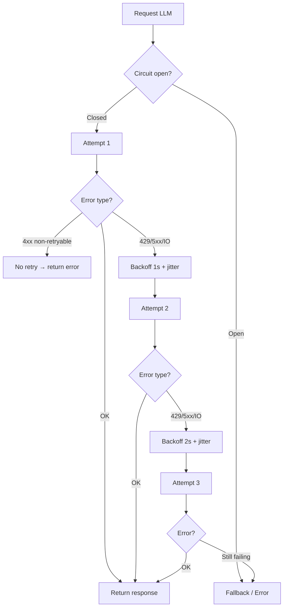

# Retry LLM Request có rủi ro gì

## ⚡ Tóm tắt ngắn (30s)
* **Retry LLM** trông giống retry HTTP thường nhưng có **4 rủi ro đặc thù**:
  1. **Cost duplicate**: mỗi retry tốn token mới → 3 attempt thất bại = 3× tiền oan.
  2. **Side effect**: nếu prompt có tool use (gọi `sendEmail`, `createTicket`), retry → gửi email 2 lần.
  3. **Stale state với streaming**: client đã nhận partial chunk, retry → response mới đè lên → UX vỡ.
  4. **Cascade overload**: retry storm khi provider 429 → làm provider rate-limit nặng hơn → kéo dài downtime.
* **Quy tắc Senior**:
  1. Chỉ retry **transient error**: 429 (Rate limit), 500/502/503/504, network IOException.
  2. **KHÔNG retry**: 400 (bad request), 401 (auth), 403, 422 (invalid input), context overflow.
  3. **Exponential backoff + jitter**: 1s → 2s → 4s với jitter ±25%.
  4. **Max 2-3 attempts**, tránh retry hơn 3 lần.
  5. **Idempotency key**: gửi `Idempotency-Key` header để provider dedup nếu hỗ trợ (OpenAI có).
  6. **Tool use retry**: chỉ retry phần LLM call, KHÔNG retry phần tool execution.
* **Thảm họa thực chiến**: Team set retry maxAttempts=5, no backoff, retry trên mọi exception. Provider gặp 30 phút downtime → 5× request từ 1000 user = 5000 retry/s → IP bị ban → provider mất thêm 2 giờ unblock. Senior fix: maxAttempts=2 + exponential backoff + circuit breaker.

---

## 🔍 Chi tiết bản chất

### 1. Phân loại error → có nên retry không

| HTTP Code | Tên | Retry? | Backoff | Lý do |
| :---: | :--- | :---: | :---: | :--- |
| **429** | Too Many Requests | ✓ | Theo Retry-After header | Tạm thời, sẽ recover |
| **500** | Internal Server Error | ✓ | Exponential | Có thể transient |
| **502** | Bad Gateway | ✓ | Exponential | Provider có proxy down |
| **503** | Service Unavailable | ✓ | Exponential | Provider overload |
| **504** | Gateway Timeout | ✓ (cẩn thận) | Exponential | Request đã có thể chạy → side effect |
| **400** | Bad Request | ✗ | - | Prompt sai, retry không cứu được |
| **401** | Unauthorized | ✗ | - | Key sai/expired, cần intervention |
| **403** | Forbidden | ✗ | - | Permission issue |
| **404** | Not Found | ✗ | - | Model name sai |
| **422** | Unprocessable Entity | ✗ | - | Schema validation fail |
| **IOException** | Network error | ✓ | Exponential | Connection drop, transient |
| **TimeoutException** | Read timeout | ✓ (1 lần) | Linear | Request có thể đã chạy provider-side |

### 2. Side effect — Vấn đề tinh tế nhất

Khi LLM dùng **tool calling** (gọi API external trong loop), retry phải cẩn thận:

```
Turn 1: LLM gọi tool send_email(user@x.com)
Turn 2: Tool result → LLM trả final answer
[Network error trên Turn 2 response]
Retry: LLM lại gọi tool send_email(user@x.com)  ← Đã gửi 2 lần!
```

→ Senior tách: retry chỉ vòng outer (overall request), tool execution có **idempotency key của riêng** nó (Redis dedup theo `(user_id, action, params_hash)`).

### 3. Exponential Backoff + Jitter

Vì sao cần jitter: nếu 1000 client cùng retry cùng lúc sau 1s → thundering herd. Jitter random 0-25% spread out.

```
attempt 1: 1.0s × (1 ± 0.25) = 0.75-1.25s
attempt 2: 2.0s × (1 ± 0.25) = 1.5-2.5s
attempt 3: 4.0s × (1 ± 0.25) = 3.0-5.0s
```

Tổng max wait: ~8s. Sau đó give up + circuit break.

### 4. Idempotency Key

OpenAI hỗ trợ `Idempotency-Key` header. Nếu cùng key trong 24h:
* Request đầu thành công → cache response.
* Request sau cùng key → trả về cached response thay vì re-execute.
* Không tốn cost cho retry.

Anthropic: chưa có official idempotency header (May 2026), nhưng có request_id cho debug.

### 5. Circuit Breaker — Tại sao đi cùng Retry

Retry vô tội vạ khi provider down → DDoS chính bạn. Circuit breaker:
* Đếm error rate trong sliding window.
* Vượt threshold (50% trong 30s) → OPEN: stop sending request, trả fallback ngay.
* Sau cooldown (60s) → HALF-OPEN: thử 1 request. Pass → close. Fail → open lại.

---

## 🎨 Sơ đồ trực quan



---

## 💻 Code thực chiến

### 1. Spring + Resilience4j

```java
package com.example.ai.retry;

import io.github.resilience4j.retry.annotation.Retry;
import io.github.resilience4j.circuitbreaker.annotation.CircuitBreaker;
import org.springframework.stereotype.Service;
import org.springframework.web.reactive.function.client.WebClient;
import reactor.core.publisher.Mono;
import java.io.IOException;
import java.util.UUID;

@Service
public class RetryAwareLlmService {

    private final WebClient client;

    public RetryAwareLlmService(WebClient c) { this.client = c; }

    @Retry(name = "llm")  // config trong yml
    @CircuitBreaker(name = "llm", fallbackMethod = "fallback")
    public Mono<String> chat(String prompt) {
        // Idempotency key cho retry safety
        String idemKey = UUID.randomUUID().toString();

        return client.post()
            .uri("/chat/completions")
            .header("Idempotency-Key", idemKey)
            .bodyValue(buildPayload(prompt))
            .retrieve()
            // Chỉ retry trên error retryable (4xx khác sẽ throw non-retryable)
            .onStatus(s -> s.is4xxClientError() && s.value() != 429,
                resp -> Mono.error(new NonRetryableException("4xx: " + resp.statusCode())))
            .bodyToMono(String.class);
    }

    public Mono<String> fallback(String prompt, Throwable t) {
        if (t instanceof NonRetryableException) {
            // Don't retry, bubble up
            return Mono.error(t);
        }
        // Circuit open hoặc retry exhausted
        return Mono.just("Hệ thống AI tạm thời gián đoạn. Vui lòng thử lại sau.");
    }

    private Object buildPayload(String prompt) { return null; }
    public static class NonRetryableException extends RuntimeException {
        public NonRetryableException(String m) { super(m); }
    }
}
```

### 2. application.yml — Retry config

```yaml
resilience4j:
  retry:
    instances:
      llm:
        max-attempts: 3
        wait-duration: 1s
        exponential-backoff-multiplier: 2
        randomized-wait-factor: 0.25       # jitter ±25%
        retry-exceptions:
          - java.io.IOException
          - java.util.concurrent.TimeoutException
          - org.springframework.web.reactive.function.client.WebClientResponseException$TooManyRequests
          - org.springframework.web.reactive.function.client.WebClientResponseException$InternalServerError
          - org.springframework.web.reactive.function.client.WebClientResponseException$BadGateway
          - org.springframework.web.reactive.function.client.WebClientResponseException$ServiceUnavailable
        ignore-exceptions:
          - com.example.ai.retry.RetryAwareLlmService$NonRetryableException

  circuitbreaker:
    instances:
      llm:
        sliding-window-type: COUNT_BASED
        sliding-window-size: 50
        failure-rate-threshold: 50
        wait-duration-in-open-state: 60s
        permitted-number-of-calls-in-half-open-state: 5
```

### 3. Python OpenAI SDK — Tenacity for retry

```python
from openai import OpenAI, RateLimitError, APIError
from tenacity import (
    retry, wait_random_exponential, stop_after_attempt,
    retry_if_exception_type, before_sleep_log
)
import logging

logger = logging.getLogger(__name__)
client = OpenAI()

@retry(
    retry=retry_if_exception_type((RateLimitError, APIError)),
    wait=wait_random_exponential(min=1, max=8, multiplier=1),  # 1s → 8s with jitter
    stop=stop_after_attempt(3),
    before_sleep=before_sleep_log(logger, logging.WARNING),
    reraise=True,  # raise original exception after exhaust
)
def chat_with_retry(messages, **kwargs):
    return client.chat.completions.create(
        model="gpt-4o-mini",
        messages=messages,
        **kwargs,
    )
```

### 4. Tool use loop — Per-tool idempotency

```python
from hashlib import sha256
import json, redis

r = redis.Redis()

def safe_tool_execute(tool_name: str, args: dict):
    """Idempotency cho tool call — không gửi email 2 lần khi retry"""
    key = "tool:" + tool_name + ":" + sha256(json.dumps(args, sort_keys=True).encode()).hexdigest()
    
    # Nếu đã execute trong 10 phút → trả cached result
    cached = r.get(key)
    if cached:
        return json.loads(cached)
    
    result = execute_tool(tool_name, args)  # Side-effectful
    r.setex(key, 600, json.dumps(result))   # TTL 10 phút
    return result

def execute_tool(name, args):
    if name == "send_email":
        return email_service.send(args["to"], args["subject"], args["body"])
    # ...
```

---

## 📊 Bảng so sánh strategy retry

| Strategy | Pros | Cons | Khi dùng |
| :--- | :--- | :--- | :--- |
| **No retry** | Đơn giản, không double-spend | UX kém với transient error | Test/POC |
| **Linear backoff** | Predictable | Thundering herd | Internal service, low scale |
| **Exponential backoff** | Reduces load | Có thể đợi lâu | Default cho LLM |
| **Exponential + jitter** | Tránh thundering herd | Phải tune jitter | **Production** |
| **Adaptive (theo Retry-After)** | Optimal khi provider gửi hint | Phức tạp | Khi provider cung cấp header |
| **Retry với fallback model** | Cứu được khi model A down | Quality khác → cần test | Multi-provider abstraction |

---

## ⚠️ Common Gotchas & Questions follow-up

### 1. Cạm bẫy: Retry trên 400 → infinite loop
* **Vấn đề**: Prompt vượt context limit → 400. Retry → vẫn 400. Đốt cost retry vô nghĩa.
* **Giải pháp**: Whitelist retry chỉ cho retryable code (429, 5xx, network). Mọi 4xx khác bubble lên.

### 2. Cạm bẫy: Retry timeout response
* **Vấn đề**: Read timeout 60s → tưởng fail. Thực tế provider đã chạy + sẽ tính tiền. Retry → tính tiền lần 2.
* **Giải pháp**: 
  1. Idempotency key (OpenAI hỗ trợ): nếu provider thấy key đã processed → return cached.
  2. Hoặc tăng timeout đủ generous để không hit thường xuyên.
  3. Khi timeout, ưu tiên fallback graceful thay vì retry mù.

### 3. Cạm bẫy: Retry tool execution
* **Vấn đề**: LLM call tool `createTicket()` thành công. Trên đường về backend, lỗi mạng → retry whole turn → LLM gọi `createTicket()` lần 2 → 2 ticket.
* **Giải pháp**: Mỗi tool có idempotency key riêng (hash args). Lưu result trong Redis 10 phút. Retry → trả cached.

### 4. Cạm bẫy: Không monitor retry rate
* **Vấn đề**: Retry "silently fix" issue → team không biết provider đang flaky. Một ngày retry rate = 30% → đột nhiên cost gấp đôi và không ai để ý.
* **Giải pháp**: Metric `llm.retry.count` per endpoint. Alert khi retry rate > 5%.

### 5. Câu hỏi đào sâu từ interviewer
* **Interviewer: "Provider trả 429 với header Retry-After: 60s. Bạn xử lý thế nào?"**
* **Trả lời Senior**:
  1. **Respect Retry-After**: backoff đúng 60s (KHÔNG dùng exponential mặc định, vì provider biết rõ hơn).
  2. **Update circuit**: nếu 429 lặp lại → có nghĩa rate plan của ta quá thấp. Circuit không phải solution, cần upgrade plan hoặc throttle client-side.
  3. **Client-side throttle**: Redis token bucket biết rate limit của plan. Throttle BEFORE reach provider, tránh waste budget thử và bị reject.
  4. **Per-user quota**: nếu 1 user spam → block user thay vì để provider block toàn service.
  5. **Fallback provider**: nếu có abstraction multi-provider, route sang Anthropic khi OpenAI 429. Có thể giữ "warm path" để swap nhanh.
  6. **Alert**: 429 kéo dài >5 phút → page on-call, kiểm tra usage.
