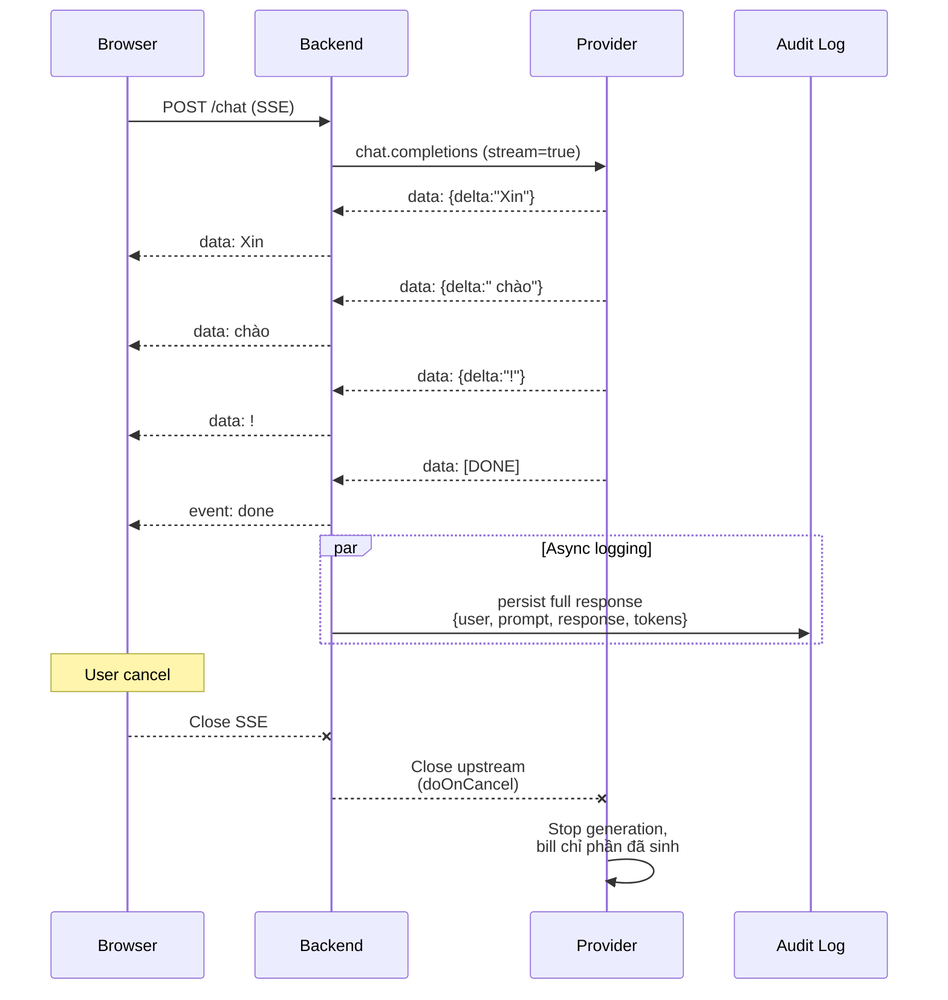

# Xử lý Response Streaming từ LLM

## ⚡ Tóm tắt ngắn (30s)
* **Streaming** = LLM gửi response **từng token (chunk)** thay vì chờ full output. Bắt buộc cho mọi UX chat: TTFT (Time-To-First-Token) giảm từ 5-30s xuống 200ms-2s, perceived latency tốt hơn 10x.
* **Mô hình**: Provider mở **HTTP chunked transfer encoding** hoặc **SSE (Server-Sent Events)**, gửi mỗi delta JSON `{"choices":[{"delta":{"content":"hello"}}]}` cho tới khi `[DONE]`.
* **Backend cần làm**:
  1. **Pass-through stream**: nhận từ provider → forward ngay tới frontend qua SSE, KHÔNG buffer full.
  2. **Cancel propagation**: client disconnect → cancel upstream → save cost.
  3. **Error handling mid-stream**: 1 chunk bị malformed → vẫn cố tiếp tục stream.
  4. **Token counting on-the-fly**: đếm token đã sinh để guard cost/quota.
  5. **Reassemble for logging**: lưu full response sau khi stream xong (cho audit, eval).
* **Thảm họa thực chiến**: Team buffer toàn bộ response rồi mới forward → user thấy "loading 25s" → 60% bỏ. Sau khi switch sang pass-through SSE + streaming UI: bounce rate giảm xuống 8%. Cost không đổi.

---

## 🔍 Chi tiết bản chất

### 1. Streaming protocol từ provider

#### OpenAI / Anthropic format (Server-Sent Events)
```
HTTP/1.1 200 OK
Content-Type: text/event-stream

data: {"choices":[{"delta":{"content":"Xin"}}]}

data: {"choices":[{"delta":{"content":" chào"}}]}

data: {"choices":[{"delta":{"content":"!"}}]}

data: [DONE]
```

Mỗi `data:` line là 1 JSON delta. Backend parse từng line.

### 2. Pass-through architecture

```
[Browser] --SSE--> [Backend] --SSE--> [Provider]
   ↑                    ↑                    ↑
   │                    │                    │ generates token-by-token
   │                    │ Forward chunk-by-chunk (no buffer)
   │ Display incrementally
```

Senior CỰC LỰC tránh:
```
[Browser] --HTTP--> [Backend] --SSE--> [Provider]
                       ↑
                       │ buffer ENTIRE response
                       │ Then return as single JSON
```

Vì làm vậy mất hết lợi ích streaming.

### 3. Khi nào KHÔNG stream

* **Output structured JSON** cần parse → khó parse partial JSON. Sync OK.
* **Output < 100 token**: TTFT difference không đáng kể.
* **Batch background job**: không có user UI → không cần TTFT.
* **Tool calling tự động**: agent loop cần full response để decide tiếp.

### 4. WebSocket vs SSE

| Khía cạnh | SSE | WebSocket |
| :--- | :--- | :--- |
| Direction | 1 chiều server→client | 2 chiều |
| Protocol | HTTP standard | Upgrade từ HTTP |
| Reconnect | Tự động (Last-Event-ID) | Tự code |
| Browser support | Native | Native |
| Proxy support | HTTP friendly | Có thể bị firewall block |
| Khi dùng | Chat streaming 1-way | Cần bidirectional realtime |

**LLM streaming = SSE 99% case**. WebSocket overkill.

### 5. Logging full response sau stream

Stream giải quyết UX, nhưng cần lưu full response để audit. Pattern:
1. Stream chunks → tee vào 2 destination: frontend + buffer in-memory.
2. Khi stream complete → flush buffer → log + DB.
3. Nếu stream bị cancel → log partial + flag "cancelled".

---

## 🎨 Sơ đồ trực quan



---

## 💻 Code thực chiến

### 1. Spring WebFlux — Full pass-through streaming

```java
package com.example.ai.stream;

import com.fasterxml.jackson.databind.ObjectMapper;
import org.springframework.http.MediaType;
import org.springframework.http.codec.ServerSentEvent;
import org.springframework.web.bind.annotation.*;
import org.springframework.web.reactive.function.client.WebClient;
import reactor.core.publisher.Flux;
import reactor.core.publisher.Mono;

import java.time.Duration;
import java.util.concurrent.atomic.AtomicInteger;
import java.util.concurrent.atomic.AtomicReference;

@RestController
@RequestMapping("/api/ai")
public class StreamingController {

    private final WebClient openai;
    private final AuditService audit;
    private final ObjectMapper mapper = new ObjectMapper();

    public StreamingController(WebClient w, AuditService a) {
        this.openai = w; this.audit = a;
    }

    @PostMapping(value = "/chat/stream", produces = MediaType.TEXT_EVENT_STREAM_VALUE)
    public Flux<ServerSentEvent<String>> stream(@RequestBody ChatReq body,
                                                @RequestHeader("X-User-Id") String userId) {
        AtomicReference<StringBuilder> buffer = new AtomicReference<>(new StringBuilder());
        AtomicInteger outputTokens = new AtomicInteger();

        return openai.post()
            .uri("/chat/completions")
            .bodyValue(buildPayload(body, true))  // stream=true
            .accept(MediaType.TEXT_EVENT_STREAM)
            .retrieve()
            .bodyToFlux(String.class)
            .takeUntil("[DONE]"::equals)
            .map(this::parseDelta)
            .filter(s -> s != null && !s.isEmpty())
            .doOnNext(chunk -> {
                buffer.get().append(chunk);
                outputTokens.incrementAndGet();
            })
            .map(content -> ServerSentEvent.<String>builder()
                .event("token")
                .data(content)
                .build())
            .concatWith(Flux.just(ServerSentEvent.<String>builder()
                .event("done").data("").build()))
            // Chunk-level timeout: 30s không có chunk → coi như provider stuck
            .timeout(Duration.ofSeconds(30))
            // Cancel propagation: client disconnect → đóng upstream
            .doOnCancel(() -> log.info("user_id={} stream cancelled (user disconnect)", userId))
            // Log full response sau khi xong (success hoặc error)
            .doOnTerminate(() -> audit.recordResponse(userId, body.prompt(),
                                                     buffer.get().toString(),
                                                     outputTokens.get()));
    }

    private String parseDelta(String json) {
        try {
            var node = mapper.readTree(json);
            return node.at("/choices/0/delta/content").asText("");
        } catch (Exception e) {
            // Malformed chunk → log + skip
            log.warn("parse delta failed: {}", json);
            return null;
        }
    }

    private Object buildPayload(ChatReq body, boolean stream) { return null; }

    record ChatReq(String prompt) {}
    private static final org.slf4j.Logger log = org.slf4j.LoggerFactory.getLogger(StreamingController.class);
}
```

### 2. Frontend — Đọc SSE từ browser

```javascript
async function streamChat(prompt) {
  const resp = await fetch("/api/ai/chat/stream", {
    method: "POST",
    headers: {"Content-Type":"application/json"},
    body: JSON.stringify({prompt}),
  });

  const reader = resp.body.getReader();
  const decoder = new TextDecoder();
  let buffer = "";
  const messageEl = document.getElementById("message");
  messageEl.textContent = "";

  try {
    while (true) {
      const {done, value} = await reader.read();
      if (done) break;
      buffer += decoder.decode(value, {stream: true});
      const lines = buffer.split("\n");
      buffer = lines.pop(); // last partial line

      for (const line of lines) {
        if (line.startsWith("data:")) {
          messageEl.textContent += line.slice(5).trim();
        } else if (line.startsWith("event:done")) {
          return; // hoàn thành
        }
      }
    }
  } catch (e) {
    console.error("Stream error:", e);
  }
}
```

### 3. Spring AI ChatClient — Đơn giản hơn

```java
package com.example.ai.simple;

import org.springframework.ai.chat.client.ChatClient;
import org.springframework.http.MediaType;
import org.springframework.stereotype.Service;
import org.springframework.web.bind.annotation.*;
import reactor.core.publisher.Flux;

@RestController
public class SimpleStreamController {
    private final ChatClient chat;

    public SimpleStreamController(ChatClient.Builder b) { this.chat = b.build(); }

    @GetMapping(value = "/ai/simple", produces = MediaType.TEXT_EVENT_STREAM_VALUE)
    public Flux<String> simple(@RequestParam String q) {
        // Spring AI tự handle parse delta + map sang Flux<String>
        return chat.prompt().user(q).stream().content();
    }
}
```

---

## 📊 Bảng so sánh implementation streaming

| Approach | Pros | Cons | Khi dùng |
| :--- | :--- | :--- | :--- |
| **Sync (block until done)** | Đơn giản | UX chậm, perceived latency cao | Output ngắn, structured JSON |
| **SSE pass-through** | UX tốt, HTTP standard | Server cần WebFlux | Chat UI (default) |
| **WebSocket bidirectional** | Bi-directional | Overkill cho 1-way | Multi-user collab |
| **Chunked HTTP** | Native HTTP/1.1 | Frontend parsing thủ công | Legacy client |
| **gRPC server streaming** | Type-safe, efficient | Browser cần grpc-web | Internal service |

---

## ⚠️ Common Gotchas & Questions follow-up

### 1. Cạm bẫy: Buffer toàn bộ response
* **Vấn đề**: Backend chờ stream xong → return full string → UX không khác sync.
* **Giải pháp**: `Flux<String>` forward từng emit. Test: TTFT phải < 2s.

### 2. Cạm bẫy: Quên cancel propagation
* **Vấn đề**: User đóng tab → frontend đóng SSE. Backend Flux không cancel upstream → provider vẫn generate → cost lãng phí.
* **Giải pháp**: `.doOnCancel()` để log + Flux tự propagate cancel xuống WebClient. Verify bằng test.

### 3. Cạm bẫy: Nginx/ALB buffering
* **Vấn đề**: Proxy mặc định buffer response → chunks bị gom lại → user vẫn thấy "loading lâu".
* **Giải pháp**: 
  1. Nginx: `proxy_buffering off` cho endpoint streaming.
  2. AWS ALB: switch sang ALB target type IP với HTTP/2 + auto-streaming.
  3. CloudFront: tắt buffer for SSE path.

### 4. Cạm bẫy: Malformed chunk crash whole stream
* **Vấn đề**: 1 chunk JSON malformed → exception → stream chết.
* **Giải pháp**: 
  1. Try/catch trong parser → skip chunk lỗi.
  2. Log để debug, không kill stream.
  3. Recover gracefully: nếu lỗi liên tục → send error event tới client.

### 5. Cạm bẫy: Structured output với stream
* **Vấn đề**: Yêu cầu output JSON cứng, stream từng token → JSON partial không parse được.
* **Giải pháp**: 
  1. Dùng sync (non-stream) cho JSON output.
  2. Hoặc dùng provider's structured output mode + stream parser library (e.g. `jsonparse` của OpenAI examples).
  3. Hoặc stream text + parse cuối → user thấy text nhưng backend parse khi DONE.

### 6. Câu hỏi đào sâu từ interviewer
* **Interviewer: "Stream 5 phút bị cut giữa chừng (network). Frontend xử lý thế nào?"**
* **Trả lời Senior**:
  1. **Detect cut**: `reader.read()` throw error hoặc done=true sớm.
  2. **Save partial**: state of UI có chunks đã nhận.
  3. **Retry option**: hiển thị nút "Tiếp tục" cho user. KHÔNG tự retry vì sẽ regenerate từ đầu (tốn token).
  4. **Provider-side**: nếu provider không có "continuation API" → retry = trả lời lại từ đầu, có thể khác lần trước.
  5. **Workaround**: backend lưu chunks vào Redis với `request_id`. Client reconnect với `Last-Event-ID` (SSE feature) → backend resume nếu còn data. Nhưng chỉ resume CHỖ ĐÃ STREAM, không continue generation từ provider.
  6. **Best practice**: cho phép user paste prompt tiếp theo nói "tiếp tục" để LLM tự continue logically.
