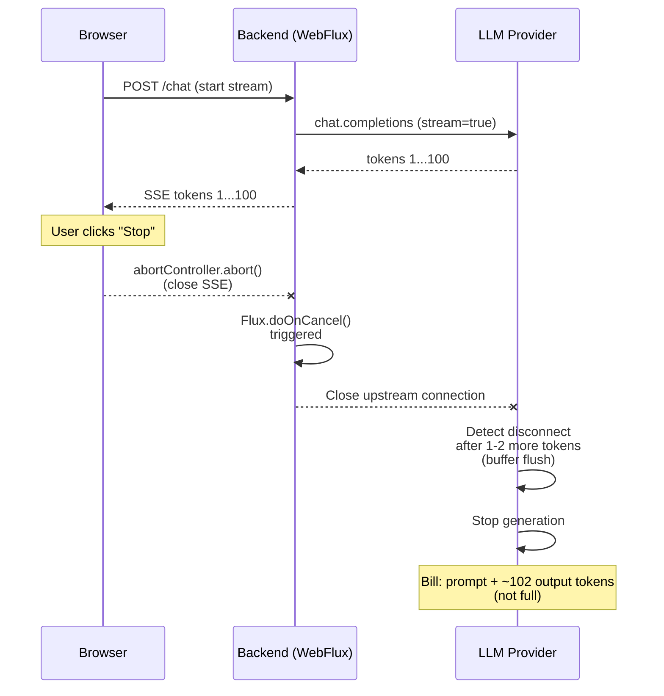

# Cancel một Request LLM đang chạy

## ⚡ Tóm tắt ngắn (30s)
* **Vì sao cần cancel**: LLM call có thể chạy 5-30s. Trong khoảng đó, user có thể: (a) đóng tab/disconnect, (b) đổi câu hỏi, (c) timeout. Nếu KHÔNG cancel → provider vẫn generate full output → bill cost cho data user không bao giờ thấy.
* **Cancel KHÔNG miễn phí về cost**: token đã sinh (đến lúc cancel) VẪN BỊ TÍNH TIỀN. Cancel sớm = cứu phần lớn cost, không phải tất cả. OpenAI/Anthropic bill prompt_tokens + đã-sinh-output_tokens.
* **Quy tắc Senior 3 tầng cancel**:
  1. **Client-side**: `AbortController` (JS), `fetch` cancel, SSE close.
  2. **Backend**: Flux/reactive `doOnCancel` propagate; thread interrupt; HTTP connection close.
  3. **Provider**: đóng HTTP connection từ phía mình → provider thấy disconnect → stop generation.
* **Thảm họa thực chiến**: Team set timeout 30s nhưng không cancel propagate. User cancel 10s, backend trả 200 sau 30s (vẫn chạy đến hết). Cost = full output token. Một ngày 50k cancel × $0.02 = $1000 cost lãng phí. Senior fix: WebClient + Reactor doOnCancel → cost giảm 60% cho cancelled request.

---

## 🔍 Chi tiết bản chất

### 1. Mô hình cancel propagation

```
[Browser]
   ↓ user click "Stop" hoặc đóng tab
   ↓ JS: abortController.abort()
[HTTP Connection user→backend]
   ↓ Connection closed (SSE / fetch abort)
[Backend WebFlux]
   ↓ Flux/Mono detect cancel
   ↓ doOnCancel handler runs
   ↓ Cancel propagate xuống WebClient
[HTTP Connection backend→provider]
   ↓ Connection closed
[LLM Provider]
   ↓ Detect disconnect
   ↓ Stop generation (sau 1-2 token)
   ↓ Bill cost cho prompt + đã-sinh output
```

Mỗi bước phải hoạt động đúng để cancel có hiệu lực.

### 2. Cost gốc của cancel

OpenAI/Anthropic policy:
* Prompt tokens: **luôn bị tính** (provider đã encode).
* Output tokens: **chỉ tính phần đã sinh** tại thời điểm disconnect.

Ví dụ: prompt 1000 token, output dự kiến 2000 token, user cancel sau 500 output token đã sinh:
* Bill: 1000 input + 500 output = đầy đủ cho 1500 token, không phải 3000.

→ Cancel cứu được output cost sau điểm cancel. Tiết kiệm 75% trong ví dụ trên.

### 3. Threading & cancel

Sync (blocking) HTTP client (RestTemplate, OkHttp default):
* Thread bị block waiting for response → cancel khó (cần thread interrupt + custom HTTP client).

Async/reactive (WebClient, Reactor Netty):
* Có thread switching tự nhiên. Cancel = ngắt subscription → free resource ngay.

**Quy tắc Senior**: cho LLM call → dùng **reactive ngay từ đầu** vì cancel + concurrency + streaming đều support tự nhiên.

### 4. Provider-side support

* **OpenAI**: HTTP-level cancel hoạt động. Disconnect = stop.
* **Anthropic**: Tương tự.
* **Bedrock**: tương tự cho streaming. Sync invoke có thể không cancel được mid-flight (đã queued vào model).
* **Self-host (vLLM)**: hỗ trợ cancel qua HTTP disconnect và `request_id` API.

---

## 🎨 Sơ đồ trực quan



---

## 💻 Code thực chiến

### 1. Spring WebFlux — Cancel propagation hoàn chỉnh

```java
package com.example.ai.cancel;

import org.springframework.http.MediaType;
import org.springframework.stereotype.Service;
import org.springframework.web.bind.annotation.*;
import org.springframework.web.reactive.function.client.WebClient;
import reactor.core.publisher.Flux;

import java.time.Duration;
import java.util.UUID;
import java.util.concurrent.atomic.AtomicInteger;

@RestController
public class CancellableChatController {

    private final WebClient openai;
    private final AuditService audit;

    public CancellableChatController(WebClient w, AuditService a) {
        this.openai = w; this.audit = a;
    }

    @PostMapping(value = "/api/ai/chat", produces = MediaType.TEXT_EVENT_STREAM_VALUE)
    public Flux<String> chat(@RequestBody ChatReq body) {
        String requestId = UUID.randomUUID().toString();
        AtomicInteger tokensEmitted = new AtomicInteger();
        long start = System.currentTimeMillis();

        return openai.post()
            .uri("/chat/completions")
            .bodyValue(buildStreamPayload(body))
            .retrieve()
            .bodyToFlux(String.class)
            .takeUntil("[DONE]"::equals)
            .map(this::parseContent)
            .doOnNext(c -> tokensEmitted.incrementAndGet())
            // KEY: cancel propagation
            .doOnCancel(() -> {
                long elapsed = System.currentTimeMillis() - start;
                int tokens = tokensEmitted.get();
                log.info("request_id={} CANCELLED after {}ms, {} tokens generated",
                         requestId, elapsed, tokens);
                audit.recordCancelled(requestId, tokens, elapsed);
            })
            // Cleanup khi error (network drop) hoặc complete
            .doFinally(signal ->
                log.info("request_id={} final signal={}", requestId, signal))
            // Total stream cap 5 phút (defense)
            .take(Duration.ofMinutes(5));
    }

    private String parseContent(String sseData) { /* parse delta JSON */ return ""; }
    private Object buildStreamPayload(ChatReq body) { return null; }
    record ChatReq(String prompt) {}

    private static final org.slf4j.Logger log =
        org.slf4j.LoggerFactory.getLogger(CancellableChatController.class);
}
```

### 2. Frontend — AbortController + SSE cancel

```javascript
class CancellableChatClient {
  constructor() {
    this.currentController = null;
  }

  async startChat(prompt, onChunk) {
    // Cancel previous request if any
    this.cancel();
    
    this.currentController = new AbortController();
    
    try {
      const resp = await fetch("/api/ai/chat", {
        method: "POST",
        headers: {"Content-Type":"application/json"},
        body: JSON.stringify({prompt}),
        signal: this.currentController.signal,  // KEY: pass abort signal
      });

      const reader = resp.body.getReader();
      const decoder = new TextDecoder();
      
      while (true) {
        const {done, value} = await reader.read();
        if (done) break;
        onChunk(decoder.decode(value));
      }
    } catch (e) {
      if (e.name === "AbortError") {
        console.log("User cancelled");
      } else {
        throw e;
      }
    } finally {
      this.currentController = null;
    }
  }

  cancel() {
    if (this.currentController) {
      this.currentController.abort();
      console.log("Cancelling current request...");
    }
  }
}

// Usage:
const client = new CancellableChatClient();
document.getElementById("send").onclick = () =>
  client.startChat(input.value, (chunk) => display.append(chunk));
document.getElementById("stop").onclick = () => client.cancel();
```

### 3. Python OpenAI SDK — Cancel với async + signal

```python
import asyncio
from openai import AsyncOpenAI

client = AsyncOpenAI()

async def cancellable_chat(prompt: str):
    stream = await client.chat.completions.create(
        model="gpt-4o-mini",
        messages=[{"role":"user","content":prompt}],
        stream=True,
    )
    
    try:
        async for chunk in stream:
            content = chunk.choices[0].delta.content
            if content:
                print(content, end="", flush=True)
    except asyncio.CancelledError:
        # Task được cancel → đóng stream để stop provider
        await stream.close()  # KEY: provider-side cancel
        print("\n[Cancelled by user]")
        raise

async def main():
    task = asyncio.create_task(cancellable_chat("Hãy viết một bài essay 5000 từ về AI"))
    
    # Cancel sau 2 giây
    await asyncio.sleep(2)
    task.cancel()
    
    try:
        await task
    except asyncio.CancelledError:
        pass

asyncio.run(main())
```

### 4. Provider-side cancel với explicit request_id (self-host vLLM)

```python
import httpx

# vLLM hỗ trợ cancel qua API endpoint riêng
async def cancel_request(request_id: str):
    async with httpx.AsyncClient() as client:
        await client.post(
            f"http://vllm.internal:8000/v1/cancel/{request_id}"
        )

# OpenAI/Anthropic: cancel = đóng HTTP connection, không có explicit cancel API
```

---

## 📊 Bảng so sánh strategy cancel

| Strategy | Pros | Cons | Khi dùng |
| :--- | :--- | :--- | :--- |
| **HTTP disconnect** | Universal (mọi provider) | Có lag 1-2 token | Default |
| **Explicit cancel API** | Cancel ngay lập tức | Phụ thuộc provider | Self-host (vLLM, TGI) |
| **Timeout cứng** | Đơn giản | Không user-driven | Bg job, no user UI |
| **No cancel** | Zero code | Cost lãng phí | Test/POC only |

---

## ⚠️ Common Gotchas & Questions follow-up

### 1. Cạm bẫy: RestTemplate / blocking client
* **Vấn đề**: Blocking I/O thread → khó cancel mid-flight. Thread interrupt cũng không close socket → provider vẫn chạy.
* **Giải pháp**: Dùng WebClient/Reactor cho mọi LLM call.

### 2. Cạm bẫy: ALB / reverse proxy buffering
* **Vấn đề**: Backend đã cancel + đóng connection. Nhưng ALB/Nginx vẫn nắm connection upstream → vẫn chạy. Cancel không tới provider.
* **Giải pháp**: 
  1. Direct connection từ backend → provider (qua VPC endpoint hoặc direct), không qua proxy nội bộ buffer.
  2. Hoặc dùng provider managed endpoint trong same VPC (AWS Bedrock).

### 3. Cạm bẫy: Forget log cancelled requests
* **Vấn đề**: Cancel xảy ra → không log → không biết tỷ lệ cancel.
* **Giải pháp**: Metric `llm.cancel.rate`. Cancel rate > 30% = UI quá chậm hoặc câu trả lời không relevant → cần fix.

### 4. Cạm bẫy: Cancel race với complete
* **Vấn đề**: User cancel ngay lúc response complete → Flux đã emit DONE → doOnCancel không trigger. Log sai số liệu.
* **Giải pháp**: 
  1. `doOnTerminate` trigger cho cả success + cancel + error.
  2. Phân biệt bằng `doFinally(signal)` — signal = COMPLETE / CANCEL / ERROR.

### 5. Câu hỏi đào sâu từ interviewer
* **Interviewer: "Khi user gửi câu hỏi mới mà câu hỏi cũ chưa xong, bạn xử lý thế nào?"**
* **Trả lời Senior**:
  1. **Frontend**: cancel request cũ trước khi gửi mới. Pattern "last-write-wins".
  2. **Backend**: tracking active request per user (Redis), khi nhận request mới → cancel active của user đó qua signal (e.g. Redis pub/sub).
  3. **UI feedback**: show indicator "Đang cancel..." để user biết.
  4. **Audit trail**: log cả cancelled + new request để debug.
  5. **Edge case race**: nếu provider đã trả full response trước khi cancel reach → still display nhưng warn "Đã có câu trả lời mới".
  6. **Cost optimization**: nếu nhiều cancel/user/min → throttle, hoặc warn user "Bạn đang gửi quá nhanh, đợi response trước khi đổi".
