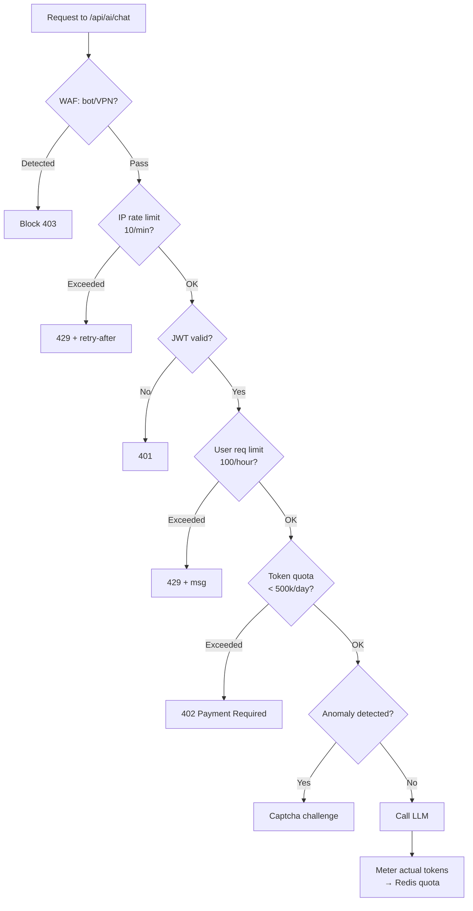

# Giới hạn User không Spam AI Endpoint

## ⚡ Tóm tắt ngắn (30s)
* **Spam AI endpoint** = thảm họa cost: 1 user vô tình hoặc cố ý gửi 1000 req/phút × $0.02/req = $20/phút = $28k/ngày. Bot scraping còn tệ hơn.
* **Defense-in-depth 5 tầng**:
  1. **WAF / API Gateway**: chặn bot, IP từ datacenter/VPN, geo-block.
  2. **IP rate limit**: Sliding window 10-30 req/phút/IP.
  3. **User rate limit**: 60-200 req/giờ/user (JWT-based).
  4. **Token quota**: cost-based limit, không phải req-based. 100k token/ngày/user free tier.
  5. **Anomaly detection**: alert + auto-block khi pattern bất thường.
* **Quan trọng nhất**: cost-based quota, KHÔNG req-based. Vì 1 request 50k token vs 1 request 50 token có cost x1000 khác nhau.
* **Thảm họa thực chiến**: Team set "100 req/giờ/user". 1 paid user dùng prompt 50k token + max_tokens 4000 → mỗi request $0.30. 100 req × $0.30 = $30/giờ. User dùng đúng quota nhưng app cháy $20k/tháng từ 30 power user. Senior chuyển sang token quota: 500k token/ngày/user → cap đúng cost.

---

## 🔍 Chi tiết kiến trúc

### 1. Tổng quan defense-in-depth

```
[Bot Scanner / Spammer]
       │
       ▼
[Tầng 1: WAF/CDN]                     ← Block scanner, geo, datacenter IP
       │
       ▼
[Tầng 2: API Gateway]                 ← Token bucket per IP (10/min)
       │
       ▼
[Tầng 3: JWT Auth]                    ← Require login
       │
       ▼
[Tầng 4: Backend Rate Limit]          ← Per-user req/hr (Redis sliding window)
       │
       ▼
[Tầng 5: Token Quota]                 ← Per-user token/day (cost-based)
       │
       ▼
[Tầng 6: Anomaly Detection]           ← Auto-block khi pattern bất thường
       │
       ▼
[LLM Provider]
```

### 2. Tại sao token quota > req quota

| Scenario | Req quota = 100/giờ | Token quota = 500k/ngày |
| :--- | :--- | :--- |
| 1 user gửi 100 short prompt 50 token | ✓ allowed | ~50 × 100 = 5k token, OK |
| 1 user gửi 100 prompt 5000 token max_tokens 4000 | ✓ allowed (NHƯNG cost $30) | block ở token thứ 500k |
| Burst 10 prompt/phút | ✗ block sớm | ✓ allowed nếu cost thấp |

→ Token quota align với **cost thực**, đảm bảo predictable spending.

### 3. Algorithm: Sliding Window vs Token Bucket

**Sliding window log (Redis sorted set)**:
* Lưu timestamp mọi request gần đây trong sorted set.
* Khi check: ZREMRANGEBYSCORE xóa cũ, ZCARD đếm hiện tại.
* Chính xác cao, nhưng tốn RAM (mỗi event 1 entry).

**Token bucket (Redis Lua script)**:
* Refill tokens với rate cố định.
* Mỗi request consume tokens.
* Burst-friendly: cho phép spike ngắn.
* Tốn RAM ít.

**Quy tắc**: API critical (login, payment) → sliding window log. AI endpoint với cost-based → token bucket với "token" = LLM token thật.

### 4. Anomaly detection cho AI endpoint

Signals:
* Token/min của 1 user vượt baseline 5x.
* Cùng prompt template + thay đổi 1 param → scraping.
* IP cluster với user agent giống nhau.
* Embedding của prompt tương tự nhau cực kỳ cao → bot.

Action:
* Soft: thêm captcha cho session.
* Hard: temporary ban 1 giờ → page on-call review.

---

## 🎨 Sơ đồ trực quan



---

## 💻 Code thực chiến

### 1. Sliding window rate limit (Redis Lua atomic)

```lua
-- /resources/scripts/sliding_window.lua
local key = KEYS[1]
local now = tonumber(ARGV[1])
local window = tonumber(ARGV[2])   -- ms
local limit = tonumber(ARGV[3])

local clearBefore = now - window
redis.call('ZREMRANGEBYSCORE', key, 0, clearBefore)

local count = redis.call('ZCARD', key)
if count < limit then
  redis.call('ZADD', key, now, now .. ':' .. math.random())
  redis.call('PEXPIRE', key, window)
  return {1, count + 1}
end
return {0, count}
```

```java
package com.example.ai.ratelimit;

import org.springframework.core.io.ClassPathResource;
import org.springframework.data.redis.core.StringRedisTemplate;
import org.springframework.data.redis.core.script.DefaultRedisScript;
import org.springframework.scripting.support.ResourceScriptSource;
import org.springframework.stereotype.Service;
import java.time.Instant;
import java.util.Collections;
import java.util.List;

@Service
public class SlidingWindowRateLimiter {
    private final StringRedisTemplate redis;
    private final DefaultRedisScript<List> script;

    public SlidingWindowRateLimiter(StringRedisTemplate r) {
        this.redis = r;
        this.script = new DefaultRedisScript<>();
        this.script.setResultType(List.class);
        this.script.setScriptSource(new ResourceScriptSource(
            new ClassPathResource("scripts/sliding_window.lua")));
    }

    public boolean allow(String identifier, int limit, long windowMs) {
        @SuppressWarnings("unchecked")
        List<Long> result = redis.execute(script,
            Collections.singletonList("rl:" + identifier),
            String.valueOf(Instant.now().toEpochMilli()),
            String.valueOf(windowMs),
            String.valueOf(limit));
        return result.get(0) == 1L;
    }
}
```

### 2. Token quota — Cost-based

```java
package com.example.ai.quota;

import org.springframework.data.redis.core.StringRedisTemplate;
import org.springframework.stereotype.Service;
import java.time.Duration;
import java.time.LocalDate;

@Service
public class TokenQuotaService {
    private final StringRedisTemplate redis;

    // Quota theo tier
    private static final long FREE_TIER_TOKENS_PER_DAY = 100_000;
    private static final long PRO_TIER_TOKENS_PER_DAY = 1_000_000;

    public TokenQuotaService(StringRedisTemplate r) { this.redis = r; }

    public boolean reserve(String userId, int estimatedTokens, String tier) {
        long limit = "pro".equals(tier) ? PRO_TIER_TOKENS_PER_DAY : FREE_TIER_TOKENS_PER_DAY;
        String key = "quota:tokens:" + userId + ":" + LocalDate.now();

        Long current = redis.opsForValue().increment(key, estimatedTokens);
        if (current == estimatedTokens) {
            // First today → set TTL
            redis.expire(key, Duration.ofDays(2));
        }
        return current != null && current <= limit;
    }

    /** Reconcile: sau khi LLM trả về, adjust theo actual token */
    public void reconcile(String userId, int estimatedTokens, int actualTokens) {
        String key = "quota:tokens:" + userId + ":" + LocalDate.now();
        long delta = actualTokens - estimatedTokens;
        if (delta != 0) {
            redis.opsForValue().increment(key, delta);
        }
    }
}
```

### 3. Pre-LLM filter chain

```java
package com.example.ai.controller;

import org.springframework.http.MediaType;
import org.springframework.web.bind.annotation.*;
import org.springframework.web.server.ResponseStatusException;
import org.springframework.http.HttpStatus;
import reactor.core.publisher.Flux;

@RestController
public class GuardedChatController {

    private final SlidingWindowRateLimiter ipLimiter;
    private final SlidingWindowRateLimiter userLimiter;
    private final TokenQuotaService quota;
    private final TokenCounter counter;
    private final LlmService llm;

    @PostMapping(value = "/api/ai/chat", produces = MediaType.TEXT_EVENT_STREAM_VALUE)
    public Flux<String> chat(@AuthenticationPrincipal Jwt jwt,
                              @RequestHeader("X-Real-IP") String ip,
                              @RequestBody ChatReq body) {

        // Tầng 2: IP rate limit (10/min)
        if (!ipLimiter.allow("ip:" + ip, 10, 60_000)) {
            throw new ResponseStatusException(HttpStatus.TOO_MANY_REQUESTS,
                "Quá nhiều request từ IP này");
        }

        String userId = jwt.getSubject();
        String tier = jwt.getClaimAsString("tier");

        // Tầng 4: User rate limit (100/hour)
        int userLimit = "pro".equals(tier) ? 500 : 100;
        if (!userLimiter.allow("user:" + userId, userLimit, 3_600_000)) {
            throw new ResponseStatusException(HttpStatus.TOO_MANY_REQUESTS,
                "Vượt quota request/giờ");
        }

        // Tầng 5: Token quota (cost-based)
        int estTokens = counter.estimate(body.prompt(), body.maxTokens());
        if (!quota.reserve(userId, estTokens, tier)) {
            throw new ResponseStatusException(HttpStatus.PAYMENT_REQUIRED,
                "Vượt quota token/ngày. Upgrade plan để tiếp tục.");
        }

        return llm.stream(body.prompt())
            .doOnComplete(() -> quota.reconcile(userId, estTokens, /*actual*/ 0));
    }

    record ChatReq(String prompt, int maxTokens) {}
}
```

### 4. Anomaly detection — Simple version

```python
import redis
r = redis.Redis()

def is_anomaly(user_id: str, current_tokens: int) -> bool:
    """Detect 5x baseline usage in past 5 min."""
    key = f"anomaly:tokens:{user_id}"
    # Sliding window of recent 5-min usage
    r.zadd(key, {f"{current_tokens}:{r.time()[0]}": r.time()[0]})
    r.zremrangebyscore(key, 0, r.time()[0] - 300)
    r.expire(key, 600)
    
    recent_values = r.zrange(key, 0, -1)
    total = sum(int(v.decode().split(":")[0]) for v in recent_values)
    
    baseline = int(r.get(f"baseline:tokens:{user_id}") or 1000)  # 1k/5min default
    if total > baseline * 5:
        return True
    return False
```

---

## 📊 Bảng quy tắc rate limit

| Tier | IP/phút | User/giờ | Token/ngày | $/ngày max |
| :---: | :---: | :---: | :---: | :---: |
| Anonymous | 5 | - (cần login) | 0 | $0 |
| Free | 20 | 100 | 100k | ~$0.20 |
| Pro | 30 | 500 | 1M | ~$2 |
| Enterprise | 100 | 5000 | 20M | ~$40 |
| Internal | 1000 | unlimited | unlimited | tracked |

---

## ⚠️ Common Gotchas & Questions follow-up

### 1. Cạm bẫy: Rate limit chỉ ở backend, miss API Gateway
* **Vấn đề**: Backend rate limit hiệu quả khi request reach backend. Nhưng request đã tốn TLS handshake + auth → CPU cao khi bị spam.
* **Giải pháp**: Tầng đầu ở API Gateway/WAF (Cloudflare, AWS WAF) chặn TRƯỚC khi request reach backend.

### 2. Cạm bẫy: Block bằng user_id thiếu IP
* **Vấn đề**: Chỉ rate limit theo user_id → attacker tạo nhiều account. Hoặc user_id giả qua JWT forging (nếu auth yếu).
* **Giải pháp**: Combo both: IP + user_id. Bot phải vừa tạo nhiều account vừa rotate IP → cost cao cho attacker.

### 3. Cạm bẫy: Quota reset 0h UTC vs local
* **Vấn đề**: User ở Việt Nam (UTC+7) thấy quota reset lúc 7AM thay vì midnight → khó hiểu.
* **Giải pháp**: 
  1. Document rõ "Quota reset hàng ngày 00:00 UTC".
  2. Hoặc rolling 24h window thay vì reset cứng.

### 4. Cạm bẫy: Pre-estimate token sai
* **Vấn đề**: Estimate trước = 500 token nhưng actual = 2000 → user vượt quota mà không biết.
* **Giải pháp**: 
  1. Reserve theo upper bound (max_tokens × safety).
  2. Reconcile sau khi LLM trả về.
  3. Nếu reconcile khiến vượt → giảm credit cho ngày sau hoặc block immediate.

### 5. Câu hỏi đào sâu từ interviewer
* **Interviewer: "User báo bị rate limit nhưng họ chỉ gửi vài request. Bạn debug thế nào?"**
* **Trả lời Senior**:
  1. **Log mọi rate limit decision**: include `userId, ipId, currentCount, limit, windowSize`. Tìm log để xem nguyên do thực sự.
  2. **Phân biệt rate-limit types**: IP vs user vs token quota. User thấy "rate limit" nhưng có thể là token quota.
  3. **Bug share IP**: nhiều user behind NAT (corp VPN) cùng IP → 1 person spam ảnh hưởng cả nhóm. Mitigate: ưu tiên user_id rate limit hơn IP rate limit cho authenticated user.
  4. **Bug Redis key**: race condition / TTL sai → counter không reset. Verify với `redis-cli TTL key`.
  5. **Token estimate sai**: nếu reserve token quá cao → false positive quota exceeded. Test với chính prompt user.
  6. **Comm**: cho user một dashboard tự xem quota usage. Transparency giảm support load.
