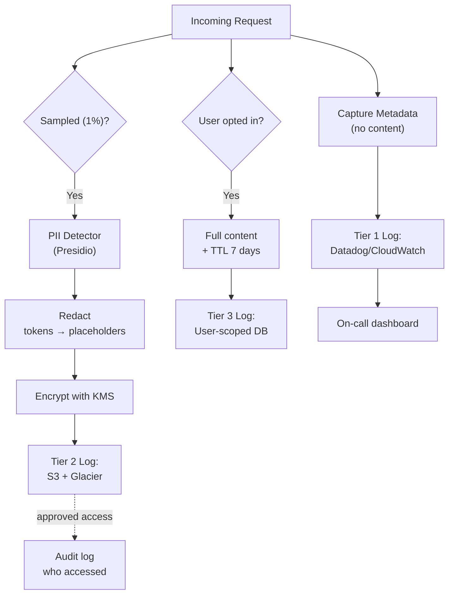

# Log Request/Response AI mà không Lộ Dữ Liệu Nhạy Cảm

## ⚡ Tóm tắt ngắn (30s)
* **AI log là tài sản double-edge**: cần để debug, eval, regression test — nhưng chứa PII (tên, email, SSN), secret (API key user paste), tài liệu bí mật của user/khách hàng. Log không cẩn thận = vi phạm GDPR/CCPA + nguy cơ lộ qua engineer access.
* **5 nguyên tắc Senior**:
  1. **Redact at source**: PII bị mask TRƯỚC khi vào log system. Không phải "log raw rồi sau này lọc".
  2. **Tiered logging**: 
     * **Tier 1** (real-time, all requests): metadata only — không có content.
     * **Tier 2** (sampled 1%, encrypted): content đầy đủ cho debug.
     * **Tier 3** (opt-in user, encrypted, TTL 7 ngày): full với user consent.
  3. **Encryption at rest**: log encrypted với KMS key. Access có audit.
  4. **PII detector**: AWS Comprehend / Microsoft Presidio / Google DLP detect + redact PII tự động.
  5. **Retention policy**: log < 90 ngày auto-delete. Long-term aggregate only.
* **Thảm họa thực chiến**: Team log full prompt + response vào Datadog. 6 tháng sau auditor phát hiện log chứa email cá nhân + SSN. GDPR fine $100k + reputation. Senior fix: implement Presidio detect 18 entity types + mask + re-process toàn bộ log cũ.

---

## 🔍 Chi tiết kiến trúc

### 1. Tiered Logging Strategy

```
┌─────────────────────────────────────────────────┐
│ TIER 1: Always-on Metadata (100% requests)      │
│   - request_id, user_id (hashed), timestamp     │
│   - provider, model, prompt_tokens, output_toks │
│   - latency, cost_usd, error_code               │
│   - DOES NOT contain prompt/response content    │
└─────────────────────────────────────────────────┘
        │
┌─────────────────────────────────────────────────┐
│ TIER 2: Sampled Content (1% requests)           │
│   - All Tier 1 fields                           │
│   - Redacted prompt (PII masked)                │
│   - Redacted response                           │
│   - Encrypted at rest with KMS                  │
│   - Access logged                               │
└─────────────────────────────────────────────────┘
        │
┌─────────────────────────────────────────────────┐
│ TIER 3: User-consented Debug (opt-in)           │
│   - Full prompt + response                      │
│   - TTL 7 days                                  │
│   - User can delete anytime                     │
└─────────────────────────────────────────────────┘
```

### 2. PII Detection & Redaction

**Entities cần mask** (NIST/GDPR baseline):
* Email, phone, SSN/CMND, credit card, IBAN
* Address, ZIP, city
* Name (PERSON entity)
* IP address, URL có user info
* Dates of birth, age
* Medical record number, diagnosis code

**Tools**:
* **Microsoft Presidio** (open-source): 30+ entity recognizers + custom regex.
* **AWS Comprehend**: managed, 14 PII categories, paid per char.
* **Google DLP**: managed, 150+ info types.
* **Regex + spaCy**: DIY cho domain-specific (e.g. employee ID).

### 3. Redaction strategies

| Strategy | Ví dụ | Khi dùng |
| :--- | :--- | :--- |
| **Replace với placeholder** | `john@x.com` → `<EMAIL>` | Default, simple |
| **Mask partial** | `4111-2222-3333-4444` → `XXXX-XXXX-XXXX-4444` | Cần partial cho debug |
| **Hash deterministic** | `john@x.com` → `sha256_abc...` | Cần đối chiếu cross-log |
| **Tokenize (FPE)** | `john@x.com` → `fake@y.com` (recoverable) | Cần restore với key |

### 4. Audit của access vào log nhạy cảm

* Mọi truy cập log Tier 2/3 phải có lý do (ticket ID).
* Access logged: who, when, what query, IP.
* Manager approve cho production log access.
* 4-eyes principle với high-sensitivity.

---

## 🎨 Sơ đồ trực quan



---

## 💻 Code thực chiến

### 1. PII Redactor với Presidio (Python service)

```python
# pii_service.py — Standalone service backend Java có thể gọi qua HTTP
from presidio_analyzer import AnalyzerEngine
from presidio_anonymizer import AnonymizerEngine
from presidio_anonymizer.entities import OperatorConfig
from fastapi import FastAPI
from pydantic import BaseModel

analyzer = AnalyzerEngine()
anonymizer = AnonymizerEngine()
app = FastAPI()

ENTITIES = ["EMAIL_ADDRESS", "PHONE_NUMBER", "PERSON", "CREDIT_CARD",
            "US_SSN", "IP_ADDRESS", "LOCATION", "DATE_TIME", "URL"]

class RedactRequest(BaseModel):
    text: str
    language: str = "en"

@app.post("/redact")
def redact(req: RedactRequest):
    results = analyzer.analyze(text=req.text, entities=ENTITIES, language=req.language)
    
    anon = anonymizer.anonymize(
        text=req.text,
        analyzer_results=results,
        operators={
            "EMAIL_ADDRESS": OperatorConfig("replace", {"new_value": "<EMAIL>"}),
            "PHONE_NUMBER": OperatorConfig("replace", {"new_value": "<PHONE>"}),
            "PERSON": OperatorConfig("replace", {"new_value": "<PERSON>"}),
            "CREDIT_CARD": OperatorConfig("mask", {"chars_to_mask": 12, "masking_char": "X", "from_end": False}),
            "US_SSN": OperatorConfig("replace", {"new_value": "<SSN>"}),
            "default": OperatorConfig("replace", {"new_value": "<PII>"}),
        }
    )
    return {"redacted": anon.text, "entities_found": len(results)}
```

### 2. Java client — Async redact + log

```java
package com.example.ai.logging;

import org.springframework.stereotype.Service;
import org.springframework.web.reactive.function.client.WebClient;
import reactor.core.publisher.Mono;
import java.security.MessageDigest;
import java.util.HexFormat;

@Service
public class AiAuditService {
    private final WebClient piiService;
    private final ThreadLocalRandom random = ThreadLocalRandom.current();
    private static final double SAMPLE_RATE = 0.01;  // 1% sampling for Tier 2

    public AiAuditService(WebClient.Builder b) {
        this.piiService = b.baseUrl("http://pii-service.internal:8000").build();
    }

    public Mono<Void> log(LlmRequest req, LlmResponse resp, long latencyMs) {
        // TIER 1: always
        logTier1(req, resp, latencyMs);

        // TIER 2: sampled
        if (random.nextDouble() < SAMPLE_RATE) {
            return redactAndLogTier2(req, resp);
        }

        // TIER 3: opt-in
        if (req.userOptedInDebugLog()) {
            return logTier3(req, resp);
        }
        return Mono.empty();
    }

    private void logTier1(LlmRequest req, LlmResponse resp, long latency) {
        log.info("ai_request_id={} user_id_hash={} provider={} model={} " +
                 "input_tokens={} output_tokens={} latency_ms={} cost_usd={}",
                req.id(), hashUserId(req.userId()),
                req.provider(), req.model(),
                resp.inputTokens(), resp.outputTokens(),
                latency, computeCost(resp));
    }

    private Mono<Void> redactAndLogTier2(LlmRequest req, LlmResponse resp) {
        return Mono.zip(
                redact(req.prompt()),
                redact(resp.text())
            )
            .doOnNext(tuple -> {
                String redactedPrompt = tuple.getT1();
                String redactedResp = tuple.getT2();
                // Encrypt với KMS, push lên S3
                s3Writer.write(req.id(), redactedPrompt, redactedResp);
            })
            .then();
    }

    private Mono<String> redact(String text) {
        return piiService.post()
            .uri("/redact")
            .bodyValue(Map.of("text", text))
            .retrieve()
            .bodyToMono(RedactResponse.class)
            .map(RedactResponse::redacted)
            .onErrorReturn("<REDACTION_FAILED>");
    }

    private String hashUserId(String userId) {
        try {
            byte[] hash = MessageDigest.getInstance("SHA-256")
                .digest((userId + "salt_v1").getBytes());
            return HexFormat.of().formatHex(hash).substring(0, 16);
        } catch (Exception e) { return "unknown"; }
    }

    record RedactResponse(String redacted, int entitiesFound) {}
    private static final org.slf4j.Logger log = org.slf4j.LoggerFactory.getLogger(AiAuditService.class);
}
```

### 3. Logback config — Auto-redact pattern

```xml
<!-- logback-spring.xml -->
<configuration>
    <appender name="JSON" class="ch.qos.logback.core.ConsoleAppender">
        <encoder class="net.logstash.logback.encoder.LogstashEncoder">
            <!-- Auto redact secret patterns trong stack trace -->
            <provider class="net.logstash.logback.composite.loggingevent.ArgumentsJsonProvider">
                <fieldNames>
                    <ignoreFieldNames>password,token,apiKey,authorization</ignoreFieldNames>
                </fieldNames>
            </provider>
        </encoder>
    </appender>

    <!-- Filter cấp message để redact API key pattern -->
    <conversionRule conversionWord="redact"
                    converterClass="com.example.logging.SecretRedactor"/>
    <appender name="CONSOLE" class="ch.qos.logback.core.ConsoleAppender">
        <encoder>
            <pattern>%date %level %logger - %redact(%msg)%n</pattern>
        </encoder>
    </appender>
</configuration>
```

```java
public class SecretRedactor extends ClassicConverter {
    private static final Pattern SECRET = Pattern.compile(
        "(?i)(api[_-]?key|secret|token|password|sk-[A-Za-z0-9]+)[=:\\s]+\\S+");

    @Override
    public String convert(ILoggingEvent event) {
        return SECRET.matcher(event.getFormattedMessage())
            .replaceAll("$1=***REDACTED***");
    }
}
```

---

## 📊 Bảng quyết định gì log, gì redact

| Field | Tier 1 | Tier 2 | Tier 3 | Note |
| :--- | :---: | :---: | :---: | :--- |
| request_id, model, provider | ✓ | ✓ | ✓ | Metadata only |
| User ID | hash | hash | actual | Avoid raw correlation |
| Timestamp, latency | ✓ | ✓ | ✓ | |
| Token count, cost | ✓ | ✓ | ✓ | Aggregate fine |
| Prompt content | ✗ | redacted | full | PII removed always |
| Response content | ✗ | redacted | full | |
| API key | ✗ | ✗ | ✗ | Never log |
| Auth token / JWT | ✗ | ✗ | ✗ | Never log |
| File attachments | ✗ | metadata only | with consent | |

---

## ⚠️ Common Gotchas & Questions follow-up

### 1. Cạm bẫy: Log first, redact later
* **Vấn đề**: Log raw → "sẽ chạy job redact định kỳ". Job fail/skip → PII tồn tại trong Datadog index → đã tới retention auto-delete chậm hơn dự kiến.
* **Giải pháp**: Redact AT SOURCE, in-flight, trước khi vào logger.

### 2. Cạm bẫy: PII trong stack trace
* **Vấn đề**: Exception message chứa user input. `RuntimeException: Invalid email: john@x.com`. Stack trace log → leak email.
* **Giải pháp**: 
  1. Logger filter (như SecretRedactor trên).
  2. Exception không bao giờ embed user data; dùng error code + reference ID.

### 3. Cạm bẫy: Log gửi sang Datadog/CloudWatch không encrypted
* **Vấn đề**: Datadog index có thể search full content. Engineer truy cập Datadog = thấy hết.
* **Giải pháp**: 
  1. RBAC strict trên Datadog.
  2. Sensitive content KHÔNG vào Datadog; vào S3 encrypted (KMS) với access policy strict.

### 4. Cạm bẫy: Retention quá dài
* **Vấn đề**: Default retention 1 năm → khối lượng PII tích lũy → blast radius lớn nếu breach.
* **Giải pháp**: 
  1. Tier 2/3 retention 30-90 ngày.
  2. Tier 1 (metadata) có thể giữ 1 năm cho analytics.
  3. Auto-delete jobs verified hàng tuần.

### 5. Câu hỏi đào sâu từ interviewer
* **Interviewer: "GDPR right-to-be-forgotten request đến. User muốn xóa tất cả log liên quan đến họ. Bạn handle thế nào?"**
* **Trả lời Senior**:
  1. **Architecture phải support search-by-user**: log có field `user_id` hashed deterministic → có thể locate.
  2. **Workflow**:
     - Verify identity user.
     - Find user_id hash → query S3 tiers + DB → list objects.
     - Soft delete: mark `deleted_at`, hide from query immediately.
     - Hard delete: scheduled job xóa file S3, vacuum DB, trong 30 ngày SLA.
     - Audit log của deletion: log thao tác xóa, ai approve.
  3. **Backup conundrum**: backup chứa data đã xóa? Document policy "backup không phải production data, sẽ pruned khi rotation".
  4. **Aggregate metrics OK to keep**: count, average không identify user → giữ cho analytics.
  5. **Test**: chạy E2E test xóa request → verify không còn data ở mọi tier.
  6. **Comm**: gửi user confirmation email + reference ID khi hoàn tất.
