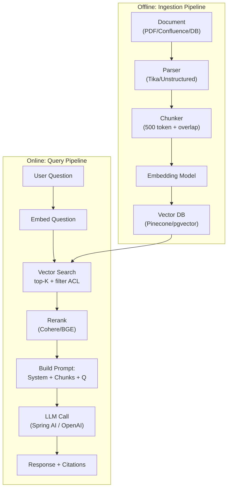

# RAG là gì? Giải quyết vấn đề gì

## ⚡ Tóm tắt ngắn (30s)
* **RAG (Retrieval-Augmented Generation)** = pattern kết hợp **search** + **LLM generation**. Khi user hỏi, trước hết hệ thống **retrieve** các đoạn tài liệu liên quan từ vector database, sau đó **bơm** chúng vào prompt làm context, để LLM trả lời **dựa trên** nguồn thật thay vì knowledge "mơ hồ" trong weights.
* **Giải quyết 4 vấn đề kinh điển của LLM thuần**:
  1. **Hallucination**: LLM bịa fact. RAG bắt nó trả lời từ context được cung cấp → giảm 60-80%.
  2. **Knowledge cutoff**: LLM không biết event sau training date. RAG cập nhật được realtime.
  3. **Private/internal data**: ChatGPT không biết policy/sản phẩm/khách hàng của bạn. RAG ingest doc nội bộ.
  4. **Citation/audit**: trả lời kèm nguồn → compliance + user trust.
* **Khác RAG với Fine-tuning**:
  * Fine-tune ghi knowledge vào weights → khó update, lock vào model version.
  * RAG ghi knowledge ở vector DB → realtime update, dễ scale, có citation.
  * **80% case dùng RAG**. Fine-tune cho FORM, RAG cho FACT.
* **Thảm họa thực chiến nếu KHÔNG dùng RAG**: Team build chatbot pháp lý dùng GPT-4 thuần. Model bịa số điều luật + tên vụ án. User là luật sư đem ra tòa → bị tòa cảnh cáo vì citation fake. Sau khi switch sang RAG (ingest Bộ luật + judgement) + citation enforcement → accuracy tăng từ 60% lên 92%, hallucination giảm dưới 3%.

---

## 🔍 Chi tiết bản chất

### 1. Mô hình "Closed-book exam" vs "Open-book exam"

* **LLM thuần** = student trả lời "kín sách" (closed-book) — chỉ dùng trí nhớ → có thể nhớ sai.
* **RAG** = student "mở sách" (open-book) — đọc đoạn liên quan, tổng hợp trả lời → ít sai hơn nhiều.

LLM được train trên hàng trillion token web, nhưng:
* Knowledge cutoff: training date trước hiện tại 6-12 tháng.
* Long-tail facts: thông tin hiếm bị "loãng" trong weights.
* Private data: không có trong training → bịa.

RAG bù vào những gap này bằng cách **inject knowledge tươi** ngay tại query time.

### 2. Flow RAG cơ bản

```
[User Question]
   │
   ▼
[Embed question → vector Q]
   │
   ▼
[Vector DB: search top-K chunks gần Q]
   │
   ▼
[Build prompt: System + Top-K chunks + Q]
   │
   ▼
[LLM call: trả lời dựa trên context]
   │
   ▼
[Return answer + citations về chunks gốc]
```

### 3. Khi RAG phù hợp

| Use case | RAG có ích? | Lý do |
| :--- | :---: | :--- |
| FAQ chatbot nội bộ | ✓✓✓ | Knowledge cố định, cần citation |
| Q&A trên doc pháp lý | ✓✓✓ | Cần accuracy + citation |
| Customer support bot | ✓✓✓ | Product info update thường xuyên |
| Code search / code chat | ✓✓ | Knowledge repo-specific |
| Phân tích dữ liệu transactional | ✗ | Cần SQL exact, không semantic |
| Math/reasoning thuần | ✗ | LLM chính phụ trách, retrieval không help |
| Creative writing | ✗ | Không cần grounding |

### 4. Khác biệt với "chỉ dùng long context"

Có người nói "context window đủ to → không cần RAG". Sai vì:
* **Cost**: nhồi 200k token mỗi request = ~$0.50–$2/req. RAG 5k token = $0.005.
* **Latency**: long context prefill 5-20s. RAG 0.5-1s.
* **"Lost in the middle"**: model miss thông tin ở giữa context dài.
* **Permission**: long context không filter được theo ACL; RAG filter ở vector search.
* **Citation**: long context không biết "trả lời từ chunk nào"; RAG biết.

→ RAG thắng trừ task đặc thù cần holistic view.

### 5. Giới hạn của RAG

* **Phụ thuộc retrieval quality**: miss chunk = trả lời sai/refuse.
* **Multi-hop reasoning yếu**: câu trả lời cần combine info từ nhiều doc → retrieval đơn giản fail.
* **Chunking trade-off**: chunk nhỏ → match keyword tốt nhưng thiếu ngữ cảnh; chunk lớn → ngược lại.

Giải pháp nâng cao: agentic RAG, query rewriting, multi-step retrieval, rerank.

---

## 🎨 Sơ đồ kiến trúc RAG đầy đủ



---

## 💻 Code thực chiến: Minimal RAG Service

### 1. Spring AI + pgvector — End-to-end

```java
package com.example.rag;

import org.springframework.ai.chat.client.ChatClient;
import org.springframework.ai.embedding.EmbeddingModel;
import org.springframework.jdbc.core.namedparam.NamedParameterJdbcTemplate;
import org.springframework.stereotype.Service;
import java.util.*;

@Service
public class SimpleRagService {

    private final EmbeddingModel embeddings;
    private final NamedParameterJdbcTemplate jdbc;
    private final ChatClient chat;

    private static final String SYSTEM = """
            Bạn là trợ lý chỉ trả lời từ thông tin trong CONTEXT.
            Nếu không có thông tin, trả lời: "Tôi không tìm thấy trong tài liệu."
            Kèm citation [doc_id:chunk_id] cho mọi tuyên bố factual.
            """;

    public SimpleRagService(EmbeddingModel e, NamedParameterJdbcTemplate j, ChatClient.Builder cb) {
        this.embeddings = e; this.jdbc = j; this.chat = cb.build();
    }

    public RagAnswer ask(String question, UUID tenantId) {
        // 1. Embed question
        float[] qEmb = embeddings.embed(question);

        // 2. Retrieve top-5 chunks with ACL filter
        var chunks = retrieveChunks(qEmb, tenantId, 5);

        if (chunks.isEmpty()) {
            return new RagAnswer("Tôi không tìm thấy thông tin trong tài liệu.", List.of());
        }

        // 3. Build prompt
        StringBuilder context = new StringBuilder();
        for (var c : chunks) {
            context.append("[doc:").append(c.docId()).append(" chunk:").append(c.chunkIdx()).append("]\n");
            context.append(c.text()).append("\n---\n");
        }

        String userPrompt = "CONTEXT:\n" + context + "\nQ: " + question;

        // 4. Call LLM
        String answer = chat.prompt()
            .system(SYSTEM)
            .user(userPrompt)
            .call().content();

        return new RagAnswer(answer, chunks.stream().map(c -> 
            new Citation(c.docId(), c.chunkIdx())).toList());
    }

    private List<Chunk> retrieveChunks(float[] qEmb, UUID tenantId, int topK) {
        String sql = """
            SELECT id, doc_id, chunk_idx, text,
                   1 - (embedding <=> CAST(:q AS vector)) AS sim
              FROM rag_chunks
             WHERE tenant_id = :tid
             ORDER BY embedding <=> CAST(:q AS vector)
             LIMIT :k
            """;
        return jdbc.query(sql, Map.of(
            "q", toPgvec(qEmb), "tid", tenantId, "k", topK
        ), (rs, n) -> new Chunk(
            rs.getLong("id"),
            UUID.fromString(rs.getString("doc_id")),
            rs.getInt("chunk_idx"),
            rs.getString("text"),
            rs.getDouble("sim")
        ));
    }

    private String toPgvec(float[] v) { /* ... */ return ""; }

    public record Chunk(long id, UUID docId, int chunkIdx, String text, double similarity) {}
    public record RagAnswer(String text, List<Citation> citations) {}
    public record Citation(UUID docId, int chunkIdx) {}
}
```

### 2. Ingestion job (cron / Kafka consumer)

```java
@Service
public class IngestionService {
    private final EmbeddingModel embeddings;
    private final NamedParameterJdbcTemplate jdbc;

    public void ingest(Document doc) {
        // 1. Chunk (~500 token với overlap 50)
        List<String> chunks = chunkText(doc.content(), 500, 50);

        for (int i = 0; i < chunks.size(); i++) {
            float[] emb = embeddings.embed(chunks.get(i));
            jdbc.update("""
                INSERT INTO rag_chunks (tenant_id, doc_id, chunk_idx, text, embedding)
                VALUES (:tid, :did, :ci, :txt, CAST(:emb AS vector))
                """, Map.of(
                    "tid", doc.tenantId(), "did", doc.id(),
                    "ci", i, "txt", chunks.get(i), "emb", toPgvec(emb)
                ));
        }
    }

    private List<String> chunkText(String text, int maxTokens, int overlap) { return List.of(); }
    private String toPgvec(float[] v) { return ""; }
}
```

### 3. PgVector schema

```sql
CREATE EXTENSION IF NOT EXISTS vector;

CREATE TABLE rag_chunks (
    id BIGSERIAL PRIMARY KEY,
    tenant_id UUID NOT NULL,
    doc_id UUID NOT NULL,
    chunk_idx INT NOT NULL,
    text TEXT NOT NULL,
    embedding vector(1024) NOT NULL,
    metadata JSONB DEFAULT '{}'::jsonb,
    created_at TIMESTAMPTZ DEFAULT now()
);

CREATE INDEX rag_chunks_embedding_hnsw ON rag_chunks
    USING hnsw (embedding vector_cosine_ops) WITH (m = 16, ef_construction = 64);
CREATE INDEX rag_chunks_tenant ON rag_chunks (tenant_id);
CREATE INDEX rag_chunks_doc ON rag_chunks (doc_id);
```

---

## 📊 Bảng so sánh RAG vs alternatives

| Approach | Knowledge update | Cost | Latency | Hallucination | Citation |
| :--- | :--- | :--- | :--- | :--- | :--- |
| LLM thuần | Cutoff cứng | Thấp | Thấp | Cao | Không |
| Fine-tune | Cần retrain | Cao train | Thấp | Trung bình | Không |
| RAG | Realtime | Trung bình | Trung bình | Thấp | ✓ |
| Long context (nhồi doc) | Realtime | Cao | Cao | Trung bình | Khó |
| Hybrid RAG + Fine-tune | Realtime + form | Cao | Trung bình | Thấp | ✓ |

---

## ⚠️ Common Gotchas & Questions follow-up

### 1. Cạm bẫy: Coi RAG là silver bullet
* **Vấn đề**: Triển khai RAG → vẫn hallucinate. Lý do: prompt không nghiêm khắc enforcing "chỉ trả lời từ context".
* **Giải pháp**:
  1. System prompt strict: "If not in context, say 'I don't know'".
  2. Few-shot từ chối.
  3. Threshold similarity: nếu top-K similarity < 0.5 → refuse thay vì cố trả lời.
  4. Citation enforcement: validate citation tồn tại thực sự.

### 2. Cạm bẫy: Mong RAG giải mọi câu hỏi
* **Vấn đề**: Câu hỏi "Hôm nay là thứ mấy?" cũng quăng vào RAG → vô nghĩa.
* **Giải pháp**: Intent router phía trước. Chỉ RAG khi knowledge-based query.

### 3. Cạm bẫy: Chunking quá ngẫu nhiên
* **Vấn đề**: Cắt giữa câu / giữa code block → semantic broken.
* **Giải pháp**: Smart chunker (LangChain RecursiveCharacterTextSplitter) tôn trọng paragraph/section boundary.

### 4. Câu hỏi đào sâu từ interviewer
* **Interviewer: "Tôi nghe RAG hot. Khi nào KHÔNG nên dùng?"**
* **Trả lời Senior**:
  1. **Knowledge không thay đổi + nhỏ**: chỉ vài KB doc → nhồi luôn vào system prompt, đơn giản hơn RAG.
  2. **Cần holistic reasoning cross-doc**: RAG retrieval thường miss interaction giữa các doc → cần long context hoặc agentic RAG.
  3. **Latency cực thấp <100ms**: vector search overhead 50-200ms → không phù hợp realtime.
  4. **Compliance không cho lưu embedding**: một số quy định coi embedding là derived data → review cẩn thận.
  5. **Volume thấp, knowledge định hình**: dùng intent classifier + template response thay vì over-engineering.
  6. **Cost-sensitive với task simple**: classifier truyền thống tốt hơn RAG cho task có nhãn rõ.
