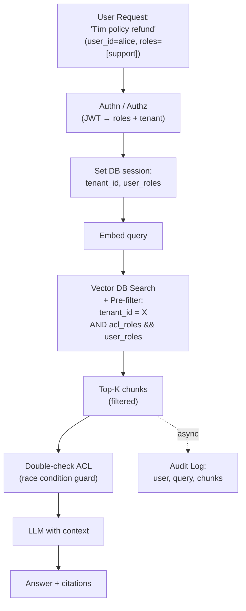

# Xử lý Document Permission trong RAG

## ⚡ Tóm tắt ngắn (30s)
* **RAG + permission = mảng dễ bị bỏ quên nhất**. Engineer mải lo retrieval quality mà quên: user A có thể search được doc của tenant B, hoặc engineer thường thấy được tài liệu C-level.
* **Defense-in-depth 4 tầng**:
  1. **Filter ở ingestion**: gắn `tenant_id`, `acl_roles`, `confidentiality` vào metadata mỗi chunk.
  2. **Filter ở retrieval**: vector search BẮT BUỘC filter theo identity của user. Pre-filter trong HNSW, không post-filter.
  3. **Authorization check ở response**: sau retrieve, double-check user có thực sự được đọc mọi chunk không (race condition khi permission đổi).
  4. **Audit log**: ghi mọi search + chunk trả về để forensic.
* **Patterns đặc thù**:
  * **Per-tenant collection**: nếu số tenant nhỏ (<100) — isolation mạnh nhất.
  * **Shared collection + metadata filter**: phần lớn case multi-tenant SaaS.
  * **Row-level security** (Postgres RLS) cho pgvector — DB enforce, không trust app code.
* **Thảm họa thực chiến**: Multi-tenant RAG dùng pgvector, filter `tenant_id` trong WHERE clause của application code. Một bug missing param → query không filter → user của tenant A thấy doc tenant B trong response. GDPR breach. Senior fix: enable Postgres RLS, app KHÔNG còn quyền bypass filter ở DB level.

---

## 🔍 Chi tiết kiến trúc

### 1. Phân loại permission

| Loại | Ví dụ | Implementation |
| :--- | :--- | :--- |
| **Tenant isolation** | SaaS — tenant A không thấy tenant B | `tenant_id` filter |
| **Role-based** | Manager thấy doc HR, employee không | `acl_roles` array filter |
| **Confidentiality level** | Public / Internal / Confidential / Restricted | `clearance_level` filter |
| **Document-level ACL** | Chỉ owner + được share thấy doc cụ thể | `allowed_users` array |
| **Time-bound** | Beta feature: chỉ user trong waitlist | `available_after` + check |
| **Geographic** | EU data không serve user US | `region` filter |

### 2. Ingestion side — Gắn metadata

```json
{
  "chunk_id": "abc-123",
  "text": "...",
  "embedding": [...],
  "metadata": {
    "tenant_id": "uuid-xyz",
    "doc_id": "uuid-doc",
    "acl_roles": ["customer-support", "manager"],
    "acl_users": ["alice@x.com", "bob@x.com"],
    "clearance_level": "internal",
    "region": "EU"
  }
}
```

Quan trọng: ACL metadata phải **đồng bộ với source** (Confluence/Drive). Khi user mất quyền ở Confluence → invalidate ACL trong vector DB.

### 3. Retrieval side — Pre-filter

Pre-filter trong HNSW traverse:
```
Standard ANN: tìm 10 candidate gần nhất → trả 10.
Pre-filter ANN: tìm 10 candidate gần nhất MÀ thỏa filter → trả 10 đã filter.
```

Pre-filter quan trọng vì:
* Post-filter: ANN trả 10 candidates, filter → còn 3 (mất 7). Recall vỡ.
* Pre-filter: ANN biết filter, expand search → trả đủ 10 thỏa filter.

Vector DB hỗ trợ pre-filter:
* **Qdrant**: payload filter trong HNSW.
* **Weaviate**: where filter.
* **pgvector**: index combining vector + scalar via partial index hoặc hnsw filter.
* **Pinecone**: metadata filter.

### 4. Postgres Row-Level Security (RLS)

Defense bằng DB, không trust app code:

```sql
ALTER TABLE rag_chunks ENABLE ROW LEVEL SECURITY;

CREATE POLICY tenant_isolation ON rag_chunks
    USING (tenant_id = current_setting('app.current_tenant_id')::uuid);

CREATE POLICY role_access ON rag_chunks
    USING (
        acl_roles && current_setting('app.current_user_roles')::text[]
    );
```

App set context:
```sql
SET app.current_tenant_id = 'uuid-xyz';
SET app.current_user_roles = ARRAY['customer-support', 'manager'];
```

Mọi query trên `rag_chunks` tự động filter. Bug app không thể bypass.

### 5. Audit logging

Log mỗi search:
```json
{
  "timestamp": "2026-05-23T10:30:00Z",
  "user_id": "alice@x.com",
  "tenant_id": "uuid-xyz",
  "user_roles": ["customer-support"],
  "query": "<redacted PII>",
  "retrieved_chunks": ["c1", "c2", "c3"],
  "chunks_acl": ["customer-support", "manager", "customer-support"],
  "similarity_scores": [0.92, 0.88, 0.85]
}
```

Forensic khi có data breach claim: query log để chứng minh user X chỉ thấy chunk họ có quyền.

---

## 🎨 Sơ đồ kiến trúc



---

## 💻 Code thực chiến

### 1. Postgres RLS setup

```sql
-- Enable RLS
ALTER TABLE rag_chunks ENABLE ROW LEVEL SECURITY;
ALTER TABLE rag_chunks FORCE ROW LEVEL SECURITY;  -- cho cả owner

-- Policy 1: Tenant isolation
CREATE POLICY rag_chunks_tenant_policy ON rag_chunks
    FOR SELECT
    USING (tenant_id = current_setting('app.current_tenant_id', true)::uuid);

-- Policy 2: Role check
CREATE POLICY rag_chunks_role_policy ON rag_chunks
    FOR SELECT
    USING (
        acl_roles && string_to_array(
            current_setting('app.current_user_roles', true), ','
        )::text[]
    );

-- Policy 3: User-specific ACL (nếu có)
CREATE POLICY rag_chunks_user_policy ON rag_chunks
    FOR SELECT
    USING (
        current_setting('app.current_user_id', true) = ANY(acl_users)
        OR acl_users IS NULL  -- doc public trong tenant
    );

-- App user (không phải superuser) phải tuân RLS
GRANT SELECT ON rag_chunks TO app_user;
```

### 2. Set session context (Spring Boot + JdbcTemplate)

```java
package com.example.rag.security;

import org.springframework.jdbc.core.JdbcTemplate;
import org.springframework.stereotype.Component;

@Component
public class RlsSessionContext {

    private final JdbcTemplate jdbc;

    public RlsSessionContext(JdbcTemplate j) { this.jdbc = j; }

    public void setForUser(String userId, String tenantId, List<String> roles) {
        // Set session-level GUC (Postgres Grand Unified Config)
        jdbc.execute("SET app.current_user_id = '" + safeId(userId) + "'");
        jdbc.execute("SET app.current_tenant_id = '" + safeId(tenantId) + "'");
        jdbc.execute("SET app.current_user_roles = '" + String.join(",", roles).replace("'", "") + "'");
    }

    public void reset() {
        jdbc.execute("RESET app.current_user_id");
        jdbc.execute("RESET app.current_tenant_id");
        jdbc.execute("RESET app.current_user_roles");
    }

    private String safeId(String s) {
        if (!s.matches("[a-zA-Z0-9\\-]+")) throw new IllegalArgumentException("Invalid identity");
        return s;
    }
}
```

### 3. Filter integration với Spring AOP

```java
package com.example.rag.security;

import org.aspectj.lang.ProceedingJoinPoint;
import org.aspectj.lang.annotation.*;
import org.springframework.security.core.context.SecurityContextHolder;
import org.springframework.stereotype.Component;

@Aspect
@Component
public class RlsContextAspect {

    private final RlsSessionContext rls;

    public RlsContextAspect(RlsSessionContext r) { this.rls = r; }

    @Around("@annotation(WithRlsContext)")
    public Object aroundRlsCall(ProceedingJoinPoint pjp) throws Throwable {
        var auth = SecurityContextHolder.getContext().getAuthentication();
        // Extract user info from JWT
        rls.setForUser(
            auth.getName(),
            ((Jwt)auth.getPrincipal()).getClaimAsString("tenant_id"),
            auth.getAuthorities().stream().map(a -> a.getAuthority()).toList()
        );
        try {
            return pjp.proceed();
        } finally {
            rls.reset();
        }
    }
}

@Target(java.lang.annotation.ElementType.METHOD)
@Retention(java.lang.annotation.RetentionPolicy.RUNTIME)
public @interface WithRlsContext {}
```

### 4. Usage trong service

```java
@Service
public class SecureRagService {

    private final NamedParameterJdbcTemplate jdbc;

    @WithRlsContext   // AOP set RLS session, mọi query tự động filter
    public List<Chunk> search(float[] queryEmbedding, int topK) {
        // SQL không cần filter manually — RLS đã làm
        String sql = """
            SELECT id, text, 1 - (embedding <=> CAST(:q AS vector)) AS sim
              FROM rag_chunks
             ORDER BY embedding <=> CAST(:q AS vector)
             LIMIT :k
            """;
        return jdbc.query(sql, Map.of("q", toPgvec(queryEmbedding), "k", topK),
            (rs, n) -> new Chunk(rs.getLong("id"), rs.getString("text"), rs.getDouble("sim")));
    }

    private String toPgvec(float[] v) { return ""; }
    record Chunk(long id, String text, double sim) {}
}
```

### 5. Qdrant payload filter

```java
package com.example.rag.qdrant;

import io.qdrant.client.grpc.Points;

public class QdrantWithAcl {

    public Points.Filter buildAclFilter(String tenantId, List<String> userRoles) {
        var conditions = new ArrayList<Points.Condition>();
        
        // Tenant filter (MUST)
        conditions.add(Points.Condition.newBuilder()
            .setField(Points.FieldCondition.newBuilder()
                .setKey("tenant_id")
                .setMatch(Points.Match.newBuilder().setKeyword(tenantId).build())
                .build())
            .build());
        
        // Role filter: at least one user role intersect with chunk acl_roles
        var roleConditions = userRoles.stream().map(role -> 
            Points.Condition.newBuilder()
                .setField(Points.FieldCondition.newBuilder()
                    .setKey("acl_roles")
                    .setMatch(Points.Match.newBuilder().setKeyword(role).build())
                    .build())
                .build()
        ).toList();
        
        var rolesShould = Points.Filter.newBuilder()
            .addAllShould(roleConditions)
            .build();
        
        return Points.Filter.newBuilder()
            .addAllMust(conditions)
            .addMust(Points.Condition.newBuilder().setFilter(rolesShould).build())
            .build();
    }
}
```

---

## 📊 Bảng so sánh permission strategies

| Strategy | Isolation | Performance | Setup | Khi dùng |
| :--- | :---: | :---: | :---: | :--- |
| Per-tenant collection | Cao nhất | Tốt | Tốn (N collection) | <100 tenant lớn |
| Shared + metadata filter | Cao | Tốt | Đơn giản | Multi-tenant SaaS chuẩn |
| Postgres RLS | Cao (DB-enforced) | Tốt | Phức tạp setup | Compliance critical |
| Per-tenant DB schema | Trung bình | Tốt | Tốn | Mid-tier SaaS |
| Application-level filter only | Thấp (dễ bug) | Tốt | Đơn giản | Internal app |

---

## ⚠️ Common Gotchas & Questions follow-up

### 1. Cạm bẫy: Filter chỉ ở app code
* **Vấn đề**: 1 dev quên `WHERE tenant_id=` → cross-tenant leak.
* **Giải pháp**: RLS ở DB. App KHÔNG có quyền bypass filter.

### 2. Cạm bẫy: ACL stale
* **Vấn đề**: User mất quyền ở Confluence → vector DB vẫn cho phép search.
* **Giải pháp**: 
  1. Webhook khi permission đổi → update ACL ở chunks.
  2. Hoặc check fresh permission lúc query (chậm hơn).
  3. TTL cache permission ngắn (15 phút).

### 3. Cạm bẫy: Post-filter recall
* **Vấn đề**: ANN trả 10, filter còn 2 → output thiếu.
* **Giải pháp**: Pre-filter native ở vector DB.

### 4. Cạm bẫy: Index ACL filter chậm
* **Vấn đề**: ACL filter có cardinality cao → ANN scan nhiều candidates.
* **Giải pháp**: 
  1. Per-tenant collection nếu cardinality tenant không quá lớn.
  2. Hoặc sharding theo tenant_id.
  3. Index B-tree cho acl_roles + composite.

### 5. Câu hỏi đào sâu từ interviewer
* **Interviewer: "User Alice trong tenant X có role Manager. Cô ấy hỏi 'show me sales data'. RAG retrieve doc của tenant Y. Bạn debug thế nào?"**
* **Trả lời Senior**:
  1. **Verify**: log retrieval, tìm trace_id của query. Kiểm tra chunk retrieved có tenant_id gì.
  2. **Hai khả năng**:
     - **Filter không apply**: query sai không include tenant_id. Check session context, RLS active, query log.
     - **Data corruption**: chunk có tenant_id sai do bug ingestion.
  3. **Container test**: viết unit test reproduce — set Alice context, search → verify chỉ trả tenant X.
  4. **DB integrity check**: count chunks group by tenant_id, sample random chunks → verify metadata đúng.
  5. **Audit log**: tìm xem có bao nhiêu user khác gặp issue tương tự → assess blast radius.
  6. **Postmortem & fix**:
     - Add RLS nếu chưa có.
     - Add E2E test cross-tenant penetration.
     - Add monitor alert nếu chunk metadata fail validation.
     - Inform stakeholders + compliance team theo SLA.
