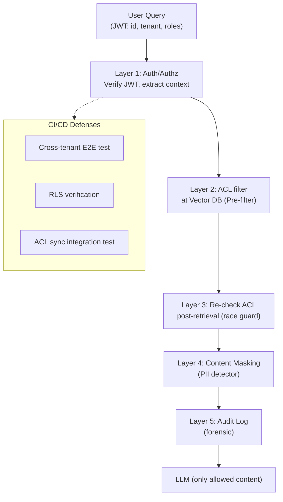

# Tránh User Truy xuất Tài liệu Không có Quyền

## ⚡ Tóm tắt ngắn (30s)
* **Cốt lõi**: ACL filter phải xảy ra ở **DB level** (Postgres RLS / Pinecone metadata filter), không trust app code. Defense-in-depth: ACL ở ingestion + retrieval + response validation + audit.
* **5 patterns Senior**:
  1. **Pre-filter trong ANN traverse** (Qdrant payload, Weaviate where, pgvector + RLS).
  2. **Hard tenant isolation**: per-tenant collection nếu tenant lớn.
  3. **Re-check ACL ở response time**: race condition giữa lúc retrieve và user permission đổi.
  4. **Mask sensitive content** ngay cả khi ACL allow (e.g. salary in HR doc visible to other HR).
  5. **Penetration test cross-tenant** trong CI.
* **Câu hỏi cốt yếu nhất là: nếu app code bug, user X có thể đọc doc của user Y không?** Câu trả lời PHẢI là KHÔNG.
* **Thảm họa thực chiến**: Multi-tenant chatbot, ACL filter trong WHERE clause của app. Refactor controller, lỡ remove `tenant_id` param → query không filter. Trong 6 giờ, 12 user của tenant A đọc được doc tenant B. GDPR data breach, fine + customer churn. Senior fix: Postgres RLS, app KHÔNG còn bypass được, kèm penetration test trong CI.

---

## 🔍 Chi tiết best practices

### 1. ACL synchronization với source-of-truth

**Source-of-truth**: hệ thống chính quản permission (Confluence/Drive/Slack/AzureAD).

**Sync strategy**:
* **Pull on schedule**: cron mỗi 5-15 phút, fetch ACL delta → update vector DB metadata.
* **Push on webhook**: source gửi event khi permission đổi → process ngay.
* **Lazy on query**: kiểm tra fresh ACL khi user query (slow nhưng accurate).

**Stale ACL** là bug phổ biến: user nghỉ việc thứ Hai, ACL ở Confluence revoke. Nhưng vector DB metadata vẫn cho phép 24 giờ.

→ Senior dùng webhook + TTL cache: webhook update ngay, cache permission TTL 15 phút như safety net.

### 2. Multi-level permission

User có thể có nhiều dimension permission:
* **Tenant**: tenant_id
* **Group/Role**: ["engineering", "manager"]
* **Specific user**: doc shared cá nhân cho user X
* **Sensitivity level**: < user.clearance_level
* **Time/region**: < doc.expiry_date, region match

Filter all dimensions trong vector search:

```sql
WHERE tenant_id = :user_tenant_id
  AND acl_roles && :user_roles
  AND (acl_users IS NULL OR :user_id = ANY(acl_users))
  AND clearance_level <= :user_clearance
  AND (expiry_date IS NULL OR expiry_date > NOW())
  AND (region IS NULL OR region = :user_region)
```

### 3. Pre-filter trong HNSW (quan trọng)

**Post-filter** problem: ANN tìm top-100, filter (e.g. tenant_id) còn top-3. Top-97 bị mất → recall tệ.

**Pre-filter**: ANN tự biết filter, khi traverse skip nodes không qualify → trả đủ top-K filtered.

DB hỗ trợ pre-filter:
* **Qdrant**: `payload_index` + `filter` trong search.
* **Weaviate**: `where` filter.
* **pgvector**: cần partial index hoặc combine với B-tree.
* **Pinecone**: metadata filter native.

### 4. Re-check ACL ở response time

Giữa lúc retrieve (T0) và lúc return user (T1), permission có thể đổi (e.g. admin revoke ngay). Filter ACL re-check ở response:

```java
public List<Chunk> filterByCurrentAcl(List<Chunk> retrieved, User user) {
    return retrieved.stream()
        .filter(c -> hasAccess(user, c.aclRoles(), c.aclUsers(), c.clearance()))
        .toList();
}
```

Có vẻ duplicate (vector DB đã filter), nhưng catch race condition.

### 5. Content masking

Đôi khi user có quyền đọc doc, nhưng không phải mọi phần trong doc. Ví dụ:
* HR doc visible to HR team, nhưng salary numbers maskable to non-finance HR.

→ Maskable PII detector chạy trên retrieved chunks trước khi vào LLM. Hoặc structure doc với block-level ACL.

### 6. Test cross-tenant penetration

CI test:
```
1. Setup 2 tenant A, B với data riêng.
2. Login user của A.
3. Search query khớp với doc B.
4. Verify: 0 chunk of B trả về.
5. Repeat với roles permutations.
```

---

## 🎨 Sơ đồ defense-in-depth



---

## 💻 Code thực chiến

### 1. Multi-dimensional ACL filter (pgvector)

```sql
-- Composite index for filter + vector
CREATE INDEX rag_chunks_acl_idx ON rag_chunks
    (tenant_id, clearance_level)
    WHERE expiry_date IS NULL OR expiry_date > NOW();

-- Full search query
PREPARE rag_search AS
SELECT id, text, doc_id,
       1 - (embedding <=> CAST($1 AS vector)) AS sim
FROM rag_chunks
WHERE tenant_id = $2::uuid
  AND acl_roles && $3::text[]
  AND ($4::uuid = ANY(acl_users) OR acl_users IS NULL)
  AND clearance_level <= $5
  AND (expiry_date IS NULL OR expiry_date > NOW())
  AND (region IS NULL OR region = $6)
ORDER BY embedding <=> CAST($1 AS vector)
LIMIT $7;
```

### 2. ACL sync from Confluence webhook

```java
package com.example.rag.acl;

import org.springframework.web.bind.annotation.*;
import org.springframework.stereotype.Service;
import java.util.UUID;

@RestController
@RequestMapping("/webhooks/confluence")
public class ConfluenceWebhook {

    private final AclSyncService aclSync;

    public ConfluenceWebhook(AclSyncService a) { this.aclSync = a; }

    @PostMapping("/permission-changed")
    public void onPermissionChanged(@RequestBody ConfluencePermissionEvent event) {
        aclSync.handlePermissionChange(event);
    }

    public record ConfluencePermissionEvent(
        String pageId, String action, // "grant" | "revoke"
        List<String> users, List<String> roles
    ) {}
}

@Service
class AclSyncService {
    private final NamedParameterJdbcTemplate jdbc;
    private final AclCache cache;

    public void handlePermissionChange(ConfluenceWebhook.ConfluencePermissionEvent e) {
        // Update chunks metadata
        String sql = """
            UPDATE rag_chunks
            SET acl_roles = :roles, acl_users = :users, updated_at = NOW()
            WHERE doc_id = (SELECT id FROM documents WHERE source_id = :pageId)
            """;
        jdbc.update(sql, Map.of(
            "pageId", e.pageId(),
            "roles", e.roles().toArray(new String[0]),
            "users", e.users().toArray(new String[0])
        ));

        // Invalidate Redis cache
        cache.invalidate(e.pageId());
    }
}
```

### 3. Penetration test in CI

```java
package com.example.rag;

import org.junit.jupiter.api.Test;
import org.springframework.boot.test.context.SpringBootTest;

@SpringBootTest
class CrossTenantPenetrationTest {

    @Autowired RagService rag;
    @Autowired TestDataLoader loader;

    @Test
    void userOfTenantA_shouldNotSeeTenantBDocs() {
        // Setup
        UUID tenantA = UUID.randomUUID();
        UUID tenantB = UUID.randomUUID();
        loader.insertChunk(tenantB, "Confidential plan to acquire competitor X");

        // Login as user of tenant A
        TestSecurityContext.loginAs("alice@a.com", tenantA, List.of("user"));

        // Search query matching B's doc
        var results = rag.search("acquire competitor", 10);

        // Assert: no chunk of tenant B
        for (var chunk : results) {
            assertNotEquals(tenantB, chunk.tenantId(),
                "LEAK: tenant A user thấy chunk of tenant B");
        }
    }

    @Test
    void revokedUser_shouldNotAccessAfterRevoke() {
        // ... scenario: user mất quyền ở Confluence
    }
}
```

### 4. Content masking trước LLM

```python
from presidio_analyzer import AnalyzerEngine
from presidio_anonymizer import AnonymizerEngine

analyzer = AnalyzerEngine()
anonymizer = AnonymizerEngine()

def mask_for_user(text: str, user_clearance: str) -> str:
    """Mask thông tin nhạy cảm nếu user không đủ clearance."""
    if user_clearance == "confidential":
        return text  # full access
    
    results = analyzer.analyze(
        text=text,
        entities=["US_SSN", "CREDIT_CARD", "PHONE_NUMBER", "SALARY"],
        language="vi"
    )
    if not results:
        return text
    
    return anonymizer.anonymize(text=text, analyzer_results=results).text
```

---

## 📊 Bảng patterns

| Pattern | Isolation | Setup | Performance | Khi dùng |
| :--- | :---: | :---: | :---: | :--- |
| Single shared collection + metadata filter | Trung bình | Đơn giản | Tốt | <1000 tenant |
| Per-tenant collection | Cao | Tốn | Tốt | Tenant lớn, ít |
| Postgres RLS | Cao | Phức tạp | Tốt | Compliance critical |
| Hierarchical (tenant DB + shared global) | Cao | Phức tạp | Trung bình | Mixed public+private |
| App-only filter | Thấp | Đơn giản | Tốt | KHÔNG production |

---

## ⚠️ Common Gotchas & Questions follow-up

### 1. Cạm bẫy: Quên filter trên 1 endpoint
* **Vấn đề**: 5 endpoint search, 4 filter đúng, 1 quên.
* **Giải pháp**: 
  1. RLS DB-level (app không cần code filter).
  2. AOP aspect inject filter tự động.
  3. CI test mọi endpoint cross-tenant.

### 2. Cạm bẫy: Filter bằng JWT roles không validate
* **Vấn đề**: JWT có thể forge nếu signing key leak. Trust JWT mù → bypass.
* **Giải pháp**: Validate JWT signature mỗi request. Server-side role lookup từ DB nếu critical.

### 3. Cạm bẫy: Pre-filter chậm với cardinality cao
* **Vấn đề**: Filter `tenant_id` với 100k tenant → ANN traverse skip nhiều → slow.
* **Giải pháp**: Per-tenant sharding hoặc dedicated index per-tenant nếu lớn.

### 4. Câu hỏi đào sâu từ interviewer
* **Interviewer: "Bạn tin tưởng vào filter ở DB. Nhưng nếu attacker có quyền execute SQL tùy ý thì sao?"**
* **Trả lời Senior**:
  1. **SQL injection**: tất nhiên không cho phép. PreparedStatement parameterized.
  2. **DB user least-privilege**: app user không có quyền `SET ROLE`, không bypass được RLS. Production phải `FORCE ROW LEVEL SECURITY` (apply cho cả owner).
  3. **Application-level breach**: nếu attacker chiếm được DB credential → có thể bypass. Mitigations:
     - Credential rotation, vault.
     - Network isolation: DB trong private subnet, chỉ accept connection từ app subnet.
     - Audit log mọi connection.
     - Monitor abnormal query pattern.
  4. **Defense beyond DB**:
     - Encryption at rest với KMS.
     - Application-level encryption cho fields nhạy cảm (envelope encryption).
     - Even nếu DB bị dump → encrypted data không đọc được.
  5. **Compliance**: HSM cho production key, SOC 2 audit, regular pentests.
