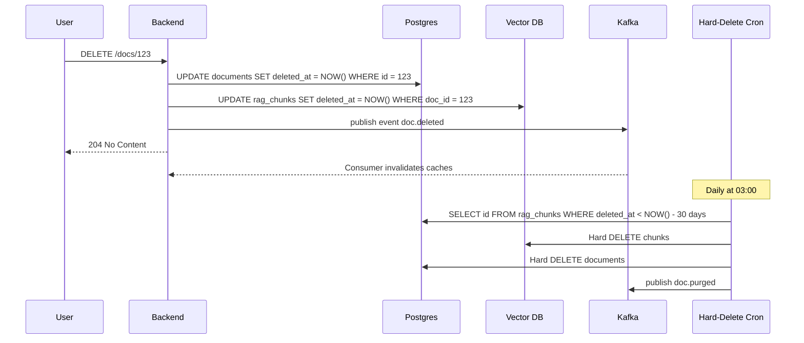

# Update/Delete Document đã Embedding

## ⚡ Tóm tắt ngắn (30s)
* **Update/Delete doc trong RAG** = thao tác phổ biến (doc update, user delete, GDPR right-to-be-forgotten), nhưng dễ làm sai dẫn đến data stale hoặc orphan chunks.
* **Quy tắc Senior**:
  1. **Atomic replace cho update**: delete old chunks + insert new. Không bao giờ update chunk in-place vì content thay đổi → embedding cũng phải thay đổi.
  2. **Soft delete trước, hard delete sau**: mark `deleted_at`, hide từ retrieval ngay. Hard delete async (cron 7-30 ngày sau) để cho phép recovery.
  3. **Cascade**: delete doc → delete chunks → invalidate cache (Redis cached search) → notify downstream.
  4. **Idempotent**: re-run delete OK nếu doc đã gone.
  5. **Versioning chunks**: include `embedding_model_version`, `chunk_strategy_version` → migrate dễ.
* **GDPR / Right-to-be-forgotten**: phải có ability để xóa toàn bộ data của 1 user trong SLA (thường 30 ngày).
* **Thảm họa thực chiến**: Team chỉ delete row trong `documents` table khi user xóa doc, quên `rag_chunks`. 1 tháng sau, vector DB có 30% orphan chunks → user search ra content "ma" → bug + compliance violation. Senior fix: cascade trigger + sweep job.

---

## 🔍 Chi tiết workflow

### 1. Update document

```
[User edit doc trên Confluence]
   ↓
[Webhook → backend]
   ↓
[Compare hash với version cũ]
   ↓ (hash khác)
[Begin Transaction]
   ↓
DELETE chunks WHERE doc_id = X
   ↓
INSERT new chunks (re-chunk + re-embed)
   ↓
[Commit]
   ↓
[Invalidate Redis cache tag = doc_id]
   ↓
[Update `documents.updated_at`]
```

**Atomic** cần thiết: nếu fail giữa delete và insert → doc empty trong vector DB. Transaction giữ consistency.

### 2. Delete document

```
[User clicks delete trên UI]
   ↓
[Soft delete: UPDATE documents SET deleted_at = NOW(), is_deleted = true]
   ↓
[Soft delete chunks: UPDATE rag_chunks SET deleted_at = NOW() WHERE doc_id = X]
   ↓ (Filter ở retrieval: WHERE deleted_at IS NULL)
[Doc invisible to user]
   ↓ (async, sau N ngày)
[Hard delete cron: DELETE chunks, documents WHERE deleted_at < NOW() - INTERVAL '30 days']
```

**Soft delete** quan trọng vì:
* User có thể undo trong khoảng grace period.
* Audit có thể replay nếu cần.
* Bug-rollback safety.

### 3. GDPR — Right-to-be-forgotten

User yêu cầu xóa toàn bộ data của họ:
1. Find all docs owned/created by user → list doc_ids.
2. Find all chunks referencing user (e.g. metadata.author = user) → list chunk_ids.
3. Find all logs có user_id → handle separately.
4. Soft delete chunks + docs.
5. Schedule hard delete sau 30 ngày.
6. Send confirmation email với ticket ID.
7. Audit log của deletion operation (ai approve, when).

### 4. Cascade across systems

Khi delete doc, các hệ thống phụ thuộc cũng phải cập nhật:
* **Vector DB chunks**: delete.
* **Redis search cache**: invalidate.
* **Semantic cache** (cached responses): invalidate nếu cite deleted doc.
* **Audit log**: KEEP — soft hide nhưng giữ cho forensic.
* **Backup**: document policy "backup chứa data đã xóa, sẽ pruned sau rotation 90 ngày".

### 5. Idempotency

Re-run delete với cùng doc_id phải:
* OK nếu doc còn → soft delete.
* OK nếu doc đã gone → no-op, không error.
* Không tạo duplicate side effect.

---

## 🎨 Sơ đồ workflow



---

## 💻 Code thực chiến

### 1. Spring Service — Atomic update

```java
package com.example.rag.update;

import org.springframework.stereotype.Service;
import org.springframework.transaction.annotation.Transactional;
import org.springframework.jdbc.core.namedparam.NamedParameterJdbcTemplate;
import java.util.*;

@Service
public class DocumentUpdateService {

    private final NamedParameterJdbcTemplate jdbc;
    private final EmbeddingService embedding;
    private final TextChunker chunker;
    private final CacheInvalidator cacheInvalidator;

    @Transactional
    public void update(UUID docId, String newContent, String newHash) {
        // 1. Verify hash changed
        String existingHash = jdbc.queryForObject(
            "SELECT content_hash FROM documents WHERE id = :id",
            Map.of("id", docId), String.class);
        if (newHash.equals(existingHash)) {
            log.info("doc_id={} hash unchanged, skip", docId);
            return;
        }

        // 2. Delete old chunks
        jdbc.update("DELETE FROM rag_chunks WHERE doc_id = :id",
                    Map.of("id", docId));

        // 3. Re-chunk + re-embed
        List<String> chunks = chunker.split(newContent, 500, 50);
        List<float[]> embeddings = embedding.embedBatch(chunks);

        // 4. Insert new chunks
        for (int i = 0; i < chunks.size(); i++) {
            jdbc.update("""
                INSERT INTO rag_chunks (doc_id, chunk_idx, text, embedding, content_hash)
                VALUES (:did, :idx, :txt, CAST(:emb AS vector), :hash)
                """, Map.of(
                    "did", docId, "idx", i, "txt", chunks.get(i),
                    "emb", toPgvec(embeddings.get(i)), "hash", newHash
                ));
        }

        // 5. Update documents row
        jdbc.update("UPDATE documents SET content_hash = :h, updated_at = NOW() WHERE id = :id",
                    Map.of("h", newHash, "id", docId));

        // 6. Invalidate caches (sau transaction commit thông qua event)
        cacheInvalidator.invalidateForDoc(docId);
    }

    private String toPgvec(float[] v) { return ""; }
    private static final org.slf4j.Logger log = org.slf4j.LoggerFactory.getLogger(DocumentUpdateService.class);
}
```

### 2. Soft delete service

```java
package com.example.rag.delete;

import org.springframework.stereotype.Service;
import org.springframework.transaction.annotation.Transactional;
import java.util.UUID;

@Service
public class DocumentDeleteService {

    private final NamedParameterJdbcTemplate jdbc;
    private final EventPublisher events;

    @Transactional
    public void softDelete(UUID docId) {
        // Idempotent: chỉ update nếu chưa deleted
        int rows = jdbc.update("""
            UPDATE documents
               SET deleted_at = NOW()
             WHERE id = :id
               AND deleted_at IS NULL
            """, Map.of("id", docId));

        if (rows == 0) {
            log.info("doc_id={} already deleted, idempotent skip", docId);
            return;
        }

        jdbc.update("""
            UPDATE rag_chunks SET deleted_at = NOW()
            WHERE doc_id = :id AND deleted_at IS NULL
            """, Map.of("id", docId));

        events.publish(new DocDeletedEvent(docId));
    }

    public record DocDeletedEvent(UUID docId) {}
    private static final org.slf4j.Logger log = org.slf4j.LoggerFactory.getLogger(DocumentDeleteService.class);
}
```

### 3. Filter ở retrieval (deleted_at IS NULL)

```sql
SELECT id, text, 1 - (embedding <=> CAST(:q AS vector)) AS sim
FROM rag_chunks
WHERE tenant_id = :tid
  AND deleted_at IS NULL              -- key filter
  AND acl_roles && :user_roles
ORDER BY embedding <=> CAST(:q AS vector)
LIMIT 10;
```

### 4. Hard delete cron

```java
@Component
public class HardDeleteCron {

    private final JdbcTemplate jdbc;

    @Scheduled(cron = "0 0 3 * * *")  // 3AM daily
    @Transactional
    public void purgeOldDeleted() {
        // Delete chunks
        int chunks = jdbc.update("""
            DELETE FROM rag_chunks
            WHERE deleted_at IS NOT NULL
              AND deleted_at < NOW() - INTERVAL '30 days'
            """);

        // Delete documents
        int docs = jdbc.update("""
            DELETE FROM documents
            WHERE deleted_at IS NOT NULL
              AND deleted_at < NOW() - INTERVAL '30 days'
            """);

        log.info("Purged {} chunks, {} documents", chunks, docs);
    }

    private static final org.slf4j.Logger log = org.slf4j.LoggerFactory.getLogger(HardDeleteCron.class);
}
```

### 5. GDPR right-to-be-forgotten

```java
@Service
public class GdprDeletionService {

    private final JdbcTemplate jdbc;
    private final AuditService audit;

    @Transactional
    public DeletionReceipt forgetUser(UUID userId, String approvedByAdminId) {
        // 1. Find scope
        List<UUID> docIds = jdbc.queryForList(
            "SELECT id FROM documents WHERE owner_id = :uid",
            Map.of("uid", userId), UUID.class);

        // 2. Soft delete docs + chunks
        for (UUID docId : docIds) {
            softDelete(docId);
        }

        // 3. Delete user-attributed metadata
        jdbc.update("""
            UPDATE rag_chunks
            SET metadata = metadata - 'author' - 'owner_id'
            WHERE metadata @> jsonb_build_object('owner_id', :uid::text)
            """, Map.of("uid", userId));

        // 4. Audit
        String ticketId = audit.recordDeletion(userId, approvedByAdminId, docIds);

        return new DeletionReceipt(ticketId, docIds.size(),
                                    LocalDate.now().plusDays(30));
    }

    public record DeletionReceipt(String ticketId, int docCount, LocalDate purgeBy) {}
}
```

---

## 📊 Bảng quyết định

| Scenario | Approach | Why |
| :--- | :--- | :--- |
| Doc content update | Atomic replace (delete + insert) | Embedding change with content |
| Doc small update (metadata only) | UPDATE in-place | No re-embed needed |
| Single chunk fix | Soft delete + re-insert specific chunk | Avoid full re-embed |
| Doc delete (user action) | Soft delete + cron hard delete | Recovery window |
| GDPR delete | Soft delete + scheduled hard delete (30d) | Compliance SLA |
| Model upgrade | Migrate via dual-write | No downtime |
| Bulk delete (tenant offboard) | Background job + batch | Avoid lock |

---

## ⚠️ Common Gotchas & Questions follow-up

### 1. Cạm bẫy: Update in-place chunk row
* **Vấn đề**: Chunk text đổi nhưng embedding không re-compute → embedding mismatch content.
* **Giải pháp**: Atomic replace bắt buộc cho mọi content change.

### 2. Cạm bẫy: Quên delete orphan chunks
* **Vấn đề**: User xóa doc trong Confluence. Webhook fail/skip. Chunks trong vector DB vẫn live → search ra "ma".
* **Giải pháp**: 
  1. Idempotent webhook + retry.
  2. Sweep job hàng tuần: cross-check vector DB chunks với source doc list, delete orphan.

### 3. Cạm bẫy: Cache sau delete
* **Vấn đề**: Semantic cache đã cache response có citation tới doc đã xóa → user vẫn thấy.
* **Giải pháp**: 
  1. Invalidate semantic cache khi doc xóa.
  2. Hoặc validate citation tại response time.

### 4. Cạm bẫy: Hard delete khi user còn quyền undo
* **Vấn đề**: Soft delete 1 giờ → hard delete → user click undo → mất data.
* **Giải pháp**: Hard delete TTL ≥ 7-30 ngày tùy SLA. Document grace period rõ ràng.

### 5. Câu hỏi đào sâu từ interviewer
* **Interviewer: "100M chunks, daily 10M delete + 10M insert. Strategy thế nào?"**
* **Trả lời Senior**:
  1. **Batch operations**: 
     - Delete: WHERE deleted_at < ... LIMIT 10000 → vòng lặp → tránh long transaction.
     - Insert: COPY hoặc batch INSERT 1000 rows/statement.
  2. **HNSW maintenance**: HNSW không support efficient delete (must rebuild eventually). Vector DB như Qdrant có "vacuum" để gỡ deleted nodes.
  3. **Sharding**: chia data theo tenant hoặc doc_type → mỗi shard nhỏ hơn → rebuild nhanh hơn.
  4. **Read replica**: write to primary, read from replica → write spike không impact query.
  5. **Off-peak vacuum**: schedule reindex 3AM khi traffic thấp.
  6. **Monitoring**: 
     - Delete/insert throughput.
     - Index size growth.
     - Fragmentation %.
     - Query latency p99.
  7. **Cost**: re-embedding daily = expensive. Tối ưu bằng skip nếu content_hash unchanged.
