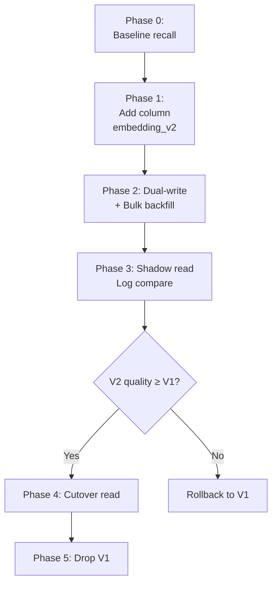

# Xử lý Stale Embeddings

## ⚡ Tóm tắt ngắn (30s)
* **Stale embedding** = embedding không còn phản ánh nội dung hiện tại hoặc không tương thích với model query → retrieval recall giảm dần theo thời gian.
* **3 nguyên nhân chính**:
  1. **Content đã update nhưng embedding chưa re-compute** (bug pipeline).
  2. **Embedding model đã upgrade** (text-embedding-ada-002 → text-embedding-3) nhưng chỉ migrate một phần.
  3. **Drift của domain**: terminology công ty đổi, sản phẩm rename, model train cũ không hiểu term mới.
* **Quy tắc Senior**:
  1. **Detect**: monitor recall trên golden set; checksum (`content_hash`) cho mỗi chunk.
  2. **Re-embed on update**: pipeline event-driven, không phải cron.
  3. **Model migration plan**: dual-write → shadow read → cutover (zero downtime).
  4. **Periodic refresh**: định kỳ re-embed all (yearly hoặc khi domain drift).
* **Thảm họa thực chiến**: Team upgrade embedding model text-embedding-3-large, re-embed mới docs nhưng quên cron migrate cũ → 70% data dùng model cũ, 30% model mới. Recall@5 từ 87% xuống 61%. Senior fix: bulk re-embed background job + verify trên golden set trước cutover.

---

## 🔍 Chi tiết bản chất

### 1. Loại stale

**(a) Content stale**: doc đã edit nhưng chunks/embedding chưa update.
```
documents.updated_at = 2026-05-20
rag_chunks.updated_at = 2026-05-01   ← stale
```

Cause: webhook bị miss, cron skip, race condition.

**(b) Model stale**: embedding sinh ra bởi model V1 nhưng query đang dùng model V2.
```
chunks[0].embedding_model = "text-embedding-ada-002"   ← V1
chunks[1].embedding_model = "text-embedding-3-large"   ← V2
```

Query với V2 sẽ retrieve được chunks V2 đúng, nhưng chunks V1 trong cùng collection sẽ sai (distribution khác).

**(c) Domain drift**: model train cũ không hiểu term mới. E.g. công ty đổi tên sản phẩm "Acme Pro" → "Acme Studio". Doc cũ embed có "Acme Pro" → query "Acme Studio" không match.

### 2. Detect stale

**Content stale**:
```sql
SELECT d.id, d.updated_at AS doc_updated, MAX(c.updated_at) AS chunk_updated
FROM documents d
JOIN rag_chunks c ON c.doc_id = d.id
GROUP BY d.id, d.updated_at
HAVING d.updated_at > MAX(c.updated_at);
```

Hoặc compare `content_hash`:
```sql
SELECT d.id FROM documents d
JOIN rag_chunks c ON c.doc_id = d.id
WHERE d.content_hash != c.content_hash;
```

**Model stale**: check `embedding_model_version` column:
```sql
SELECT embedding_model_version, COUNT(*)
FROM rag_chunks
GROUP BY embedding_model_version;
```

Nếu thấy multiple version → đang trong migration phase, cần finish.

**Domain drift**: monitor recall@5 trên golden set theo tuần. Drop > 5% → có thể drift.

### 3. Fix strategies

**For content stale**: re-process via webhook + sweep job.

**For model stale**: dual-write + shadow read + cutover.

**For domain drift**: 
* Add synonym mapping trong query rewrite.
* Re-embed với model mới (cập nhật hơn).
* Hoặc fine-tune embedding trên domain data.

### 4. Migration plan model upgrade

```
Phase 0 (baseline): Eval current recall@5
Phase 1 (preparation):
  - Schema: add column embedding_v2
  - Add index hnsw on embedding_v2
Phase 2 (dual-write):
  - Mọi ingest mới: write both embedding (V1) + embedding_v2 (V2)
  - Bulk re-embed historical → fill embedding_v2
Phase 3 (shadow read):
  - Query both columns
  - Log similarity, recall comparison
  - Validate V2 không worse than V1
Phase 4 (cutover):
  - Switch read sang embedding_v2
  - Keep embedding (V1) thêm 1 tuần làm rollback safety
Phase 5 (cleanup):
  - DROP column embedding
  - Update docs / runbooks
```

### 5. Periodic refresh

Even without model upgrade, re-embed có thể:
* Adapt với new terminology trong corpus.
* Pick up improved model nếu cùng tên (provider có thể update silently).
* Clean residual stale từ bug nhỏ.

Schedule: quarterly hoặc khi recall drift.

---

## 🎨 Sơ đồ migration



---

## 💻 Code thực chiến

### 1. Schema để track model version

```sql
ALTER TABLE rag_chunks
    ADD COLUMN content_hash TEXT NOT NULL,
    ADD COLUMN embedding_model_version TEXT NOT NULL,
    ADD COLUMN updated_at TIMESTAMPTZ DEFAULT NOW();

CREATE INDEX rag_chunks_hash_idx ON rag_chunks (doc_id, content_hash);
CREATE INDEX rag_chunks_model_version_idx ON rag_chunks (embedding_model_version);
```

### 2. Detect stale chunks job

```java
package com.example.rag.staleness;

import org.springframework.stereotype.Service;
import org.springframework.scheduling.annotation.Scheduled;
import org.springframework.jdbc.core.JdbcTemplate;
import java.util.*;

@Service
public class StalenessDetector {

    private final JdbcTemplate jdbc;
    private final ReembeddingService reembed;

    @Scheduled(cron = "0 */15 * * * *")  // every 15 min
    public void detectAndFixContentStale() {
        List<UUID> staleDocIds = jdbc.queryForList("""
            SELECT DISTINCT d.id
            FROM documents d
            JOIN rag_chunks c ON c.doc_id = d.id
            WHERE d.content_hash != c.content_hash
              AND d.deleted_at IS NULL
            """, UUID.class);

        log.info("Found {} stale documents", staleDocIds.size());

        for (UUID docId : staleDocIds) {
            try {
                reembed.reembed(docId);
            } catch (Exception e) {
                log.error("Failed to re-embed doc {}", docId, e);
            }
        }
    }

    @Scheduled(cron = "0 0 4 * * SUN")  // weekly Sun 4AM
    public void detectModelDistribution() {
        var counts = jdbc.queryForList(
            "SELECT embedding_model_version, COUNT(*) FROM rag_chunks GROUP BY 1");
        log.info("Model version distribution: {}", counts);

        // Alert nếu multiple version đang co-exist quá lâu
        if (counts.size() > 1) {
            alert("Multiple embedding model versions detected — migration not complete");
        }
    }

    private void alert(String msg) { /* page on-call */ }
    private static final org.slf4j.Logger log = org.slf4j.LoggerFactory.getLogger(StalenessDetector.class);
}
```

### 3. Dual-write trong migration

```java
package com.example.rag.migration;

import org.springframework.stereotype.Service;
import org.springframework.beans.factory.annotation.Value;

@Service
public class DualWriteEmbeddingService {

    private final EmbeddingService oldModel;
    private final EmbeddingService newModel;
    private final JdbcTemplate jdbc;

    @Value("${rag.migration.phase}")  // dual-write | shadow | cutover
    private String phase;

    public void embedChunk(UUID docId, int chunkIdx, String text) {
        switch (phase) {
            case "dual-write" -> {
                float[] v1 = oldModel.embed(text);
                float[] v2 = newModel.embed(text);
                jdbc.update("""
                    INSERT INTO rag_chunks (doc_id, chunk_idx, text, embedding, embedding_v2,
                                           embedding_model_version)
                    VALUES (?, ?, ?, ?::vector, ?::vector, 'v1+v2')
                    """, docId, chunkIdx, text, toPgvec(v1), toPgvec(v2));
            }
            case "shadow", "cutover" -> {
                float[] v2 = newModel.embed(text);
                jdbc.update("""
                    INSERT INTO rag_chunks (doc_id, chunk_idx, text, embedding_v2,
                                           embedding_model_version)
                    VALUES (?, ?, ?, ?::vector, 'v2')
                    """, docId, chunkIdx, text, toPgvec(v2));
            }
        }
    }

    private String toPgvec(float[] v) { return ""; }
}
```

### 4. Shadow read comparison

```java
@Service
public class ShadowReadService {

    private final EmbeddingService oldModel;
    private final EmbeddingService newModel;
    private final NamedParameterJdbcTemplate jdbc;
    private final MetricsService metrics;

    public List<Chunk> search(String query, UUID tenantId, int topK) {
        float[] vOld = oldModel.embed(query);
        float[] vNew = newModel.embed(query);

        var resultsOld = searchWith(vOld, "embedding", tenantId, topK);
        var resultsNew = searchWith(vNew, "embedding_v2", tenantId, topK);

        // Log comparison
        double overlap = computeOverlap(resultsOld, resultsNew);
        metrics.gauge("rag.shadow.overlap", overlap);

        // Serve old (active) but log new for eval
        return resultsOld;
    }

    private List<Chunk> searchWith(float[] vec, String col, UUID tid, int k) { return List.of(); }
    private double computeOverlap(List<Chunk> a, List<Chunk> b) {
        Set<String> idsA = a.stream().map(c -> c.id().toString()).collect(java.util.stream.Collectors.toSet());
        long overlap = b.stream().filter(c -> idsA.contains(c.id().toString())).count();
        return (double) overlap / Math.max(a.size(), 1);
    }
    record Chunk(UUID id, String text, double sim) {}
}
```

### 5. Bulk re-embedding job

```python
# bulk_reembed.py
import os
from openai import OpenAI
import psycopg2
from tqdm import tqdm

client = OpenAI()
conn = psycopg2.connect(os.environ["DATABASE_URL"])

BATCH_SIZE = 100
NEW_MODEL = "text-embedding-3-large"

cur = conn.cursor()
cur.execute("""
    SELECT id, text FROM rag_chunks
    WHERE embedding_model_version != %s
      AND deleted_at IS NULL
    ORDER BY id
""", (NEW_MODEL,))

batch = []
for row_id, text in tqdm(cur):
    batch.append((row_id, text))
    if len(batch) >= BATCH_SIZE:
        process_batch(batch)
        batch = []

if batch:
    process_batch(batch)

def process_batch(rows):
    texts = [r[1] for r in rows]
    resp = client.embeddings.create(input=texts, model=NEW_MODEL)
    
    with conn.cursor() as cur2:
        for (row_id, _), emb_data in zip(rows, resp.data):
            cur2.execute("""
                UPDATE rag_chunks
                SET embedding_v2 = %s::vector,
                    embedding_model_version = %s,
                    updated_at = NOW()
                WHERE id = %s
            """, (emb_data.embedding, NEW_MODEL, row_id))
    conn.commit()
```

---

## 📊 Bảng patterns

| Stale type | Detection | Fix | TTL |
| :--- | :--- | :--- | :--- |
| Content (hash mismatch) | Hash comparison cron 15 min | Re-embed atomic | Realtime |
| Model version | Periodic distribution check | Dual-write migration | Weeks |
| Domain drift | Recall@5 monitoring weekly | Query rewrite / re-embed | Quarterly |
| Orphan chunks (deleted doc) | Cross-check source doc list | Hard delete | Monthly |

---

## ⚠️ Common Gotchas & Questions follow-up

### 1. Cạm bẫy: Re-embed thiếu sót
* **Vấn đề**: Bulk job re-embed 1M chunks. Job fail giữa chừng (provider 429). Restart không track progress → re-do từ đầu, hoặc skip phần đã làm.
* **Giải pháp**: Job checkpoint trong DB (`last_processed_id`). Restart từ checkpoint. Idempotent.

### 2. Cạm bẫy: Quên invalidate cache khi re-embed
* **Vấn đề**: Sau re-embed, vector DB updated. Nhưng Redis semantic cache vẫn cache result cũ.
* **Giải pháp**: Invalidate cache theo `doc_id` khi re-embed.

### 3. Cạm bẫy: Cost re-embed surprises
* **Vấn đề**: 100M chunks × $0.13/1M token × ~500 token/chunk = ~$6500 one-time. Không budget.
* **Giải pháp**: Plan migration với budget approved. Hoặc chọn model cheap hơn (text-embedding-3-small).

### 4. Câu hỏi đào sâu từ interviewer
* **Interviewer: "Upgrade embedding model nhưng provider không nói rõ training data có thay đổi không. Bạn assess thế nào?"**
* **Trả lời Senior**:
  1. **Đọc model card + release note**: provider thường ghi.
  2. **Benchmark trên golden set**: chạy cả model V1 + V2 trên golden set → so sánh recall@5, MRR, NDCG.
  3. **Domain-specific test**: nếu domain bạn (e.g. legal) không trong public benchmark → tự test.
  4. **Distribution comparison**: embed sample 1k doc với cả 2 model, plot distribution. Big shift = warning.
  5. **Cost-benefit**: V2 cost cao hơn? Quality gain có justify?
  6. **A/B test trong production**: 5% traffic V2, monitor business metric (CSAT, conversion). Decide rollout sau 1-2 tuần data.
  7. **Rollback plan**: dual-write giữ V1 trong 1 tháng để rollback dễ.
