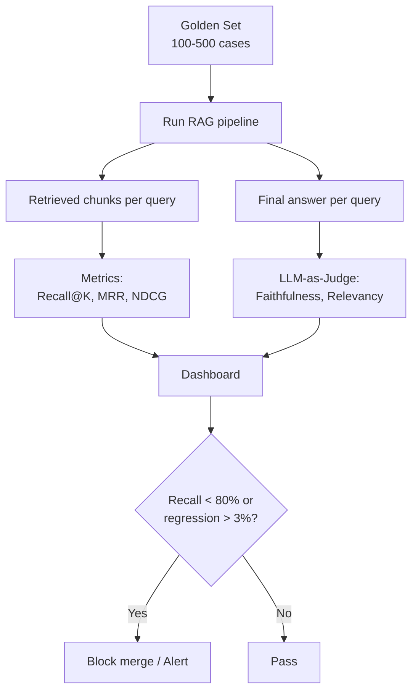

# Đánh giá Chất lượng Retrieval

## ⚡ Tóm tắt ngắn (30s)
* **Eval retrieval là sống còn**. Không đo = không biết RAG hoạt động ra sao. Có thể đo các metric:
  1. **Recall@K**: tỷ lệ golden chunk nằm trong top-K.
  2. **Precision@K**: tỷ lệ chunk trong top-K thực sự relevant.
  3. **MRR (Mean Reciprocal Rank)**: 1/position của correct chunk.
  4. **NDCG@K**: weighted by position + relevance score.
  5. **Hit Rate**: có ít nhất 1 chunk relevant trong top-K.
* **Pre-requisite**: cần **golden set** (50-500 cases: question + correct chunk_ids). Đầu tư xây golden set là ROI cao nhất của RAG project.
* **Tools**: Ragas, TruLens, LangSmith Eval, Promptfoo, custom scripts.
* **Cấp độ đánh giá**:
  * **Component-level**: chỉ đo retrieval (recall, MRR).
  * **End-to-end**: đo final answer (LLM-as-judge, semantic similarity, human eval).
* **Thảm họa thực chiến**: Team không có eval. Khi user phàn nàn "RAG sai" → không biết bug ở retrieval (miss chunk) hay generation (LLM hallucinate). Mất 2 ngày trial-and-error. Sau khi xây golden set 100 case + Ragas pipeline → mỗi prompt change có metric report trong 5 phút.

---

## 🔍 Chi tiết metrics

### 1. Recall@K

```
Recall@K = (số golden chunks trong top-K) / (tổng golden chunks)
```

Đơn giản hóa khi mỗi câu hỏi có 1 golden chunk:
```
Recall@K = (1 nếu golden in top-K else 0) — gọi là Hit Rate
```

Tốt nhất ~0.9+. Dưới 0.7 = retrieval bị issue.

### 2. Precision@K

```
Precision@K = (số chunks relevant trong top-K) / K
```

Cần annotated relevance cho mọi chunk top-K (nhiều effort). Hoặc dùng LLM-as-judge để score relevance.

### 3. MRR (Mean Reciprocal Rank)

```
MRR = mean(1 / rank_of_first_relevant_chunk)
```

Nếu golden chunk ở rank 1 → 1.0; rank 5 → 0.2; rank 10 → 0.1; không trong top-K → 0.

MRR thưởng correct chunk ở vị trí cao → quan trọng vì LLM thường đọc top-2-3 nặng nhất.

### 4. NDCG@K (Normalized Discounted Cumulative Gain)

Phức tạp hơn — handle multi-level relevance (highly/somewhat/not relevant):
```
DCG@K = Σ (2^rel_i - 1) / log2(i + 1)
NDCG@K = DCG@K / IDCG@K  (normalize bởi best possible ordering)
```

NDCG ~0.85+ cho production-quality RAG.

### 5. End-to-end metrics (Ragas framework)

**Faithfulness**: response có grounded trong retrieved context không (anti-hallucination).
**Answer Relevancy**: response có relevant với question không.
**Context Precision**: context có chứa info trả lời question không (signal-to-noise).
**Context Recall**: tất cả thông tin để trả lời có trong context không.
**Answer Correctness**: ground truth answer comparison.

### 6. Xây golden set

Quy trình:
1. Curate từ real user queries (support ticket, search log).
2. Mỗi case: `{question, correct_chunk_ids, expected_answer}`.
3. 50-100 đủ POC, 200-500 cho production.
4. Cover edge case: empty query, very long, multilingual, adversarial.
5. Refresh hàng quý.

### 7. Continuous eval

```
Mỗi prompt/model/index change → CI chạy eval suite → block merge nếu recall drop > 3%.
Mỗi ngày → cron eval trên golden set + sample production traces → dashboard.
```

---

## 🎨 Sơ đồ pipeline eval



---

## 💻 Code thực chiến

### 1. Golden set structure

```json
[
  {
    "id": "q_001",
    "question": "Chính sách hoàn tiền sau 30 ngày?",
    "correct_chunk_ids": ["chunk_42", "chunk_103"],
    "expected_answer": "Không áp dụng hoàn tiền sau 30 ngày, trừ trường hợp lỗi từ phía công ty.",
    "tags": ["refund", "policy"],
    "difficulty": "easy"
  },
  {
    "id": "q_002",
    "question": "Cách trả về sản phẩm bị lỗi đối với Hà Nội?",
    "correct_chunk_ids": ["chunk_55"],
    "expected_answer": "...",
    "tags": ["return", "regional"],
    "difficulty": "medium"
  }
]
```

### 2. Recall + MRR eval (Python)

```python
import json
from typing import Callable

def evaluate_retrieval(golden_set: list[dict], retrieve_fn: Callable, k: int = 5) -> dict:
    """
    retrieve_fn: takes question, returns list of chunk_ids (sorted by relevance).
    """
    recalls = []
    rrs = []  # reciprocal ranks
    hit_rates = []
    
    for case in golden_set:
        retrieved = retrieve_fn(case["question"])
        top_k = retrieved[:k]
        correct = set(case["correct_chunk_ids"])
        
        # Recall@K
        hits = len(set(top_k) & correct)
        recall = hits / len(correct) if correct else 0
        recalls.append(recall)
        
        # Hit Rate
        hit_rates.append(1 if hits > 0 else 0)
        
        # MRR
        rr = 0
        for i, cid in enumerate(top_k):
            if cid in correct:
                rr = 1 / (i + 1)
                break
        rrs.append(rr)
    
    return {
        "recall@k": sum(recalls) / len(recalls),
        "hit_rate@k": sum(hit_rates) / len(hit_rates),
        "mrr": sum(rrs) / len(rrs),
        "n": len(golden_set)
    }

# Usage
golden = json.load(open("golden_set.json"))
result = evaluate_retrieval(golden, my_rag_retrieve_fn, k=5)
print(result)
```

### 3. Ragas end-to-end eval

```python
from ragas import evaluate
from ragas.metrics import faithfulness, answer_relevancy, context_precision, context_recall
from datasets import Dataset

# Build dataset
data = {
    "question": [c["question"] for c in golden],
    "answer": [run_rag(c["question"]) for c in golden],  # actual RAG response
    "contexts": [retrieve_chunks(c["question"]) for c in golden],
    "ground_truth": [c["expected_answer"] for c in golden],
}
dataset = Dataset.from_dict(data)

result = evaluate(
    dataset,
    metrics=[faithfulness, answer_relevancy, context_precision, context_recall]
)
print(result)
# {'faithfulness': 0.87, 'answer_relevancy': 0.91, 'context_precision': 0.83, ...}
```

### 4. Java integration test với Spring Boot

```java
package com.example.rag.eval;

import org.junit.jupiter.api.Test;
import org.springframework.boot.test.context.SpringBootTest;
import com.fasterxml.jackson.core.type.TypeReference;
import com.fasterxml.jackson.databind.ObjectMapper;
import java.io.InputStream;
import java.util.*;

@SpringBootTest
class RagEvalTest {

    @org.springframework.beans.factory.annotation.Autowired RagService rag;

    @Test
    void recallAt5ShouldBeAbove80() throws Exception {
        InputStream is = getClass().getResourceAsStream("/golden_set.json");
        List<GoldenCase> goldenSet = new ObjectMapper().readValue(
            is, new TypeReference<List<GoldenCase>>(){});

        int hits = 0;
        double mrrSum = 0;
        for (GoldenCase c : goldenSet) {
            var retrieved = rag.retrieve(c.question(), 5);
            var retrievedIds = retrieved.stream().map(r -> r.id().toString()).toList();

            boolean hit = c.correctChunkIds().stream().anyMatch(retrievedIds::contains);
            if (hit) hits++;

            for (int i = 0; i < retrievedIds.size(); i++) {
                if (c.correctChunkIds().contains(retrievedIds.get(i))) {
                    mrrSum += 1.0 / (i + 1);
                    break;
                }
            }
        }

        double hitRate = (double) hits / goldenSet.size();
        double mrr = mrrSum / goldenSet.size();

        System.out.println("Hit Rate @5: " + hitRate);
        System.out.println("MRR: " + mrr);

        // Assert: must be >= 80%
        org.junit.jupiter.api.Assertions.assertTrue(hitRate >= 0.80,
            "Recall regression: " + hitRate);
    }

    public record GoldenCase(String id, String question, List<String> correctChunkIds,
                              String expectedAnswer) {}
}
```

### 5. LangSmith eval — Production observability

```python
from langsmith import Client
from langsmith.evaluation import evaluate

client = Client()

def my_rag(inputs: dict) -> dict:
    return {"answer": run_rag(inputs["question"])}

def correctness_evaluator(run, example) -> dict:
    """Compare RAG answer with ground truth."""
    expected = example.outputs["answer"]
    actual = run.outputs["answer"]
    # Use LLM-as-judge or embedding similarity
    score = compute_similarity(expected, actual)
    return {"score": score}

results = evaluate(
    my_rag,
    data="golden-set-v3",  # dataset stored in LangSmith
    evaluators=[correctness_evaluator],
    experiment_prefix="rag-eval-2026-05-23",
)
```

---

## 📊 Bảng so sánh metrics

| Metric | Cần golden set? | Cần human label? | Cấp độ | Khi dùng |
| :--- | :---: | :---: | :--- | :--- |
| Recall@K | ✓ | ✓ (chunk-level) | Retrieval | Basic, core |
| MRR | ✓ | ✓ | Retrieval | Position matters |
| NDCG@K | ✓ | ✓ (graded) | Retrieval | Multi-level relevance |
| Hit Rate | ✓ | ✓ | Retrieval | Đơn giản nhất |
| Faithfulness (Ragas) | Optional | ✗ (LLM-judge) | E2E | Anti-hallucination |
| Answer Relevancy | ✗ | ✗ | E2E | Quality answer |
| Context Precision/Recall | ✓ | ✗ | E2E | Đánh giá pipeline |
| Human eval | ✗ | ✓ | E2E | Gold standard, expensive |

---

## ⚠️ Common Gotchas & Questions follow-up

### 1. Cạm bẫy: Golden set bias
* **Vấn đề**: Curate từ team mình → bias câu hỏi internal. Real user query khác hoàn toàn.
* **Giải pháp**: Sample từ production logs (anonymized). Annotate kỹ. Cover edge cases.

### 2. Cạm bẫy: Eval cứng nhắc
* **Vấn đề**: Chỉ đo recall@5. Bỏ qua precision và end-to-end.
* **Giải pháp**: Multi-metric. Recall + MRR + Faithfulness + user feedback.

### 3. Cạm bẫy: Eval không catch regression slow
* **Vấn đề**: Run eval 1 lần khi launch. 6 tháng sau drift mới phát hiện.
* **Giải pháp**: 
  1. Daily cron eval → dashboard.
  2. Alert recall drop > 5%.
  3. Sample production trace daily, manually review 20 random cases/tuần.

### 4. Câu hỏi đào sâu từ interviewer
* **Interviewer: "Recall@5 = 85% sounds tốt. Nhưng user vẫn không hài lòng. Bạn investigate thế nào?"**
* **Trả lời Senior**:
  1. **Disconnect retrieval vs generation**: 
     - Retrieval OK (top-5 có golden chunk).
     - LLM hallucinate hoặc miss highlight chính ngay trong context.
  2. **End-to-end eval**: chạy Ragas Faithfulness + Answer Relevancy. Nếu Faithfulness thấp → LLM bịa.
  3. **Manual review**: take 50 user complaints, đọc Q/retrieval/answer cụ thể.
  4. **Categorize failures**:
     - Type 1: Retrieval miss (recall < 5).
     - Type 2: Retrieval hit nhưng LLM ignore.
     - Type 3: Retrieval hit nhưng chunk thiếu context (chunking bad).
     - Type 4: Retrieval hit nhưng có conflict info trong top-K.
  5. **Fix theo type**:
     - Type 1: chunk strategy / embedding model / hybrid.
     - Type 2: prompt enforce citation, JSON format.
     - Type 3: chunk size tune, overlap, hierarchical.
     - Type 4: rerank, conflict resolution prompt.
  6. **Iterate** mỗi week, measure progress.
