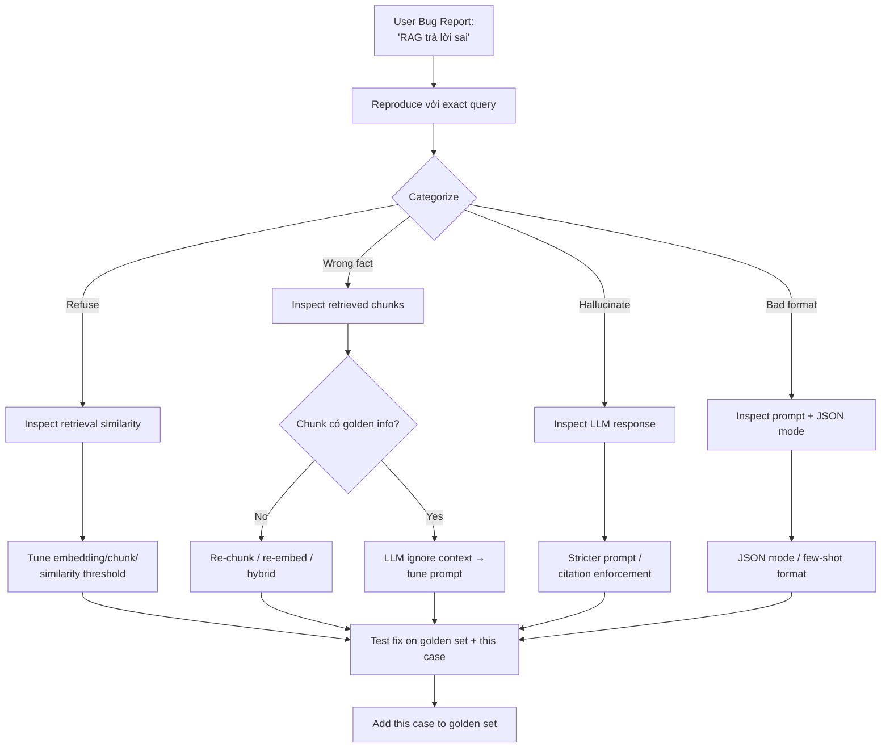

# Debug khi RAG trả lời Sai

## ⚡ Tóm tắt ngắn (30s)
* **Quy trình Senior debug RAG sai 7 bước**:
  1. **Reproduce**: lấy exact query + user context, replay trong dev/staging.
  2. **Phân loại loại sai**: retrieval miss / retrieval hit but LLM ignore / hallucinate / format bug.
  3. **Inspect retrieval**: log top-K chunks + similarity scores. Có chứa golden chunk không?
  4. **Inspect prompt**: full prompt LLM nhận. Context có đủ không?
  5. **Inspect LLM response**: raw output. So với prompt → LLM hiểu gì?
  6. **Form hypothesis + fix**.
  7. **Add test case vào golden set** để prevent regression.
* **Tools**: LangSmith / Langfuse trace, log full prompt + response trong S3, replay script.
* **Thảm họa thực chiến**: User phàn nàn "RAG bịa số liệu doanh thu". Team đoán LLM hallucinate → tune prompt 2 ngày → vẫn sai. Hóa ra retrieval miss chunk đúng (chunk title có "doanh thu Q1 2025" nhưng query nói "revenue Q1" — embedding multilingual model không khớp). Senior fix: switch embedding sang bge-m3 multilingual → đúng.

---

## 🔍 Chi tiết quy trình debug

### 1. Reproduce — Bước đầu tiên

Cần lấy:
* **Exact query** user nhập.
* **User context**: tenant_id, roles, language.
* **Timestamp**: để check state vector DB lúc đó (nếu đã ingest doc mới).
* **Session ID**: để xem multi-turn context.

Replay với production data hoặc snapshot.

### 2. Phân loại loại sai

Đọc kỹ response của user và compare với expected:

| Symptom | Possible cause |
| :--- | :--- |
| "Tôi không tìm thấy thông tin" | Retrieval miss / similarity threshold |
| Trả lời với data sai | Retrieved chunk có data sai, hoặc LLM bịa |
| Trả lời lan man, không relevant | LLM được context noisy |
| Citation tới doc không tồn tại | LLM hallucinate citation |
| Output sai format | Prompt schema chưa enforced |
| Delay quá lâu | Latency issue, không phải accuracy |

### 3. Inspect retrieval

Log retrieval cho query cụ thể:
```json
{
  "query": "Cách hoàn tiền cho đơn hàng lỗi?",
  "embedding_distance": [0.18, 0.22, 0.25, 0.28, 0.32],
  "top_k": [
    {"id": "c_42", "doc_id": "d_5", "text": "...", "sim": 0.82},
    {"id": "c_103", "doc_id": "d_7", "text": "...", "sim": 0.78}
  ]
}
```

Check:
* Top-K có chứa golden chunk không?
* Similarity scores có hợp lý không (>0.7 cho top-1)?
* Có chunk nào "noise" trong top-K không?

### 4. Inspect prompt

Đôi khi bug là prompt không build đúng:
```
SYSTEM: ...
CONTEXT:
[doc:5 chunk:42] (empty text)   ← chunk text bị trắng!
[doc:7 chunk:103] ...

QUESTION: ...
```

Hoặc:
```
CONTEXT:
[doc:5 chunk:42] ...nội dung dài 5000 token, lost in middle...

QUESTION: ...
```

Senior copy full prompt vào file, đọc như user.

### 5. Inspect LLM response

Raw response từ LLM:
```json
{
  "finish_reason": "stop",
  "content": "Theo điều 5.3 của chính sách hoàn tiền...",
  "tool_calls": null
}
```

Compare với context:
* Citation `điều 5.3` có thực sự trong context không?
* Số liệu có khớp không?

### 6. Hypothesis & Fix

Sau khi inspect, build hypothesis:
* "Embedding model multilingual không tốt cho query EN/doc VN" → test bge-m3.
* "Chunk quá lớn → context bị diluted" → smaller chunks.
* "Prompt không strict đủ" → thêm "ONLY answer from context".

Test fix trên golden set + case này → verify trước deploy.

### 7. Add to golden set

Mọi production bug → thêm vào golden set để regression test catch tương lai.

---

## 🎨 Sơ đồ debug



---

## 💻 Code thực chiến

### 1. Trace logging — Full RAG state

```java
package com.example.rag.debug;

import org.springframework.stereotype.Service;
import java.util.*;

@Service
public class RagTraceService {

    private final ObjectMapper mapper = new ObjectMapper();
    private final S3Client s3;

    public void logTrace(String requestId, RagTrace trace) {
        try {
            String json = mapper.writeValueAsString(trace);
            // Lưu vào S3 cho replay/forensic
            s3.putObject(builder -> builder
                .bucket("rag-traces")
                .key("traces/" + LocalDate.now() + "/" + requestId + ".json"),
                RequestBody.fromString(json));
        } catch (Exception e) {
            log.error("Failed to save trace", e);
        }
    }

    public record RagTrace(
        String requestId,
        String userId,
        String tenantId,
        String query,
        List<RetrievedChunk> retrieved,
        String prompt,
        String response,
        List<String> citations,
        long latencyMs,
        Map<String,Object> metadata
    ) {}

    public record RetrievedChunk(String chunkId, String docId, String text,
                                  double similarity, Map<String,Object> aclMetadata) {}
    private static final org.slf4j.Logger log = org.slf4j.LoggerFactory.getLogger(RagTraceService.class);
}
```

### 2. Replay script — Debug locally

```python
# replay.py
import boto3, json, sys
from rag_service import run_rag

s3 = boto3.client('s3')

def replay(request_id: str):
    obj = s3.get_object(Bucket="rag-traces", Key=f"traces/2026-05-23/{request_id}.json")
    trace = json.loads(obj['Body'].read())
    
    print(f"Query: {trace['query']}")
    print(f"User: {trace['userId']}")
    print(f"Original retrieval:")
    for chunk in trace['retrieved']:
        print(f"  [{chunk['chunkId']}] sim={chunk['similarity']:.2f}")
    print(f"Original response:\n{trace['response']}\n")
    
    # Re-run với current code
    print("Re-running with current code...")
    new_result = run_rag(trace['query'], trace['userId'], trace['tenantId'])
    print(f"New response:\n{new_result['answer']}\n")
    
    # Diff
    if new_result['answer'] != trace['response']:
        print("⚠️  Response CHANGED")
    else:
        print("Response same")

if __name__ == "__main__":
    replay(sys.argv[1])
```

### 3. Trace inspector — LangSmith Python

```python
from langsmith import Client

client = Client()

def inspect_trace(trace_id: str):
    """Pull full trace from LangSmith, print structured info."""
    run = client.read_run(trace_id)
    
    print(f"=== Trace {trace_id} ===")
    print(f"Latency: {run.latency_ms}ms")
    print(f"Cost: ${run.total_cost}")
    
    for child in client.list_runs(parent_run_id=trace_id):
        if child.name == "vector_search":
            print(f"\n[Vector Search] {child.latency_ms}ms")
            print(f"Top-K:")
            for hit in child.outputs.get("hits", []):
                print(f"  - {hit['id']}: sim={hit['similarity']:.2f}")
        elif child.name == "llm_call":
            print(f"\n[LLM Call] {child.latency_ms}ms tokens={child.outputs.get('tokens')}")
            print(f"Prompt (first 500 chars):\n{child.inputs['prompt'][:500]}")
            print(f"Response:\n{child.outputs['content']}")
```

### 4. A/B comparison giữa version

```python
def compare_versions(query: str, version_a: dict, version_b: dict):
    """Run same query through 2 RAG configs, compare."""
    result_a = run_rag(query, **version_a)
    result_b = run_rag(query, **version_b)
    
    print(f"Query: {query}\n")
    print("=== Version A ===")
    print(f"Top chunks: {[r['id'] for r in result_a['retrieval']]}")
    print(f"Answer:\n{result_a['answer']}\n")
    
    print("=== Version B ===")
    print(f"Top chunks: {[r['id'] for r in result_b['retrieval']]}")
    print(f"Answer:\n{result_b['answer']}\n")
    
    # Show diff
    overlap = set(r['id'] for r in result_a['retrieval']) & \
              set(r['id'] for r in result_b['retrieval'])
    print(f"Chunk overlap: {len(overlap)}")
```

---

## 📊 Bảng triage common bugs

| Symptom | Likely cause | Fix |
| :--- | :--- | :--- |
| "Không tìm thấy" cho query rõ | Embedding miss / chunk size | Re-chunk, hybrid search, semantic threshold |
| Trả số sai | Retrieved chunk có số sai HOẶC LLM bịa | Validate retrieval, prompt strict |
| Lan man, lạc đề | Context nhiều noise | Rerank, top-K nhỏ hơn |
| Citation fake | LLM hallucinate citation | Validate citation tồn tại |
| Cross-tenant leak | ACL filter miss | RLS + penetration test |
| Slow | Vector DB / Rerank / LLM bottleneck | Profile từng span |
| Stale answer | Index chưa update | Re-ingest, invalidate cache |

---

## ⚠️ Common Gotchas & Questions follow-up

### 1. Cạm bẫy: Skip step "phân loại loại sai"
* **Vấn đề**: Đoán bug là LLM → tune prompt nhiều ngày → vẫn sai vì retrieval miss.
* **Giải pháp**: Phân loại trước, fix sau. Inspect retrieval + prompt + response riêng.

### 2. Cạm bẫy: Fix bug 1 case, break case khác
* **Vấn đề**: Tune chunk size cho 1 query → recall@5 trên 100 query khác giảm.
* **Giải pháp**: Mọi fix run golden set trước/sau, compare. Block nếu regression.

### 3. Cạm bẫy: Không lưu trace
* **Vấn đề**: User report bug tuần trước. Không có log → không reproduce được.
* **Giải pháp**: 
  1. Trace mọi RAG request (sampled hoặc full).
  2. Retention 30+ ngày.
  3. Searchable theo user_id, query hash.

### 4. Câu hỏi đào sâu từ interviewer
* **Interviewer: "Bạn fix bug retrieval xong. Làm sao tránh regression sau này?"**
* **Trả lời Senior**:
  1. **Add to golden set**: bug case → golden_set với expected output. CI sẽ catch.
  2. **Eval pipeline CI**: mọi PR đụng prompt/code RAG → run eval → block nếu regression > 3%.
  3. **Daily prod monitoring**: cron eval trên golden set production env → dashboard.
  4. **Sample production traces**: review 20 random/tuần manually.
  5. **User feedback loop**: thumbs up/down rate, click into response. Drop = signal.
  6. **Postmortem**: document root cause + fix + prevention. Share với team để học.
  7. **Adversarial test**: thêm "weird queries" vào golden set: empty, very long, multilingual, special chars, prompt injection attempts.
