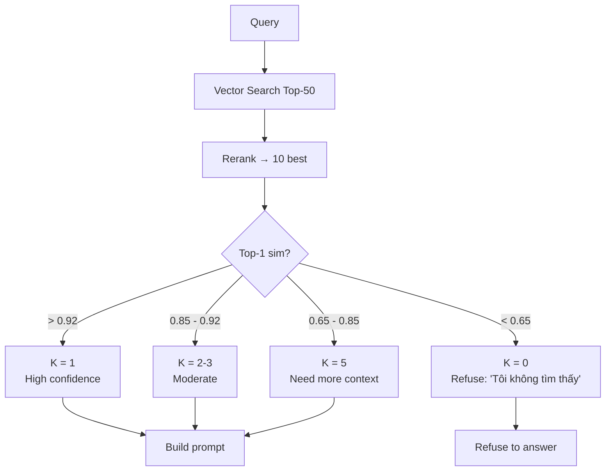

# Top-K Retrieval nên chọn như thế nào

## ⚡ Tóm tắt ngắn (30s)
* **Top-K = số chunks trả về từ retrieval để đưa vào prompt LLM**. Quá ít → miss info; quá nhiều → noise + cost + lost in middle.
* **Quy tắc Senior cho K**:
  * **Sau rerank**: 3-5 chunks. LLM tập trung tốt, ít noise.
  * **Trước rerank**: 20-100 candidates. Đủ rộng cho rerank chọn được top quality.
  * **Token budget**: tổng `K × chunk_size ≤ 4000-8000 token` (để chừa cho system prompt + question + output).
* **Adaptive K**:
  * Top-1 nếu similarity của top-1 > 0.9 (high confidence).
  * Top-5 nếu similarity < 0.7 (uncertain, cần nhiều ngữ cảnh).
  * Top-3 default.
* **Thảm họa thực chiến**: Team set K = 20 để "bơm nhiều context". Output token tăng (LLM diluted), cost x4, p99 latency tăng 60%, accuracy giảm 8% vì lost in middle. Senior fix: K = 5 sau rerank → cost giảm, accuracy tăng.

---

## 🔍 Chi tiết

### 1. Trade-off K nhỏ vs lớn

```
K = 1:    ✓ Focused
          ✗ Miss nếu retrieval không perfect
          ✗ Không có "second opinion"

K = 3-5:  ✓ Sweet spot
          ✓ Có dự phòng nếu top-1 sai
          ✗ Cần rerank để precision cao

K = 10+:  ✗ Lost in middle
          ✗ Cost cao
          ✗ Noise dilute signal
```

### 2. Tính token budget

Context window LLM (e.g. 128k) là max. Nhưng practical budget thấp hơn:

```
Available = context_window - system_prompt - question - max_output - buffer
         = 128000 - 1000 - 500 - 2000 - 1000 = 123500 token
```

Nhưng vì **lost in middle** + cost, target thực tế:

```
RAG context budget = 4000-8000 token (đủ tốt cho 99% case)
K × avg_chunk_size = 4000-8000
K × 500 = 4000-8000
K = 8-16 candidates trước rerank
K = 3-5 sau rerank
```

### 3. Adaptive K

Quyết định K dựa trên signal:

**Theo similarity gap**:
```python
def adaptive_k(retrieved):
    """Chọn K dựa trên gap similarity."""
    if len(retrieved) == 0:
        return 0
    if retrieved[0].sim > 0.92:
        # Top-1 cực kỳ confident
        return 1
    if retrieved[0].sim > 0.85 and (retrieved[0].sim - retrieved[3].sim) > 0.15:
        # Top-1 nổi trội
        return 1
    if retrieved[0].sim < 0.6:
        # Uncertain, cần nhiều context
        return 5
    return 3  # default
```

**Theo question complexity**:
* Simple factual Q ("Giá iPhone 16?") → K = 1-2.
* Multi-hop Q ("So sánh chính sách hoàn tiền giữa product A và B") → K = 5-10.

### 4. K trước vs sau rerank

```
Vector search top-50 (cast wide net)
   ↓
Rerank top-50 → top-5
   ↓
top-5 vào LLM
```

* Top-50 trước rerank: tradeoff recall vs latency rerank.
* Top-5 sau rerank: precision cao.

K trước rerank không cần optimize precision (chỉ cần recall).

### 5. Khi nào tăng K

* User feedback "answer thiếu thông tin" → tăng K.
* Multi-aspect question → tăng K.
* Complex doc structure → tăng K.

Nhưng phải đo bằng eval, không tăng mù.

---

## 🎨 Sơ đồ adaptive K



---

## 💻 Code thực chiến

### 1. Adaptive K logic

```java
package com.example.rag.retrieval;

import org.springframework.stereotype.Service;
import java.util.*;

@Service
public class AdaptiveKSelector {

    public List<Chunk> selectTopK(List<Chunk> reranked) {
        if (reranked.isEmpty()) return List.of();

        double top1Sim = reranked.get(0).score();

        // Confidence-based threshold
        if (top1Sim < 0.50) {
            // Too low → no chunks for LLM, will refuse
            return List.of();
        }

        int k;
        if (top1Sim > 0.92) {
            k = 1;  // very confident, only top-1
        } else if (top1Sim > 0.85 && reranked.size() >= 4 &&
                   top1Sim - reranked.get(3).score() > 0.15) {
            k = 2;  // clear winner
        } else if (top1Sim > 0.70) {
            k = 3;  // default
        } else {
            k = 5;  // uncertain, gather more
        }

        return reranked.subList(0, Math.min(k, reranked.size()));
    }

    public record Chunk(String id, String text, double score) {}
}
```

### 2. Token budget guard

```java
package com.example.rag.budget;

import org.springframework.stereotype.Service;
import java.util.*;

@Service
public class ContextTruncator {

    private final TokenCounter counter;
    private static final int MAX_CONTEXT_TOKENS = 6000;

    public List<Chunk> truncateToFit(List<Chunk> chunks) {
        List<Chunk> result = new ArrayList<>();
        int totalTokens = 0;

        for (Chunk c : chunks) {
            int chunkTokens = counter.count(c.text());
            if (totalTokens + chunkTokens > MAX_CONTEXT_TOKENS) {
                break;
            }
            result.add(c);
            totalTokens += chunkTokens;
        }

        return result;
    }

    public record Chunk(String id, String text, double score) {}
}
```

### 3. Eval K across values

```python
import json

def evaluate_k_values(golden_set, retrieve_fn, llm_fn, k_values=[1, 3, 5, 10]):
    """Eval RAG end-to-end with different K."""
    results = {}
    
    for k in k_values:
        scores = []
        for case in golden_set:
            chunks = retrieve_fn(case["question"], k=k)
            answer = llm_fn(case["question"], chunks)
            score = compare_answer(answer, case["expected_answer"])
            scores.append(score)
        
        results[k] = {
            "avg_score": sum(scores) / len(scores),
            "cost_per_query": k * 0.005,  # approx
        }
    
    print("K vs Quality vs Cost:")
    for k, r in results.items():
        print(f"  K={k}: quality={r['avg_score']:.2f}, cost=${r['cost_per_query']:.4f}")
    
    return results
```

---

## 📊 Bảng K theo use case

| Use case | K trước rerank | K sau rerank | Avg chunk size | Total token |
| :--- | :---: | :---: | :---: | :---: |
| Simple FAQ | 20 | 2-3 | 300 | 600-900 |
| Multi-hop reasoning | 50 | 5-7 | 500 | 2500-3500 |
| Long doc QA | 50 | 5 | 800 | 4000 |
| Multi-step agent | 30 | 3 | 500 | 1500 |
| Compliance review | 100 | 10 | 600 | 6000 |

---

## ⚠️ Common Gotchas & Questions follow-up

### 1. Cạm bẫy: K cố định
* **Vấn đề**: K = 5 cho mọi query. Đôi khi top-1 đủ, đôi khi 5 không đủ.
* **Giải pháp**: Adaptive K dựa trên similarity gap + question complexity.

### 2. Cạm bẫy: Quá phụ thuộc top-1
* **Vấn đề**: Top-1 sim = 0.85 nhưng thực ra wrong chunk. K = 1 → miss.
* **Giải pháp**: Default K >= 2-3 để có dự phòng.

### 3. Cạm bẫy: K lớn không justify
* **Vấn đề**: K = 20 vì "more context" → cost x4, accuracy giảm.
* **Giải pháp**: Đo eval cụ thể. Senior measure trước khi quyết định.

### 4. Câu hỏi đào sâu từ interviewer
* **Interviewer: "Câu hỏi multi-hop cần info từ 3 chunks khác doc. K = 5 OK?"**
* **Trả lời Senior**:
  1. **K = 5 OK** cho phần lớn multi-hop. Nhưng tùy:
     - Nếu 3 doc nằm trong top-5 → OK.
     - Nếu phân tán → cần K lớn hơn hoặc tactic khác.
  2. **Multi-step retrieval**: cho complex Q, dùng decomposition. LLM break Q thành 3 sub-Q, retrieve riêng → merge.
  3. **Self-query / Hyde**: LLM rewrite Q thành multiple variants, retrieve mỗi variant.
  4. **Agent RAG**: agent quyết định khi nào retrieve thêm, retrieve gì.
  5. **Hybrid**: BM25 cho exact entity (sản phẩm A, sản phẩm B), semantic cho concept.
  6. **Test**: golden set có multi-hop cases. Đo recall@5 vs recall@10 vs agentic.
