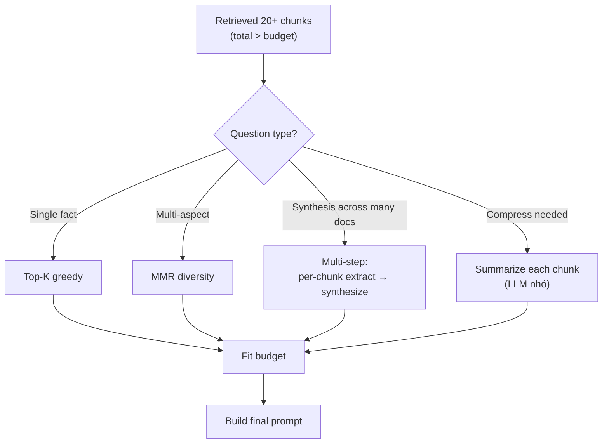

# Nếu Context quá dài, Bạn chọn Chunk nào đưa vào Prompt

## ⚡ Tóm tắt ngắn (30s)
* **Khi retrieved chunks total token > prompt budget** (e.g. retrieved 20 × 800 = 16k token, budget 6k), phải **chọn lọc**.
* **5 strategies Senior**:
  1. **Top-K by score**: greedy chọn cao nhất xuống thấp đến đầy budget.
  2. **Diversity-aware (MMR — Maximal Marginal Relevance)**: tránh trùng nội dung, ưu tiên đa dạng góc nhìn.
  3. **Summarize chunks**: dùng LLM nhỏ tóm tắt mỗi chunk trước khi gộp vào prompt chính.
  4. **Multi-step**: chia LLM call thành nhiều bước (per-chunk analyze → synthesize).
  5. **Truncate per chunk**: lấy snippet quan trọng nhất từ mỗi chunk.
* **Quy tắc**:
  * 80% case: top-K + truncate đủ.
  * Cần đa dạng: MMR.
  * Multi-document synthesis: multi-step.
* **Thảm họa thực chiến**: Top-20 chunks toàn nói chung 1 topic (phần lớn trùng nhau). LLM ignore vì redundant context. Senior switch sang MMR → top-5 đa dạng → accuracy tăng.

---

## 🔍 Chi tiết strategies

### 1. Top-K greedy

Đơn giản nhất:
```python
budget = 6000
chunks = retrieved_sorted_by_score
selected, total = [], 0
for c in chunks:
    tokens = count_tokens(c.text)
    if total + tokens > budget:
        break
    selected.append(c)
    total += tokens
```

Pros: fast, đơn giản. Cons: có thể chọn nhiều chunk redundant.

### 2. MMR (Maximal Marginal Relevance)

Trade off relevance và diversity:
```
MMR(Di) = λ × sim(Di, Q) - (1 - λ) × max_j sim(Di, Dj_selected)
```

* λ gần 1 → ưu tiên relevance (greedy).
* λ gần 0 → ưu tiên diversity.
* λ = 0.5: balanced.

Output: chunks vừa relevant với Q vừa khác nhau với chunks đã chọn.

### 3. Summarize chunks

Khi 50 chunks không thể tất cả → LLM nhỏ tóm tắt mỗi chunk:

```
For each chunk:
    summary[i] = LLM_haiku("Summarize in 50 words: " + chunk[i].text)

Then:
    main_prompt = system + summaries (compressed) + question
    answer = LLM_sonnet(main_prompt)
```

Cost compress + main LLM, nhưng giảm context dramatically.

### 4. Multi-step decomposition

```
Step 1: For each chunk, LLM extract relevant facts.
Step 2: LLM synthesize from facts.
```

Phù hợp với complex synthesis (legal review across 50 contracts).

### 5. Per-chunk truncation

Mỗi chunk lấy 200 token đầu (giả sử info quan trọng ở đầu paragraph). Hoặc extract sentences best match Q:

```python
def extract_best_sentences(chunk_text, query, max_sentences=3):
    sentences = split_sentences(chunk_text)
    sim_per_sentence = [cosine(embed(s), embed(query)) for s in sentences]
    top_idx = sorted(range(len(sim_per_sentence)),
                     key=lambda i: -sim_per_sentence[i])[:max_sentences]
    return [sentences[i] for i in sorted(top_idx)]
```

---

## 🎨 Sơ đồ chọn strategy



---

## 💻 Code thực chiến

### 1. MMR implementation

```java
package com.example.rag.context;

import java.util.*;

public class MmrSelector {

    private final EmbeddingService embedding;
    private static final double LAMBDA = 0.5;

    public List<Chunk> select(List<Chunk> candidates, String query, int k) {
        if (candidates.isEmpty()) return List.of();

        float[] qEmb = embedding.embed(query);
        Map<String, float[]> chunkEmbs = new HashMap<>();
        for (var c : candidates) chunkEmbs.put(c.id(), embedding.embed(c.text()));

        List<Chunk> selected = new ArrayList<>();
        List<Chunk> remaining = new ArrayList<>(candidates);

        while (selected.size() < k && !remaining.isEmpty()) {
            Chunk bestNext = null;
            double bestScore = Double.NEGATIVE_INFINITY;

            for (Chunk c : remaining) {
                double simToQuery = cosine(qEmb, chunkEmbs.get(c.id()));
                double maxSimToSelected = selected.stream()
                    .mapToDouble(s -> cosine(chunkEmbs.get(c.id()), chunkEmbs.get(s.id())))
                    .max().orElse(0);

                double mmr = LAMBDA * simToQuery - (1 - LAMBDA) * maxSimToSelected;
                if (mmr > bestScore) {
                    bestScore = mmr;
                    bestNext = c;
                }
            }

            if (bestNext != null) {
                selected.add(bestNext);
                remaining.remove(bestNext);
            } else break;
        }
        return selected;
    }

    private double cosine(float[] a, float[] b) {
        double dot = 0, na = 0, nb = 0;
        for (int i = 0; i < a.length; i++) {
            dot += a[i] * b[i];
            na += a[i] * a[i];
            nb += b[i] * b[i];
        }
        return dot / (Math.sqrt(na) * Math.sqrt(nb) + 1e-10);
    }

    public record Chunk(String id, String text, double score) {}
}
```

### 2. Multi-step summarize-then-answer

```python
from openai import OpenAI
client = OpenAI()

def synthesize_from_many(question: str, chunks: list[str]) -> str:
    # Step 1: Per-chunk extraction with cheap model
    facts = []
    for chunk in chunks:
        resp = client.chat.completions.create(
            model="gpt-4o-mini",  # cheap
            messages=[
                {"role": "system", "content": "Extract 1-3 facts from this chunk relevant to the question. If irrelevant, reply NONE."},
                {"role": "user", "content": f"Question: {question}\n\nChunk:\n{chunk}"}
            ],
            max_tokens=200, temperature=0.0
        )
        fact = resp.choices[0].message.content.strip()
        if fact != "NONE":
            facts.append(fact)
    
    # Step 2: Synthesize with main model
    final = client.chat.completions.create(
        model="claude-sonnet-4-6",
        messages=[
            {"role": "system", "content": "Synthesize a complete answer from these facts. Cite source if mentioned."},
            {"role": "user", "content": f"Question: {question}\n\nFacts:\n" + "\n".join(facts)}
        ],
        max_tokens=1000, temperature=0.1
    )
    return final.choices[0].message.content
```

### 3. Sentence extraction từ chunk

```java
package com.example.rag.context;

import java.util.*;
import java.util.regex.Pattern;
import java.util.stream.IntStream;

public class SentenceExtractor {

    private final EmbeddingService embedding;
    private static final Pattern SENT_SPLIT = Pattern.compile("(?<=[.!?])\\s+");

    public String extractTopSentences(String chunkText, String query, int n) {
        String[] sentences = SENT_SPLIT.split(chunkText);
        if (sentences.length <= n) return chunkText;

        float[] qEmb = embedding.embed(query);
        float[][] sentEmbs = new float[sentences.length][];
        for (int i = 0; i < sentences.length; i++) {
            sentEmbs[i] = embedding.embed(sentences[i]);
        }

        // Score each sentence, pick top-N preserving original order
        var scored = IntStream.range(0, sentences.length)
            .mapToObj(i -> new int[]{i, (int)(cosine(qEmb, sentEmbs[i]) * 1000)})
            .sorted((a, b) -> Integer.compare(b[1], a[1]))
            .limit(n)
            .map(a -> a[0])
            .sorted()
            .toList();

        StringBuilder sb = new StringBuilder();
        for (int idx : scored) sb.append(sentences[idx]).append(" ");
        return sb.toString().trim();
    }

    private double cosine(float[] a, float[] b) { /* impl */ return 0; }
}
```

---

## 📊 Bảng so sánh strategies

| Strategy | Setup | Quality | Cost | Latency | Khi dùng |
| :--- | :---: | :---: | :---: | :---: | :--- |
| Top-K greedy | Đơn giản | Trung bình | Thấp | Thấp | Default |
| MMR | Trung bình | Tốt cho diversity | Thấp | Thấp | Multi-aspect Q |
| Summarize chunks | Phức tạp | Tốt | Cao (+1 LLM call/chunk) | Cao | 50+ chunks |
| Multi-step | Phức tạp | Best cho synthesis | Cao | Cao | Cross-doc reasoning |
| Sentence extraction | Trung bình | Tốt | Embedding cost | Trung bình | Chunk dài noisy |

---

## ⚠️ Common Gotchas & Questions follow-up

### 1. Cạm bẫy: Always top-K
* **Vấn đề**: Top-5 toàn cùng paragraph cùng doc → redundant. LLM ignore.
* **Giải pháp**: MMR hoặc dedup theo doc_id.

### 2. Cạm bẫy: Summarize quá aggressive
* **Vấn đề**: LLM nhỏ summarize → mất nuance → main LLM trả lời thiếu chính xác.
* **Giải pháp**: Summarize chỉ cho chunks rank thấp; chunks rank cao đưa nguyên.

### 3. Câu hỏi đào sâu từ interviewer
* **Interviewer: "Compress 100 contracts cho legal review thế nào?"**
* **Trả lời Senior**:
  1. **Multi-step pipeline**:
     - Step 1: per-contract LLM extract relevant clauses (cheap model).
     - Step 2: cluster similar clauses.
     - Step 3: main model synthesize.
  2. **Citation tracking**: mỗi clause kèm contract_id để user trace.
  3. **Parallel processing**: 100 contracts → 100 parallel LLM call, total time = 1 call latency.
  4. **Cost**: ~$X cho extract + $Y cho synthesize. Justifiable nếu giúp legal 4 giờ work.
  5. **Quality**: validate trên golden set human-reviewed.
  6. **Human-in-loop**: AI propose, legal review trước final.
