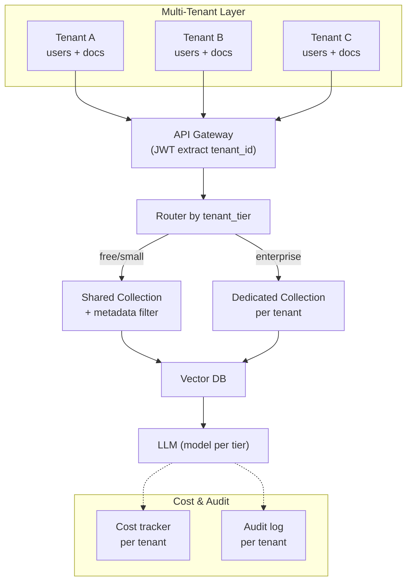

# Thiết kế Multi-tenant RAG

## ⚡ Tóm tắt ngắn (30s)
* **Multi-tenant RAG** = một hệ thống RAG phục vụ nhiều tenant (công ty/customer), mỗi tenant có doc + user riêng. Phải đảm bảo:
  1. **Data isolation**: tenant A không thấy data tenant B (compliance critical).
  2. **Cost attribution**: track cost/tenant để bill chính xác.
  3. **Per-tenant tuning**: chunk size, model, ACL có thể khác giữa tenants.
  4. **Scale**: enrollment hàng nghìn tenant không degrade quality.
* **3 patterns isolation**:
  1. **Shared collection + metadata filter**: 1 vector DB, 1 collection, filter `tenant_id`. Đơn giản, scale cao. Default.
  2. **Per-tenant collection**: tenant lớn có collection riêng. Cao isolation, ops phức tạp.
  3. **Hybrid**: small tenant shared, enterprise tenant dedicated.
* **Thảm họa thực chiến**: Multi-tenant SaaS với 200 tenant chia sẻ vector DB. Một bug filter → tenant A user thấy doc tenant B. 3 tenant churn. Senior fix: RLS + tenant_id at every layer + cross-tenant penetration test trong CI + bug bounty.

---

## 🔍 Chi tiết kiến trúc

### 1. Pattern 1: Shared collection + metadata filter

**Pros**:
* Simple ops: 1 DB, 1 schema.
* Cost-effective cho nhiều small tenant.
* Easy update schema/embedding migration.

**Cons**:
* Filter overhead khi tenant nhiều.
* Một bug filter → leak cross-tenant.
* Hard to customize per-tenant.

Implementation:
```sql
CREATE TABLE rag_chunks (
    tenant_id UUID NOT NULL,
    -- ... other fields
    embedding vector(1024)
);
CREATE INDEX ... USING hnsw (embedding) WITH (...);
CREATE INDEX rag_chunks_tenant ON rag_chunks (tenant_id);

-- Every query MUST include tenant_id filter
SELECT * FROM rag_chunks WHERE tenant_id = X AND ...;
```

Force tenant_id filter via Postgres RLS (xem c5_s3_q10).

### 2. Pattern 2: Per-tenant collection

Mỗi tenant 1 collection trong vector DB:
* Qdrant: `collection_{tenant_id}`.
* Pinecone: `namespace = tenant_id` (Pinecone native multi-tenancy).
* Weaviate: `class Tenant_{tenant_id}`.

**Pros**:
* Hard isolation, bug không leak cross-tenant.
* Per-tenant customize index params.
* Easy delete (drop collection).

**Cons**:
* Tốn ops với 1000 tenant.
* HNSW index cho tenant nhỏ vẫn tốn baseline RAM.

→ Pattern 2 phù hợp với <100 tenant lớn, hoặc enterprise dedicated.

### 3. Pattern 3: Hybrid

Most pragmatic:
* Free/small tier: shared collection + metadata filter.
* Pro/enterprise tier: per-tenant collection.

Routing layer quyết định.

### 4. Per-tenant customization

Different needs per tenant:
* **Chunk size**: legal firm 800 token, e-commerce 300.
* **Embedding model**: small tenant text-embedding-3-small, enterprise text-embedding-3-large.
* **Reranker**: free tier no rerank, pro tier with rerank.
* **LLM model**: free tier gpt-4o-mini, enterprise claude-opus-4-7.
* **System prompt**: custom branded tone.

Config in DB:
```sql
CREATE TABLE tenant_config (
    tenant_id UUID PRIMARY KEY,
    embedding_model VARCHAR(50),
    llm_model VARCHAR(50),
    chunk_size INT,
    rerank_enabled BOOLEAN,
    system_prompt_template TEXT,
    daily_token_quota BIGINT
);
```

### 5. Cost attribution

Track token usage per tenant:
```
event = {
    tenant_id, user_id, request_id, timestamp,
    input_tokens, output_tokens, model, cost_usd,
    purpose
}
```

Aggregate hàng ngày → dashboard/billing.

### 6. Onboarding / Offboarding flow

**Onboarding**:
1. Tạo `tenant_config` record.
2. Provision: nếu Pattern 2, create collection.
3. Migrate ingestion: connect source (Confluence/Drive) → ingestion queue.
4. Warm cache: pre-embed common queries.

**Offboarding**:
1. Suspend access: revoke tokens.
2. Soft delete: mark tenant `deleted_at`.
3. Hard delete sau N ngày: drop collection / DELETE chunks / purge backups.
4. Confirmation: GDPR-compliant deletion certificate.

---

## 🎨 Sơ đồ kiến trúc



---

## 💻 Code thực chiến

### 1. Tenant config lookup

```java
package com.example.rag.tenant;

import org.springframework.cache.annotation.Cacheable;
import org.springframework.stereotype.Service;
import java.util.UUID;

@Service
public class TenantConfigService {

    private final JdbcTemplate jdbc;

    public TenantConfigService(JdbcTemplate j) { this.jdbc = j; }

    @Cacheable(value = "tenantConfig", key = "#tenantId")
    public TenantConfig get(UUID tenantId) {
        return jdbc.queryForObject("""
            SELECT * FROM tenant_config WHERE tenant_id = ?
            """, (rs, n) -> new TenantConfig(
                UUID.fromString(rs.getString("tenant_id")),
                rs.getString("tier"),
                rs.getString("embedding_model"),
                rs.getString("llm_model"),
                rs.getInt("chunk_size"),
                rs.getBoolean("rerank_enabled"),
                rs.getString("system_prompt_template"),
                rs.getLong("daily_token_quota"),
                rs.getString("storage_pattern")  // "shared" | "dedicated"
            ), tenantId);
    }

    public record TenantConfig(
        UUID tenantId, String tier, String embeddingModel, String llmModel,
        int chunkSize, boolean rerankEnabled, String systemPromptTemplate,
        long dailyTokenQuota, String storagePattern
    ) {}
}
```

### 2. Tenant-aware RAG service

```java
package com.example.rag.tenant;

import org.springframework.stereotype.Service;
import reactor.core.publisher.Mono;
import java.util.*;

@Service
public class MultiTenantRagService {

    private final TenantConfigService configService;
    private final SharedVectorRepo sharedRepo;
    private final DedicatedVectorRepo dedicatedRepo;
    private final EmbeddingFactory embeddingFactory;
    private final LlmRouter llmRouter;
    private final RerankService reranker;
    private final QuotaService quota;
    private final CostTracker costTracker;

    public Mono<String> answer(String question, UUID tenantId, UUID userId) {
        var config = configService.get(tenantId);

        // 1. Check quota
        return quota.checkAndReserve(tenantId, 1000)
            .flatMap(allowed -> {
                if (!allowed) return Mono.error(new QuotaExceededException());

                // 2. Embed query with tenant's embedding model
                var embedSvc = embeddingFactory.forModel(config.embeddingModel());
                float[] qEmb = embedSvc.embed(question);

                // 3. Search (shared or dedicated)
                List<Chunk> retrieved;
                if ("dedicated".equals(config.storagePattern())) {
                    retrieved = dedicatedRepo.search(tenantId, qEmb, 50);
                } else {
                    retrieved = sharedRepo.search(tenantId, qEmb, 50);  // with filter
                }

                // 4. Rerank if enabled
                List<Chunk> top;
                if (config.rerankEnabled()) {
                    top = reranker.rerank(question, retrieved, 5);
                } else {
                    top = retrieved.subList(0, Math.min(5, retrieved.size()));
                }

                // 5. Build prompt with tenant's system prompt
                String prompt = buildPrompt(config.systemPromptTemplate(), top, question);

                // 6. Call LLM with tenant's model
                return llmRouter.forModel(config.llmModel())
                    .chat(prompt)
                    .doOnSuccess(resp -> costTracker.record(tenantId, userId, resp));
            });
    }

    private String buildPrompt(String tmpl, List<Chunk> chunks, String q) { return ""; }
    record Chunk(UUID docId, String text, double sim) {}
}
```

### 3. Penetration test

```java
@SpringBootTest
class MultiTenantPenetrationTest {

    @Autowired MultiTenantRagService rag;
    @Autowired TestDataLoader loader;

    @org.junit.jupiter.api.Test
    void crossTenantLeak_shouldBlock() {
        UUID tenantA = UUID.randomUUID();
        UUID tenantB = UUID.randomUUID();
        loader.setupTenant(tenantA, "Confidential plan for A");
        loader.setupTenant(tenantB, "Confidential plan for B");

        // Login as tenant A user
        var resultA = rag.answer("confidential plan", tenantA, UUID.randomUUID()).block();
        var resultB = rag.answer("confidential plan", tenantB, UUID.randomUUID()).block();

        org.junit.jupiter.api.Assertions.assertFalse(resultA.contains("for B"),
            "LEAK: A user thấy B data");
        org.junit.jupiter.api.Assertions.assertFalse(resultB.contains("for A"),
            "LEAK: B user thấy A data");
    }
}
```

### 4. Cost tracker

```java
@Service
public class CostTracker {
    private final JdbcTemplate jdbc;

    public void record(UUID tenantId, UUID userId, LlmResponse resp) {
        jdbc.update("""
            INSERT INTO usage_events (tenant_id, user_id, model, input_tokens,
                                       output_tokens, cost_usd, created_at)
            VALUES (?, ?, ?, ?, ?, ?, NOW())
            """, tenantId, userId, resp.model(),
                resp.inputTokens(), resp.outputTokens(), resp.costUsd());
    }
}
```

---

## 📊 Bảng so sánh patterns

| Aspect | Shared + filter | Per-tenant collection | Hybrid |
| :--- | :--- | :--- | :--- |
| Setup | Đơn giản | Phức tạp | Trung bình |
| Isolation | Trung bình (cần RLS) | Cao | Tier-based |
| Scale (nhiều tenant) | Tốt (1000+) | Hạn chế (<100) | Tốt |
| Per-tenant customize | Khó | Dễ | Tier-based |
| Onboard/offboard | Dễ | Tốn ops | Trung bình |
| Compliance (data residency) | Khó | Dễ | Tier-based |
| Cost / tenant | Thấp | Cao | Differentiated |

---

## ⚠️ Common Gotchas & Questions follow-up

### 1. Cạm bẫy: Filter chỉ ở app
* **Vấn đề**: 1 dev quên filter → leak. Pattern: shared collection + only app-level filter = dangerous.
* **Giải pháp**: Postgres RLS hoặc per-tenant collection.

### 2. Cạm bẫy: Cost not attributed
* **Vấn đề**: Aggregate cost cuối tháng. Không biết tenant nào "ăn" 70% cost.
* **Giải pháp**: Track per request, dashboard per-tenant. Identify outliers, optimize hoặc charge.

### 3. Cạm bẫy: Per-tenant prompt template không versioned
* **Vấn đề**: Customer ask custom system prompt → save trong DB → một dev edit gây regression.
* **Giải pháp**: Git version control prompt templates, deploy via approved process.

### 4. Câu hỏi đào sâu từ interviewer
* **Interviewer: "Enterprise customer yêu cầu data ở region của họ (EU). Bạn thiết kế thế nào?"**
* **Trả lời Senior**:
  1. **Data residency**: deploy stack riêng ở region EU. Tenant config có `region` field.
  2. **Routing**: API Gateway route EU tenant tới EU cluster.
  3. **LLM provider**: AWS Bedrock EU region (data không leave region).
  4. **Vector DB**: Qdrant/Pinecone EU region.
  5. **No cross-region replication** of tenant data.
  6. **Sync metadata-only**: tenant config có thể sync cross-region cho consistency, nhưng KHÔNG sync user data.
  7. **Audit log**: cũng stay in region.
  8. **Compliance**: SOC 2 / GDPR cert cho EU cluster.
  9. **Cost**: 2-3 regional stack tăng cost — pricing tier "enterprise EU" reflect.
  10. **Test**: cross-region access tests phải fail (verify isolation).
