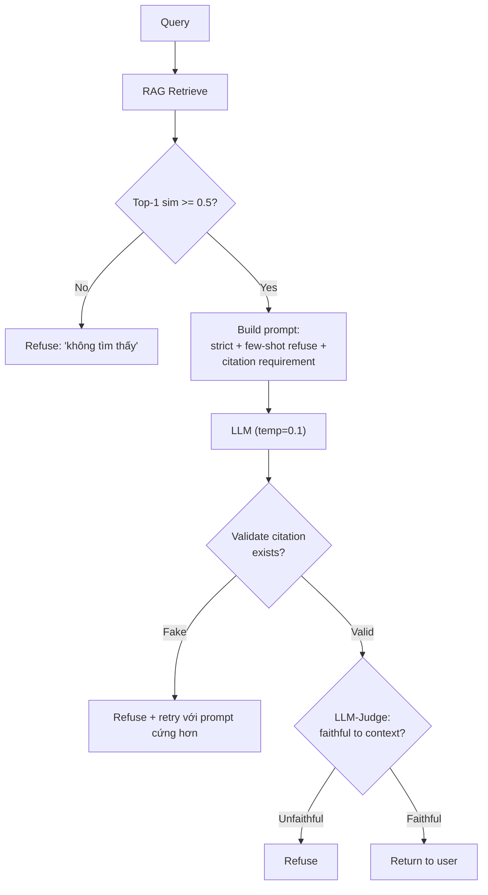

# RAG có Đảm bảo Không Hallucinate không

## ⚡ Tóm tắt ngắn (30s)
* **KHÔNG**. RAG **giảm** hallucination 60-80% nhưng không loại bỏ hoàn toàn. LLM vẫn có thể:
  1. **Ignore context**: trả lời từ prior knowledge dù có context.
  2. **Conflate info**: trộn 2 chunk thành câu trả lời sai.
  3. **Extrapolate**: suy diễn ra ngoài context.
  4. **Bịa citation**: trích nguồn không tồn tại.
  5. **Misread context**: hiểu sai chunk.
* **Defense-in-depth chống hallucinate trong RAG**:
  1. **Strict prompt**: "Chỉ trả lời từ CONTEXT. Nếu không có, refuse."
  2. **Temperature = 0**: giảm random.
  3. **Citation enforcement**: bắt buộc kèm `[doc:X]` cho mọi tuyên bố factual + validate citation exist.
  4. **LLM-as-judge**: model thứ 2 verify response có grounded không.
  5. **Similarity threshold**: refuse nếu top-K similarity < 0.5.
  6. **Few-shot từ chối**: dạy model nói "Tôi không biết".
* **Thảm họa thực chiến**: RAG cho legal Q&A có citation nhưng không validate. LLM bịa citation `[điều 257 Luật XYZ]`. User đem ra tòa → fake. Senior fix: validate mọi citation pattern `\[điều \d+ Luật \w+\]` tồn tại trong context, reject if not.

---

## 🔍 Chi tiết các kiểu hallucination dù có RAG

### 1. Ignore context

LLM thấy context nói "X" nhưng vẫn trả lời "Y" từ prior knowledge. Đặc biệt khi:
* Context conflict với "common knowledge".
* Context dài, info quan trọng nằm giữa (lost in middle).
* Prompt không strict đủ.

**Fix**: prompt strict, "Trả lời CHỈ từ context. KHÔNG dùng kiến thức bên ngoài. Nếu không trong context, nói 'không có thông tin'."

### 2. Conflate info

```
Context:
  Chunk 1: "Sản phẩm A có thời hạn bảo hành 2 năm."
  Chunk 2: "Sản phẩm B có thời hạn bảo hành 1 năm."

Q: "Bảo hành sản phẩm A bao lâu?"
A (hallucinate): "1 năm" ← lấy nhầm từ chunk 2
```

**Fix**: prompt yêu cầu citation per claim → model phải trace tới chunk cụ thể.

### 3. Extrapolate

```
Context: "Hệ thống chấp nhận đăng ký từ 18-65 tuổi."

Q: "Người 70 tuổi có đăng ký được không?"
A (extrapolate): "Có thể, nếu có người bảo lãnh..." ← không có trong context
```

**Fix**: refuse nếu Q không thể trả lời từ context.

### 4. Bịa citation

```
A: "Theo điều 5.3 của chính sách..." nhưng context không có điều 5.3.
```

**Fix**: regex extract citation patterns, verify each tồn tại trong context.

### 5. Misread

Context nói "Hết hạn 14 ngày từ ngày giao", LLM trả lời "Hết hạn 14 ngày từ ngày mua".

**Fix**: LLM-as-judge verify response faithfulness.

---

## 🎨 Sơ đồ defense



---

## 💻 Code thực chiến

### 1. Strict prompt + few-shot refuse

```java
private static final String STRICT_SYSTEM = """
        Bạn là trợ lý CHỈ trả lời từ thông tin trong CONTEXT dưới đây.
        
        QUY TẮC TUYỆT ĐỐI:
        1. Nếu CONTEXT không có thông tin để trả lời, BẮT BUỘC trả lời:
           "Tôi không tìm thấy thông tin trong tài liệu."
        2. KHÔNG suy diễn, KHÔNG dùng kiến thức bên ngoài.
        3. Mọi tuyên bố factual PHẢI kèm citation [doc:X chunk:Y].
        4. Nếu CONTEXT có thông tin mâu thuẫn, nói rõ "Có thông tin mâu thuẫn".
        
        Few-shot ví dụ từ chối:
        Q: "Người 70 tuổi đăng ký được không?"
        Context: "Chấp nhận 18-65 tuổi."
        A: "Theo tài liệu, hệ thống chấp nhận từ 18-65 tuổi [doc:5 chunk:2]. Tôi không tìm thấy thông tin về người trên 65 tuổi."
        """;
```

### 2. Citation validator

```java
package com.example.rag.guardrail;

import java.util.*;
import java.util.regex.*;

public class CitationValidator {

    // Match [doc:UUID chunk:N]
    private static final Pattern CITATION_PATTERN = Pattern.compile(
        "\\[doc:([a-f0-9\\-]+)\\s+chunk:(\\d+)\\]");

    public ValidationResult validate(String response, List<RetrievedChunk> retrievedChunks) {
        Set<String> validIds = new HashSet<>();
        for (var c : retrievedChunks) {
            validIds.add("doc:" + c.docId() + ":chunk:" + c.chunkIdx());
        }

        List<String> invalidCitations = new ArrayList<>();
        Matcher m = CITATION_PATTERN.matcher(response);
        while (m.find()) {
            String id = "doc:" + m.group(1) + ":chunk:" + m.group(2);
            if (!validIds.contains(id)) {
                invalidCitations.add(m.group(0));
            }
        }

        return new ValidationResult(invalidCitations.isEmpty(), invalidCitations);
    }

    public record ValidationResult(boolean valid, List<String> invalidCitations) {}
    public record RetrievedChunk(String docId, int chunkIdx, String text) {}
}
```

### 3. LLM-as-Judge faithfulness

```python
import anthropic
judge = anthropic.Anthropic()

JUDGE_PROMPT = """Bạn là trọng tài đánh giá faithfulness.
Kiểm tra ANSWER có CHỈ dùng thông tin từ CONTEXT không.

CONTEXT:
{context}

ANSWER:
{answer}

Đánh giá:
- faithful = true nếu mọi claim factual trong answer ĐỀU có trong context.
- faithful = false nếu có ÍT NHẤT 1 claim không có trong context.

Trả JSON: {{"faithful": true/false, "violations": ["claim_1", "claim_2"]}}
"""

def judge_faithfulness(answer: str, context: str) -> dict:
    resp = judge.messages.create(
        model="claude-haiku-4-5",  # cheap judge
        max_tokens=500, temperature=0.0,
        messages=[{"role": "user", "content": JUDGE_PROMPT.format(context=context, answer=answer)}]
    )
    import json
    return json.loads(resp.content[0].text)
```

### 4. Full pipeline với guardrails

```java
@Service
public class GuardedRagService {

    public RagResponse answer(String question, UUID tenantId) {
        // 1. Retrieve
        var chunks = retrieve(question, tenantId, 5);
        if (chunks.isEmpty() || chunks.get(0).similarity() < 0.5) {
            return RagResponse.refused("Không tìm thấy thông tin liên quan.");
        }

        // 2. Build strict prompt
        String prompt = buildStrictPrompt(question, chunks);

        // 3. LLM call (temperature 0.1)
        String response = llm.chat(prompt, 0.1);

        // 4. Validate citations
        var citationResult = citationValidator.validate(response, chunks);
        if (!citationResult.valid()) {
            log.warn("Invalid citations: {}", citationResult.invalidCitations());
            // Retry với prompt cứng hơn
            response = retryStricter(question, chunks);
            citationResult = citationValidator.validate(response, chunks);
            if (!citationResult.valid()) {
                return RagResponse.refused("Hệ thống không thể trả lời chính xác.");
            }
        }

        // 5. LLM-as-judge (async, eval but không block UI)
        judgeAsync(response, chunks).subscribe(judgeResult -> {
            if (!judgeResult.faithful()) {
                alerting.flagPotentialHallucination(question, response, chunks);
            }
        });

        return RagResponse.success(response, chunks);
    }

    private static final org.slf4j.Logger log = org.slf4j.LoggerFactory.getLogger(GuardedRagService.class);
}
```

---

## 📊 Bảng kỹ thuật chống hallucinate

| Kỹ thuật | Hiệu quả | Cost overhead | Setup |
| :--- | :---: | :---: | :---: |
| Strict prompt | Cao | 0% | Đơn giản |
| Temperature = 0 | Trung bình | 0% | Đơn giản |
| Few-shot refuse | Cao | Token | Đơn giản |
| Citation enforcement | Rất cao | 5% | Trung bình |
| LLM-as-judge | Rất cao | +1 LLM call | Trung bình |
| Similarity threshold | Cao cho refusal | 0% | Đơn giản |
| Self-consistency (sample n) | Cao | n× cost | Phức tạp |
| Fine-tune trên domain | Cao | Train | Phức tạp |

---

## ⚠️ Common Gotchas & Questions follow-up

### 1. Cạm bẫy: Tin RAG = không hallucinate
* **Vấn đề**: Đội triển khai RAG, không thêm guardrail → vẫn 15% hallucinate.
* **Giải pháp**: Defense-in-depth. Multiple layers.

### 2. Cạm bẫy: LLM-judge tự bias
* **Vấn đề**: Cùng model làm judge → bias same hallucination pattern.
* **Giải pháp**: Judge bằng model khác (Sonnet generate, Haiku judge → ổn vì khác kiểm soát). Hoặc dùng metric không LLM (string match cho citation, fact extraction match).

### 3. Câu hỏi đào sâu từ interviewer
* **Interviewer: "Bạn có 5% hallucination rate sau RAG + guardrails. Làm sao reduce thêm?"**
* **Trả lời Senior**:
  1. **Root cause analysis** trên 5%:
     - Phân loại: retrieval miss vs ignore context vs misread vs format bug.
     - Chia bug bucket riêng để fix targeted.
  2. **Per-bucket fix**:
     - Retrieval miss: better chunk/embed/rerank.
     - Ignore context: stricter prompt, fine-tune.
     - Misread: better chunking (smaller chunks, fewer info per chunk).
     - Format: JSON mode, structured output.
  3. **Stricter refusal**: tăng similarity threshold (0.5 → 0.6) → từ chối nhiều hơn nhưng accurate hơn.
  4. **Human-in-loop cho high-stakes**: AI proposes, human approves (legal, medical).
  5. **Fine-tune** model trên domain data: dạy model "refuse" khi không chắc.
  6. **Sample + improve loop**: production trace → identify failure → fix → eval → deploy.
  7. **Set realistic expectation**: 100% no-hallucinate impossible. Document SLA "95% accurate" và workflow handling sai.
