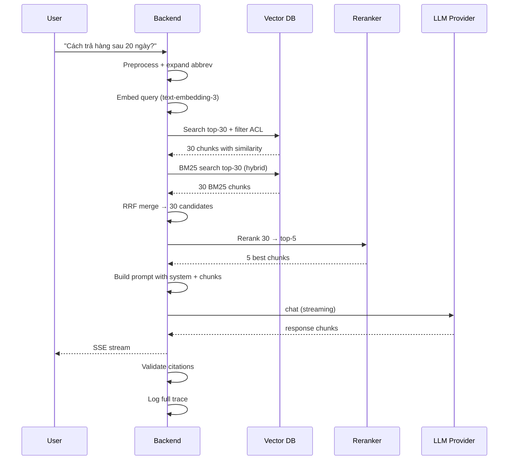

# Flow RAG cơ bản gồm những bước nào

## ⚡ Tóm tắt ngắn (30s)
* **RAG có 2 pipeline song song**:
  * **Ingestion (offline)**: Document → Parser → Chunker → Embedding → Vector DB. Chạy 1 lần khi ingest + định kỳ update.
  * **Query (online)**: User question → Embed → Vector search → Rerank → Prompt → LLM → Response. Chạy mỗi request.
* **8 bước Query Path chi tiết**:
  1. **Query preprocessing**: clean, expand abbrev, detect language.
  2. **Embed question**: thường cùng model với ingestion.
  3. **Vector search**: top-K (~20-50) candidates.
  4. **Hybrid search**: combine với BM25 cho keyword exact.
  5. **Rerank**: cross-encoder rerank top-K xuống top-5.
  6. **Build prompt**: system + retrieved chunks + question + format hints.
  7. **LLM call**: temperature thấp, citation requirement.
  8. **Post-process**: validate citation, redact PII, log.
* **Thảm họa thực chiến**: Team skip bước 5 (rerank). Top-5 từ vector search có chunks không thực sự relevant → LLM bị "noise" trong context → trả lời lan man, miss chính. Sau khi add Cohere rerank → accuracy tăng 18%.

---

## 🔍 Chi tiết từng bước

### Bước 1: Ingestion Pipeline (Offline)

```
[Source]                  ← Confluence / S3 / DB
   ↓
[Parser]                  ← Tika / Unstructured / Apache POI
   ↓
[Cleaner]                 ← Strip HTML, normalize whitespace
   ↓
[Chunker]                 ← Split into 300-800 token chunks
   ↓
[Metadata Extractor]      ← Page, section, author, date, ACL
   ↓
[Embedder]                ← OpenAI text-embedding-3 / bge-m3
   ↓
[Vector DB Insert]        ← pgvector / Pinecone / Weaviate
```

* **Idempotency**: dùng `(doc_id, chunk_idx)` làm unique key. Re-ingest = delete cũ + insert mới.
* **Batch**: embed 50-100 chunks/request để tận dụng batch API.
* **Incremental**: chỉ re-ingest doc đã update (compare hash hoặc updated_at).

### Bước 2: Query Preprocessing

* Strip noise: trim, remove emoji thừa.
* Expand abbreviations: "DB" → "database", "CSKH" → "chăm sóc khách hàng".
* Language detection nếu multilingual.
* Spell correction nếu cần.
* **Query rewriting** (nâng cao): dùng LLM nhỏ rewrite query thành 3 variants → retrieval nhiều góc nhìn.

### Bước 3: Embed Question

* Dùng **CÙNG model** với ingestion. Đổi model = phải re-embed toàn bộ DB.
* Một số model có asymmetric encoding (query vs passage prefix khác nhau). Đọc model card.

### Bước 4: Vector Search

* Top-K ban đầu thường = 20-50, không phải 5. Để dành cho rerank.
* Filter: ACL (tenant_id, user_id), thời gian (created_at > X), tag (type IN ('faq','policy')).
* Index: HNSW cho speed, IVF cho ít RAM.

### Bước 5: Hybrid Search (Optional but recommended)

```
Final candidates = RRF(vector top-50, BM25 top-50)
```

Hybrid tăng recall đáng kể cho query có từ khóa exact (SKU, mã sản phẩm).

### Bước 6: Rerank

* Vector search dùng **bi-encoder** (encode query + doc riêng) — fast nhưng có miss.
* Rerank dùng **cross-encoder** (encode query + doc cùng nhau) — accuracy cao nhưng chậm hơn.
* Tools: Cohere rerank-3, BGE-reranker-v2-m3, voyage-rerank-2.
* Rerank chỉ trên top-20-50 từ vector → top-3-10 final.

### Bước 7: Build Prompt

```
System: "Bạn là trợ lý. Trả lời từ context. Kèm citation [doc:X chunk:Y]."

CONTEXT:
[doc:42 chunk:3] Chính sách hoàn tiền 14 ngày...
[doc:42 chunk:4] Trường hợp ngoại lệ...
[doc:51 chunk:1] Quy trình yêu cầu hoàn tiền...

USER QUESTION: Cách trả lại sản phẩm sau 20 ngày?
```

### Bước 8: LLM Call

* `temperature = 0.0-0.3` cho factual.
* `max_tokens` tùy expected output.
* Streaming SSE cho UX.

### Bước 9: Post-processing

* **Validate citation**: kiểm tra mọi `[doc:X chunk:Y]` trong response thực sự tồn tại trong retrieved chunks.
* **PII redaction** ở response (nếu cần).
* **Logging**: lưu prompt, response, citation, similarity scores cho debug + eval.

---

## 🎨 Sơ đồ flow đầy đủ



---

## 💻 Code thực chiến: Full RAG Flow

```java
package com.example.rag;

import org.springframework.ai.chat.client.ChatClient;
import org.springframework.stereotype.Service;
import reactor.core.publisher.Flux;
import java.util.*;

@Service
public class FullRagService {

    private final EmbeddingService embed;
    private final VectorSearchService vectorSearch;
    private final Bm25SearchService bm25Search;
    private final RerankService reranker;
    private final ChatClient llm;
    private final CitationValidator validator;
    private final AuditService audit;

    public Flux<String> ask(String question, UUID userId, UUID tenantId) {
        long start = System.currentTimeMillis();

        // 1. Preprocess
        String cleaned = preprocess(question);

        // 2. Embed
        float[] qEmb = embed.embed(cleaned);

        // 3 + 4. Hybrid search
        var vectorHits = vectorSearch.search(qEmb, tenantId, 30);
        var bm25Hits = bm25Search.search(cleaned, tenantId, 30);
        var candidates = rrfMerge(vectorHits, bm25Hits);

        // 5. Rerank
        var topChunks = reranker.rerank(cleaned, candidates, 5);

        // Audit retrieval
        audit.recordRetrieval(userId, question, topChunks);

        if (topChunks.isEmpty() || topChunks.get(0).similarity() < 0.5) {
            return Flux.just("Tôi không tìm thấy thông tin liên quan trong tài liệu.");
        }

        // 6. Build prompt
        String prompt = buildPrompt(cleaned, topChunks);

        // 7. LLM call streaming
        StringBuilder fullResponse = new StringBuilder();
        return llm.prompt()
            .system(SYSTEM_PROMPT)
            .user(prompt)
            .stream().content()
            .doOnNext(fullResponse::append)
            .doOnComplete(() -> {
                // 8. Post-process: validate + log
                boolean valid = validator.validate(fullResponse.toString(), topChunks);
                long latency = System.currentTimeMillis() - start;
                audit.recordResponse(userId, question, fullResponse.toString(),
                                     topChunks, valid, latency);
            });
    }

    private String preprocess(String q) {
        return q.trim().replaceAll("\\s+", " ");
    }

    private List<Chunk> rrfMerge(List<Chunk> a, List<Chunk> b) {
        Map<String, Double> scores = new HashMap<>();
        Map<String, Chunk> all = new HashMap<>();
        for (int i = 0; i < a.size(); i++) {
            String id = a.get(i).id();
            scores.merge(id, 1.0 / (60 + i + 1), Double::sum);
            all.put(id, a.get(i));
        }
        for (int i = 0; i < b.size(); i++) {
            String id = b.get(i).id();
            scores.merge(id, 1.0 / (60 + i + 1), Double::sum);
            all.put(id, b.get(i));
        }
        return scores.entrySet().stream()
            .sorted(Map.Entry.<String,Double>comparingByValue().reversed())
            .limit(30)
            .map(e -> all.get(e.getKey()))
            .toList();
    }

    private String buildPrompt(String question, List<Chunk> chunks) {
        StringBuilder ctx = new StringBuilder();
        for (var c : chunks) {
            ctx.append("[doc:").append(c.docId())
               .append(" chunk:").append(c.chunkIdx()).append("]\n")
               .append(c.text()).append("\n---\n");
        }
        return "CONTEXT:\n" + ctx + "\n\nQ: " + question;
    }

    private static final String SYSTEM_PROMPT = """
            Bạn là trợ lý. CHỈ trả lời từ thông tin trong CONTEXT.
            Mọi tuyên bố factual phải kèm citation [doc:X chunk:Y].
            Nếu CONTEXT không đủ, trả lời: "Tôi không tìm thấy trong tài liệu."
            """;

    public record Chunk(String id, UUID docId, int chunkIdx, String text, double similarity) {}
}
```

---

## 📊 Bảng đo lường mỗi bước

| Bước | Latency điển hình | Tỷ trọng cost | Có thể skip? |
| :--- | :---: | :---: | :--- |
| Preprocess | <5ms | 0% | Không, rất rẻ |
| Embed query | 30-100ms | ~5% | Không |
| Vector search | 30-100ms | 0% (DB self-host) | Không |
| BM25 search | 5-20ms | 0% | Có (giảm recall) |
| RRF merge | <5ms | 0% | Có nếu chỉ vector |
| Rerank | 100-500ms | ~10% | Có (giảm precision) |
| Build prompt | <5ms | 0% | Không |
| LLM call | 500-5000ms | ~85% | Không |
| Validate + log | <50ms | 0% | Không nên skip |

→ LLM call thống trị latency. Optimize: streaming + caching + chunk count nhỏ hơn.

---

## ⚠️ Common Gotchas & Questions follow-up

### 1. Cạm bẫy: Skip rerank
* **Vấn đề**: Trả top-5 trực tiếp từ vector search. Top-5 thường có 1-2 chunk không thực sự relevant → LLM noise.
* **Giải pháp**: Vector search top-30 → rerank → top-5. ROI rất cao.

### 2. Cạm bẫy: Chunk size không phù hợp
* **Vấn đề**: Chunk 100 token quá ngắn → thiếu context; 2000 token quá dài → similarity vào pha loãng + miss specific info.
* **Giải pháp**: 300-800 token sweet spot. Test trên golden set.

### 3. Cạm bẫy: Quên filter ACL
* **Vấn đề**: Vector search không filter tenant_id → user X thấy doc của tenant Y.
* **Giải pháp**: Filter là MANDATORY ngay ở vector DB level. Test penetration cross-tenant.

### 4. Câu hỏi đào sâu từ interviewer
* **Interviewer: "Bạn deploy RAG mới. Hành vi đầu tiên bạn monitor là gì?"**
* **Trả lời Senior**:
  1. **Retrieval quality**: recall@5 trên golden set (cron hourly). Drop > 5% → alert.
  2. **End-to-end accuracy**: LLM-as-judge eval trên 100 question/giờ → score.
  3. **Latency p50/p99**: từng bước (embed, vector search, rerank, LLM).
  4. **Cost per query**: tokens used + provider price.
  5. **Refusal rate**: tỷ lệ "Tôi không tìm thấy" — nếu vọt → có thể retrieval hỏng.
  6. **Citation validity**: % response có citation valid. Drop = LLM bịa.
  7. **User feedback signal**: thumbs up/down rate, conversation length, escalation rate.
  8. **Cost dashboard**: token consumption theo team/tenant.
