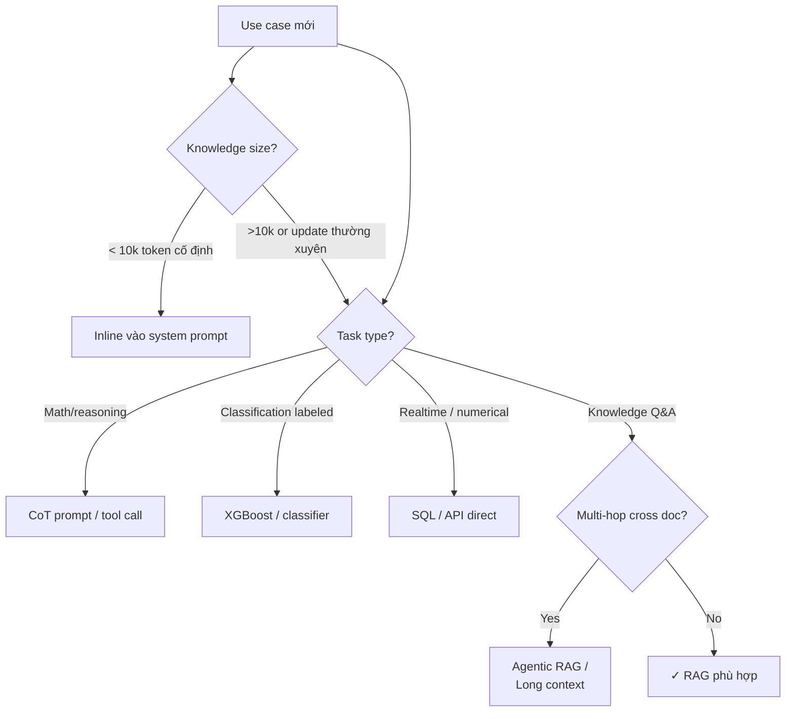

# Khi nào RAG Không Phù hợp

## ⚡ Tóm tắt ngắn (30s)
* **RAG là tool, không phải answer**. Có scenarios RAG là overkill, hoặc fundamentally không match. Senior nhận diện khi nào dùng alternative.
* **7 scenarios KHÔNG nên dùng RAG**:
  1. **Knowledge cố định + nhỏ** (<10k token): nhồi vào system prompt, đơn giản hơn.
  2. **Math / reasoning thuần**: không cần retrieve, dùng CoT.
  3. **Tasks có nhãn rõ + high-volume**: ML truyền thống (classifier) tốt hơn.
  4. **Multi-hop reasoning cross-document**: RAG retrieval đơn giản miss interaction. Cần agentic RAG hoặc long context.
  5. **Realtime data / numerical computation**: SQL/API tốt hơn.
  6. **Output format extraction**: structured output / regex tốt hơn.
  7. **Compliance không cho lưu embedding**: một số quy định coi embedding là derived data.
* **Thảm họa thực chiến**: Team dùng RAG cho task "tính tổng doanh thu Q1". Embed báo cáo tài chính. RAG retrieve doc đúng nhưng LLM tính sai (bịa số). Switch sang SQL query trực tiếp DB → 100% chính xác, 100ms vs 3s.

---

## 🔍 Chi tiết từng scenario

### 1. Knowledge cố định + nhỏ

Nếu toàn bộ knowledge < 10k token (e.g. company policy, terms of service):
* Nhồi nguyên vào system prompt.
* Tận dụng prompt caching → cost giảm 90%.
* Đơn giản hơn build pipeline RAG.

Quy tắc: chỉ build RAG infra khi knowledge > ~50k token và sẽ update thường xuyên.

### 2. Math / Reasoning thuần

```
Q: "5 + 7 × 3 - (2 × 4) = ?"
```

RAG vô nghĩa. Dùng:
* LLM với CoT prompt.
* Hoặc tool calling: LLM gọi calculator tool.
* Hoặc code execution: LLM viết Python, execute, trả kết quả.

### 3. Tasks có nhãn rõ + high-volume

```
Spam filter: 10M email/ngày, có 100k email với nhãn manually labeled.
```

XGBoost 99% F1, 5ms/req, $0. RAG với LLM: 300ms/req, $0.001/req → cost 100x cao hơn, accuracy thấp hơn.

Senior chọn classifier khi:
* Có dataset có nhãn.
* High volume.
* Output schema cố định (1 nhãn).
* Latency critical.

### 4. Multi-hop reasoning cross-document

```
Q: "Compare điều khoản phạt vi phạm giữa 10 hợp đồng A-J và highlight outliers."
```

RAG simple retrieve top-5 chunks → miss vì 10 chunks rải rác cần cùng lúc. Solutions:
* **Long context**: nếu doc fit vào 200k context, nhồi tất cả.
* **Agentic RAG**: agent quyết định retrieve từng aspect, synthesize.
* **Multi-step pipeline**: per-doc extract clauses → compare offline.

### 5. Realtime data / numerical computation

```
Q: "Tổng doanh thu Q1 hiện tại?"
```

RAG retrieve doc cũ → số stale. SQL query trực tiếp:
```sql
SELECT SUM(amount) FROM orders WHERE quarter = 'Q1';
```

→ 100% accurate, realtime.

Pattern: text2SQL với LLM generate SQL → execute → return result.

### 6. Output format extraction

```
Q: "Trích email và số điện thoại từ text"
```

Regex + lib có sẵn. RAG vô nghĩa.

### 7. Compliance restrictions

Một số quy định:
* GDPR: embedding của PII coi như derived PII → khó comply nếu user request delete.
* Healthcare: HIPAA strict cho vector DB chứa PHI.
* Financial: SOX audit trail cho mọi data transformation.

Khi không clear → tránh hoặc phải có compliance team review.

---

## 🎨 Sơ đồ quyết định



---

## 💻 Code thực chiến: Alternative patterns

### 1. Inline knowledge (small + static)

```java
@Service
public class StaticPolicyAssistant {
    
    // Knowledge ngắn cố định → inline
    private static final String POLICY_DOC = """
            Chính sách hoàn tiền:
            - Trong 14 ngày kể từ ngày mua, có thể hoàn tiền nếu chưa sử dụng.
            - Sản phẩm điện tử: 7 ngày.
            - Sản phẩm khuyến mãi: không hoàn tiền.
            
            Chính sách bảo hành:
            - 12 tháng cho mọi sản phẩm.
            - Lỗi do người dùng không được bảo hành.
            """;

    public String ask(String question) {
        return chatClient.prompt()
            .system("Bạn là CSKH. Trả lời từ POLICY dưới đây.\n\nPOLICY:\n" + POLICY_DOC)
            .user(question)
            .call().content();
    }
}
```

### 2. SQL agent cho realtime data

```java
@Service
public class TextToSqlService {

    private final ChatClient chat;
    private final JdbcTemplate jdbc;

    public Object queryNumerical(String question) {
        // Step 1: LLM sinh SQL
        String sql = chat.prompt()
            .system("""
                Bạn là SQL expert. Chỉ trả về SQL query, không giải thích.
                Schema: orders(id, customer_id, amount, created_at, status)
                """)
            .user(question)
            .options(ChatOptions.builder().temperature(0).build())
            .call().content();

        // Step 2: Validate SQL (only SELECT, no DDL/DML)
        if (!sql.trim().toLowerCase().startsWith("select")) {
            throw new SecurityException("Only SELECT allowed");
        }

        // Step 3: Execute với readonly user
        return jdbc.queryForList(sql);
    }
}
```

### 3. Hybrid: RAG + Tool calling

```python
import anthropic
client = anthropic.Anthropic()

# Tools available
TOOLS = [
    {
        "name": "sql_query",
        "description": "Execute SELECT SQL for numerical / realtime data",
        "input_schema": {"type": "object", "properties": {"sql": {"type": "string"}}, "required": ["sql"]}
    },
    {
        "name": "rag_search",
        "description": "Search company documentation for policy / knowledge",
        "input_schema": {"type": "object", "properties": {"query": {"type": "string"}}, "required": ["query"]}
    }
]

def smart_ask(question: str):
    """LLM decides whether to use SQL or RAG."""
    response = client.messages.create(
        model="claude-sonnet-4-6",
        max_tokens=2000,
        system="Use sql_query for numerical/realtime, rag_search for policy/documentation.",
        tools=TOOLS,
        messages=[{"role": "user", "content": question}]
    )
    # ... handle tool_use, loop until final answer
```

---

## 📊 Bảng quyết định "Khi nào dùng gì"

| Scenario | Best tool |
| :--- | :--- |
| Doc QA, knowledge update | **RAG** |
| Static small policy | Inline prompt |
| Math, logic | CoT + tool calling (calculator/code) |
| Classify text với data labeled | XGBoost / classifier |
| Realtime numerical | SQL via text2SQL |
| Extract structured fields | Regex / LLM structured output |
| Cross-doc complex synthesis | Long context / Agentic RAG / multi-step |
| Personalized recommendation | Collaborative filtering + embedding |
| User-facing chat về kiến thức công ty | RAG |

---

## ⚠️ Common Gotchas & Questions follow-up

### 1. Cạm bẫy: RAG cho mọi thứ vì hype
* **Vấn đề**: PM "AI everywhere", team RAG mọi feature, kể cả task có rule rõ ràng.
* **Giải pháp**: Senior push back: đo cost vs benefit, propose alternative simpler.

### 2. Cạm bẫy: RAG ép vào computational task
* **Vấn đề**: "Tính tổng" qua RAG → bịa số.
* **Giải pháp**: Số = SQL. Text = RAG. Mix qua tool calling.

### 3. Câu hỏi đào sâu từ interviewer
* **Interviewer: "Stakeholder ép dùng RAG cho task spam classification. Bạn pushback thế nào?"**
* **Trả lời Senior**:
  1. **Data**: bạn có 10M email × $0.001 (RAG cost) = $10k/ngày = $300k/tháng. Làm sao justify?
  2. **Latency**: spam check inline trong inbox = <100ms. RAG ~500ms → user feel sluggish.
  3. **Accuracy**: classifier existing 99% F1. RAG có thể 92%. Reverse direction.
  4. **Alternative pragmatic**:
     - Keep classifier cho 95% case.
     - RAG/LLM cho 5% gray zone (confidence 0.4-0.6).
     - Best of both: cost low, accuracy high.
  5. **POC nhỏ**: 1 tuần A/B test → numbers convince.
  6. **Educate stakeholder**: AI != LLM. ML truyền thống vẫn relevant.
