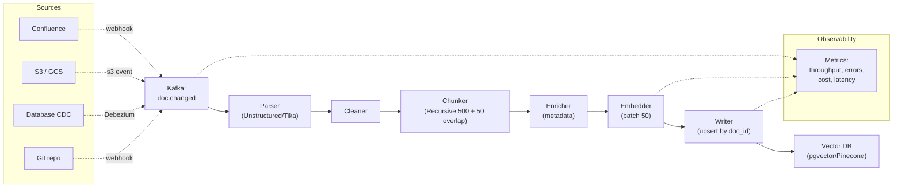

# Thiết kế Document Ingestion Pipeline

## ⚡ Tóm tắt ngắn (30s)
* **Ingestion pipeline = backbone của RAG**. Nó quyết định 70% retrieval quality. Pipeline xấu = "garbage in, garbage out", không cứu được bằng LLM tốt hơn.
* **Kiến trúc Senior (7 stages)**:
  1. **Source connector**: Pull/push từ Confluence, Drive, S3, DB, Notion.
  2. **Parser**: PDF/DOCX/HTML/Markdown → text + metadata. Tools: Apache Tika, Unstructured.io, Llama Parse.
  3. **Cleaner**: strip noise (header/footer/page numbers), normalize whitespace, fix encoding.
  4. **Chunker**: split thành 300-800 token chunks, tôn trọng boundary (paragraph, section, code block).
  5. **Enricher**: thêm metadata (title, section, doc_type, ACL, tags).
  6. **Embedder**: batch 50-100 chunks/request.
  7. **Vector store writer**: upsert với (doc_id, chunk_idx) key, atomic delete + insert cho update.
* **Quan trọng**: pipeline **idempotent + incremental**. Re-run cùng source không tạo duplicate. Chỉ ingest doc đã thay đổi (compare hash/timestamp).
* **Thảm họa thực chiến**: Team chạy ingestion full mỗi đêm (cron) → 8 giờ chạy + duplicate khi cùng doc ingested nhiều phiên bản. Cost embedding $300/đêm. Senior refactor: event-driven (Kafka khi Confluence update) + incremental (chỉ doc thay đổi) → cost $15/ngày, latency from update to searchable = 5 phút.

---

## 🔍 Chi tiết từng stage

### Stage 1: Source Connectors

Common sources:
* **Confluence / Notion / Google Docs**: API + webhook cho realtime.
* **S3 / GCS / Azure Blob**: bucket event notifications.
* **Database**: change data capture (Debezium + Kafka).
* **Git repo**: webhook on push.
* **Email / Slack**: pull qua API định kỳ.

Design:
* **Push** (preferred): webhook → Kafka topic → processor.
* **Pull**: cron scan, dùng `updated_at` để incremental.

### Stage 2: Parser

* **Apache Tika**: tổng hợp, ngon cho PDF/DOCX/HTML đơn giản.
* **Unstructured.io**: mạnh hơn, hiểu layout (table, list, header). Open-source + commercial.
* **Llama Parse**: hiểu PDF phức tạp (multi-column, table với caption).
* **PyMuPDF / pdfplumber**: low-level PDF, cần code thêm để layout.

Quan trọng:
* **Trích structured metadata**: title, headers (h1, h2), tables, code blocks.
* **Encoding**: UTF-8, fix mojibake.
* **Image OCR** nếu cần (tesseract).

### Stage 3: Cleaning

* Strip: page header/footer ("Confidential - Page X of Y"), watermarks.
* Normalize: whitespace, line endings.
* Detect & remove duplicates trong cùng doc (TOC, repeated sections).
* Language detect → có thể split per-language.

### Stage 4: Chunking

Strategies:

**(a) Fixed-size chunking**: 500 token mỗi chunk, overlap 50.
* Pros: đơn giản, predictable.
* Cons: cắt giữa câu/đoạn → semantic broken.

**(b) Recursive splitter** (LangChain RecursiveCharacterTextSplitter):
* Try split by paragraph → section → sentence → fallback character.
* Default cho text thông thường.

**(c) Semantic chunking** (Llama Index):
* Embed sentences → group những câu semantically gần.
* Smart hơn nhưng chậm + cost.

**(d) Document-aware chunking**:
* Markdown: split theo `##`.
* Code: split theo function/class.
* HTML: split theo section.

**(e) Late chunking**:
* Encode toàn document trong một go (with model có context lớn), rồi split chunk + pooling embedding.
* Best quality nhưng cần model support.

### Stage 5: Enrichment

Mỗi chunk có metadata:
```json
{
  "doc_id": "uuid",
  "chunk_idx": 5,
  "doc_title": "Refund Policy 2025",
  "section": "Late Returns",
  "doc_type": "policy",
  "tenant_id": "uuid",
  "acl_roles": ["customer-support", "agent"],
  "language": "vi",
  "created_at": "2025-03-15",
  "source_url": "confluence://..."
}
```

Metadata dùng cho:
* Filter trong vector search.
* Re-rank hint.
* Display source trong UI.

### Stage 6: Embedding

* **Batch**: gọi embedding API với 50-100 input/request → tiết kiệm 90% overhead.
* **Rate limiting**: respect provider limit (OpenAI ~1M token/min embedding).
* **Idempotency**: nếu re-embed (model upgrade) → version field trong metadata.
* **Failure handling**: retry transient, dead-letter queue cho permanent fail.

### Stage 7: Vector Store Write

* **Upsert atomic**: dùng `(doc_id, chunk_idx)` làm composite key.
* **Update flow**:
  1. Delete tất cả chunks cũ của doc_id.
  2. Insert chunks mới.
  3. Trong cùng transaction nếu vector DB support, hoặc dùng 2-phase.
* **Versioning**: thêm column `embedding_model_version` → migrate dễ.

---

## 🎨 Sơ đồ pipeline



---

## 💻 Code thực chiến

### 1. Kafka consumer + idempotent ingest

```java
package com.example.rag.ingest;

import org.springframework.kafka.annotation.KafkaListener;
import org.springframework.stereotype.Service;
import java.util.*;

@Service
public class DocumentIngestionService {

    private final DocumentParser parser;
    private final TextChunker chunker;
    private final EmbeddingService embedding;
    private final ChunkRepository repo;

    @KafkaListener(topics = "doc.changed", concurrency = "8")
    public void onDocChanged(DocChangedEvent event) {
        try {
            // 1. Idempotency: check if already processed with same hash
            if (repo.existsByDocIdAndHash(event.docId(), event.contentHash())) {
                log.info("doc_id={} already ingested with hash, skip", event.docId());
                return;
            }

            // 2. Parse
            ParsedDocument parsed = parser.parse(event.sourceUrl());

            // 3. Clean
            String cleaned = clean(parsed.text());

            // 4. Chunk
            List<String> chunkTexts = chunker.split(cleaned, 500, 50);

            // 5. Enrich + embed in batch
            List<Chunk> chunks = new ArrayList<>();
            for (int batchStart = 0; batchStart < chunkTexts.size(); batchStart += 50) {
                int batchEnd = Math.min(batchStart + 50, chunkTexts.size());
                List<String> batch = chunkTexts.subList(batchStart, batchEnd);
                List<float[]> embeddings = embedding.embedBatch(batch);

                for (int i = 0; i < batch.size(); i++) {
                    chunks.add(new Chunk(
                        event.docId(), batchStart + i, batch.get(i),
                        embeddings.get(i),
                        Map.of(
                            "tenant_id", event.tenantId(),
                            "doc_title", parsed.title(),
                            "acl_roles", parsed.aclRoles(),
                            "doc_type", parsed.type(),
                            "source_url", event.sourceUrl(),
                            "language", parsed.language()
                        )
                    ));
                }
            }

            // 6. Atomic replace
            repo.replaceAllForDoc(event.docId(), event.contentHash(), chunks);

            log.info("doc_id={} ingested {} chunks", event.docId(), chunks.size());
        } catch (Exception e) {
            log.error("Ingestion failed for doc {}", event.docId(), e);
            // Send to DLQ for manual review
            dlq.send(event, e.getMessage());
        }
    }

    private String clean(String text) {
        return text.replaceAll("(?m)^Confidential.*$", "")
                   .replaceAll("\\s+", " ")
                   .trim();
    }

    public record DocChangedEvent(UUID docId, UUID tenantId, String sourceUrl,
                                   String contentHash, long updatedAt) {}
    public record Chunk(UUID docId, int chunkIdx, String text, float[] embedding,
                        Map<String,Object> metadata) {}
    public record ParsedDocument(String title, String text, List<String> aclRoles,
                                  String type, String language) {}
    
    private static final org.slf4j.Logger log = org.slf4j.LoggerFactory.getLogger(DocumentIngestionService.class);
}
```

### 2. Repository — Atomic update

```java
package com.example.rag.ingest;

import org.springframework.jdbc.core.namedparam.NamedParameterJdbcTemplate;
import org.springframework.stereotype.Repository;
import org.springframework.transaction.annotation.Transactional;
import java.util.*;

@Repository
public class ChunkRepository {
    private final NamedParameterJdbcTemplate jdbc;

    @Transactional
    public void replaceAllForDoc(UUID docId, String contentHash, List<Chunk> newChunks) {
        // Delete all chunks of doc
        jdbc.update("DELETE FROM rag_chunks WHERE doc_id = :did",
                   Map.of("did", docId));

        // Insert new
        for (Chunk c : newChunks) {
            jdbc.update("""
                INSERT INTO rag_chunks (doc_id, chunk_idx, text, embedding, metadata, content_hash)
                VALUES (:did, :idx, :txt, CAST(:emb AS vector), CAST(:md AS jsonb), :hash)
                """, Map.of(
                    "did", c.docId(), "idx", c.chunkIdx(),
                    "txt", c.text(), "emb", toPgvec(c.embedding()),
                    "md", toJson(c.metadata()), "hash", contentHash
                ));
        }
    }

    public boolean existsByDocIdAndHash(UUID docId, String hash) {
        Integer count = jdbc.queryForObject(
            "SELECT COUNT(*) FROM rag_chunks WHERE doc_id = :did AND content_hash = :hash LIMIT 1",
            Map.of("did", docId, "hash", hash), Integer.class);
        return count != null && count > 0;
    }

    private String toPgvec(float[] v) { /* impl */ return ""; }
    private String toJson(Object o) { /* Jackson */ return ""; }
}
```

### 3. Smart chunker (recursive + boundary aware)

```python
# chunker.py — Python với LangChain
from langchain.text_splitter import RecursiveCharacterTextSplitter
import tiktoken

enc = tiktoken.encoding_for_model("text-embedding-3-large")

def smart_chunk(text: str, doc_type: str = "text") -> list[str]:
    # Boundary theo doc type
    if doc_type == "markdown":
        separators = ["\n## ", "\n### ", "\n\n", "\n", " ", ""]
    elif doc_type == "code":
        separators = ["\nclass ", "\ndef ", "\n\n", "\n", " ", ""]
    else:
        separators = ["\n\n", "\n", ". ", " ", ""]
    
    splitter = RecursiveCharacterTextSplitter(
        chunk_size=500,
        chunk_overlap=50,
        separators=separators,
        length_function=lambda x: len(enc.encode(x)),  # count by tokens
        is_separator_regex=False,
    )
    return splitter.split_text(text)
```

---

## 📊 Bảng so sánh parser

| Parser | PDF complexity | Layout aware | Speed | Cost | Khi dùng |
| :--- | :---: | :---: | :---: | :---: | :--- |
| Apache Tika | Basic | Thấp | Nhanh | Free | Simple docs |
| PyMuPDF / pdfplumber | Trung bình | Trung bình | Nhanh | Free | PDF text-heavy |
| Unstructured.io | Cao | Cao | Trung bình | Free/Paid | Mixed sources (table, image) |
| Llama Parse | Rất cao | Rất cao | Chậm | Paid | Complex PDF (lab reports, financial) |
| Adobe PDF Extract | Rất cao | Rất cao | Chậm | Paid | Enterprise, table extraction |

---

## ⚠️ Common Gotchas & Questions follow-up

### 1. Cạm bẫy: Re-ingest full mỗi lần
* **Vấn đề**: Cron job ingest full nightly → 8h chạy, embed cost $300/đêm.
* **Giải pháp**: 
  1. Event-driven: webhook khi source update.
  2. Incremental: compare hash hoặc updated_at, chỉ re-ingest doc thay đổi.
  3. Per-chunk: nếu doc lớn, hash từng chunk; chỉ re-embed chunk thay đổi.

### 2. Cạm bẫy: Quên ACL trong metadata
* **Vấn đề**: Vector search trả về chunk doc bí mật cho user thường.
* **Giải pháp**: 
  1. ACL là field BẮT BUỘC trong metadata.
  2. Vector search filter `acl_roles && current_user_roles`.
  3. Penetration test cross-role.

### 3. Cạm bẫy: Chunk size copy paste từ tutorial
* **Vấn đề**: "Tutorial nói chunk 1024 token". Test trên doc của mình → recall thấp vì doc dài, info dispersed.
* **Giải pháp**: Test chunk size 250/500/1000 trên golden set → chọn best.

### 4. Cạm bẫy: Embedding API rate limit
* **Vấn đề**: Re-ingest 100k chunks → spam OpenAI → 429.
* **Giải pháp**: 
  1. Batch 50-100 chunks/request.
  2. Respect rate limit: token bucket.
  3. Schedule off-peak.
  4. Multiple API key rotation nếu cần.

### 5. Câu hỏi đào sâu từ interviewer
* **Interviewer: "Doc của bạn có 10M page, ingest pipeline thế nào?"**
* **Trả lời Senior**:
  1. **Architecture**: Kafka + N workers (auto-scale theo lag).
  2. **Parallel processing**: 1 doc 1 message; workers parallel parse + chunk + embed.
  3. **Embedding cost**: 10M pages × 500 token = 5B token. OpenAI text-embedding-3-small $0.02/1M = $100k → cần optimize:
     - Self-host bge-m3 (open) thay vì API.
     - Hoặc chunk size lớn hơn (giảm số chunk).
  4. **Vector DB**: pgvector cho <10M vector, Milvus cho >100M, sharded.
  5. **Phased rollout**: P0 doc trước (most accessed), P1, P2 dần.
  6. **Monitoring**: throughput, error rate, embed cost per minute, vector DB write latency.
  7. **Recovery**: idempotent + DLQ + replay capability.
