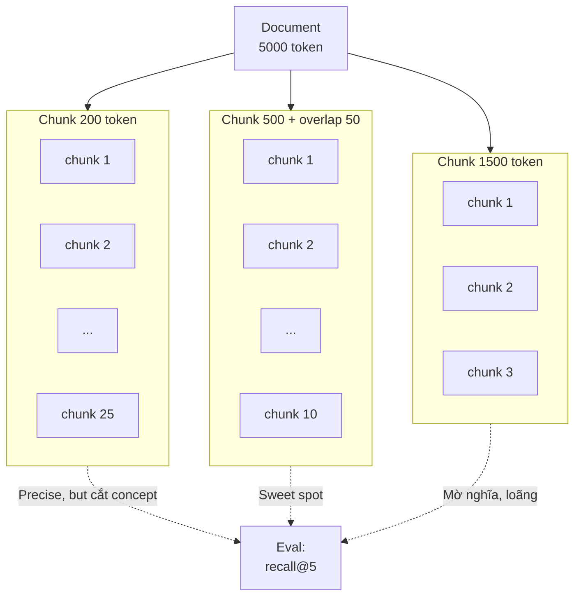

# Chunking là gì? Vì sao Chunk Size Quan trọng

## ⚡ Tóm tắt ngắn (30s)
* **Chunking** = chia document dài thành các **đoạn nhỏ hơn (chunk)** trước khi embed. Vì: (1) embedding model có max input token (512-8192), (2) chunk nhỏ giúp retrieval precise hơn, (3) chunk vừa cỡ context window LLM.
* **Chunk size là tradeoff**:
  * **Quá nhỏ (100-200 token)**: chunk thiếu context, embedding "rỗng nghĩa", LLM nhận context phân mảnh khó tổng hợp.
  * **Vừa (300-800 token)**: sweet spot cho hầu hết RAG.
  * **Quá lớn (>1500 token)**: similarity "loãng" (chunk có nhiều topic), tốn token context, "lost in the middle".
* **Quy tắc Senior chọn chunk size**:
  1. Loại document: FAQ ngắn → 200-400; legal/policy → 500-800; code → theo function.
  2. Embedding model max: text-embedding-3 cho phép 8k token nhưng practical 800.
  3. Test trên golden set: 250 vs 500 vs 1000 → đo recall@5.
  4. Add overlap 10-20% để tránh cắt giữa concept quan trọng.
* **Thảm họa thực chiến**: Team chunk 200 token + không overlap. Câu hỏi "thời gian shipping cho Hà Nội" → answer nằm ở câu "Đối với Hà Nội thì..." (chunk 5) + "...thời gian dự kiến là 24 giờ." (chunk 6). Cắt giữa concept → retrieval miss cả 2 chunk. Senior fix: chunk 500 + overlap 100 → answer trong 1 chunk.

---

## 🔍 Chi tiết bản chất

### 1. Tại sao phải chunk?

Document gốc có thể dài 100 page. Không thể:
* **Embed cả doc** thành 1 vector → embedding "trung bình hóa" → semantic mờ.
* **Đưa cả doc vào prompt** → tốn cost + lost in middle + có thể vượt context.

→ Chunk = đơn vị retrieve cơ bản. Mỗi chunk có embedding riêng, được retrieve độc lập.

### 2. Trade-off chunk size

```
Chunk nhỏ (200 token)              Chunk lớn (1500 token)
─────────────────────────         ─────────────────────────
✓ Embedding focused              ✗ Embedding "loãng nghĩa"
✓ Precise retrieval              ✗ Có thể match topic nhưng miss specific
✗ Thiếu context khi LLM đọc      ✓ LLM có đủ context xung quanh
✓ Nhiều chunk cùng topic         ✗ Khó retrieve câu cụ thể
✗ Concept bị cắt giữa            ✓ Hiếm khi bị cắt
✓ Top-K nhiều = nhiều info       ✗ Top-K ít = ít token tốn
```

### 3. Lựa chọn chunk size theo loại doc

| Loại doc | Chunk size khuyến nghị | Lý do |
| :--- | :---: | :--- |
| FAQ (Q+A ngắn) | 200-300 token | Mỗi Q+A là 1 unit logical |
| Knowledge base article | 300-500 token | Đoạn văn / paragraph |
| Policy / legal | 500-800 token | Clause + context xung quanh |
| Technical doc / code | 400-800 token | Function/class boundary |
| Long-form (book, paper) | 500-1000 token | Section level |
| Conversational log | 100-300 token | Mỗi turn / message |

### 4. Đo lường khi tune chunk size

Trên golden set Q&A:
1. Ingest với chunk size = 250, 500, 1000.
2. Cho mỗi câu hỏi, retrieve top-5 chunks.
3. Đo:
   * **Recall@5**: có phải golden chunk nằm trong top-5?
   * **MRR (Mean Reciprocal Rank)**: golden chunk ở position nào?
   * **End-to-end accuracy**: LLM trả lời đúng?
4. Chọn chunk size có recall@5 cao nhất.

### 5. Smart chunking strategies

**(a) Fixed-size** (đơn giản nhất): `text[i:i+500]`.

**(b) Recursive splitter** (LangChain): cố split tại boundary tự nhiên trước (paragraph → sentence → space).

**(c) Document-aware**:
* Markdown: split theo `##` heading.
* Code: AST-based (split theo function/class).
* HTML: split theo `<section>`, `<article>`.

**(d) Semantic chunking** (Llama Index):
* Embed từng câu.
* Group câu gần ngữ nghĩa thành chunk.
* Chậm + cost nhưng chất lượng cao.

**(e) Sliding window with overlap**: 500 token + 100 token overlap với chunk trước → giảm risk cắt giữa concept.

**(f) Hierarchical chunking**: 
* Chunk nhỏ (200 token) cho precise retrieval.
* Khi retrieve hit → expand sang chunk parent (1000 token) cho LLM context đầy đủ.

---

## 🎨 Sơ đồ trực quan



---

## 💻 Code thực chiến

### 1. Recursive chunker (Java)

```java
package com.example.rag.chunk;

import java.util.*;

public class RecursiveTextChunker {

    private final int maxTokens;
    private final int overlap;
    private final List<String> separators;
    private final TokenCounter tokenCounter;

    public RecursiveTextChunker(int maxTokens, int overlap, TokenCounter counter) {
        this.maxTokens = maxTokens;
        this.overlap = overlap;
        this.tokenCounter = counter;
        // Try paragraph → sentence → word fallback
        this.separators = List.of("\n\n", "\n", ". ", " ", "");
    }

    public List<String> split(String text) {
        List<String> chunks = new ArrayList<>();
        splitRecursive(text, separators, chunks);
        return addOverlap(chunks);
    }

    private void splitRecursive(String text, List<String> seps, List<String> chunks) {
        if (tokenCounter.count(text) <= maxTokens) {
            if (!text.isBlank()) chunks.add(text);
            return;
        }
        if (seps.isEmpty()) {
            // Fallback: cắt cứng theo character
            chunks.add(text.substring(0, Math.min(text.length(), maxTokens * 4)));
            return;
        }

        String sep = seps.get(0);
        String[] parts = text.split(java.util.regex.Pattern.quote(sep));
        
        StringBuilder current = new StringBuilder();
        for (String part : parts) {
            String candidate = current + (current.isEmpty() ? "" : sep) + part;
            if (tokenCounter.count(candidate) > maxTokens) {
                if (!current.isEmpty()) chunks.add(current.toString());
                current = new StringBuilder(part);
                if (tokenCounter.count(part) > maxTokens) {
                    // recurse with next separator
                    splitRecursive(part, seps.subList(1, seps.size()), chunks);
                    current = new StringBuilder();
                }
            } else {
                current = new StringBuilder(candidate);
            }
        }
        if (!current.isEmpty()) chunks.add(current.toString());
    }

    private List<String> addOverlap(List<String> chunks) {
        if (overlap <= 0 || chunks.size() < 2) return chunks;
        
        List<String> result = new ArrayList<>();
        result.add(chunks.get(0));
        
        for (int i = 1; i < chunks.size(); i++) {
            String prevTail = takeLastTokens(chunks.get(i-1), overlap);
            result.add(prevTail + " " + chunks.get(i));
        }
        return result;
    }

    private String takeLastTokens(String text, int n) {
        // Approximate: last n*4 characters
        return text.length() <= n * 4 ? text : text.substring(text.length() - n * 4);
    }
}
```

### 2. Markdown-aware chunker

```python
from langchain.text_splitter import MarkdownHeaderTextSplitter, RecursiveCharacterTextSplitter

def chunk_markdown(md: str) -> list[dict]:
    # Step 1: split by headers (## level)
    header_splitter = MarkdownHeaderTextSplitter(
        headers_to_split_on=[("#", "title"), ("##", "section"), ("###", "subsection")]
    )
    sections = header_splitter.split_text(md)
    
    # Step 2: further split sections if too long
    text_splitter = RecursiveCharacterTextSplitter(
        chunk_size=500, chunk_overlap=50,
        separators=["\n\n", "\n", ". ", " ", ""]
    )
    
    chunks = []
    for section in sections:
        sub_chunks = text_splitter.split_text(section.page_content)
        for sc in sub_chunks:
            chunks.append({
                "text": sc,
                "metadata": {**section.metadata}
            })
    return chunks
```

### 3. Code chunker (AST-based)

```python
import ast

def chunk_python_code(code: str) -> list[dict]:
    """Split Python code by function/class boundary."""
    try:
        tree = ast.parse(code)
    except SyntaxError:
        # Fallback to fixed chunking
        return fixed_chunk(code, 500)
    
    chunks = []
    for node in ast.iter_child_nodes(tree):
        if isinstance(node, (ast.FunctionDef, ast.AsyncFunctionDef, ast.ClassDef)):
            start_line = node.lineno - 1
            end_line = node.end_lineno
            code_lines = code.split("\n")[start_line:end_line]
            chunk_text = "\n".join(code_lines)
            chunks.append({
                "text": chunk_text,
                "metadata": {
                    "type": type(node).__name__,
                    "name": node.name,
                    "lines": f"{start_line}-{end_line}"
                }
            })
    return chunks
```

### 4. Token counter (jtokkit)

```java
package com.example.rag.chunk;

import com.knuddels.jtokkit.Encodings;
import com.knuddels.jtokkit.api.Encoding;
import com.knuddels.jtokkit.api.EncodingType;
import org.springframework.stereotype.Component;

@Component
public class TokenCounter {
    private final Encoding enc = Encodings.newDefaultEncodingRegistry()
        .getEncoding(EncodingType.O200K_BASE);

    public int count(String text) {
        return enc.countTokens(text);
    }
}
```

---

## 📊 Bảng so sánh chunking strategies

| Strategy | Setup | Quality | Cost | Khi dùng |
| :--- | :---: | :---: | :---: | :--- |
| Fixed-size | Đơn giản | Thấp | Free | POC |
| Recursive | Trung bình | Tốt | Free | Default text |
| Markdown-aware | Trung bình | Tốt | Free | Markdown docs |
| Code-aware (AST) | Phức tạp | Tốt cho code | Free | Code repo RAG |
| Semantic | Phức tạp | Best | Embedding cost | High-stakes Q&A |
| Hierarchical | Phức tạp | Best | DB overhead | Long docs |
| Late chunking | Mới (2024) | Best | Model support | Khi có context-rich model |

---

## ⚠️ Common Gotchas & Questions follow-up

### 1. Cạm bẫy: Copy chunk size từ tutorial
* **Vấn đề**: "Tutorial nói 1024 token". Áp vào FAQ doc → mỗi chunk chứa 5 FAQ → retrieval không precise.
* **Giải pháp**: Đo thực tế trên dataset của mình. A/B 250/500/1000.

### 2. Cạm bẫy: Cắt giữa code block
* **Vấn đề**: Code block bị cắt giữa → cả 2 nửa khó parse, embedding khó hiểu.
* **Giải pháp**: Chunker phát hiện ` ``` ` markdown, treat as boundary cứng, không cắt bên trong.

### 3. Cạm bẫy: Token count != character count
* **Vấn đề**: Chunk size theo character → tiếng Việt tốn token gấp đôi → chunk thực tế quá lớn → vượt embedding max.
* **Giải pháp**: Dùng token counter của tokenizer thật (jtokkit cho OpenAI, transformers cho HuggingFace).

### 4. Cạm bẫy: Đổi chunk size mà không re-ingest
* **Vấn đề**: Đổi từ 500 → 800 token nhưng giữ chunks cũ → mix sizes, recall tệ.
* **Giải pháp**: Re-ingest hết khi đổi chunk strategy. Hoặc migrate dual-write + cutover.

### 5. Câu hỏi đào sâu từ interviewer
* **Interviewer: "Doc của bạn có cả text, table, code. Bạn chunk thế nào?"**
* **Trả lời Senior**:
  1. **Multi-modal chunking**: parser detect type, chunk differently.
     - Text: recursive splitter.
     - Table: giữ nguyên table như 1 chunk (vì semantic gắn liền).
     - Code: AST-based.
  2. **Metadata**: mỗi chunk có field `content_type` (text/table/code) → reranker có thể weight khác.
  3. **Table representation**: convert table → markdown table hoặc CSV → embed; còn lưu HTML original cho display.
  4. **Code embedding model**: text-embedding-3 hoạt động OK với code; nhưng có code-specific model (CodeBERT, voyage-code-3).
  5. **Hybrid retrieval**: BM25 mạnh cho code identifier (function name, variable); semantic cho concept. Combine.
  6. **Test**: golden set cover cả 3 type, đo recall riêng từng loại.
