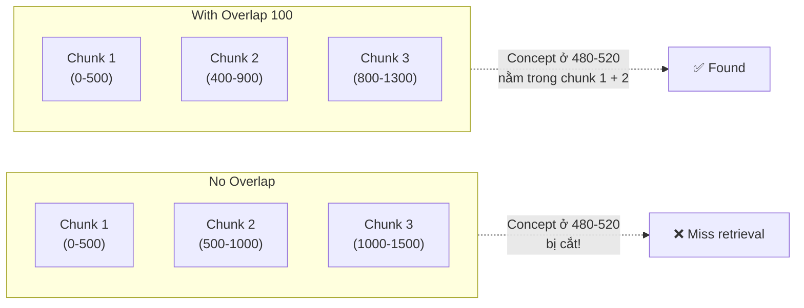

# Overlap giữa các Chunk dùng để làm gì

## ⚡ Tóm tắt ngắn (30s)
* **Overlap** = phần text trùng nhau giữa 2 chunk liên tiếp (thường 10-20% của chunk size, ví dụ 50-100 token cho chunk 500). Mục đích:
  1. **Tránh cắt giữa concept**: thông tin quan trọng nằm vắt qua boundary 2 chunk → không bị mất khi retrieval.
  2. **Giữ ngữ cảnh đầu/cuối**: chunk N có context của chunk N-1 → LLM hiểu connection.
  3. **Tăng recall**: 1 fact xuất hiện trong 2 chunk → khả năng match query cao hơn.
* **Cái giá phải trả**:
  * Tăng số chunk: 500 token + 100 overlap → 20% chunk thêm → 20% embedding cost + 20% storage.
  * **Duplicate retrieval**: top-K có thể trả 2 chunk gần nhau → "lãng phí" slot trong context.
* **Quy tắc Senior**:
  * Overlap = 10-20% chunk size (50-100 token cho chunk 500).
  * Có thể skip nếu chunk size đủ lớn + boundary aware (paragraph chunking).
  * Hierarchical chunking giảm sự cần thiết của overlap.
* **Thảm họa thực chiến**: No-overlap chunker. User hỏi "thời gian shipping Hà Nội bao lâu?". Answer nằm ở chunk_5 "Đối với Hà Nội thì..." + chunk_6 "...thời gian dự kiến là 24 giờ.". Vector search match chunk_5 cao (có "Hà Nội") nhưng không có "24 giờ". LLM trả lời "không tìm thấy". Add overlap 100 → answer trong 1 chunk → trả lời đúng.

---

## 🔍 Chi tiết bản chất

### 1. Khi nào overlap quan trọng

#### Case 1: Concept vắt qua boundary
```
Chunk 5: "...Đối với khu vực Hà Nội, đơn hàng được xử lý..."
[BOUNDARY]
Chunk 6: "...trong vòng 24 giờ kể từ khi xác nhận thanh toán."
```
Query "shipping Hà Nội bao lâu?" → cần cả 2 phần. Overlap đưa "24 giờ" vào chunk 5 → retrieval thành công.

#### Case 2: Antecedent reference
```
Chunk 5: "...Chính sách hoàn tiền 14 ngày..."
[BOUNDARY]
Chunk 6: "...Điều này không áp dụng cho hàng giảm giá."
```
Query "hàng giảm giá có hoàn tiền không?" → chunk 6 nói "Điều này..." nhưng không rõ "điều này" là gì. Overlap mang "chính sách hoàn tiền" vào chunk 6 → context rõ hơn.

#### Case 3: Definition spanning
```
Chunk 5: "...Service Level Agreement (SLA) là cam kết về..."
[BOUNDARY]
Chunk 6: "...thời gian phản hồi và uptime."
```

### 2. Vì sao overlap > simply chunk lớn hơn

Có thể nghĩ "chunk 1000 token đỡ cần overlap". Đúng phần, nhưng:
* Vẫn có boundary giữa chunk 1000-1 và 1000-2.
* Chunk lớn = embedding "loãng" → similarity kém precise.

→ Overlap giải bài toán boundary tốt hơn là tăng chunk size.

### 3. Cách tính overlap

* **Token-based**: 50-100 token mỗi side. Đảm bảo include cả câu hoàn chỉnh ở boundary.
* **Sentence-based**: include 1-2 câu cuối của chunk trước vào đầu chunk hiện tại. Tự nhiên hơn.
* **Adaptive**: detect natural boundary trong vùng overlap, cắt đúng đó.

### 4. Trade-off chính xác

| Overlap | Recall | Cost | Duplicate top-K | Khuyến nghị |
| :---: | :---: | :---: | :---: | :--- |
| 0% | Trung bình | Tối thiểu | Không | Chunk đã boundary-aware (markdown ##) |
| 10% (50 tok/500) | Tốt | +10% | Hiếm | Default cho text thông thường |
| 20% (100 tok/500) | Tốt nhất | +20% | Thỉnh thoảng | Khi concept dài, technical doc |
| 30%+ | Diminishing | Cao | Thường xuyên | Hiếm khi cần |

### 5. Khi KHÔNG cần overlap

* **Boundary-aware chunking**: split theo `##` markdown, paragraph → mỗi chunk là 1 unit logical hoàn chỉnh.
* **Hierarchical chunking**: retrieve chunk nhỏ → expand sang parent chunk → tự có context.
* **Self-contained units**: FAQ (Q+A), code function — mỗi chunk đã hoàn chỉnh.

---

## 🎨 Sơ đồ trực quan



---

## 💻 Code thực chiến

### 1. Overlap đơn giản (Java)

```java
package com.example.rag.chunk;

import java.util.*;

public class OverlapChunker {
    
    private final int chunkSize;
    private final int overlap;
    
    public OverlapChunker(int chunkSize, int overlap) {
        if (overlap >= chunkSize) {
            throw new IllegalArgumentException("Overlap phải nhỏ hơn chunk size");
        }
        this.chunkSize = chunkSize;
        this.overlap = overlap;
    }
    
    /** Token-based sliding window with overlap */
    public List<String> split(List<String> tokens) {
        List<String> chunks = new ArrayList<>();
        int stride = chunkSize - overlap;  // bước nhảy
        
        for (int i = 0; i < tokens.size(); i += stride) {
            int end = Math.min(i + chunkSize, tokens.size());
            List<String> chunkTokens = tokens.subList(i, end);
            chunks.add(String.join(" ", chunkTokens));
            
            if (end == tokens.size()) break;  // last chunk
        }
        return chunks;
    }
}
```

### 2. Sentence-aware overlap (Python)

```python
import re

def split_with_overlap(text: str, chunk_size_tokens: int = 500,
                       overlap_sentences: int = 2) -> list[str]:
    """Chunk by sentence, with N-sentence overlap between chunks."""
    sentences = re.split(r'(?<=[.!?])\s+', text)
    chunks = []
    current = []
    current_token_count = 0
    
    for sent in sentences:
        sent_tokens = len(sent.split())  # approximate
        if current_token_count + sent_tokens > chunk_size_tokens and current:
            # Flush current chunk
            chunks.append(" ".join(current))
            # Start new chunk with last N sentences as overlap
            current = current[-overlap_sentences:] if overlap_sentences > 0 else []
            current_token_count = sum(len(s.split()) for s in current)
        
        current.append(sent)
        current_token_count += sent_tokens
    
    if current:
        chunks.append(" ".join(current))
    
    return chunks

# Usage
text = "Câu 1. Câu 2. Câu 3. ... Câu 100."
chunks = split_with_overlap(text, chunk_size_tokens=500, overlap_sentences=2)
```

### 3. LangChain RecursiveCharacterTextSplitter

```python
from langchain.text_splitter import RecursiveCharacterTextSplitter
import tiktoken

enc = tiktoken.encoding_for_model("text-embedding-3-large")

splitter = RecursiveCharacterTextSplitter(
    chunk_size=500,           # token
    chunk_overlap=100,        # token overlap
    length_function=lambda x: len(enc.encode(x)),  # đếm token thật
    separators=["\n\n", "\n", ". ", " ", ""],
)

chunks = splitter.split_text(long_text)
```

### 4. Deduplicate gần nhau trong retrieval

```java
package com.example.rag.retrieval;

import java.util.*;
import java.util.stream.Collectors;

public class ChunkDeduplicator {
    
    /**
     * Loại bỏ chunk trùng gần nhau từ overlap.
     * Sau retrieval, có thể có chunk N và N+1 trong top-K → context lặp.
     */
    public List<Chunk> dedupAdjacent(List<Chunk> chunks) {
        // Group theo doc_id + sort theo chunk_idx
        Map<UUID, List<Chunk>> byDoc = chunks.stream()
            .collect(Collectors.groupingBy(Chunk::docId));
        
        List<Chunk> deduped = new ArrayList<>();
        for (var entry : byDoc.entrySet()) {
            List<Chunk> sorted = entry.getValue().stream()
                .sorted(Comparator.comparingInt(Chunk::chunkIdx))
                .toList();
            
            Chunk prev = null;
            for (Chunk c : sorted) {
                // Nếu chunk này adjacent với chunk trước → merge hoặc skip
                if (prev != null && c.chunkIdx() - prev.chunkIdx() == 1) {
                    // Merge: extend prev với phần non-overlap của c
                    Chunk merged = new Chunk(prev.docId(),
                        prev.chunkIdx(),
                        prev.text() + " " + removeOverlapPrefix(c.text(), 100),
                        Math.max(prev.similarity(), c.similarity()));
                    deduped.set(deduped.size() - 1, merged);
                    prev = merged;
                } else {
                    deduped.add(c);
                    prev = c;
                }
            }
        }
        return deduped;
    }
    
    private String removeOverlapPrefix(String text, int approxTokens) {
        // Skip first approxTokens*4 characters (rough)
        return text.length() > approxTokens * 4 ? text.substring(approxTokens * 4) : text;
    }
    
    public record Chunk(UUID docId, int chunkIdx, String text, double similarity) {}
}
```

---

## 📊 Bảng so sánh overlap strategies

| Strategy | Setup | Recall | Cost overhead | Khi dùng |
| :--- | :---: | :---: | :---: | :--- |
| No overlap | Đơn giản | Trung bình | 0% | Boundary-aware chunker |
| Fixed token overlap | Đơn giản | Tốt | 10-20% | Default fixed-size chunking |
| Sentence overlap (1-2) | Trung bình | Tốt | 5-15% | Natural language |
| Adaptive (boundary aware) | Phức tạp | Tốt nhất | 5-10% | High-stakes RAG |
| Hierarchical (parent expand) | Phức tạp | Tốt nhất | DB overhead | Doc rất dài |

---

## ⚠️ Common Gotchas & Questions follow-up

### 1. Cạm bẫy: Overlap quá lớn (>30%)
* **Vấn đề**: Overlap 50% → 50% storage thừa, top-K thường có 2-3 chunk gần nhau → context lặp lại trong prompt.
* **Giải pháp**: Overlap 10-20%. Đủ giải bài toán boundary, không over-engineer.

### 2. Cạm bẫy: Duplicate trong top-K
* **Vấn đề**: Overlap khiến 2 chunk liền kề cùng match query → top-K chứa cả 2 → context lặp, lãng phí slot.
* **Giải pháp**: 
  1. Dedup theo (doc_id, chunk_idx) adjacent.
  2. Hoặc rerank biết merge.

### 3. Cạm bẫy: Tính overlap bằng character
* **Vấn đề**: Overlap = 200 ký tự → cho tiếng Việt thực ra ~50 token → quá nhỏ.
* **Giải pháp**: Tính overlap bằng token count, không character.

### 4. Cạm bẫy: Cắt giữa câu khi overlap
* **Vấn đề**: Overlap = 100 token cắt cứng → có thể nửa câu → embedding "nhiễu".
* **Giải pháp**: Sentence-aware: cắt overlap ở sentence boundary gần nhất.

### 5. Câu hỏi đào sâu từ interviewer
* **Interviewer: "Bạn có cần overlap không nếu dùng hierarchical chunking?"**
* **Trả lời Senior**:
  1. **Hierarchical**: chunk nhỏ (200 token) cho retrieval precision; khi hit, expand sang chunk parent (1000 token) chứa nó.
  2. **Overlap ít cần thiết**: vì parent chunk đã chứa đủ context xung quanh. Concept ở boundary nhỏ sẽ nằm trong parent.
  3. **Tradeoff**:
     - Hierarchical: storage gấp đôi (lưu cả 2 level), query phức tạp hơn (2 lookups).
     - Overlap: storage +20%, query đơn giản.
  4. **Quyết định**:
     - Doc cực dài + retrieval precision quan trọng → hierarchical.
     - Doc trung bình + đơn giản hóa code → overlap 10-20%.
     - Combine: hierarchical + overlap nhỏ 5% trong child chunks.
  5. **Test**: dùng golden set cả 2 approach, đo end-to-end accuracy + ops cost.
