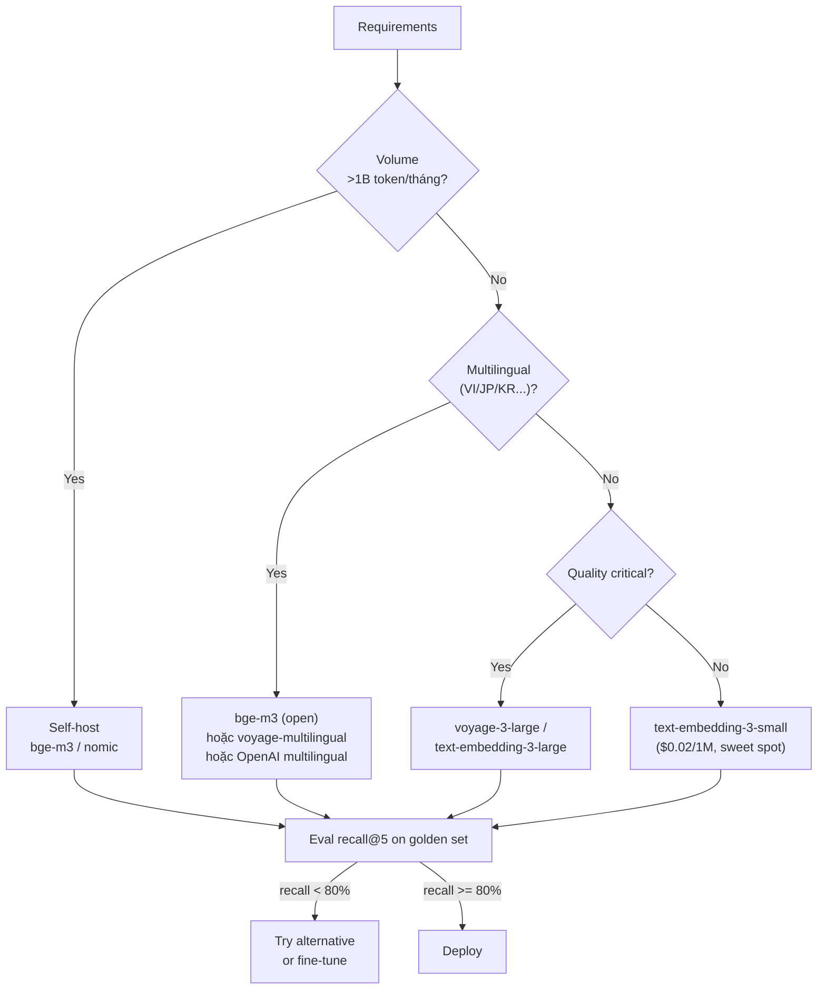

# Embedding Model ảnh hưởng Chất lượng Retrieval thế nào

## ⚡ Tóm tắt ngắn (30s)
* **Embedding model = trái tim của RAG**. Chọn model kém = retrieval kém = LLM nhận context sai = trả lời sai. Không cứu được bằng prompt engineering.
* **4 yếu tố cốt lõi**:
  1. **Quality**: model lớn (text-embedding-3-large, voyage-3-large) recall@5 cao hơn model nhỏ (small variants) 5-15%.
  2. **Language coverage**: tiếng Việt cần model multilingual (bge-m3, OpenAI multilingual). Model English-only tệ.
  3. **Domain**: model general (OpenAI) tốt cho QA chung; model code-specific (voyage-code-3) tốt cho code search.
  4. **Dimension & latency**: 384 dim nhanh + ít RAM; 3072 dim tốt hơn nhưng chậm + nhiều storage.
* **Quy tắc Senior**:
  1. Bắt đầu với text-embedding-3-small ($0.02/1M) hoặc bge-m3 (open). Đủ tốt 80% case.
  2. Đo recall@5 trên golden set của mình. Nếu < 80% → thử voyage-3 / text-embedding-3-large.
  3. Multilingual + domain → bge-m3 self-host hoặc voyage-multilingual.
  4. **KHÔNG bao giờ trộn embedding model trong cùng collection**.
* **Thảm họa thực chiến**: Team chọn text-embedding-ada-002 (1536 dim, deprecated 2025) cho RAG tiếng Việt. Recall@5 chỉ 55%. Switch sang bge-m3 (1024 dim, multilingual) → recall 84%. Cost gần như $0 vì self-host.

---

## 🔍 Chi tiết yếu tố

### 1. Quality / Benchmark

MTEB (Massive Text Embedding Benchmark) là chuẩn vàng. So sánh model trên 58 task.

Top models May 2026 (English):
* **voyage-3-large**: top 1, $0.18/1M token.
* **text-embedding-3-large**: $0.13/1M.
* **bge-large-en-v1.5**: open, self-host free.
* **nomic-embed-text-v2**: open, lightweight.

Top multilingual:
* **bge-m3**: open, hỗ trợ 100+ ngôn ngữ, tiếng Việt mạnh.
* **voyage-multilingual-2**: paid.
* **OpenAI text-embedding-3** với multilingual native.

### 2. Dimension matter

| Dim | Storage / vector | Speed | Recall (typical) |
| :---: | :---: | :---: | :---: |
| 384 | 1.5 KB | Nhanh | Trung bình |
| 768 | 3 KB | Trung bình | Tốt |
| 1024 | 4 KB | Trung bình | Tốt |
| 1536 | 6 KB | Chậm hơn | Tốt |
| 3072 | 12 KB | Chậm | Best |

10M vector × 3072 dim × 4 bytes = ~120GB RAM cho HNSW index. Đáng cân nhắc với scale lớn.

Một số model hỗ trợ **Matryoshka representation**: train 1 lần cho phép truncate dim mà không retrain. text-embedding-3-large có thể dùng 256/512/1024 dim. Trade off recall lấy speed.

### 3. Asymmetric encoding

Một số model encode query và document **khác nhau**:
* **bge-m3**: cần prefix `"query: "` cho query, không cho document.
* **e5-multilingual**: tương tự.
* **text-embedding-3**: symmetric, không cần prefix.

Quên prefix → recall giảm 10-20%. Phải đọc model card kỹ.

### 4. Domain-specific embeddings

* **Code**: voyage-code-3, jina-embeddings-v2-base-code → hiểu syntax, identifier.
* **Medical/Legal**: BiomedBERT, Legal-BERT (cần fine-tune custom data).
* **Multilingual**: bge-m3, paraphrase-multilingual-mpnet.

Domain model có thể đem recall +10-20% trên domain task.

### 5. Cost vs quality tradeoff

Cost embedding 1M token theo provider (May 2026):
* OpenAI text-embedding-3-small: $0.02
* OpenAI text-embedding-3-large: $0.13
* Cohere embed-multilingual: $0.10
* Voyage-3-large: $0.18
* Self-host bge-m3: GPU + ops cost (~$200/month cho small cluster)

Với <100M token/tháng → API rẻ hơn self-host. Với >1B token/tháng → self-host rẻ hơn.

---

## 🎨 Sơ đồ tradeoff



---

## 💻 Code thực chiến

### 1. Đo recall@5 cross-models

```python
import json
from openai import OpenAI
from sentence_transformers import SentenceTransformer
import numpy as np

openai_client = OpenAI()

# Golden set: list of {question, correct_chunk_id}
golden = json.load(open("golden_set.json"))
chunks = json.load(open("chunks.json"))  # {id, text}

def embed_openai(texts: list[str], model: str) -> np.ndarray:
    resp = openai_client.embeddings.create(input=texts, model=model)
    return np.array([e.embedding for e in resp.data])

def embed_bge(texts: list[str], prefix: str = ""):
    model = SentenceTransformer("BAAI/bge-m3")
    prefixed = [prefix + t for t in texts]
    return model.encode(prefixed, normalize_embeddings=True)

def evaluate_recall(question_embs, chunk_embs, golden, k=5):
    hits = 0
    for q, gc in zip(question_embs, golden):
        sims = chunk_embs @ q
        top_k = np.argsort(sims)[-k:]
        if gc["correct_chunk_id"] in top_k:
            hits += 1
    return hits / len(golden)

# Test 3 models
chunk_texts = [c["text"] for c in chunks]
queries = [g["question"] for g in golden]

# Model 1: OpenAI small
q1 = embed_openai(queries, "text-embedding-3-small")
c1 = embed_openai(chunk_texts, "text-embedding-3-small")
print(f"OpenAI small recall@5: {evaluate_recall(q1, c1, golden):.2f}")

# Model 2: OpenAI large
q2 = embed_openai(queries, "text-embedding-3-large")
c2 = embed_openai(chunk_texts, "text-embedding-3-large")
print(f"OpenAI large recall@5: {evaluate_recall(q2, c2, golden):.2f}")

# Model 3: bge-m3 (multilingual)
q3 = embed_bge(queries, "query: ")
c3 = embed_bge(chunk_texts, "passage: ")
print(f"bge-m3 recall@5: {evaluate_recall(q3, c3, golden):.2f}")
```

### 2. Spring AI config — Switch embedding model

```yaml
# application.yml
spring:
  ai:
    openai:
      api-key: ${OPENAI_API_KEY}
      embedding:
        options:
          model: text-embedding-3-small
          dimensions: 1024   # Matryoshka: dim truncate 1024 từ 1536
```

```java
package com.example.embedding;

import org.springframework.ai.embedding.EmbeddingModel;
import org.springframework.stereotype.Service;

@Service
public class EmbeddingService {
    private final EmbeddingModel model;

    public EmbeddingService(EmbeddingModel m) { this.model = m; }

    public float[] embed(String text) {
        return model.embed(text);
    }

    public List<float[]> embedBatch(List<String> texts) {
        return model.call(new EmbeddingRequest(texts, null))
            .getResults().stream()
            .map(r -> toArray(r.getOutput()))
            .toList();
    }

    private float[] toArray(List<Float> list) {
        float[] arr = new float[list.size()];
        for (int i = 0; i < list.size(); i++) arr[i] = list.get(i);
        return arr;
    }
}
```

### 3. Migrate embedding model — Dual-write

```java
package com.example.embedding.migration;

import org.springframework.stereotype.Service;

@Service
public class EmbeddingMigrationService {
    private final EmbeddingService oldModel;  // text-embedding-ada-002
    private final EmbeddingService newModel;  // text-embedding-3-small

    private final ChunkRepo oldRepo;
    private final ChunkRepo newRepo;

    /** Dual-write giai đoạn migrate */
    public void onIngest(String chunkId, String text) {
        // Write to both
        float[] oldEmb = oldModel.embed(text);
        float[] newEmb = newModel.embed(text);
        oldRepo.save(chunkId, text, oldEmb);
        newRepo.save(chunkId, text, newEmb);
    }

    /** Read path: shadow compare */
    public List<Chunk> search(String query) {
        float[] oldQ = oldModel.embed(query);
        float[] newQ = newModel.embed(query);
        
        var oldResults = oldRepo.search(oldQ, 10);
        var newResults = newRepo.search(newQ, 10);
        
        // Log overlap để monitor migration quality
        compareResults(oldResults, newResults);
        
        return newResults;  // serve new model
    }

    private void compareResults(List<Chunk> a, List<Chunk> b) { /* metric */ }
}
```

---

## 📊 Bảng so sánh embedding models (2026)

| Model | Provider | Dim | Multilingual | $/1M | MTEB avg | Khi dùng |
| :--- | :--- | :---: | :---: | :---: | :---: | :--- |
| text-embedding-3-small | OpenAI | 1536 | ✓ | $0.02 | 62 | **Default sweet spot** |
| text-embedding-3-large | OpenAI | 3072 | ✓ | $0.13 | 65 | English quality cao |
| voyage-3-large | Voyage | 1024 | English+ | $0.18 | 67 | Top quality English |
| voyage-multilingual-2 | Voyage | 1024 | ✓ | $0.12 | 65 | Multilingual paid |
| bge-m3 | BAAI (open) | 1024 | ✓ 100+ | self-host | 63 | **Multilingual, free** |
| bge-large-en-v1.5 | BAAI (open) | 1024 | English | self-host | 64 | English self-host |
| amazon.titan-embed-text-v2 | Bedrock | 1024 | partial | $0.02 | 60 | AWS native |
| cohere embed-multilingual-v3 | Cohere | 1024 | ✓ | $0.10 | 62 | Multilingual paid |
| jina-embeddings-v3 | Jina (open) | 1024 | ✓ | self-host | 64 | Multilingual self-host |
| voyage-code-3 | Voyage | 1024 | Code | $0.18 | top for code | Code RAG |

---

## ⚠️ Common Gotchas & Questions follow-up

### 1. Cạm bẫy: Trộn embedding model trong cùng collection
* **Vấn đề**: Nửa data ada-002 (1536 dim), nửa text-embedding-3-large (3072 dim). Không thể compare cross-model. Recall vỡ.
* **Giải pháp**: Một collection = một model. Migrate hoàn toàn rồi mới swap.

### 2. Cạm bẫy: Quên prefix asymmetric
* **Vấn đề**: bge-m3 cần `"query: "` cho query, `"passage: "` cho doc. Quên → recall giảm 10-20%.
* **Giải pháp**: Wrap embedding call: query path tự thêm prefix.

### 3. Cạm bẫy: Dim quá lớn không cần thiết
* **Vấn đề**: 3072 dim cho dataset 1M vector → 12GB RAM index. Test với 1024 dim → recall giảm 1% nhưng RAM giảm 3x.
* **Giải pháp**: Test multiple dim trên golden set. Matryoshka cho phép giảm dim không retrain.

### 4. Cạm bẫy: Đánh giá bằng benchmark public
* **Vấn đề**: MTEB nói model X tốt. Apply vào data riêng → tệ.
* **Giải pháp**: MTEB chỉ là gợi ý. Benchmark bằng golden set của mình.

### 5. Câu hỏi đào sâu từ interviewer
* **Interviewer: "Bạn đang dùng OpenAI ada-002 (deprecated). Migrate plan thế nào?"**
* **Trả lời Senior**:
  1. **Eval baseline**: đo recall@5 hiện tại trên golden set. Có thể model deprecated nhưng vẫn ổn — đừng migrate vì hype.
  2. **Candidate model**: 
     - Same provider: text-embedding-3-small (compatible API, cheaper).
     - Cross provider: bge-m3, voyage-3.
  3. **Test offline**: re-embed 1% data với candidate, đo recall.
  4. **Decision**: chỉ migrate nếu candidate tốt hơn baseline > 3% HOẶC cost giảm > 50%.
  5. **Migration plan**:
     - Phase 1: Dual-write. Mỗi chunk có 2 embedding (old + new). 1-2 tuần.
     - Phase 2: Shadow read. Query cả 2, log comparison. Verify quality.
     - Phase 3: Cutover. Switch read sang new. Old vẫn write thêm 1 tuần để rollback.
     - Phase 4: Drop old embedding column.
  6. **Risk**: 
     - Cost embedding migration: 100M token × $0.02 = $2k one-time.
     - Latency: re-embed có thể mất ngày-tuần với batch + rate limit.
     - Recall regression: monitor và rollback nếu cần.
