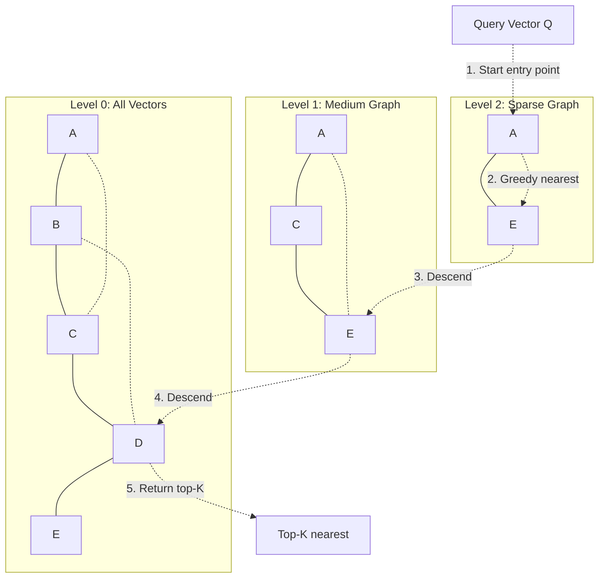

# Vector Search hoạt động ở mức Khái niệm ra sao

## ⚡ Tóm tắt ngắn (30s)
* **Vector search** = tìm các vector **gần nhất** với query vector trong không gian high-dimensional. "Gần" được đo bằng **cosine similarity** (góc giữa 2 vector) hoặc **Euclidean distance**.
* **Bài toán**: cho 10M vector 1024-dim + 1 query vector. Tìm top-K gần nhất.
  * **Brute-force**: O(n) — quá chậm với scale lớn (vài giây cho 10M).
  * **ANN (Approximate Nearest Neighbor) Index**: O(log n) với 95-99% recall — đủ tốt + nhanh (ms).
* **3 thuật toán ANN chính**:
  1. **HNSW (Hierarchical Navigable Small World)**: graph-based, recall cao, ăn RAM. Default cho hầu hết vector DB.
  2. **IVF (Inverted File Index)**: cluster-based, ít RAM. Tốt cho dataset lớn.
  3. **Product Quantization (PQ)**: nén vector → giảm RAM 4-32x. Combine với HNSW/IVF.
* **Thảm họa thực chiến**: Team dùng brute-force search (numpy) trên 5M vector. Query 8s, không scale. Switch sang Qdrant với HNSW → query 30ms, 99% recall.

---

## 🔍 Chi tiết bản chất

### 1. Distance metrics

**Cosine similarity** (phổ biến nhất cho text embedding):
```
cos(A, B) = (A · B) / (|A| × |B|)
Range [-1, 1]. Càng gần 1 càng giống.
```

**Cosine distance** = 1 - cosine similarity. Range [0, 2].

**Euclidean distance** (L2):
```
d(A, B) = sqrt(Σ(a_i - b_i)²)
```

Nếu vector đã normalize (|A| = |B| = 1), cosine và L2 cho thứ tự giống nhau. Most modern embedding model output normalized vectors → dùng dot product (rẻ nhất).

### 2. Brute-force search

```python
def brute_force(query, vectors, k):
    sims = [cosine(query, v) for v in vectors]
    top_k_idx = sorted(range(len(sims)), key=lambda i: -sims[i])[:k]
    return top_k_idx
```

* Time: O(n × d) cho mỗi query. n = số vector, d = dim.
* 10M × 1024 = 10 tỷ phép nhân → 5-30 giây.
* Không scale, nhưng **chính xác 100%**.

### 3. HNSW — Hierarchical Navigable Small World

Idea: build **graph multi-level**. Mỗi node = 1 vector. Cạnh nối với các neighbor "gần".

```
Level 2:        A ─────── E (sparse, long-range)
                │         │
Level 1:        A ─── C ─ E
                │   ╱     │
Level 0:        A ─ B C ─ D E (dense, all nodes)
```

Search:
1. Start ở level cao nhất (entry point).
2. Greedy: di chuyển đến node gần Q nhất ở level đó.
3. Khi không tiến được nữa, descend xuống level dưới.
4. Lặp đến level 0 → trả K node gần Q nhất.

Tham số quan trọng:
* **M**: số connection mỗi node (16-64). Càng cao càng recall + RAM.
* **ef_construction**: chất lượng khi build (32-256).
* **ef_search**: chất lượng khi query (10-500). Tăng = recall cao + latency cao.

### 4. IVF — Inverted File Index

Idea: cluster vectors bằng k-means thành n buckets. Khi query:
1. Tính cluster gần Q nhất.
2. Search chỉ trong cluster đó (hoặc nprobe cluster gần).

```
Cluster 1: [v1, v2, v3, ...]
Cluster 2: [v50, v51, v52, ...]
...
Cluster 1000: [...]

Query Q → tìm cluster gần nhất → search ~10000 vector thay vì 10M.
```

Tham số:
* **nlist**: số cluster (~sqrt(n)).
* **nprobe**: số cluster check khi query. Tăng = recall cao.

### 5. Product Quantization

Idea: chia vector thành sub-vector, mỗi sub có codebook 256 centroid → vector 1024-d compress xuống ~8-16 bytes.

* Recall hơi giảm (5-10%) nhưng RAM giảm 16-32x.
* Combine với HNSW (HNSW+PQ) hoặc IVF (IVF+PQ).

### 6. Pre-filter vs Post-filter

Khi query có filter (e.g. tenant_id = X):

**Pre-filter**: Filter trước khi ANN search.
* Quality cao (no top-K bị "ăn" bởi vector ngoài filter).
* Phụ thuộc DB support (pgvector, Qdrant pre-filter trong HNSW traverse).

**Post-filter**: ANN search → filter sau.
* Đơn giản hơn.
* Recall thấp: nếu filter strict, top-K có thể bị "rỗng".

→ Senior chọn DB có pre-filter (Qdrant, Weaviate, pgvector recent).

---

## 🎨 Sơ đồ HNSW



---

## 💻 Code thực chiến

### 1. Brute-force (for learning)

```java
package com.example.search;

import java.util.*;

public class BruteForceSearch {
    
    public List<Integer> searchTopK(float[] query, float[][] vectors, int k) {
        record ScoredIdx(int idx, double sim) {}
        
        List<ScoredIdx> scored = new ArrayList<>();
        for (int i = 0; i < vectors.length; i++) {
            scored.add(new ScoredIdx(i, cosine(query, vectors[i])));
        }
        
        return scored.stream()
            .sorted(Comparator.comparingDouble(ScoredIdx::sim).reversed())
            .limit(k)
            .map(ScoredIdx::idx)
            .toList();
    }
    
    private double cosine(float[] a, float[] b) {
        double dot = 0, na = 0, nb = 0;
        for (int i = 0; i < a.length; i++) {
            dot += a[i] * b[i];
            na += a[i] * a[i];
            nb += b[i] * b[i];
        }
        return dot / (Math.sqrt(na) * Math.sqrt(nb));
    }
}
```

### 2. pgvector HNSW

```sql
-- Create HNSW index
CREATE INDEX rag_chunks_hnsw_idx
ON rag_chunks
USING hnsw (embedding vector_cosine_ops)
WITH (m = 16, ef_construction = 64);

-- Tune ef_search per query (higher = better recall, slower)
SET hnsw.ef_search = 100;

-- Query with pre-filter (tenant_id)
SELECT id, text, 1 - (embedding <=> :q) AS sim
FROM rag_chunks
WHERE tenant_id = :tenant
ORDER BY embedding <=> :q
LIMIT 10;
```

### 3. Qdrant — Pre-filter native

```java
package com.example.search;

import io.qdrant.client.QdrantClient;
import io.qdrant.client.grpc.Points;

public class QdrantSearch {
    private final QdrantClient client;

    public QdrantSearch(QdrantClient c) { this.client = c; }

    public List<Points.ScoredPoint> search(String collection, float[] query,
                                            String tenantId, int topK) throws Exception {
        var filter = Points.Filter.newBuilder()
            .addMust(Points.Condition.newBuilder()
                .setField(Points.FieldCondition.newBuilder()
                    .setKey("tenant_id")
                    .setMatch(Points.Match.newBuilder().setKeyword(tenantId).build())
                    .build())
                .build())
            .build();

        var req = Points.SearchPoints.newBuilder()
            .setCollectionName(collection)
            .addAllVector(toFloatList(query))
            .setLimit(topK)
            .setFilter(filter)
            // Pre-filter happens BEN TRONG HNSW traverse → recall cao
            .setParams(Points.SearchParams.newBuilder()
                .setHnswEf(128)  // ef_search
                .setExact(false) // approximate
                .build())
            .setWithPayload(Points.WithPayloadSelector.newBuilder().setEnable(true).build())
            .build();

        return client.searchAsync(req).get();
    }

    private List<Float> toFloatList(float[] arr) {
        List<Float> list = new ArrayList<>(arr.length);
        for (float v : arr) list.add(v);
        return list;
    }
}
```

### 4. Faiss self-host (Python)

```python
import faiss
import numpy as np

# Build HNSW index
d = 1024  # dimension
index = faiss.IndexHNSWFlat(d, 16)  # M = 16
index.hnsw.efConstruction = 64
index.hnsw.efSearch = 64

# Add vectors
vectors = np.random.rand(1_000_000, d).astype("float32")
faiss.normalize_L2(vectors)
index.add(vectors)

# Search
query = np.random.rand(1, d).astype("float32")
faiss.normalize_L2(query)
k = 5
distances, indices = index.search(query, k)
print(indices[0])  # top-k vector indices
```

---

## 📊 Bảng so sánh ANN algorithms

| Algorithm | Recall | Speed | RAM | Build time | Khi dùng |
| :--- | :---: | :---: | :---: | :---: | :--- |
| Brute-force | 100% | Chậm O(n) | Thấp | Không cần | <10k vector |
| **HNSW** | 95-99% | Nhanh | Cao | Chậm | **Default, 1M-100M** |
| IVF | 90-95% | Nhanh | Trung bình | Trung bình | Lớn (>100M), ít RAM |
| HNSW+PQ | 90-95% | Nhanh | Thấp (nén) | Chậm | Cực lớn, ràng buộc RAM |
| IVF+PQ | 85-92% | Rất nhanh | Thấp | Trung bình | Cực lớn, billion scale |
| ScaNN (Google) | 95-99% | Rất nhanh | Trung bình | Trung bình | Khi cần ScaNN-specific |

---

## ⚠️ Common Gotchas & Questions follow-up

### 1. Cạm bẫy: ef_search quá thấp
* **Vấn đề**: Default ef_search = 64 (pgvector). Recall ~92% cho 1M vector. Khi user phàn nàn → tăng ef_search = 200 → recall 97%, latency tăng 2x.
* **Giải pháp**: Đo trade-off recall/latency, set theo SLA của app.

### 2. Cạm bẫy: Quên normalize
* **Vấn đề**: Embedding không normalize, dùng dot product → kết quả khác cosine. Distribution embedding khác hẳn → recall vỡ.
* **Giải pháp**: Hoặc normalize trước insert + dùng dot product. Hoặc dùng cosine distance trong DB (`<=>` của pgvector).

### 3. Cạm bẫy: Index rebuild khi insert nhiều
* **Vấn đề**: pgvector HNSW không support incremental insert efficient. Insert 1M vector → reindex → 1-2 giờ downtime.
* **Giải pháp**:
  1. Build index sau khi insert hết.
  2. Hoặc dùng dedicated vector DB (Qdrant, Pinecone) có incremental.

### 4. Cạm bẫy: Filter post-hoc
* **Vấn đề**: DB không support pre-filter trong HNSW → ANN search 100 candidates, filter tenant → còn 5. Mất 95% candidates.
* **Giải pháp**: 
  1. Tăng top-K ban đầu để compensate.
  2. Hoặc đổi DB có pre-filter native.
  3. Hoặc per-tenant collection (nếu số tenant nhỏ).

### 5. Câu hỏi đào sâu từ interviewer
* **Interviewer: "1 tỷ vector, query <100ms p99. Thiết kế?"**
* **Trả lời Senior**:
  1. **DB**: Milvus (distributed) hoặc Pinecone enterprise. pgvector không scale tới 1B.
  2. **Algorithm**: IVF+PQ. PQ nén vector → fit RAM. IVF cluster → narrow search.
  3. **Sharding**: 10 shard × 100M vector. Mỗi shard 1 node với GPU (Milvus support GPU search).
  4. **Pre-warm**: index lưu trong RAM (mmap), không SSD swap.
  5. **Cache**: query phổ biến → cache top-K trong Redis. Hit rate 20-40%.
  6. **Monitoring**: p99 latency, recall (sample golden set hourly), RAM usage.
  7. **Cost**: 1B vector × 1024 dim × 4 byte = 4TB raw. PQ nén xuống 100-200GB. Cluster 10 node × 64GB RAM = $$$/month.
