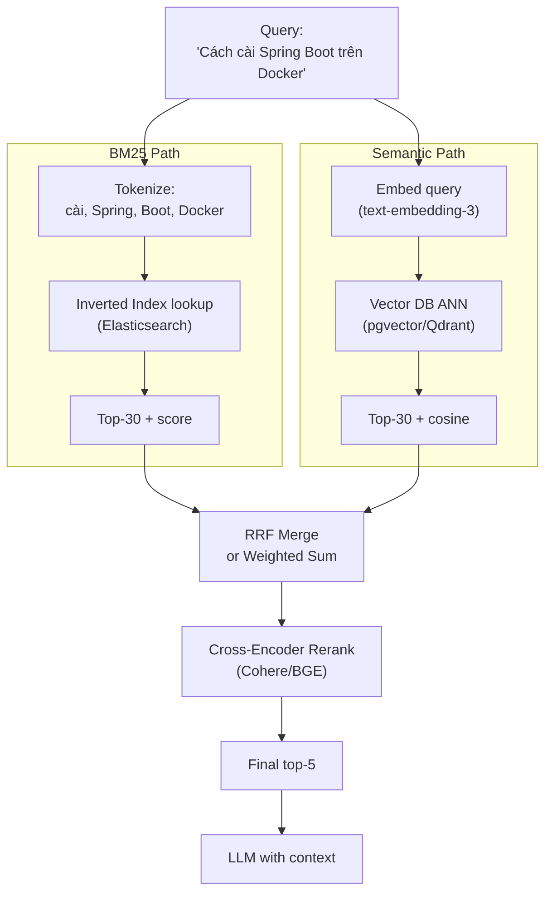

# Hybrid Search là gì? Khi nào Kết hợp Semantic Search và Keyword Search

## ⚡ Tóm tắt ngắn (30s)
* **Hybrid search** = **kết hợp BM25 (keyword search) + vector semantic search** trong cùng một query, sau đó merge kết quả bằng Reciprocal Rank Fusion (RRF) hoặc weighted sum.
* **Vì sao kết hợp**:
  * **BM25 mạnh ở**: exact match (SKU, code, version "v1.2.3"), tên người, jargon hiếm, từ khóa đặc thù.
  * **Semantic mạnh ở**: paraphrase, synonym, cross-lingual, câu hỏi mơ hồ, intent.
  * **Kết hợp đem recall@5 tăng 10-25%** so với chỉ semantic, đặc biệt cho query mixed (có cả keyword + concept).
* **Khi nào dùng**:
  * **80% case production RAG nên dùng hybrid**.
  * Đặc biệt: e-commerce search, code search, technical doc, multi-lingual.
  * Có thể skip hybrid nếu: doc thuần natural language + query thuần concept (e.g. summarization Q&A).
* **Thảm họa thực chiến**: Team RAG cho FAQ e-commerce dùng pure semantic. User search "mã giảm giá KM2024" → semantic không match doc nói "Mã KM2024 áp dụng cho..." vì model không hiểu mã hash. BM25 match ngay vì cùng token "KM2024". Add hybrid → recall@5 từ 62% lên 89%.

---

## 🔍 Chi tiết bản chất

### 1. BM25 — Best Matching 25

Algorithm refinement của TF-IDF. Score cho mỗi doc:
```
score(D, Q) = Σ IDF(q_i) × (f(q_i, D) × (k1 + 1)) / (f(q_i, D) + k1 × (1 - b + b × |D| / avgdl))

q_i: từ trong query
f(q_i, D): tần suất từ q_i trong doc D
|D|: độ dài D
avgdl: độ dài trung bình của doc
k1, b: hyperparameter (mặc định k1=1.2, b=0.75)
```

* **TF**: doc chứa từ query nhiều → score cao, có saturation.
* **IDF**: từ hiếm → quan trọng hơn (e.g. "transformer" hơn "the").
* **Length normalization**: doc dài không tự nhiên cao điểm hơn.

Implement: Elasticsearch / OpenSearch / Postgres tsvector / Tantivy.

### 2. Semantic Search

Embed query + doc → cosine similarity → ANN search. Đã chi tiết ở câu trước.

### 3. Strategies kết hợp

#### (a) Reciprocal Rank Fusion (RRF)

Không cần normalize score:
```
rrf_score(doc) = Σ 1 / (k + rank_in_source_i)
```

Default k = 60. Đơn giản, hiệu quả.

#### (b) Weighted sum (score normalization)

```
final_score = α × normalized_bm25 + (1 - α) × normalized_cosine
```

Cần normalize scores về [0, 1] trước khi sum. α tune theo eval.

#### (c) Rank-based với boost

```
1. BM25 top-N
2. Semantic top-N
3. Union
4. Boost docs xuất hiện ở cả 2 (intersection)
```

### 4. Khi BM25 thắng

* "SKU ABC-12345 còn hàng không?"
* "Function `processOrder` ở file nào?"
* "Lỗi error code 500-X"
* Tên người: "Báo cáo do John Smith viết"
* Brand/product: "iPhone 16 Pro Max"
* Code identifier
* Mã số: phone, ID

### 5. Khi Semantic thắng

* "Làm sao bảo trì xe?" (xe = motorbike / car / scooter)
* "Cách xử lý khi mất ngủ" (synonym với insomnia)
* Cross-lingual: query VN, doc EN
* Câu hỏi dài, mơ hồ
* Paraphrase

### 6. Khi cả 2 đều thắng (Hybrid optimal)

* Mix keyword + concept: "Cách cài Spring Boot trên Docker"
  * BM25 match "Spring Boot", "Docker".
  * Semantic match "cài đặt", "deploy".
* FAQ thực tế: cần match cả "intent" + "specific entity".

---

## 🎨 Sơ đồ trực quan



---

## 💻 Code thực chiến

### 1. Hybrid search với Postgres (tsvector + pgvector)

```sql
-- Schema
ALTER TABLE rag_chunks ADD COLUMN tsv tsvector
    GENERATED ALWAYS AS (to_tsvector('vietnamese', text)) STORED;
CREATE INDEX rag_chunks_tsv_idx ON rag_chunks USING GIN(tsv);

-- Hybrid query: combine ts_rank với cosine
WITH bm25 AS (
    SELECT id, ts_rank(tsv, plainto_tsquery('vietnamese', :q)) AS rank,
           ROW_NUMBER() OVER (ORDER BY ts_rank(tsv, plainto_tsquery('vietnamese', :q)) DESC) AS rn
    FROM rag_chunks
    WHERE tenant_id = :tid
      AND tsv @@ plainto_tsquery('vietnamese', :q)
    ORDER BY rank DESC
    LIMIT 50
),
semantic AS (
    SELECT id, 1 - (embedding <=> CAST(:qemb AS vector)) AS sim,
           ROW_NUMBER() OVER (ORDER BY embedding <=> CAST(:qemb AS vector)) AS rn
    FROM rag_chunks
    WHERE tenant_id = :tid
    ORDER BY embedding <=> CAST(:qemb AS vector)
    LIMIT 50
),
combined AS (
    SELECT id,
           COALESCE(1.0 / (60 + bm25.rn), 0) + COALESCE(1.0 / (60 + semantic.rn), 0) AS rrf_score
    FROM bm25
    FULL OUTER JOIN semantic USING (id)
)
SELECT rc.id, rc.text, combined.rrf_score
FROM combined
JOIN rag_chunks rc ON rc.id = combined.id
ORDER BY rrf_score DESC
LIMIT 10;
```

### 2. Java service implementing hybrid

```java
package com.example.rag.hybrid;

import org.springframework.stereotype.Service;
import java.util.*;

@Service
public class HybridSearchService {

    private final ElasticBm25Service bm25;
    private final PgVectorService vector;
    private final EmbeddingService embedding;
    private final CohereRerankService reranker;

    public HybridSearchService(ElasticBm25Service b, PgVectorService v,
                                EmbeddingService e, CohereRerankService r) {
        this.bm25 = b; this.vector = v; this.embedding = e; this.reranker = r;
    }

    public List<Hit> search(String query, UUID tenantId, int topK) {
        // 1. Embed query (async để chạy song song với BM25)
        var embFuture = CompletableFuture.supplyAsync(() -> embedding.embed(query));
        var bm25Future = CompletableFuture.supplyAsync(() -> bm25.search(query, tenantId, 50));

        var embedVec = embFuture.join();
        var vectorHits = vector.search(embedVec, tenantId, 50);
        var bm25Hits = bm25Future.join();

        // 2. RRF merge
        Map<String, Double> rrfScores = new HashMap<>();
        Map<String, Hit> allHits = new HashMap<>();
        
        addRRF(rrfScores, allHits, bm25Hits, 60);
        addRRF(rrfScores, allHits, vectorHits, 60);

        // 3. Take top-N after merge
        List<String> topIds = rrfScores.entrySet().stream()
            .sorted(Map.Entry.<String,Double>comparingByValue().reversed())
            .limit(30)
            .map(Map.Entry::getKey)
            .toList();
        List<Hit> mergedTop30 = topIds.stream().map(allHits::get).toList();

        // 4. Rerank with cross-encoder
        return reranker.rerank(query, mergedTop30, topK);
    }

    private void addRRF(Map<String, Double> scores, Map<String, Hit> all,
                         List<Hit> hits, int k) {
        for (int i = 0; i < hits.size(); i++) {
            Hit h = hits.get(i);
            scores.merge(h.id(), 1.0 / (k + i + 1), Double::sum);
            all.putIfAbsent(h.id(), h);
        }
    }

    public record Hit(String id, String text, double score, Map<String,Object> metadata) {}
}
```

### 3. Elasticsearch — Hybrid query

```java
package com.example.rag.hybrid;

import co.elastic.clients.elasticsearch.ElasticsearchClient;
import co.elastic.clients.elasticsearch._types.query_dsl.*;
import co.elastic.clients.elasticsearch.core.SearchRequest;

public class ElasticHybridSearch {
    private final ElasticsearchClient es;

    public Object search(String query, float[] embedding, String tenantId, int topK) throws Exception {
        // ES 8+ hỗ trợ hybrid (knn + bool query)
        var searchReq = SearchRequest.of(s -> s
            .index("rag_chunks")
            .query(q -> q.bool(b -> b
                .filter(f -> f.term(t -> t.field("tenant_id").value(tenantId)))
                .should(sh -> sh.match(m -> m.field("text").query(query)))  // BM25
            ))
            .knn(k -> k
                .field("embedding")
                .queryVector(toFloatList(embedding))
                .k(50)
                .numCandidates(200)
            )
            .size(topK)
            .rankConstant(60)  // RRF constant
            .rankWindowSize(50)
        );
        return es.search(searchReq, Object.class);
    }

    private List<Float> toFloatList(float[] arr) { return List.of(); }
}
```

---

## 📊 Bảng so sánh BM25 vs Semantic vs Hybrid

| Tiêu chí | BM25 | Semantic | Hybrid |
| :--- | :---: | :---: | :---: |
| Exact match (SKU, code) | ✓✓✓ | ✗ | ✓✓✓ |
| Synonym / paraphrase | ✗ | ✓✓✓ | ✓✓✓ |
| Cross-lingual | ✗ | ✓✓ | ✓✓ |
| Câu hỏi mơ hồ | ✗ | ✓✓ | ✓✓ |
| Recall@5 (typical) | 60-70% | 70-80% | **85-95%** |
| Latency | 5-20ms | 30-100ms | 50-150ms |
| Setup complexity | Thấp (ES) | Trung bình | Trung bình |
| Cost | Rẻ | Trung bình | Trung bình |
| Ops | ES có sẵn | Vector DB | Cả 2 |

---

## ⚠️ Common Gotchas & Questions follow-up

### 1. Cạm bẫy: Trọng số α không tune
* **Vấn đề**: Default α = 0.5 cho mọi query. Query keyword-heavy thì BM25 nên dominant, query concept thì semantic nên dominant.
* **Giải pháp**: 
  1. RRF không cần weight, ít sensitive hơn.
  2. Hoặc query classifier → adapt α dynamic.

### 2. Cạm bẫy: Quên stem tiếng Việt
* **Vấn đề**: BM25 query "chạy bộ" không match doc "chạy bộ buổi sáng" nếu analyzer Vietnamese không cấu hình đúng.
* **Giải pháp**: ES dùng `vi_analyzer` (cộng thêm coccoc-tokenizer plugin) hoặc dùng semantic phủ cover.

### 3. Cạm bẫy: Duplicate top-K từ 2 nguồn
* **Vấn đề**: Cùng doc xuất hiện cả ở BM25 top-50 + semantic top-50 → trong final top-K bị duplicate.
* **Giải pháp**: Dedup theo doc_id trong RRF merge.

### 4. Câu hỏi đào sâu từ interviewer
* **Interviewer: "Hybrid có cần thiết trên 100% case không?"**
* **Trả lời Senior**:
  1. **Đo bằng eval**: chạy golden set với 3 approach (pure BM25, pure semantic, hybrid). Nếu hybrid không tốt hơn semantic > 3% → có thể skip để giảm ops.
  2. **Tradeoff**:
     - Pure semantic: ops đơn giản, đủ tốt 70-80% recall.
     - Hybrid: thêm ES infra, recall +10-25%, latency +30%.
  3. **Khi pure semantic đủ**:
     - Doc + query thuần natural language.
     - Không có exact identifier.
     - Recall hiện tại > 85% bằng semantic only.
  4. **Khi cần hybrid**:
     - E-commerce / catalog (SKU, product code).
     - Code search.
     - Doc có nhiều tên riêng, version, ID.
     - Multilingual với user search EN trong doc VN.
  5. **Compromise**: skip hybrid lúc đầu, monitor recall. Nếu user complaints về missing exact match → add hybrid sau.
