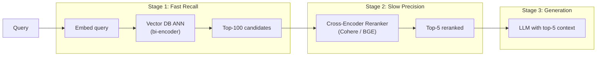

# Reranking là gì? Vì sao cần Rerank

## ⚡ Tóm tắt ngắn (30s)
* **Reranking** = bước **2nd pass** sau retrieval, dùng **cross-encoder model** để score lại top-N candidates → trả top-K final với precision cao hơn.
* **Vì sao cần**:
  1. **Bi-encoder (embedding) có giới hạn**: encode query và doc riêng → có thể miss interaction sâu giữa 2.
  2. **Cross-encoder accuracy cao hơn**: input là cặp (query, doc) → tính attention bidirectional → score tốt hơn cho relevance.
  3. **Tradeoff speed**: cross-encoder chậm hơn 100-1000x → dùng cho TOP-N (20-50) thôi, không phải toàn bộ.
* **Pattern Senior**: 
  1. Vector search top-50 (fast, recall cao).
  2. Rerank top-50 → top-5 (slow, precision cao).
  3. Top-5 vào LLM.
* **Tools**: Cohere rerank-3, BGE-reranker-v2-m3, voyage-rerank-2, ColBERT.
* **Thảm họa thực chiến**: Team không rerank, đưa thẳng top-5 vector search vào LLM. 30% case có 1-2 chunk irrelevant trong context → LLM bị "noise" → hallucinate. Sau add Cohere rerank → precision@5 từ 62% lên 87%, hallucination giảm 50%.

---

## 🔍 Chi tiết bản chất

### 1. Bi-encoder vs Cross-encoder

**Bi-encoder** (embedding model):
```
query → encoder → query_vector
doc → encoder → doc_vector
score = cosine(query_vector, doc_vector)
```
* Encode RIÊNG → có thể pre-compute doc vector → lookup O(log n) trong vector DB.
* Trade-off: model không "thấy" interaction giữa query và doc lúc encode.

**Cross-encoder**:
```
[query, doc] → encoder → relevance_score (0-1)
```
* Encode CÙNG NHAU → attention bidirectional → relevance accuracy cao hơn.
* Phải chạy cho từng cặp → O(n) cho n doc → không scale brute-force.

### 2. Khi cross-encoder thắng

* Query phức tạp: "Hợp đồng X có điều khoản về phạt vi phạm không?"
  * Bi-encoder match doc về "phạt vi phạm" chung chung.
  * Cross-encoder hiểu phải có liên quan đến "Hợp đồng X" cụ thể.
* Query ngắn ambiguous: "show me red apple"
  * Apple = công ty hay trái cây? Cross-encoder dùng doc context để decide.

### 3. Pipeline 2-stage retrieval

```
Stage 1: Fast Recall (Bi-encoder ANN)
  Query → top-100 candidates (recall ~95%)

Stage 2: Slow Precision (Cross-encoder rerank)
  Top-100 → top-5 (precision cao)

Stage 3: LLM context
  Top-5 → answer
```

Cân bằng:
* Top-N retrieve quá ít (e.g. 5) → rerank không cứu được nếu golden chunk không trong top-5.
* Top-N quá nhiều (e.g. 500) → rerank chậm + cost.
* Sweet spot: 30-100 candidates → rerank → top-5.

### 4. Common rerankers

#### (a) Cohere rerank-3
* API hosted, chất lượng cao nhất.
* Cost: $1/1000 search (1 search = up to 100 docs).
* Latency: 100-500ms cho 100 docs.

#### (b) BGE-reranker-v2-m3 (open)
* Self-host, multilingual.
* Free, GPU recommended.
* Quality gần Cohere.

#### (c) Voyage rerank-2
* Paid API, top quality.

#### (d) ColBERT (late interaction)
* Self-host, balance bi-encoder speed + cross-encoder accuracy.
* Phức tạp setup.

### 5. Reranking metrics

* **NDCG@K** (Normalized Discounted Cumulative Gain): điểm rerank weight by position.
* **MRR** (Mean Reciprocal Rank): position của correct doc.
* **Precision@K**: % top-K thực sự relevant.
* **Recall@K**: % correct chunk trong top-K.

---

## 🎨 Sơ đồ trực quan



---

## 💻 Code thực chiến

### 1. Cohere Rerank API

```java
package com.example.rag.rerank;

import org.springframework.stereotype.Service;
import org.springframework.web.reactive.function.client.WebClient;
import reactor.core.publisher.Mono;
import java.util.*;

@Service
public class CohereRerankService {

    private final WebClient cohere;

    public CohereRerankService(@Value("${cohere.api-key}") String key) {
        this.cohere = WebClient.builder()
            .baseUrl("https://api.cohere.com/v1")
            .defaultHeader("Authorization", "Bearer " + key)
            .build();
    }

    public Mono<List<RerankedHit>> rerank(String query, List<String> documents, int topK) {
        var request = Map.of(
            "model", "rerank-v3.5",
            "query", query,
            "documents", documents,
            "top_n", topK
        );

        return cohere.post()
            .uri("/rerank")
            .bodyValue(request)
            .retrieve()
            .bodyToMono(CohereResponse.class)
            .map(resp -> resp.results().stream()
                .map(r -> new RerankedHit(r.index(), r.relevanceScore()))
                .toList());
    }

    public record CohereResponse(List<CohereResult> results) {}
    public record CohereResult(int index, double relevanceScore) {}
    public record RerankedHit(int originalIndex, double score) {}
}
```

### 2. BGE-reranker self-host (Python)

```python
# bge_reranker_service.py — FastAPI service
from FlagEmbedding import FlagReranker
from fastapi import FastAPI
from pydantic import BaseModel
from typing import List

# Load model (1 lần, giữ trong memory)
reranker = FlagReranker("BAAI/bge-reranker-v2-m3", use_fp16=True, device="cuda")

app = FastAPI()

class RerankRequest(BaseModel):
    query: str
    documents: List[str]
    top_k: int = 5

class RerankResult(BaseModel):
    index: int
    score: float

@app.post("/rerank")
def rerank(req: RerankRequest) -> List[RerankResult]:
    pairs = [[req.query, doc] for doc in req.documents]
    scores = reranker.compute_score(pairs, normalize=True)
    
    indexed = list(enumerate(scores))
    indexed.sort(key=lambda x: -x[1])
    return [RerankResult(index=i, score=s) for i, s in indexed[:req.top_k]]
```

### 3. Integration trong RAG pipeline

```java
package com.example.rag;

import org.springframework.stereotype.Service;
import reactor.core.publisher.Mono;
import java.util.*;

@Service
public class RagWithRerank {

    private final VectorSearchService vector;
    private final EmbeddingService embedding;
    private final CohereRerankService reranker;
    private final ChatClient llm;

    public Mono<String> answer(String question, UUID tenantId) {
        // Stage 1: Fast retrieval
        float[] qEmb = embedding.embed(question);
        var candidates = vector.search(qEmb, tenantId, 50);
        if (candidates.isEmpty()) {
            return Mono.just("Không tìm thấy thông tin.");
        }

        // Stage 2: Rerank
        List<String> docTexts = candidates.stream().map(Chunk::text).toList();
        return reranker.rerank(question, docTexts, 5)
            .flatMap(reranked -> {
                List<Chunk> top5 = reranked.stream()
                    .map(r -> candidates.get(r.originalIndex()))
                    .toList();

                // Stage 3: LLM
                String context = buildContext(top5);
                return Mono.fromCallable(() -> llm.prompt()
                    .system("Trả lời từ context. Kèm citation.")
                    .user("CONTEXT:\n" + context + "\n\nQ: " + question)
                    .call().content());
            });
    }

    private String buildContext(List<Chunk> chunks) {
        return chunks.stream()
            .map(c -> "[doc:" + c.docId() + "] " + c.text())
            .collect(java.util.stream.Collectors.joining("\n---\n"));
    }

    record Chunk(UUID docId, String text, double similarity) {}
}
```

### 4. Caching rerank scores

```java
@Service
public class CachedRerankService {
    private final CohereRerankService cohere;
    private final ReactiveStringRedisTemplate redis;

    public Mono<List<Integer>> rerank(String query, List<String> docs, int topK) {
        // Cache key: hash(query + docIds)
        String cacheKey = "rerank:" + hash(query, docs);
        return redis.opsForValue().get(cacheKey)
            .map(this::deserialize)
            .switchIfEmpty(
                cohere.rerank(query, docs, topK)
                    .flatMap(result -> {
                        List<Integer> indices = result.stream()
                            .map(r -> r.originalIndex()).toList();
                        return redis.opsForValue()
                            .set(cacheKey, serialize(indices), Duration.ofHours(24))
                            .thenReturn(indices);
                    })
            );
    }
    private String hash(String q, List<String> d) { return ""; }
    private String serialize(List<Integer> l) { return ""; }
    private List<Integer> deserialize(String s) { return List.of(); }
}
```

---

## 📊 Bảng so sánh rerankers

| Reranker | Quality (typical) | Latency 100 docs | Cost | Multilingual | Khi dùng |
| :--- | :---: | :---: | :---: | :---: | :--- |
| No rerank | Baseline | 0ms | $0 | - | POC |
| Cohere rerank-3 | Top 1 | 100-300ms | $1/1k search | ✓ | Production paid |
| BGE-reranker-v2-m3 | Gần top | 50-200ms (GPU) | Self-host | ✓ | Self-host, multilingual |
| voyage-rerank-2 | Top tier | 100-300ms | Paid | English | English-focus |
| Mixedbread rerank | Tốt | 80-200ms | Paid/Open | ✓ | Alternative |
| ColBERT | Tốt | Phức tạp | Self-host | ✓ | Advanced |

---

## ⚠️ Common Gotchas & Questions follow-up

### 1. Cạm bẫy: Rerank quá ít candidates
* **Vấn đề**: Vector retrieve top-5, rerank top-5 → top-3. Nếu golden chunk ở rank 7 → vẫn miss.
* **Giải pháp**: Retrieve top 30-100, rerank xuống top-5. Compensate cho recall thấp của bi-encoder.

### 2. Cạm bẫy: Latency budget exceeded
* **Vấn đề**: Rerank thêm 300ms vào p99 → vượt SLA 1s.
* **Giải pháp**: 
  1. Self-host reranker trên GPU gần app → 50-100ms.
  2. Hoặc fewer candidates: top-20 thay vì top-100.
  3. Cache rerank result.

### 3. Cạm bẫy: Rerank model không multilingual
* **Vấn đề**: Dùng reranker English-only cho query/doc tiếng Việt → score random.
* **Giải pháp**: Dùng BGE-reranker-v2-m3 hoặc Cohere rerank multilingual.

### 4. Cạm bẫy: Quên cost của rerank API
* **Vấn đề**: 100k query/ngày × $0.001 (rerank API) = $100/ngày = $3k/tháng. Không ai để ý đến khi hết tháng.
* **Giải pháp**: Track cost rerank trong dashboard riêng. Cache để giảm.

### 5. Câu hỏi đào sâu từ interviewer
* **Interviewer: "Tại sao không dùng cross-encoder cho cả retrieve, bỏ vector search?"**
* **Trả lời Senior**:
  1. **Scale issue**: cross-encoder O(n) cho n doc → 1M doc × 200ms = 56 giờ/query. Không thể.
  2. **Bi-encoder (vector search)**: pre-compute doc vector → query là ANN lookup O(log n) → 30ms/query.
  3. **Trade-off**: bi-encoder fast nhưng recall hơi kém; cross-encoder slow nhưng precision cao.
  4. **2-stage pipeline**: bi-encoder thu hẹp candidate set 1M → 50; cross-encoder rerank 50 → 5. Combine best of both.
  5. **Khi 1 stage đủ**: dataset rất nhỏ (<1k doc) → có thể chỉ cross-encoder; nhưng ít case thực tế.
  6. **Trend mới**: ColBERT, FlashRank — cố gắng có cả speed và precision; nhưng không thay được 2-stage cho production scale.
