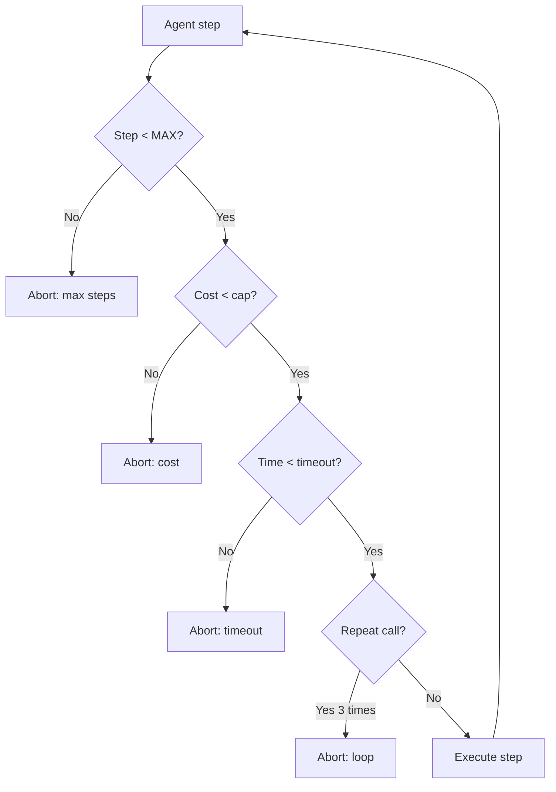

# Agent Loop là gì? Vì sao Nguy hiểm

## ⚡ Tóm tắt ngắn (30s)
* **Agent loop** = chu trình agent reason → act → observe → reason lặp lại. **Nguy hiểm** khi không có cap:
  1. **Infinite loop**: agent stuck, gọi cùng tool mãi (e.g. tool fail, model retry same args).
  2. **Cost explosion**: mỗi step = 1 LLM call ($0.05-$0.50). Loop 100 step = $5-$50/request.
  3. **Side effect spam**: nếu agent loop có write tool → mỗi loop ghi DB/gửi email → 100 lần spam.
  4. **API rate limit cascade**: agent spam internal API → DDoS chính mình.
* **Defense**:
  1. **Hard cap step** (max 10-20).
  2. **Cost cap per request** ($1-$5).
  3. **Detect repeat**: same tool + same args 3 lần → break.
  4. **Timeout total**.
  5. **Output classifier**: detect agent stuck pattern.
* **Thảm họa thực chiến**: Agent có tool `search_db`. Bug RAG → search trả empty. Agent retry với variations 50 lần → cost $25/request. Senior fix: step cap 15 + detect repeat args.

---

## 🔍 Patterns gây loop

### 1. Same args retry
Agent thấy tool fail → retry với args giống. Lặp vô hạn.

### 2. Slight variation
Agent retry với args slightly different (paraphrase).

### 3. Tool A ↔ Tool B ping-pong
Agent gọi A, observes incomplete → call B, observes incomplete → call A...

### 4. Cannot finalize
Agent biết answer nhưng prompt không cho finish → keep thinking → keep calling.

---

## 💻 Loop guard implementation

```java
@Service
public class GuardedAgentExecutor {

    private static final int MAX_STEPS = 15;
    private static final double MAX_COST_USD = 2.0;
    private static final Duration MAX_DURATION = Duration.ofMinutes(5);

    public AgentResult run(String userMsg) {
        long start = System.currentTimeMillis();
        double totalCost = 0;
        List<ToolCall> history = new ArrayList<>();

        for (int step = 0; step < MAX_STEPS; step++) {
            // Timeout check
            if (System.currentTimeMillis() - start > MAX_DURATION.toMillis()) {
                return AgentResult.aborted("Timeout");
            }
            
            // Cost check
            if (totalCost > MAX_COST_USD) {
                return AgentResult.aborted("Cost cap reached: $" + totalCost);
            }

            var response = llm.chat(messages);
            totalCost += response.costUsd();

            if (response.stopReason() == END_TURN) {
                return AgentResult.success(response.text(), totalCost);
            }

            if (response.stopReason() == TOOL_USE) {
                var toolCall = response.toolCall();
                
                // Detect repeat
                if (isRepeatCall(history, toolCall, 3)) {
                    log.warn("Agent stuck calling same tool: " + toolCall);
                    return AgentResult.aborted("Loop detected");
                }
                
                history.add(toolCall);
                var result = executeTool(toolCall);
                messages = appendToHistory(messages, toolCall, result);
            }
        }

        return AgentResult.aborted("Max steps " + MAX_STEPS);
    }

    private boolean isRepeatCall(List<ToolCall> history, ToolCall current, int threshold) {
        long sameCount = history.stream()
            .filter(c -> c.name().equals(current.name())
                      && c.args().equals(current.args()))
            .count();
        return sameCount >= threshold;
    }
}
```

---

## 🎨 Sơ đồ guard



---

## 📊 Cap recommendations

| Use case | Max steps | Cost cap | Timeout |
| :--- | :---: | :---: | :---: |
| Simple Q&A | 5 | $0.10 | 30s |
| Multi-tool support | 15 | $2 | 2 min |
| Complex research | 30 | $5 | 5 min |
| Code generation iterative | 20 | $3 | 3 min |

---

## ⚠️ Gotchas + Interviewer

1. **Cap quá thấp**: legitimate task abort. Tune theo eval.
2. **Cap quá cao**: chỉ giảm impact nhưng không bảo vệ. $5/request × 1000 user/giờ = $5k/giờ vẫn lớn.
3. **Cost tracking sai**: forget tool execute cost (DB query, API).

**Interviewer: "Detect agent stuck thế nào?"**
1. Step counter: > N steps = sus.
2. Repeat tool+args: hash → seen count.
3. No progress: same "thought" pattern.
4. Same error 3+: tool fail loop.
5. Output classifier: LLM-as-judge nhỏ check "agent making progress?".
