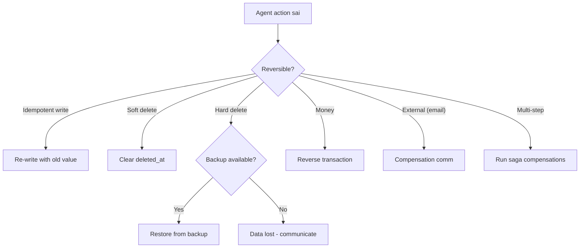

# Agent làm sai Production thì Rollback thế nào

## ⚡ Tóm tắt ngắn (30s)
* **Rollback agent action** phụ thuộc loại action:
  1. **Idempotent / reversible** (update profile): re-update với value cũ.
  2. **Soft delete**: undo flag.
  3. **Hard delete**: phục hồi từ backup (RTO/RPO matter).
  4. **Money transfer**: tạo reverse transaction.
  5. **Email/notification sent**: KHÔNG rollback được — chỉ send correction.
* **Quy tắc Senior**: design forward — **prevent** rollback bằng cách:
  * Soft delete thay vì hard delete.
  * Approval cho irreversible action.
  * Idempotency key + audit trail để traceback.
  * Saga pattern cho multi-step transaction.
* **Thảm họa thực chiến**: Agent execute "delete user X" (hard delete). User feedback "I want my account back". Backup chỉ 7 days, account deleted 14 ngày trước → mất hoàn toàn. Senior fix: soft delete với 90-day grace period.

---

## 🔍 Rollback strategies

### 1. Idempotent action (write profile)

Trước action: snapshot state.
After action: nếu cần rollback, write back snapshot.

```java
public class ReversibleAction {
    public ActionLog execute(UserUpdate u) {
        var snapshot = userRepo.findById(u.id());  // BEFORE
        userRepo.save(u.apply());
        return ActionLog.with(snapshot, u);
    }

    public void rollback(ActionLog log) {
        userRepo.save(log.snapshotBefore());
    }
}
```

### 2. Soft delete pattern

Mark `deleted_at`, không thực sự xóa. Rollback = clear `deleted_at`.

### 3. Saga pattern cho multi-step

```
Step 1: Reserve inventory  → compensation: release inventory
Step 2: Charge card        → compensation: refund
Step 3: Ship order         → compensation: cancel shipment + return label
```

Saga executor track mỗi step + compensation. Khi 1 step fail → run all compensations in reverse.

### 4. Money transfer

KHÔNG có "undo". Tạo **reverse transaction**:
```
Original: A → B: $100 (txn_id_1)
Reverse: B → A: $100 (txn_id_2, references txn_id_1)
```

Both transactions visible in audit trail.

### 5. Email/notification

KHÔNG rollback được. Chỉ:
* Send correction email/notification.
* Notify user về mistake.
* Compensate khác (credit, apology).

---

## 🎨 Decision tree



---

## 💻 Saga implementation

```java
public class RefundSaga {

    private final List<SagaStep> steps;

    public SagaResult execute(RefundRequest req) {
        List<SagaStep> completed = new ArrayList<>();
        try {
            for (SagaStep step : steps) {
                step.execute(req);
                completed.add(step);
            }
            return SagaResult.success();
        } catch (Exception e) {
            // Compensate in reverse
            for (int i = completed.size() - 1; i >= 0; i--) {
                try {
                    completed.get(i).compensate(req);
                } catch (Exception ce) {
                    log.error("Compensation failed", ce);
                    // Alert: manual intervention needed
                }
            }
            return SagaResult.failed(e);
        }
    }
}

interface SagaStep {
    void execute(Object req);
    void compensate(Object req);
}

class ChargeCardStep implements SagaStep {
    public void execute(Object req) { /* charge */ }
    public void compensate(Object req) { /* refund */ }
}
```

---

## 📊 Action vs Rollback strategy

| Action | Reversible? | Rollback method |
| :--- | :--- | :--- |
| Update profile | Yes | Snapshot + restore |
| Soft delete | Yes | Clear flag |
| Hard delete | Partially | Backup restore (if available) |
| Send email | NO | Send correction |
| Charge card | Partially | Refund (separate txn) |
| Cancel order | Yes | Reopen with status flag |
| Generate report | N/A | Just regenerate |
| Multi-step | Depends | Saga compensation |

---

## ⚠️ Gotchas + Interviewer

1. **Rollback ko cover bằng test**: surprising side effects.
2. **Race condition trong rollback**: data đã thay đổi sau action.
3. **Cascade rollback**: rollback action A nhưng B (downstream) đã commit → mismatch.

**Interviewer: "Agent gọi 5 tool. Step 4 fail. Rollback 1-3?"**
1. **Saga pattern**: mỗi step phải có compensation.
2. **Idempotency**: compensation idempotent (re-run OK).
3. **Atomic step 1-3 nếu có thể**: nếu cả 3 trong cùng DB → transaction.
4. **Distributed**: dùng saga orchestrator (Temporal, Camunda).
5. **Log everything**: trace_id để debug khi compensation fail.
6. **Manual escalation**: nếu compensation fail → alert human + dashboard "stuck saga".
