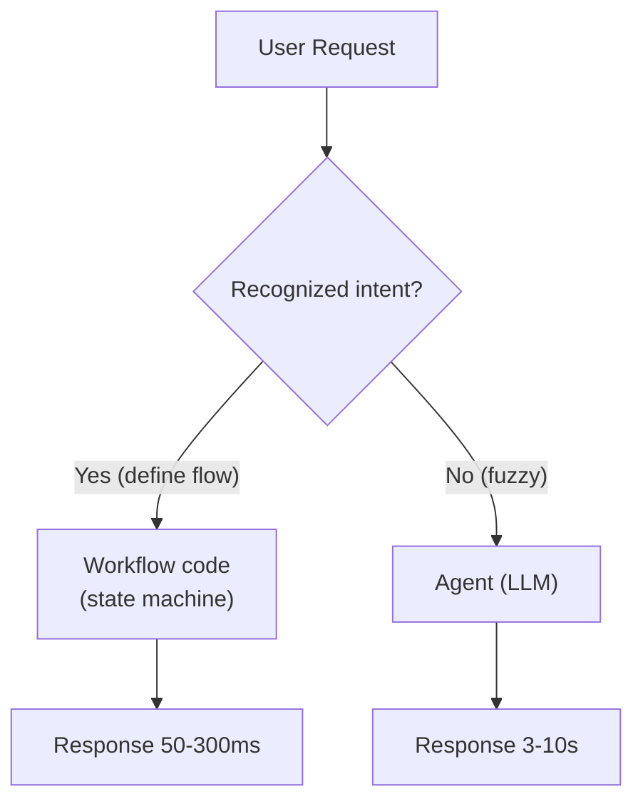

# Khi nào Agent KHÔNG tốt bằng Workflow Deterministic

## ⚡ Tóm tắt ngắn (30s)
* **Agent thắng**: task fuzzy, multi-step, không định hình trước, cần adapt.
* **Workflow thắng**: task có flow rõ ràng, cần determinism, cost critical, compliance audit.
* **Khi workflow tốt hơn**:
  1. **Flow định hình** (order checkout, signup): có thể code bằng state machine.
  2. **Predictable latency**: workflow ~100ms, agent 3-10s.
  3. **Cost-sensitive at scale**: workflow $0, agent $0.05/req.
  4. **Compliance**: workflow audit log rõ ràng, agent harder to certify.
  5. **High throughput**: 10k req/s — agent không scale.
  6. **Critical errors**: workflow bugs reproducible; agent hard to debug.
* **Pattern Senior**: hybrid. Workflow cho core flow + agent cho exception handling / edge cases.
* **Thảm họa thực chiến**: Team build entire order checkout là agent. Mỗi checkout $0.30 × 50k/ngày = $15k/ngày. UX 8s. Senior fix: workflow code cho checkout, agent chỉ khi customer hỏi support.

---

## 🔍 Decision criteria

| Criteria | Workflow win | Agent win |
| :--- | :---: | :---: |
| Flow định hình trước | ✓ | |
| Cần adapt theo input | | ✓ |
| Latency < 500ms required | ✓ | |
| Latency 3-30s OK | | ✓ |
| Volume > 10k/s | ✓ | |
| Compliance critical | ✓ | |
| Multi-step >5 fuzzy | | ✓ |
| Tool selection dynamic | | ✓ |
| Cost / req < $0.001 | ✓ | |
| Cost / req $0.01-$1 OK | | ✓ |

### Examples

**Workflow (code):**
* Login flow.
* Payment processing.
* Order checkout.
* User registration.
* Password reset.
* Data sync ETL.

**Agent (LLM):**
* Customer support chat.
* Content generation.
* Code review.
* Research synthesis.
* Multi-source data exploration.

**Hybrid:**
* Workflow cho main path + agent fallback cho exception ("user message unclear, escalate to agent").

---

## 🎨 Hybrid pattern



---

## 💻 Example: Workflow vs Agent

### Workflow checkout

```java
@Service
public class CheckoutWorkflow {
    public CheckoutResult process(CheckoutRequest req) {
        validateCart(req.cart());
        var inventory = reserveInventory(req.items());
        var payment = chargePayment(req.payment());
        var shipping = createShipment(req.address());
        var order = createOrder(payment, shipping);
        emailService.sendConfirmation(req.email(), order);
        return CheckoutResult.success(order.id());
    }
}
```

Deterministic, fast, testable.

### Agent for support

```java
public class SupportAgent {
    public String handle(String userMsg) {
        return chatClient.prompt()
            .system("You are support agent. Use tools.")
            .user(userMsg)
            .tools(getOrderTool, refundTool, escalateTool)
            .call().content();
    }
}
```

Adapts to varied questions.

---

## 📊 Cost/Latency comparison

| Operation | Workflow | Agent |
| :--- | :---: | :---: |
| Lookup order | 10ms, $0 | 1.5s, $0.005 |
| Process checkout | 300ms, $0 | 5s, $0.05 |
| Handle complex inquiry | N/A (impossible) | 8s, $0.20 |
| Answer FAQ | 30ms (cached), $0 | 1s, $0.005 |

---

## ⚠️ Gotchas + Interviewer

1. **Over-engineer**: workflow code 1000 lines cho task simple → simple agent đủ.
2. **Under-engineer**: agent cho task định hình → wasteful.
3. **Mid-migration**: half workflow, half agent → unclear ownership.

**Interviewer: "Stakeholder ép dùng agent cho mọi feature. Pushback?"**
1. **Cost analysis**: workflow vs agent total cost (eng time + runtime cost) 1 năm.
2. **Latency analysis**: SLA impact.
3. **POC**: 1 sprint build both, A/B → numbers decide.
4. **Hybrid proposal**: agent cho 20% case unhandled by workflow; workflow cho 80% define flow.
5. **Maintainability**: workflow easier to debug, certify, monitor.
