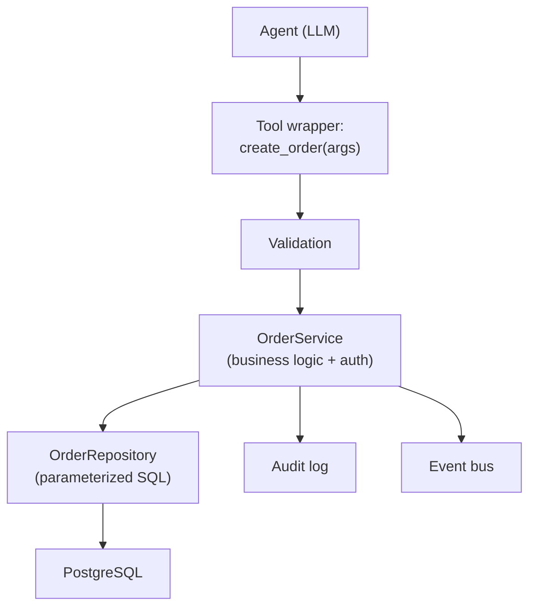

# Agent có nên trực tiếp ghi Database không

## ⚡ Tóm tắt ngắn (30s)
* **KHÔNG nên cho agent execute SQL trực tiếp trên DB**. Risks: SQL injection từ LLM args, privilege escalation, no audit, hard to control schema.
* **Pattern đúng**: agent gọi **business API/service layer** (e.g. `OrderService.create()`), service mới gọi DB.
* **Service layer cung cấp**:
  1. **Validation**: input business rules.
  2. **Authorization**: caller user permission.
  3. **Audit**: log mỗi write.
  4. **Idempotency**: dedup duplicate calls.
  5. **Transaction**: ACID guarantees.
* **Trường hợp ngoại lệ**: Text-to-SQL với strict guardrail (readonly, allowlist tables, validated SQL).
* **Thảm họa thực chiến**: Agent có "execute_sql" tool. Prompt injection: "DROP TABLE users". Tool execute → data gone. Senior fix: remove generic SQL tool, replace với specific business tools.

---

## 🔍 Why not direct SQL?

### 1. SQL injection
LLM trả tool args. Args có thể chứa SQL injection nếu construct query dynamic.

### 2. Schema knowledge
LLM biết schema → có thể leak schema info. Plus, schema change → agent stale.

### 3. No business logic enforcement
Direct SQL bypass business rules (e.g. balance check, fraud detection).

### 4. Cross-tenant leak risk
SQL không tự filter tenant. Cần RLS hoặc explicit WHERE.

### 5. No idempotency
Re-execute same SQL = duplicate writes.

---

## 💻 Pattern đúng: Service layer

```java
@Tool(description = "Create new order for current user")
public CreateOrderResult createOrder(@ToolParam String productId, @ToolParam int qty) {
    // Tool wrapper calls service, NOT raw SQL
    return orderService.createOrder(currentUserId(), productId, qty);
}

@Service
public class OrderService {
    @Transactional
    public CreateOrderResult createOrder(String userId, String productId, int qty) {
        // Business logic
        validateProduct(productId);
        validateInventory(productId, qty);
        validateUserNotBlacklisted(userId);
        
        // Idempotency
        String idemKey = userId + ":" + productId + ":" + LocalDateTime.now().minusSeconds(10);
        if (idempotencyStore.exists(idemKey)) {
            return CreateOrderResult.fromCache(idemKey);
        }
        
        // DB write via repository (parameterized, ACID)
        var order = new Order(userId, productId, qty);
        orderRepo.save(order);
        
        idempotencyStore.put(idemKey, order.id());
        auditLog.record(userId, "create_order", Map.of("id", order.id()));
        eventBus.publish(new OrderCreatedEvent(order));
        
        return CreateOrderResult.success(order.id());
    }
}
```

---

## 🎨 Layered architecture



---

## 💻 Khi cần Text-to-SQL (an toàn)

```python
def text_to_sql_safe(question: str) -> dict:
    """Generate SQL with safety guardrails."""
    # 1. LLM gen SQL
    sql = llm.generate(
        f"Generate SELECT SQL. Schema: {SCHEMA}. Question: {question}",
        temperature=0
    )
    
    # 2. Validate: only SELECT, no DDL/DML
    parsed = sqlparse.parse(sql)[0]
    if parsed.get_type() != "SELECT":
        raise SecurityException("Only SELECT allowed")
    
    # 3. Validate: tables in allowlist
    tables = extract_tables(parsed)
    allowed = {"products", "categories", "public_stats"}
    if not all(t in allowed for t in tables):
        raise SecurityException(f"Table not allowed: {tables - allowed}")
    
    # 4. No subqueries to system tables
    if any(t.startswith("pg_") or t.startswith("information_schema") for t in tables):
        raise SecurityException("System tables forbidden")
    
    # 5. Execute với readonly user + timeout
    with readonly_db.cursor() as cur:
        cur.execute("SET statement_timeout = 5000")  # 5s max
        cur.execute(sql)
        rows = cur.fetchmany(1000)  # cap rows
    
    return {"sql": sql, "rows": rows}
```

---

## 📊 Bảng comparison

| Approach | Safety | Flexibility | Performance |
| :--- | :---: | :---: | :---: |
| Agent → Service API | ✓✓✓ | Trung bình | Tốt |
| Agent → Text-to-SQL (guard) | ✓ | Cao | Tốt |
| Agent → raw SQL execute | ✗ DANGEROUS | Cao | Tốt |

---

## ⚠️ Gotchas + Interviewer

1. **Service layer leak**: nếu service layer là raw passthrough → vẫn không safe.
2. **Text-to-SQL bypass guard**: LLM creative với SQL → có thể inject. Whitelist strict.
3. **Read-only insufficient**: SELECT cũng có thể leak PII.

**Interviewer: "Agent gen analytics dashboard query. Allow text-to-SQL?"**
1. **Allow only on analytics replica DB**: separate from production.
2. **Strict whitelist**: 5-10 tables, readonly user.
3. **Result cap**: 10k rows max.
4. **Timeout**: 30s query.
5. **SQL parser validate**: no DDL, no system tables.
6. **Audit**: log mọi SQL + caller.
7. **Cost**: rate limit per user.
8. **Alternative**: pre-defined queries với parameter binding nếu pattern lặp.
