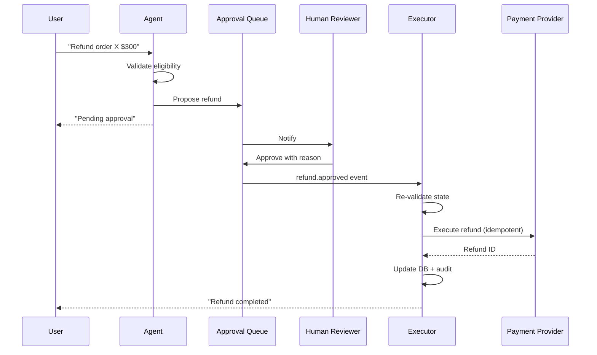

# Agent có nên trực tiếp gọi Payment/Refund/Cancel Order API không

## ⚡ Tóm tắt ngắn (30s)
* **KHÔNG**, hoặc rất hạn chế. Đây là **irreversible action** ảnh hưởng tiền/data thật.
* **Defense Senior**:
  1. **Agent CHỈ PROPOSE**, KHÔNG execute.
  2. **Human approval mandatory** cho amount > threshold.
  3. **Constraints cứng**: amount cap, time window, target validation.
  4. **Audit + idempotency**.
  5. **Saga pattern** cho rollback nếu execute.
* **Pattern**: agent → propose API (`refund_propose`) → approval workflow → executor service gọi payment provider.
* **Thảm họa thực chiến**: Agent có direct `refund_execute` tool. Prompt injection → refund $5000 cho fake user. Senior fix: agent chỉ có `refund_propose`, executor service kiểm soát thực sự.

---

## 🔍 Risks specific

### 1. Money loss
Refund/transfer tới wrong account, wrong amount.

### 2. Fraud
Attacker prompt-inject → agent refund/transfer to attacker.

### 3. Compliance
PCI-DSS, AML rules require strict audit trail. Agent action khó audit.

### 4. Customer trust
"Agent canceled my order without my consent" → churn + complaint.

### 5. Reversibility
Payment transfer to external bank = nearly impossible to recover.

---

## 💻 Safe pattern

```java
// Tool: propose only, không execute
@Tool(description = "Propose a refund. Creates request for human approval. Does NOT execute.")
public RefundProposal proposeRefund(String orderId, double amount, String reason) {
    String userId = currentUserId();
    
    // Validate
    var order = orderRepo.findByIdAndUserId(orderId, userId)
        .orElseThrow(() -> new AccessDeniedException("Order not found"));
    if (amount > order.totalAmount()) throw new IllegalArgumentException();
    if (amount > 500) approvalLevel = 3; else approvalLevel = 2;
    
    // Create proposal
    var proposal = approvalService.create(
        userId, "refund", orderId, amount, reason, approvalLevel);
    
    // Notify reviewer
    notifier.notify("#refunds", proposal);
    
    return new RefundProposal(proposal.id(), "Pending approval, ETA 15min");
}

// Executor (NOT exposed as tool) — only triggered by approval workflow
@Service
public class RefundExecutor {
    
    @KafkaListener(topics = "refund.approved")
    public void execute(RefundApprovedEvent event) {
        var proposal = approvalService.getById(event.proposalId());
        
        // Re-validate (state may have changed)
        var order = orderRepo.findById(proposal.orderId()).orElseThrow();
        if (order.alreadyRefunded()) {
            log.warn("Already refunded, skip");
            return;
        }
        
        // Idempotency
        String idemKey = "refund:" + proposal.id();
        if (idempotencyStore.exists(idemKey)) return;
        
        // Execute via payment provider (Stripe, etc.)
        var result = paymentClient.refund(
            order.paymentIntentId(), proposal.amount(), idemKey);
        
        // Atomic DB update + audit
        @Transactional
        () -> {
            order.markRefunded(result.refundId(), proposal.amount());
            orderRepo.save(order);
            auditLog.record(proposal.approver(), "refund_executed", proposal);
            eventBus.publish(new RefundExecutedEvent(order, proposal));
        };
        
        idempotencyStore.put(idemKey, result.refundId());
    }
}
```

---

## 🎨 Flow



---

## 📊 Risk-based tiers

| Amount | Approval | Time |
| :--- | :--- | :--- |
| < $50 | Auto (with audit) | Immediate |
| $50-$500 | 1-eye approval | <30 min |
| $500-$10000 | 2-eye approval (T2 + manager) | <2h |
| > $10000 | Director + finance | <24h |

---

## ⚠️ Gotchas + Interviewer

1. **Approval token leakage**: token theo URL → email forward → wrong person approve. Solution: short TTL + JWT.
2. **State changed between propose and execute**: re-validate.
3. **Provider double-charge**: idempotency key.

**Interviewer: "Refund flow CSAT thấp vì user phải chờ approval. Tối ưu?"**
1. **Auto-approve trust tier**: customer >2 years loyal, refund history clean → auto < $200.
2. **Pre-authorized patterns**: user save card → đăng ký auto-refund cho specific scenarios.
3. **Approval SLA**: 30 phút target; escalate manager nếu vượt.
4. **Self-service**: cho user "request refund" → workflow tự handle low risk.
5. **Faster human review**: dashboard với batch approve, smart sorting.
