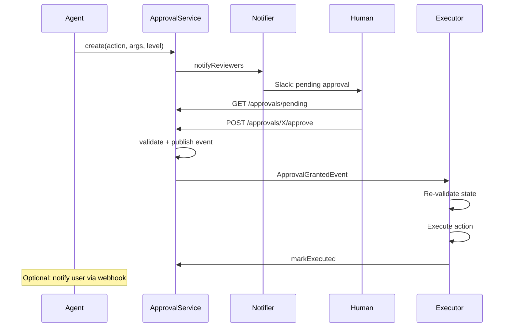

# Thiết kế Approval Flow cho Agent

## ⚡ Tóm tắt ngắn (30s)
* **Approval flow** = workflow tích hợp HITL vào agent: agent propose → human review → approve/reject → agent (or executor) execute.
* **Components**:
  1. **Proposal store**: DB table `approval_requests` với state machine.
  2. **Notifier**: Slack/email/push reviewer khi có request.
  3. **Approval UI**: dashboard cho reviewer.
  4. **Executor**: service tự execute khi approval granted.
  5. **Audit**: trace mọi proposal/decision.
* **States**: `pending` → `approved` | `rejected` | `expired` → (`executing` → `executed` | `failed`).
* **Thảm họa thực chiến**: Approval không có expiry → request pending 1 tháng → state đã đổi → approver approve → execute với data stale → bug. Senior fix: TTL 24h + re-validate khi execute.

---

## 🔍 State machine

```
pending → approved → executing → executed
   ↓        ↓                       ↓
expired  rejected               failed → retry / manual
```

**Transitions**:
* `pending`: created by agent. TTL 24h default.
* `approved`: human approve → publish event.
* `rejected`: human reject → notify user.
* `expired`: TTL hit → notify user.
* `executing`: executor picked up.
* `executed`: success.
* `failed`: retry hoặc manual.

---

## 💻 Code

### 1. Schema

```sql
CREATE TABLE approval_requests (
    id UUID PRIMARY KEY,
    requester_id UUID NOT NULL,
    tenant_id UUID NOT NULL,
    action VARCHAR(100) NOT NULL,
    args JSONB NOT NULL,
    level INT NOT NULL,
    status VARCHAR(20) NOT NULL DEFAULT 'pending',
    approver_id UUID,
    approval_reason TEXT,
    created_at TIMESTAMPTZ DEFAULT NOW(),
    expires_at TIMESTAMPTZ DEFAULT NOW() + INTERVAL '24 hours',
    approved_at TIMESTAMPTZ,
    executed_at TIMESTAMPTZ,
    execution_result JSONB
);
CREATE INDEX approval_status_idx ON approval_requests (status, expires_at);
```

### 2. Approval service

```java
@Service
public class ApprovalService {
    private final JdbcTemplate jdbc;
    private final NotificationService notifier;

    @Transactional
    public String create(String userId, String action, Map<String,Object> args, int level) {
        String id = UUID.randomUUID().toString();
        jdbc.update("""
            INSERT INTO approval_requests (id, requester_id, action, args, level)
            VALUES (?::uuid, ?::uuid, ?, ?::jsonb, ?)
            """, id, userId, action, toJson(args), level);
        
        notifier.notifyReviewers(level, id, action, args);
        return id;
    }

    @Transactional
    public boolean approve(String requestId, String approverId, String reason) {
        int updated = jdbc.update("""
            UPDATE approval_requests
            SET status = 'approved', approver_id = ?::uuid,
                approval_reason = ?, approved_at = NOW()
            WHERE id = ?::uuid
              AND status = 'pending'
              AND expires_at > NOW()
              AND requester_id != ?::uuid  -- 4-eye principle
            """, approverId, reason, requestId, approverId);
        
        if (updated == 0) return false;
        
        // Publish event for executor
        eventBus.publish(new ApprovalGrantedEvent(requestId));
        return true;
    }

    @Scheduled(fixedRate = 60_000)
    public void expirePendingOlderThanTtl() {
        jdbc.update("""
            UPDATE approval_requests SET status = 'expired'
            WHERE status = 'pending' AND expires_at < NOW()
            """);
    }
}
```

### 3. Executor (re-validate before execute)

```java
@KafkaListener(topics = "approval.granted")
public void onApprovalGranted(ApprovalGrantedEvent event) {
    var req = approvalService.getById(event.requestId());
    
    if (req == null || !"approved".equals(req.status())) return;
    
    // Re-validate state — might have changed since approval
    try {
        validateBusinessRules(req);
    } catch (Exception e) {
        approvalService.markFailed(req.id(), "Re-validation failed: " + e.getMessage());
        return;
    }
    
    try {
        approvalService.markExecuting(req.id());
        var result = executor.execute(req.action(), req.args());
        approvalService.markExecuted(req.id(), result);
    } catch (Exception e) {
        approvalService.markFailed(req.id(), e.getMessage());
        // Alert
    }
}
```

### 4. UI / API for reviewer

```java
@RestController
@RequestMapping("/api/approvals")
public class ApprovalController {
    
    @GetMapping
    public List<ApprovalRequest> pending(@AuthenticationPrincipal Jwt jwt) {
        // Filter by reviewer's role + level
        return repo.findPendingForReviewer(jwt.getClaim("roles"));
    }
    
    @PostMapping("/{id}/approve")
    public void approve(@PathVariable String id,
                        @RequestBody ApprovalDecision decision,
                        @AuthenticationPrincipal Jwt jwt) {
        approvalService.approve(id, jwt.getSubject(), decision.reason());
    }
    
    @PostMapping("/{id}/reject")
    public void reject(@PathVariable String id,
                        @RequestBody ApprovalDecision decision,
                        @AuthenticationPrincipal Jwt jwt) {
        approvalService.reject(id, jwt.getSubject(), decision.reason());
    }
}
```

---

## 🎨 Flow



---

## 📊 Approval UI requirements

| Element | Purpose |
| :--- | :--- |
| Action name | What's being done |
| Args (full) | Detail params |
| Requester | Agent + user context |
| Reasoning | Agent's why |
| Risk score | Auto-computed |
| Approve/Reject buttons | Action |
| Comment field | Reason |
| Related data | Order info, customer history |
| Audit history | Past similar approvals |

---

## ⚠️ Gotchas + Interviewer

1. **Self-approve**: requester = approver → bypass. Enforce 4-eye principle.
2. **Approver fatigue**: smart batching, low-risk auto, high-risk only manual.
3. **Approval expired but work needed**: notify requester to recreate.

**Interviewer: "How to scale approval to 1000s requests/day?"**
1. **Auto-batch by pattern**: similar requests grouped.
2. **Tiered review**: T1 reviewer for low risk, manager for high.
3. **Risk auto-scoring**: deprioritize/auto-approve clear-cut.
4. **Mobile app**: review from phone.
5. **Dedicated team**: full-time approver for critical workflows.
6. **Pre-approval workflow**: user pre-approve patterns (auto-refund <$50).
