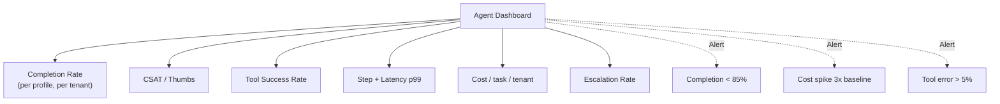

# Đo Success Rate của Agent

## ⚡ Tóm tắt ngắn (30s)
* **Success rate ≠ technical success**. Agent có thể "complete" task technically nhưng user không hài lòng. Cần đo multi-dimension.
* **5 metrics cốt lõi**:
  1. **Task completion rate**: % tasks finish (vs abort/error).
  2. **User satisfaction**: thumbs up/down, post-task survey.
  3. **Tool call success rate**: % tool calls thành công.
  4. **Step efficiency**: avg steps per task (lower is better).
  5. **Cost per task**: $ và token usage.
* **Quan trọng**: define "success" CỤ THỂ cho từng use case. "Customer support agent success = resolved without escalation"; "Code review agent success = developer accepted suggestion".
* **Thảm họa thực chiến**: Team chỉ đo "agent finished" → 95% success! Nhưng user feedback survey: 40% phải re-ask vì agent answer sai. Senior fix: combine completion + accuracy + CSAT.

---

## 🔍 Metrics chi tiết

### 1. Task completion rate
```
completion = tasks_finished / tasks_started
abort_rate = tasks_aborted / tasks_started
error_rate = tasks_failed / tasks_started
```

Target: >90% completion.

### 2. User satisfaction
- **Implicit**: did user follow up to ask again? → bad sign.
- **Explicit**: thumbs up/down on response.
- **Survey**: post-session NPS.
- **Escalation rate**: % conversations handed off to human.

### 3. Tool call metrics
- Tool call success rate per tool.
- Tool retry rate (high = sus).
- Tool args validation pass rate.

### 4. Efficiency
- Avg steps per task (lower = better, but capped by task complexity).
- p50/p99 latency per task.
- Token efficiency: tokens used / task value.

### 5. Business metrics
- For support agent: deflection rate (% questions resolved without human).
- For sales agent: conversion rate.
- For code agent: PR acceptance rate.

---

## 💻 Metric collection

```java
@Service
public class AgentMetricsCollector {

    private final MeterRegistry registry;

    public void recordTask(AgentTaskResult result) {
        // Completion
        registry.counter("agent.tasks",
            "status", result.status().name(),
            "agent_profile", result.profile()).increment();
        
        // Latency
        registry.timer("agent.task.duration", "profile", result.profile())
            .record(result.duration());
        
        // Steps
        registry.gauge("agent.task.steps",
            List.of(Tag.of("profile", result.profile())),
            result.stepCount());
        
        // Cost
        registry.counter("agent.task.cost", "profile", result.profile())
            .increment(result.costUsd());
    }

    public void recordToolCall(String tool, boolean success, long latency) {
        registry.counter("agent.tool",
            "tool", tool, "success", String.valueOf(success)).increment();
        registry.timer("agent.tool.latency", "tool", tool)
            .record(latency, TimeUnit.MILLISECONDS);
    }
}
```

---

## 🎨 Dashboard layout



---

## 💻 LLM-as-judge eval

```python
def judge_task_success(transcript: str, user_intent: str) -> dict:
    """Use cheap LLM to score task success."""
    prompt = f"""Đánh giá xem agent có hoàn thành task không.

USER INTENT: {user_intent}

TRANSCRIPT:
{transcript}

Trả JSON: {{"success": true/false, "reason": "...", "csat_predicted": 1-5}}"""
    
    resp = client.messages.create(
        model="claude-haiku-4-5",
        max_tokens=300,
        messages=[{"role":"user", "content": prompt}]
    )
    return json.loads(resp.content[0].text)
```

---

## 📊 Scorecard mỗi tuần

| Metric | Target | Current | Trend |
| :--- | :---: | :---: | :---: |
| Completion rate | >90% | 87% | ↓ alert |
| CSAT (thumbs up) | >75% | 82% | ↑ |
| Escalation rate | <15% | 12% | ↓ |
| Avg steps | <8 | 9.2 | ↑ alert |
| Cost/task | <$0.20 | $0.18 | → |
| Tool error rate | <3% | 2.1% | ↓ |

---

## ⚠️ Gotchas + Interviewer

1. **Vanity metric**: completion = 99% but quality bad.
2. **Bias in sampling**: only happy users give thumbs.
3. **Slow feedback**: by time you see CSAT, damage done.

**Interviewer: "Agent CSAT giảm từ 80% → 65% trong 1 tuần. Investigate thế nào?"**
1. **Diff what changed**: prompt v? model v? RAG index? Tool added?
2. **Sample failures**: pull 50 conversations với thumbs down.
3. **Categorize bug type**: retrieval bad / tool error / tone wrong / wrong answer.
4. **Compare with last week** same query → see regression specific.
5. **Quick fix vs rollback**: rollback if critical.
6. **Communicate**: update stakeholders, war room nếu severity high.
