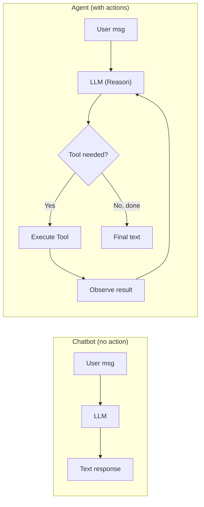

# Agent khác Chatbot Thông thường thế nào

## ⚡ Tóm tắt ngắn (30s)
* **Chatbot**: text-in → text-out. Stateless hoặc lưu conversation history. KHÔNG gọi action thực sự, chỉ generate text.
* **Agent**: text-in → **action** → observe → action → ... → text-out. Có tool calling, có planning, có memory, có loop.
* **3 khác biệt cốt lõi**:
  1. **Tool execution**: agent có thể gọi DB, API, file system. Chatbot chỉ talk.
  2. **Multi-step planning**: agent quyết định sequence; chatbot trả lời ngay.
  3. **Stateful actions**: agent thay đổi thế giới (create ticket, send email); chatbot không.
* **Spectrum** (không chỉ 2 đối lập):
  ```
  Static FAQ bot → Conversational chatbot → RAG chatbot →
    LLM with single tool → Multi-tool agent → Multi-step agent →
    Autonomous agent
  ```
* **Risk khác nhau**: chatbot risk = misinformation. Agent risk = action sai, side effect bao gồm mất data/tiền.
* **Thảm họa thực chiến**: Team upgrade từ chatbot lên agent mà không upgrade guardrail. Agent có quyền `cancel_order`. User joke "cancel tất cả đơn hàng pending", agent execute → 200 orders cancelled. Senior fix: classify action level, sensitive cần human approval.

---

## 🔍 Chi tiết khác biệt

### 1. Capability matrix

| Capability | FAQ Bot | Chatbot | RAG Chatbot | Agent |
| :--- | :---: | :---: | :---: | :---: |
| Pattern match | ✓ | ✓ | ✓ | ✓ |
| LLM generation | ✗ | ✓ | ✓ | ✓ |
| Retrieve doc | ✗ | ✗ | ✓ | ✓ |
| Call tool/API | ✗ | ✗ | ✗ | ✓ |
| Multi-step | ✗ | ✗ | ✗ | ✓ |
| Side effects | ✗ | ✗ | ✗ | ✓ |
| Memory across sessions | ✗ | ✓ | ✓ | ✓✓ |

### 2. Architecture khác biệt

**Chatbot architecture**:
```
User → API → LLM (with conversation history) → User
```

**Agent architecture**:
```
User → API → Agent Orchestrator
                ├─ LLM (decide action)
                ├─ Tool Registry
                ├─ Memory Store
                ├─ Execution Engine (call tools)
                ├─ Audit/Trace
                └─ Loop back until done
```

Agent là **stack phức tạp hơn nhiều**.

### 3. Decision criteria

| Question | If "yes" → use Agent |
| :--- | :--- |
| Cần đọc/ghi data thực tế? | ✓ |
| Multi-step, không định hình trước? | ✓ |
| LLM cần "biết" output của step trước? | ✓ |
| Cần adapt theo phản hồi từ user/system? | ✓ |
| Task < 3 step rõ ràng? | ✗ (workflow code đủ) |

### 4. Risk profile khác biệt

**Chatbot risks**:
* Hallucinate (sai info).
* Wrong tone (offensive).
* Privacy leak (lộ data trong prompt).
* Prompt injection (jailbreak).

**Agent risks (ADD ON TOP của chatbot risks)**:
* **Action errors**: gọi tool sai, args sai.
* **Irreversible side effects**: delete data, send money.
* **Cost runaway**: loop nhiều LLM call.
* **Privilege escalation**: agent gọi tool ngoài quyền user.
* **Cascading failure**: agent A gọi agent B → agent B fail → cả chain hỏng.

→ Agent cần MORE defense layers.

---

## 🎨 Sơ đồ trực quan



---

## 💻 Code thực chiến

### 1. Chatbot (simple)

```java
@Service
public class SimpleChatbot {
    private final ChatClient chat;

    public SimpleChatbot(ChatClient.Builder b) { this.chat = b.build(); }

    public String chat(String message, List<Message> history) {
        return chat.prompt()
            .messages(history)
            .user(message)
            .call().content();
    }
}
```

### 2. Agent (with tools)

```java
@Service
public class SupportAgent {
    private final ChatClient chat;

    public SupportAgent(ChatClient.Builder b, OrderTools orderTools, EmailTools emailTools) {
        this.chat = b.defaultTools(orderTools, emailTools).build();
    }

    public String handle(String message) {
        // Spring AI tự handle agent loop internally khi có tools
        return chat.prompt()
            .system("Bạn là support agent. Use tools when needed.")
            .user(message)
            .call().content();
    }
}

@Component
class OrderTools {
    @Tool(description = "Get order by ID")
    public OrderInfo getOrder(String orderId) { /* impl */ return null; }
}
```

### 3. Upgrade path: từ chatbot → agent

```java
// Phase 1: Chatbot RAG
public String chatWithRag(String q) {
    var chunks = rag.retrieve(q, 5);
    return chat.system("Answer from context").user("Context: " + chunks + "\nQ: " + q).call().content();
}

// Phase 2: Agent với 1 tool (RAG as tool)
public String agentWithSearch(String q) {
    return chat.defaultTools(new SearchTool(rag)).user(q).call().content();
}

// Phase 3: Multi-tool agent
public String fullAgent(String q) {
    return chat.defaultTools(searchTool, orderTool, emailTool, ticketTool)
              .user(q).call().content();
}
```

---

## 📊 Bảng decision

| Use case | Tool | Reason |
| :--- | :--- | :--- |
| FAQ tĩnh | FAQ bot | Đủ, rẻ nhất |
| Q&A trên doc | RAG chatbot | Có ground truth |
| Lookup nhiều system | Agent | Multi-tool |
| Approve refund | Agent + human-in-loop | Risk |
| Form submission | Workflow code | Deterministic |
| Code generation | Agent (with code exec tool) | Iteration cần |

---

## ⚠️ Common Gotchas & Questions follow-up

### 1. Cạm bẫy: Upgrade chatbot → agent without security review
* **Vấn đề**: Add tool calling → bypass tất cả guardrail của chatbot.
* **Giải pháp**: Security review trước khi add bất kỳ tool nào với side effect.

### 2. Cạm bẫy: Agent cho task đơn giản
* **Vấn đề**: "Send welcome email" có thể là 1 line code. Agent overkill: $0.05/req + 5s latency.
* **Giải pháp**: Agent chỉ khi task fuzzy/multi-step thực sự.

### 3. Câu hỏi đào sâu từ interviewer
* **Interviewer: "Khi nào bạn chuyển từ chatbot sang agent?"**
* **Trả lời Senior**:
  1. **Signal**: chatbot không đủ — user phải copy-paste thông tin từ chỗ khác để hoàn thành task.
  2. **Tool integration value**: nếu chatbot có thể gọi 1-2 tool, hỏi user satisfaction tăng X% có justify cost?
  3. **Iterative**: bắt đầu với agent 1 tool đơn giản, monitor. Đánh giá ROI trước khi add tool sensitive.
  4. **Security gates**: mỗi tool mới = review. Sensitive tool → human-in-loop, NOT auto-execute.
  5. **Fallback**: agent fail → graceful fallback sang chatbot mode (text only).
  6. **Observability**: agent cần MORE trace/audit hơn chatbot. Đầu tư observability sớm.
