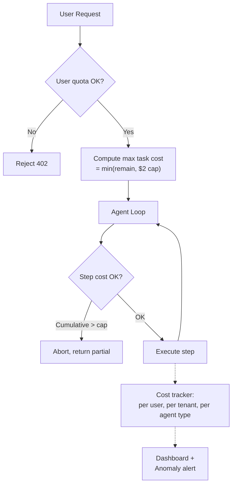

# Chi phí Agent có thể Tăng Mất Kiểm soát Như thế nào

## ⚡ Tóm tắt ngắn (30s)
* **Cost explosion** là risk lớn nhất của agent. Nguyên nhân:
  1. **Multi-step loop**: 1 task = 5-20 LLM call.
  2. **Long context per step**: history + tool results dài.
  3. **Tool spam**: agent gọi 1 tool nhiều lần.
  4. **No cap**: không có step limit, cost limit, rate limit.
  5. **User abuse**: prompt cố tình trigger expensive tasks.
  6. **Tool cost**: agent call API trả phí (e.g. web search $0.001/call).
* **Defense**: cap step, cap cost, rate limit, monitor + alert.
* **Real numbers**: GPT-4o agent task average $0.05-$0.50. Bad case $5-50/task. 1000 user × $0.20 = $200/day OK; spike to $20k/day = disaster.
* **Thảm họa thực chiến**: Marketing automation agent, no cap. Marketer queries "research 100 competitors". Agent did 200 web searches + 50 LLM calls = $25/query. 5 marketers × 10 queries/day = $1250/day = $37k/month. Senior fix: cap step + cost + per-user quota.

---

## 🔍 Cost breakdown

### 1. Per-step LLM cost
- gpt-4o: ~$0.01-0.05 per step (context 4-8k token).
- claude-sonnet-4-6: similar.
- claude-opus-4-7: $0.10-0.50 per step.

### 2. Tool cost
- Internal API: $0.
- Web search (Tavily, Serper): $0.001-0.005/call.
- Vector search (Pinecone managed): tiny.
- 3rd party API: varies (e.g. Stripe lookup free, Plaid $0.50).

### 3. Memory cost
- Long-term memory storage: minimal.
- Embed past interactions: $0.02/1M token.

### 4. Approval flow overhead
- Human reviewer time: $X/hour.

---

## 💻 Cost guard implementation

```java
@Service
public class CostGuardedAgent {
    
    private final UserQuotaService quotaService;
    private final CostTrackerService tracker;
    
    public AgentResult run(String userId, String task) {
        // Pre-flight: check user has budget
        double remainingDailyBudget = quotaService.remaining(userId);
        if (remainingDailyBudget < 0.10) {
            throw new QuotaExceededException("Daily budget exhausted");
        }
        
        double maxTaskCost = Math.min(remainingDailyBudget, 2.0);  // cap per-task
        double accumulatedCost = 0;
        
        for (int step = 0; step < MAX_STEPS; step++) {
            // Per-step check
            if (accumulatedCost > maxTaskCost) {
                return AgentResult.aborted("Task cost cap reached: $" + accumulatedCost);
            }
            
            var resp = llm.chat(messages, tools);
            accumulatedCost += resp.costUsd();
            tracker.record(userId, "llm_call", resp.costUsd());
            
            if (resp.stopReason() == END_TURN) {
                quotaService.consume(userId, accumulatedCost);
                return AgentResult.success(resp.text(), accumulatedCost);
            }
            
            // Tool cost
            var tool = resp.toolCall();
            double toolCost = ToolRegistry.getCost(tool.name());
            accumulatedCost += toolCost;
            tracker.record(userId, tool.name(), toolCost);
            
            // ...execute
        }
        
        return AgentResult.aborted("Max steps");
    }
}
```

### Anomaly detection

```java
@Component
public class CostAnomalyDetector {
    
    @Scheduled(fixedRate = 60_000)
    public void detectSpikes() {
        // Last 10 min cost vs baseline
        var last10min = costRepo.sumLastMinutes(10);
        var baseline = costRepo.avgPerInterval(10, 24*7);  // 1 week
        
        if (last10min > 3 * baseline) {
            alerts.fire("Cost spike: $" + last10min + " in 10min, baseline " + baseline);
            // Optionally: auto-throttle
            globalThrottle.tighten(0.5);
        }
    }
}
```

---

## 🎨 Cost flow



---

## 📊 Cost caps recommendations

| Tier | Daily Budget | Per-Task Cap | Step Cap |
| :--- | :---: | :---: | :---: |
| Free | $0.50 | $0.10 | 5 |
| Pro | $5 | $1 | 15 |
| Enterprise | $50 | $5 | 30 |
| Internal | unlimited (tracked) | $20 | 50 |

---

## ⚠️ Common Cost Spike Causes + Interviewer

1. **Long context accumulation**: history grows → each step more expensive.
   - **Fix**: summarize history >10 turns.
2. **Tool spam**: agent loop calling same tool.
   - **Fix**: detect repeat.
3. **Switch to expensive model unintentionally**: bug routing.
   - **Fix**: model whitelist + cost ceiling per model.
4. **Streaming uncapped**: max_tokens default high.
   - **Fix**: always set max_tokens.
5. **Failed task retry**: user retries → 5x cost.
   - **Fix**: cache result for same query.

**Interviewer: "Daily cost vọt 10x. Bạn 30 phút đầu xử lý?"**
1. **Phút 0-2**: Find spike: which user/tenant/agent? Dashboard filter.
2. **Phút 2-5**: Throttle: temporary tighten rate limit for offending entity.
3. **Phút 5-10**: Root cause: prompt injection? Bug? Legitimate burst?
4. **Phút 10-30**: 
   - Prompt injection → patch + ban user.
   - Bug → rollback recent deploy.
   - Burst → notify customer + offer enterprise.
5. **Postmortem**: prevent recurrence (better caps, monitoring).
