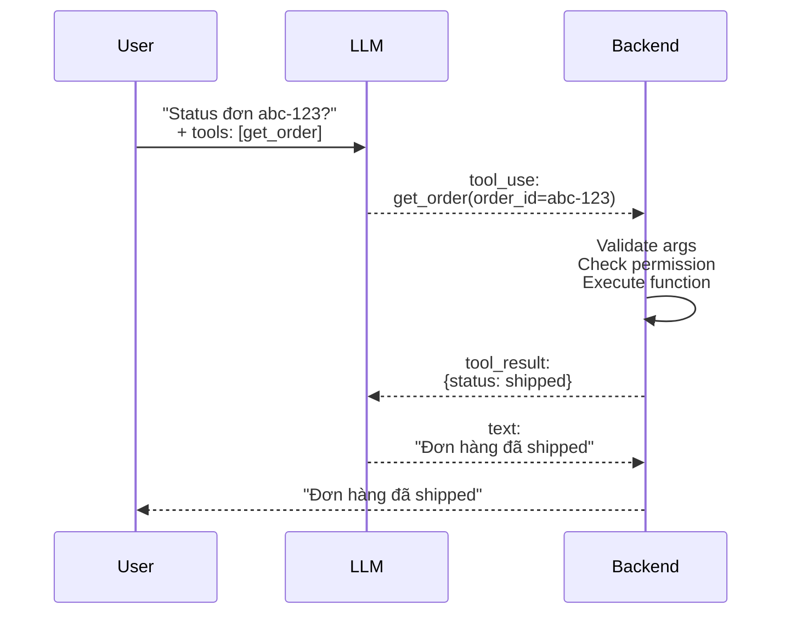

# Tool Calling / Function Calling là gì

## ⚡ Tóm tắt ngắn (30s)
* **Tool calling** (= function calling, function use, tool use) = cơ chế LLM **không trả text** mà **trả ra structured request** để app gọi function thật. Backend nhận request → execute function → trả result lại LLM → LLM tiếp tục reason.
* **Workflow**:
  1. Developer declare tools (name, description, JSON schema input).
  2. LLM nhận query + tool list.
  3. LLM quyết định: trả lời text hay gọi tool.
  4. Nếu tool: trả `{name, arguments}` JSON.
  5. Backend execute → trả result.
  6. LLM observe result → tiếp tục.
* **Tại sao quan trọng**: là cơ sở của EVERY agent. Không có tool calling → LLM chỉ là text generator.
* **Format chuẩn**:
  * OpenAI: `tools: [{type: "function", function: {name, description, parameters}}]`.
  * Anthropic: `tools: [{name, description, input_schema}]`.
  * Bedrock/Llama: tương tự với syntax riêng.
* **Thảm họa thực chiến**: Tool description ngắn gọn ("get user data"). LLM gọi tool sai context, return PII của user khác. Senior fix: description đầy đủ "Get user data BY ID THE CURRENT USER OWNS. Verify caller permission."

---

## 🔍 Chi tiết bản chất

### 1. Anatomy của tool definition

```json
{
  "name": "get_order_status",
  "description": "Lấy trạng thái đơn hàng theo ID. CHỈ dùng cho đơn hàng của user hiện tại. Nếu user không owner → từ chối.",
  "input_schema": {
    "type": "object",
    "properties": {
      "order_id": {
        "type": "string",
        "description": "UUID của order, format 8-4-4-4-12"
      }
    },
    "required": ["order_id"]
  }
}
```

Quan trọng:
* **Description** phải rõ: WHEN dùng, WHO được dùng, EDGE CASE.
* **Schema strict**: required fields, type, format. LLM tuân thủ schema.
* **Naming convention**: snake_case, verb-noun ("get_user", "send_email"), descriptive.

### 2. Tool call request format (LLM output)

OpenAI:
```json
{
  "choices": [{
    "message": {
      "role": "assistant",
      "tool_calls": [{
        "id": "call_abc123",
        "type": "function",
        "function": {
          "name": "get_order_status",
          "arguments": "{\"order_id\":\"550e8400-e29b-41d4-a716-446655440000\"}"
        }
      }]
    }
  }],
  "finish_reason": "tool_calls"
}
```

Anthropic (similar concept, different format):
```json
{
  "content": [{
    "type": "tool_use",
    "id": "toolu_abc",
    "name": "get_order_status",
    "input": {"order_id": "550e8400-..."}
  }],
  "stop_reason": "tool_use"
}
```

### 3. Tool result back to LLM

```json
{
  "role": "tool",
  "tool_call_id": "call_abc123",
  "content": "{\"status\":\"shipped\",\"eta\":\"2026-05-25\"}"
}
```

LLM observes result, decides next action (call thêm tool hoặc trả final text).

### 4. Parallel tool calls

Modern model có thể trả NHIỀU tool calls cùng lúc:
```json
"tool_calls": [
  {"function": {"name": "get_order", "arguments": "{...}"}},
  {"function": {"name": "get_customer", "arguments": "{...}"}}
]
```

Backend execute parallel → batch results back → LLM continue.

Giảm latency 30-50% cho task cần multi-lookup.

### 5. Mandatory vs Optional tool use

* **`tool_choice: "auto"`**: LLM tự quyết định.
* **`tool_choice: "required"`**: bắt buộc gọi tool.
* **`tool_choice: {function: {name: X}}`**: ép gọi tool cụ thể.
* **`tool_choice: "none"`**: tắt tool calling cho turn này.

---

## 🎨 Sơ đồ flow



---

## 💻 Code thực chiến

### 1. Spring AI — Annotation-based tools

```java
package com.example.tools;

import org.springframework.ai.tool.annotation.Tool;
import org.springframework.ai.tool.annotation.ToolParam;
import org.springframework.stereotype.Component;

@Component
public class OrderTools {

    private final OrderService orderService;

    public OrderTools(OrderService s) { this.orderService = s; }

    @Tool(description = """
            Lấy trạng thái đơn hàng theo ID.
            CHỈ dùng cho đơn của user hiện tại.
            Trả về NULL nếu order không tồn tại hoặc user không có quyền.
            """)
    public OrderStatus getOrderStatus(
        @ToolParam(description = "UUID của order, format 8-4-4-4-12")
        String orderId
    ) {
        // Backend validate + execute
        validateUuid(orderId);
        return orderService.getStatus(orderId, currentUserId());
    }

    @Tool(description = "Gửi email tóm tắt đơn. CHỈ gọi sau khi user confirm 2 lần.")
    public boolean sendOrderSummary(
        @ToolParam(description = "Email người nhận") String recipient,
        @ToolParam(description = "Order ID") String orderId
    ) {
        return orderService.sendSummary(recipient, orderId);
    }

    private void validateUuid(String s) {
        if (!s.matches("[0-9a-f]{8}-[0-9a-f]{4}-[0-9a-f]{4}-[0-9a-f]{4}-[0-9a-f]{12}"))
            throw new IllegalArgumentException("Invalid UUID");
    }
    private String currentUserId() { return ""; }
    public record OrderStatus(String id, String status, String eta) {}
}
```

### 2. Anthropic Python — Manual loop

```python
import anthropic, json

client = anthropic.Anthropic()

TOOLS = [
    {
        "name": "get_order",
        "description": "Get order by ID for current user only",
        "input_schema": {
            "type": "object",
            "properties": {"order_id": {"type": "string"}},
            "required": ["order_id"]
        }
    }
]

def execute_tool(name: str, args: dict, user_id: str):
    """Backend tool executor with validation."""
    if name == "get_order":
        order_id = args["order_id"]
        # Validate format
        if not is_valid_uuid(order_id):
            return {"error": "Invalid order_id format"}
        # Check permission
        order = db.query("SELECT * FROM orders WHERE id = %s AND user_id = %s",
                         order_id, user_id)
        if not order:
            return {"error": "Order not found or access denied"}
        return {"status": order["status"], "eta": order["eta"]}
    raise ValueError(f"Unknown tool: {name}")

def run_agent(user_msg: str, user_id: str, max_steps: int = 10):
    messages = [{"role": "user", "content": user_msg}]
    
    for step in range(max_steps):
        resp = client.messages.create(
            model="claude-sonnet-4-6",
            max_tokens=1024,
            tools=TOOLS,
            messages=messages
        )
        
        if resp.stop_reason == "end_turn":
            return resp.content[0].text
        
        if resp.stop_reason == "tool_use":
            # Could be parallel tool calls
            tool_uses = [b for b in resp.content if b.type == "tool_use"]
            
            tool_results = []
            for tu in tool_uses:
                result = execute_tool(tu.name, tu.input, user_id)
                tool_results.append({
                    "type": "tool_result",
                    "tool_use_id": tu.id,
                    "content": json.dumps(result)
                })
            
            messages.append({"role": "assistant", "content": resp.content})
            messages.append({"role": "user", "content": tool_results})
    
    raise RuntimeError("Max steps reached")
```

### 3. OpenAI Java SDK — Function calling

```java
package com.example.tools.openai;

import com.openai.client.OpenAIClient;
import com.openai.models.*;

public class OpenAiFunctionCalling {

    private final OpenAIClient client;

    public OpenAiFunctionCalling(OpenAIClient c) { this.client = c; }

    public String runAgent(String userMsg) {
        var functionDef = ChatCompletionTool.builder()
            .type(ChatCompletionTool.Type.FUNCTION)
            .function(FunctionDefinition.builder()
                .name("get_order")
                .description("Get order by ID for current user")
                .parameters(FunctionParameters.builder()
                    .additionalProperty("type", JsonValue.from("object"))
                    .additionalProperty("properties", JsonValue.from(Map.of(
                        "order_id", Map.of("type", "string")
                    )))
                    .additionalProperty("required", JsonValue.from(List.of("order_id")))
                    .build())
                .build())
            .build();

        var params = ChatCompletionCreateParams.builder()
            .model(ChatModel.GPT_4O)
            .addUserMessage(userMsg)
            .addTool(functionDef)
            .build();

        var resp = client.chat().completions().create(params);
        // Handle tool_calls...
        return resp.choices().get(0).message().content().orElse("");
    }
}
```

---

## 📊 Bảng so sánh tool calling formats

| Provider | Format | Parallel calls | Strict mode |
| :--- | :--- | :---: | :---: |
| OpenAI | `tool_calls` array | ✓ | ✓ (strict schema) |
| Anthropic | content blocks `tool_use` | ✓ | partial |
| Google Vertex | function_call | partial | ✓ |
| Bedrock (per-model) | varies by model | varies | varies |
| Spring AI (abstraction) | unified API | ✓ | depends provider |

---

## ⚠️ Common Gotchas & Questions follow-up

### 1. Cạm bẫy: Description thiếu permission constraint
* **Vấn đề**: "Get user data" → LLM gọi với ID nào cũng được → leak.
* **Giải pháp**: Description phải nói rõ "ONLY for current user". Backend VALIDATE thực sự.

### 2. Cạm bẫy: Args không validate
* **Vấn đề**: LLM trả `"order_id": "DROP TABLE orders"`. Truyền thẳng vào SQL = SQL injection.
* **Giải pháp**: Validate type, format, range. Parametrized query. NEVER trust LLM args.

### 3. Cạm bẫy: Quá nhiều tools
* **Vấn đề**: Register 50 tools → LLM confused, sai tool selection.
* **Giải pháp**: 5-10 tool/agent. Nếu cần nhiều → multi-agent (specialist agents).

### 4. Câu hỏi đào sâu từ interviewer
* **Interviewer: "LLM trả tool call với args sai format. Bạn handle thế nào?"**
* **Trả lời Senior**:
  1. **Validate at execute**: tool wrapper check schema + custom rules.
  2. **Return structured error** back to LLM: `{"error": "order_id must be UUID, got 'abc'"}`. LLM observe và retry.
  3. **Retry với hint**: nếu sai format lặp lại, gửi explicit hint.
  4. **Give-up**: nếu sau 2-3 retry vẫn sai → abort agent, return error tới user.
  5. **Log**: track failure rate per tool → biết tool nào description không rõ.
  6. **Prompt improvement**: nếu tool fail nhiều → review description.
